# The Command Zone ‘You Rock’ Shout-Outs

**233 verified shout-outs** across **233 episodes**.

This page is generated from [`data/shoutouts.csv`](data/shoutouts.csv).

<table>
  <thead>
    <tr>
      <th>Shout-out</th>
      <th>Episode</th>
      <th>Watch</th>
      <th>Proof</th>
    </tr>
  </thead>
  <tbody>
    <tr>
      <td><strong>Duncan Robb</strong></td>
      <td><a href="https://www.youtube.com/watch?v=hcdAy7ne04U&amp;t=1041s">#750 — “Fantastic Four” Precon Upgrade Guide | Marvel Super Heroes</a> Jun 26, 2026</td>
      <td><a href="https://www.youtube.com/watch?v=hcdAy7ne04U&amp;t=1041s"><strong>17:21</strong></a></td>
      <td><a href="screenshots/hcdAy7ne04U-1041-12981e7f.jpg">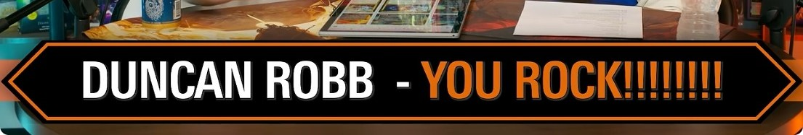</a></td>
    </tr>
    <tr>
      <td><strong>Campbell Walters</strong></td>
      <td><a href="https://www.youtube.com/watch?v=TUN9HwLWRb4&amp;t=514s">#747 — “Doom Prevails&quot; Precon Upgrade Guide | Marvel Super Heroes</a> Jun 11, 2026</td>
      <td><a href="https://www.youtube.com/watch?v=TUN9HwLWRb4&amp;t=514s"><strong>8:34</strong></a></td>
      <td><a href="screenshots/TUN9HwLWRb4-514-c801f233.jpg">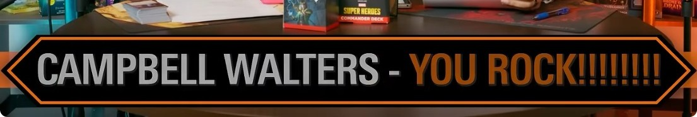</a></td>
    </tr>
    <tr>
      <td><strong>Kidany Cruz</strong></td>
      <td><a href="https://www.youtube.com/watch?v=NtA9z2wO4iM&amp;t=458s">#746 — “Avengers Assemble” Full Deck Reveal + Upgrade | Marvel Super Heroes</a> Jun 8, 2026</td>
      <td><a href="https://www.youtube.com/watch?v=NtA9z2wO4iM&amp;t=458s"><strong>7:38</strong></a></td>
      <td><a href="screenshots/NtA9z2wO4iM-458-8e7450ab.jpg">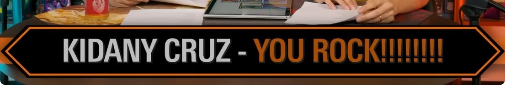</a></td>
    </tr>
    <tr>
      <td><strong>Ben Wyrosdick</strong></td>
      <td><a href="https://www.youtube.com/watch?v=ftCPe3Yxztk&amp;t=878s">#745 — How to Play Commander</a> Date unavailable</td>
      <td><a href="https://www.youtube.com/watch?v=ftCPe3Yxztk&amp;t=878s"><strong>14:38</strong></a></td>
      <td><a href="screenshots/ftCPe3Yxztk-878-manual.jpg">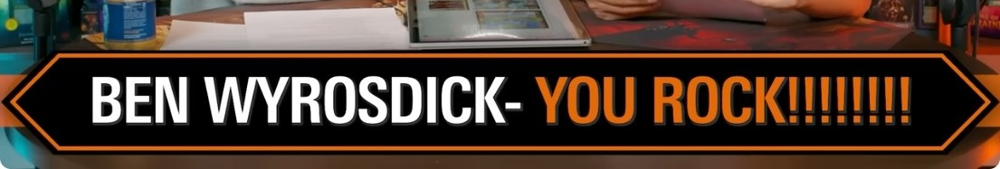</a></td>
    </tr>
    <tr>
      <td><strong>Wes Stone</strong></td>
      <td><a href="https://www.youtube.com/watch?v=4aGmNlEqb7o&amp;t=1180s">#744 — Commander Cards We Were Wrong About</a> May 28, 2026</td>
      <td><a href="https://www.youtube.com/watch?v=4aGmNlEqb7o&amp;t=1180s"><strong>19:40</strong></a></td>
      <td><a href="screenshots/4aGmNlEqb7o-1180-2518bc2c.jpg">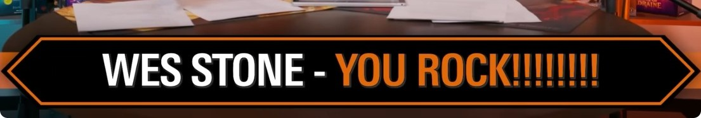</a></td>
    </tr>
    <tr>
      <td><strong>Brian Kendall</strong></td>
      <td><a href="https://www.youtube.com/watch?v=Ncj_HZkRXlc&amp;t=691s">#742 — We Roast Each Other&#x27;s Decks w/ Tomer (MTGGoldfish)</a> May 13, 2026</td>
      <td><a href="https://www.youtube.com/watch?v=Ncj_HZkRXlc&amp;t=691s"><strong>11:31</strong></a></td>
      <td><a href="screenshots/Ncj_HZkRXlc-691-0f7c5ce5.jpg">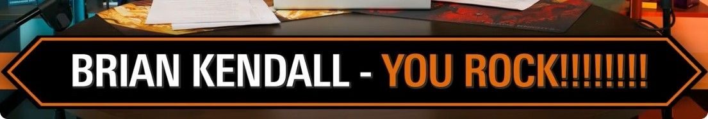</a></td>
    </tr>
    <tr>
      <td><strong>Austin Gatzemeyer</strong></td>
      <td><a href="https://www.youtube.com/watch?v=c3F0h4um8sY&amp;t=472s">#741 — “Witherbloom Pestilence” Precon Upgrade | Secrets of Strixhaven</a> May 8, 2026</td>
      <td><a href="https://www.youtube.com/watch?v=c3F0h4um8sY&amp;t=472s"><strong>7:52</strong></a></td>
      <td><a href="screenshots/c3F0h4um8sY-472-baac982f.jpg">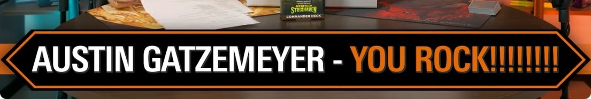</a></td>
    </tr>
    <tr>
      <td><strong>Princessariel</strong></td>
      <td><a href="https://www.youtube.com/watch?v=2OOHw-ytDy0&amp;t=940s">#739 — Secrets of Strixhaven’s Best New Cards (In the 99)</a> Date unavailable</td>
      <td><a href="https://www.youtube.com/watch?v=2OOHw-ytDy0&amp;t=940s"><strong>15:40</strong></a></td>
      <td></td>
    </tr>
    <tr>
      <td><strong>Tony Borth</strong></td>
      <td><a href="https://www.youtube.com/watch?v=yaqvE9rYUkA&amp;t=538s">#737 — “Quandrix Unlimited” Precon Upgrade | Secrets of Strixhaven</a> Date unavailable</td>
      <td><a href="https://www.youtube.com/watch?v=yaqvE9rYUkA&amp;t=538s"><strong>8:58</strong></a></td>
      <td><a href="screenshots/yaqvE9rYUkA-538-bookmark.jpg">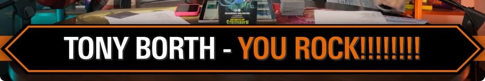</a></td>
    </tr>
    <tr>
      <td><strong>Immanuel Kerr-brown</strong></td>
      <td><a href="https://www.youtube.com/watch?v=rc2TAwL663A&amp;t=1731s">#736 — Secrets of Strixhaven’s Most Powerful New Commanders | Command Zone 736 | MTG EDH Magic Gathering</a> Date unavailable</td>
      <td><a href="https://www.youtube.com/watch?v=rc2TAwL663A&amp;t=1731s"><strong>28:51</strong></a></td>
      <td><a href="screenshots/rc2TAwL663A-1731-bookmark.jpg">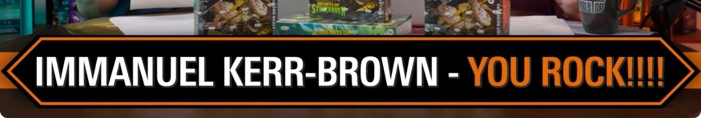</a></td>
    </tr>
    <tr>
      <td><strong>Kevin Gudino</strong></td>
      <td><a href="https://www.youtube.com/watch?v=rNUv0ZWrJeE&amp;t=607s">#735 — “Lorehold Spirit” Precon Upgrade | Secrets of Strixhaven</a> Date unavailable</td>
      <td><a href="https://www.youtube.com/watch?v=rNUv0ZWrJeE&amp;t=607s"><strong>10:07</strong></a></td>
      <td><a href="screenshots/rNUv0ZWrJeE-607-bookmark.jpg">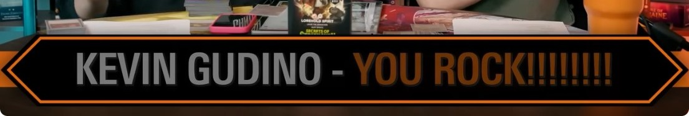</a></td>
    </tr>
    <tr>
      <td><strong>Blake Carel</strong></td>
      <td><a href="https://www.youtube.com/watch?v=5vGsFMCOW5M&amp;t=525s">#734 — “Prismari Artistry” Precon Upgrade | Secrets of Strixhaven</a> Date unavailable</td>
      <td><a href="https://www.youtube.com/watch?v=5vGsFMCOW5M&amp;t=525s"><strong>8:45</strong></a></td>
      <td><a href="screenshots/5vGsFMCOW5M-525-bookmark.jpg">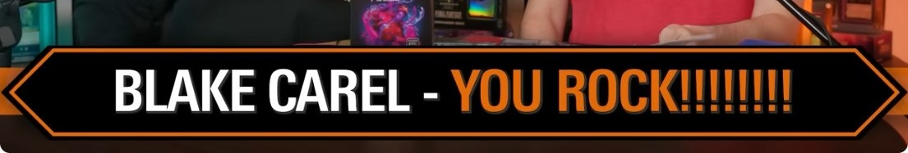</a></td>
    </tr>
    <tr>
      <td><strong>Erin Fosnocht Largen</strong></td>
      <td><a href="https://www.youtube.com/watch?v=fxBCPGaWu9Y&amp;t=363s">#733 — Level Up Your Deck Building w/ This One Hack</a> Date unavailable</td>
      <td><a href="https://www.youtube.com/watch?v=fxBCPGaWu9Y&amp;t=363s"><strong>6:03</strong></a></td>
      <td><a href="screenshots/fxBCPGaWu9Y-363-bookmark.jpg">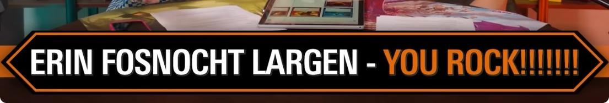</a></td>
    </tr>
    <tr>
      <td><strong>Michael Fong</strong></td>
      <td><a href="https://www.youtube.com/watch?v=8oAvrETrQEM&amp;t=1076s">#732 — What&#x27;s Fun About Bracket 1?</a> Date unavailable</td>
      <td><a href="https://www.youtube.com/watch?v=8oAvrETrQEM&amp;t=1076s"><strong>17:56</strong></a></td>
      <td><a href="screenshots/8oAvrETrQEM-1076-bookmark.jpg">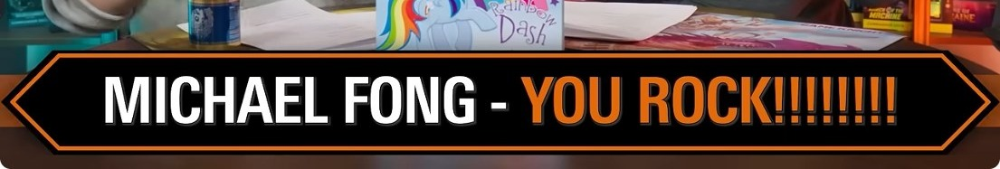</a></td>
    </tr>
    <tr>
      <td><strong>Will Norris</strong></td>
      <td><a href="https://www.youtube.com/watch?v=jzeTz9clIC8&amp;t=1031s">#731 — What&#x27;s Up w/ Bracket 4?</a> Date unavailable</td>
      <td><a href="https://www.youtube.com/watch?v=jzeTz9clIC8&amp;t=1031s"><strong>17:11</strong></a></td>
      <td><a href="screenshots/jzeTz9clIC8-1031-bookmark.jpg">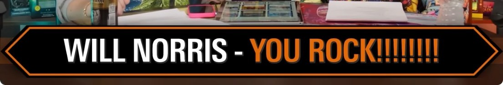</a></td>
    </tr>
    <tr>
      <td><strong>Brian Praamsma</strong></td>
      <td><a href="https://www.youtube.com/watch?v=6oS1E5BGi0U&amp;t=559s">#730 — Why Your Deck Feels Clunky and How to Fix It</a> Date unavailable</td>
      <td><a href="https://www.youtube.com/watch?v=6oS1E5BGi0U&amp;t=559s"><strong>9:19</strong></a></td>
      <td><a href="screenshots/6oS1E5BGi0U-559-bookmark.jpg">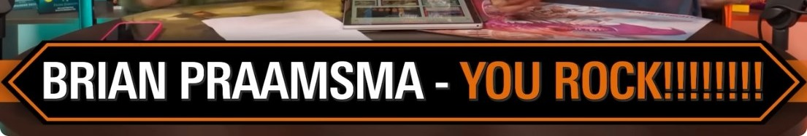</a></td>
    </tr>
    <tr>
      <td><strong>David Hurse</strong></td>
      <td><a href="https://www.youtube.com/watch?v=DbcbZmQbTm0&amp;t=984s">#728 — The TMNT Cards You Need to Know</a> Date unavailable</td>
      <td><a href="https://www.youtube.com/watch?v=DbcbZmQbTm0&amp;t=984s"><strong>16:24</strong></a></td>
      <td><a href="screenshots/DbcbZmQbTm0-984-bookmark.jpg">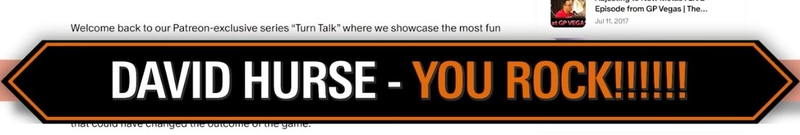</a></td>
    </tr>
    <tr>
      <td><strong>Kathleen Kennedy</strong></td>
      <td><a href="https://www.youtube.com/watch?v=9XzCokjm5Vs&amp;t=731s">#726 — Wizards Makes It Official re: Hybrid Mana, Bans/Unbans, and More</a> Date unavailable</td>
      <td><a href="https://www.youtube.com/watch?v=9XzCokjm5Vs&amp;t=731s"><strong>12:11</strong></a></td>
      <td><a href="screenshots/9XzCokjm5Vs-731-bookmark.jpg">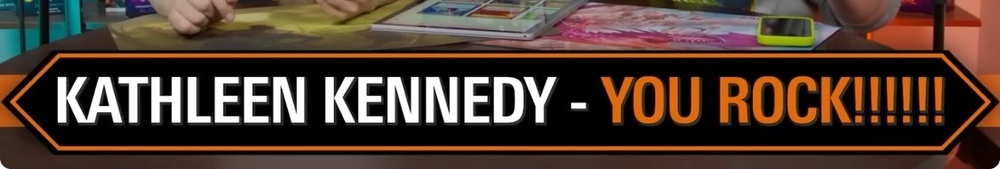</a></td>
    </tr>
    <tr>
      <td><strong>32bit</strong></td>
      <td><a href="https://www.youtube.com/watch?v=IBxHD3M87e8&amp;t=533s">#724 — “Dance of the Elements” Precon Upgrade | Lorwyn Eclipsed</a> Date unavailable</td>
      <td><a href="https://www.youtube.com/watch?v=IBxHD3M87e8&amp;t=533s"><strong>8:53</strong></a></td>
      <td><a href="screenshots/IBxHD3M87e8-533-bookmark.jpg">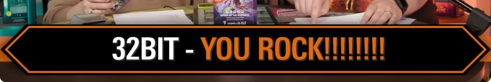</a></td>
    </tr>
    <tr>
      <td><strong>Eddieroaddogg</strong></td>
      <td><a href="https://www.youtube.com/watch?v=DlUqF9W8E7M&amp;t=499s">#722 — “Blight Curse” Precon Upgrade | Lorwyn Eclipsed</a> Date unavailable</td>
      <td><a href="https://www.youtube.com/watch?v=DlUqF9W8E7M&amp;t=499s"><strong>8:19</strong></a></td>
      <td><a href="screenshots/DlUqF9W8E7M-499-bookmark.jpg">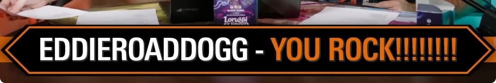</a></td>
    </tr>
    <tr>
      <td><strong>Caleb John</strong></td>
      <td><a href="https://www.youtube.com/watch?v=iqjLbIJOMlw&amp;t=1780s">#721 — Lorwyn Eclipsed’s Most Powerful New Commanders</a> Date unavailable</td>
      <td><a href="https://www.youtube.com/watch?v=iqjLbIJOMlw&amp;t=1780s"><strong>29:40</strong></a></td>
      <td><a href="screenshots/iqjLbIJOMlw-1780-bookmark.jpg">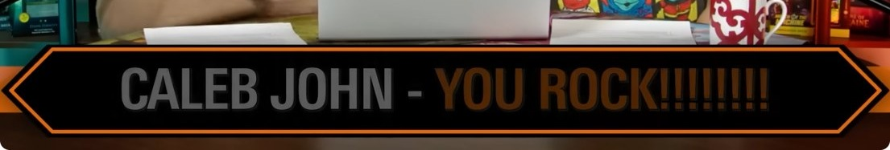</a></td>
    </tr>
    <tr>
      <td><strong>Travis Morin</strong></td>
      <td><a href="https://www.youtube.com/watch?v=yOKIc0vTnvU&amp;t=749s">#716 — How to Make Your Decks Less Boring</a> Date unavailable</td>
      <td><a href="https://www.youtube.com/watch?v=yOKIc0vTnvU&amp;t=749s"><strong>12:29</strong></a></td>
      <td><a href="screenshots/yOKIc0vTnvU-749-bookmark.jpg">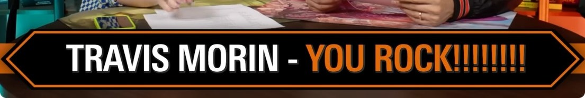</a></td>
    </tr>
    <tr>
      <td><strong>Carina Holste</strong></td>
      <td><a href="https://www.youtube.com/watch?v=Cwz_GemcWg4&amp;t=882s">#715 — Play These Cards At Your Own Risk</a> Date unavailable</td>
      <td><a href="https://www.youtube.com/watch?v=Cwz_GemcWg4&amp;t=882s"><strong>14:42</strong></a></td>
      <td><a href="screenshots/Cwz_GemcWg4-882-bookmark.jpg">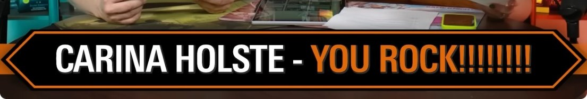</a></td>
    </tr>
    <tr>
      <td><strong>Ryan Greene</strong></td>
      <td><a href="https://www.youtube.com/watch?v=kdsXbCeaQDU&amp;t=1843s">#714 — Commanders We Just Can’t Crack</a> Date unavailable</td>
      <td><a href="https://www.youtube.com/watch?v=kdsXbCeaQDU&amp;t=1843s"><strong>30:43</strong></a></td>
      <td><a href="screenshots/kdsXbCeaQDU-1843-bookmark.jpg">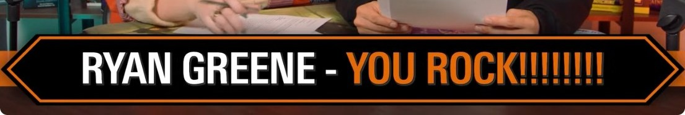</a></td>
    </tr>
    <tr>
      <td><strong>Brady White</strong></td>
      <td><a href="https://www.youtube.com/watch?v=JnITPj7bsmA&amp;t=841s">#712 — The Best Budget Cards in Every Color Pair</a> Date unavailable</td>
      <td><a href="https://www.youtube.com/watch?v=JnITPj7bsmA&amp;t=841s"><strong>14:01</strong></a></td>
      <td><a href="screenshots/JnITPj7bsmA-841-bookmark.jpg">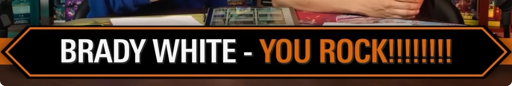</a></td>
    </tr>
    <tr>
      <td><strong>Kevin Bennett</strong></td>
      <td><a href="https://www.youtube.com/watch?v=0dBH8QxdpAE&amp;t=969s">#711 — 4 Avatar Commander Decks to Build Right Now</a> Date unavailable</td>
      <td><a href="https://www.youtube.com/watch?v=0dBH8QxdpAE&amp;t=969s"><strong>16:09</strong></a></td>
      <td><a href="screenshots/0dBH8QxdpAE-969-bookmark.jpg">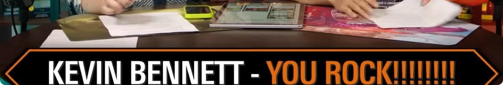</a></td>
    </tr>
    <tr>
      <td><strong>Caleb John</strong></td>
      <td><a href="https://www.youtube.com/watch?v=f9320Lqo4eI&amp;t=969s">#709 — Avatar’s Most Powerful New Commanders</a> Date unavailable</td>
      <td><a href="https://www.youtube.com/watch?v=f9320Lqo4eI&amp;t=969s"><strong>16:09</strong></a></td>
      <td><a href="screenshots/f9320Lqo4eI-969-bookmark.jpg">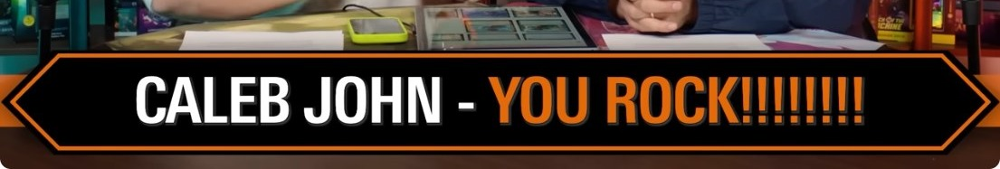</a></td>
    </tr>
    <tr>
      <td><strong>Lissa Metzler</strong></td>
      <td><a href="https://www.youtube.com/watch?v=DxIomU_20bc&amp;t=435s">#707 — These New Avatar Cards Will Blow You Away</a> Date unavailable</td>
      <td><a href="https://www.youtube.com/watch?v=DxIomU_20bc&amp;t=435s"><strong>7:15</strong></a></td>
      <td><a href="screenshots/DxIomU_20bc-435-bookmark.jpg">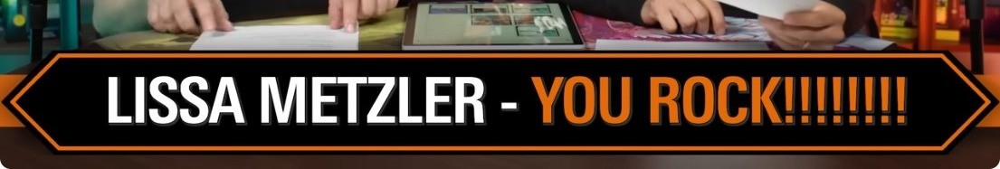</a></td>
    </tr>
    <tr>
      <td><strong>Jordan Travers</strong></td>
      <td><a href="https://www.youtube.com/watch?v=Nu8bL0cCLkA&amp;t=1631s">#701 — Our Favorite NEW Decks</a> Date unavailable</td>
      <td><a href="https://www.youtube.com/watch?v=Nu8bL0cCLkA&amp;t=1631s"><strong>27:11</strong></a></td>
      <td><a href="screenshots/Nu8bL0cCLkA-1631-bookmark.jpg">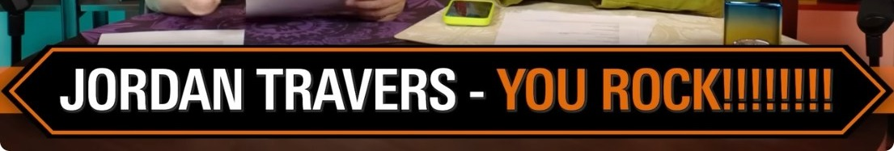</a></td>
    </tr>
    <tr>
      <td><strong>Brian Miller</strong></td>
      <td><a href="https://www.youtube.com/watch?v=agL2LV596Kc&amp;t=1048s">#699 — 4x Awesome Spider-Man Commander Decks to Build Right Now</a> Date unavailable</td>
      <td><a href="https://www.youtube.com/watch?v=agL2LV596Kc&amp;t=1048s"><strong>17:28</strong></a></td>
      <td><a href="screenshots/agL2LV596Kc-1048-bookmark.jpg">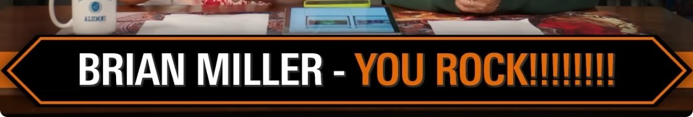</a></td>
    </tr>
    <tr>
      <td><strong>Rick Price</strong></td>
      <td><a href="https://www.youtube.com/watch?v=aLNJ9JEWFaw&amp;t=587s">#696 — BROKEN NEWS: New Spider-Man Villain ALWAYS has Blue Mana Open</a> Date unavailable</td>
      <td><a href="https://www.youtube.com/watch?v=aLNJ9JEWFaw&amp;t=587s"><strong>9:47</strong></a></td>
      <td><a href="screenshots/aLNJ9JEWFaw-587-bookmark.jpg">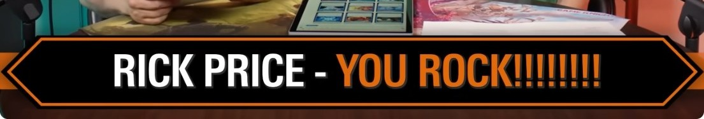</a></td>
    </tr>
    <tr>
      <td><strong>Jade Eyes</strong></td>
      <td><a href="https://www.youtube.com/watch?v=I6kd3ggg81w&amp;t=542s">#690 — When Your Deck is Too Good (But Also Too Bad)</a> Date unavailable</td>
      <td><a href="https://www.youtube.com/watch?v=I6kd3ggg81w&amp;t=542s"><strong>9:02</strong></a></td>
      <td><a href="screenshots/I6kd3ggg81w-542-bookmark.jpg">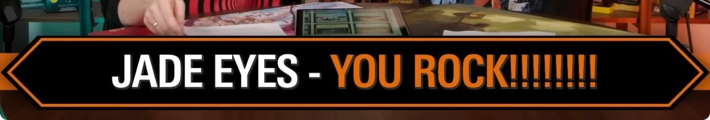</a></td>
    </tr>
    <tr>
      <td><strong>Clem Healy</strong></td>
      <td><a href="https://www.youtube.com/watch?v=ys0pgB72LIk&amp;t=801s">#687 — Most Powerful Commanders in Edge of Eternities</a> Date unavailable</td>
      <td><a href="https://www.youtube.com/watch?v=ys0pgB72LIk&amp;t=801s"><strong>13:21</strong></a></td>
      <td><a href="screenshots/ys0pgB72LIk-801-bookmark.jpg">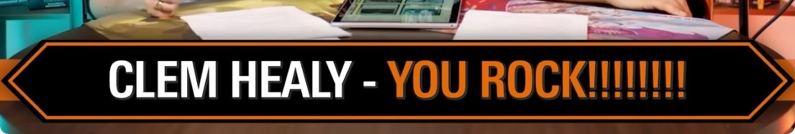</a></td>
    </tr>
    <tr>
      <td><strong>Drago Duncan</strong></td>
      <td><a href="https://www.youtube.com/watch?v=0xOXEYmbDnk&amp;t=476s">#686 — “Counter Intelligence” Precon Upgrade | Edge of Eternities</a> Date unavailable</td>
      <td><a href="https://www.youtube.com/watch?v=0xOXEYmbDnk&amp;t=476s"><strong>7:56</strong></a></td>
      <td><a href="screenshots/0xOXEYmbDnk-476-bookmark.jpg">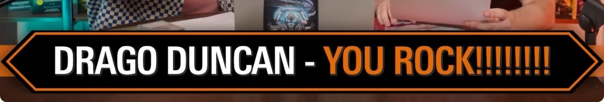</a></td>
    </tr>
    <tr>
      <td><strong>Jonathan Stier</strong></td>
      <td><a href="https://www.youtube.com/watch?v=8uxFeTgcEQY&amp;t=839s">#683 — The Best Token Commanders</a> Date unavailable</td>
      <td><a href="https://www.youtube.com/watch?v=8uxFeTgcEQY&amp;t=839s"><strong>13:59</strong></a></td>
      <td><a href="screenshots/8uxFeTgcEQY-839-bookmark.jpg">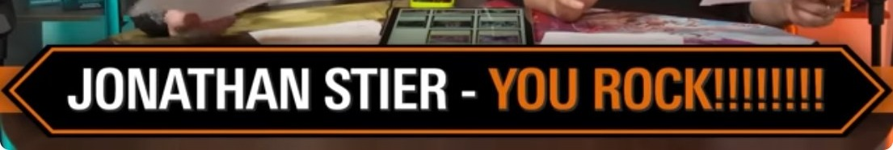</a></td>
    </tr>
    <tr>
      <td><strong>James Wood</strong></td>
      <td><a href="https://www.youtube.com/watch?v=ioB2d5WW1f8&amp;t=777s">#682 — Are These Commander Staples Worth It?</a> Date unavailable</td>
      <td><a href="https://www.youtube.com/watch?v=ioB2d5WW1f8&amp;t=777s"><strong>12:57</strong></a></td>
      <td><a href="screenshots/ioB2d5WW1f8-777-bookmark.jpg">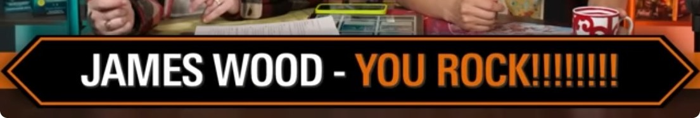</a></td>
    </tr>
    <tr>
      <td><strong>Adam Garcia</strong></td>
      <td><a href="https://www.youtube.com/watch?v=im_5XbHu4-U&amp;t=207s">#681 — We Draft the BIGGEST SPLASHY SORCERIES</a> Date unavailable</td>
      <td><a href="https://www.youtube.com/watch?v=im_5XbHu4-U&amp;t=207s"><strong>3:27</strong></a></td>
      <td><a href="screenshots/im_5XbHu4-U-207-bookmark.jpg">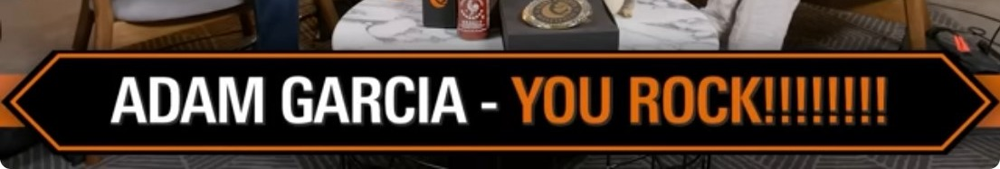</a></td>
    </tr>
    <tr>
      <td><strong>Timothy Maher</strong></td>
      <td><a href="https://www.youtube.com/watch?v=v3qeDhgVakw&amp;t=790s">#680 — Final Fantasy’s Most Iconic Commanders</a> Date unavailable</td>
      <td><a href="https://www.youtube.com/watch?v=v3qeDhgVakw&amp;t=790s"><strong>13:10</strong></a></td>
      <td><a href="screenshots/v3qeDhgVakw-790-bookmark.jpg">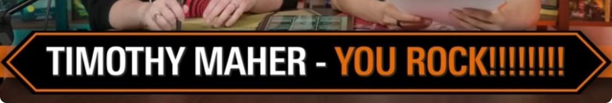</a></td>
    </tr>
    <tr>
      <td><strong>Stuart Hodge</strong></td>
      <td><a href="https://www.youtube.com/watch?v=oKzgROnDNPI&amp;t=802s">#678 — Final Fantasy’s Most Powerful Commanders</a> Date unavailable</td>
      <td><a href="https://www.youtube.com/watch?v=oKzgROnDNPI&amp;t=802s"><strong>13:22</strong></a></td>
      <td><a href="screenshots/oKzgROnDNPI-802-bookmark.jpg">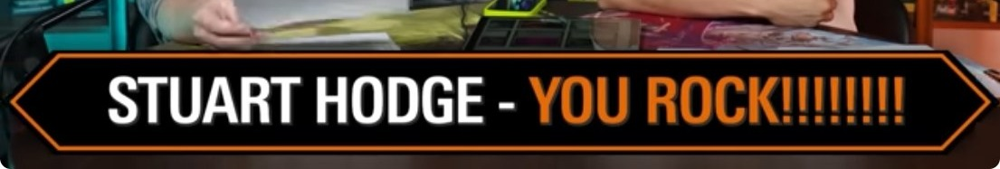</a></td>
    </tr>
    <tr>
      <td><strong>Kevin O</strong></td>
      <td><a href="https://www.youtube.com/watch?v=ZqI_-DH7lBc&amp;t=292s">#677 — Final Fantasy 6 - Commander Deck Upgrade Guide | “Revival Trance”</a> Date unavailable</td>
      <td><a href="https://www.youtube.com/watch?v=ZqI_-DH7lBc&amp;t=292s"><strong>4:52</strong></a></td>
      <td><a href="screenshots/ZqI_-DH7lBc-292-bookmark.jpg">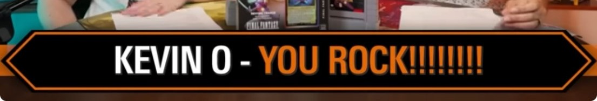</a></td>
    </tr>
    <tr>
      <td><strong>Tony Borth H</strong></td>
      <td><a href="https://www.youtube.com/watch?v=0_18LXLvR9Y&amp;t=248s">#676 — Final Fantasy 10 - Commander Deck Upgrade Guide | “Counter Blitz”</a> Date unavailable</td>
      <td><a href="https://www.youtube.com/watch?v=0_18LXLvR9Y&amp;t=248s"><strong>4:08</strong></a></td>
      <td><a href="screenshots/0_18LXLvR9Y-248-bookmark.jpg">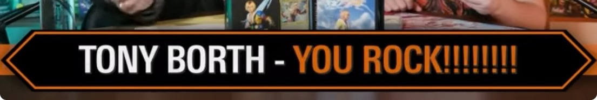</a></td>
    </tr>
    <tr>
      <td><strong>Eric Threadgold</strong></td>
      <td><a href="https://www.youtube.com/watch?v=N63rsMxeOYA&amp;t=211s">#675 — Final Fantasy 14 - Commander Deck Upgrade Guide | “Scions &amp; Spellcraft”</a> Date unavailable</td>
      <td><a href="https://www.youtube.com/watch?v=N63rsMxeOYA&amp;t=211s"><strong>3:31</strong></a></td>
      <td><a href="screenshots/N63rsMxeOYA-211-bookmark.jpg">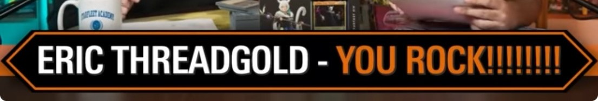</a></td>
    </tr>
    <tr>
      <td><strong>Robert Mcgill</strong></td>
      <td><a href="https://www.youtube.com/watch?v=xkypTAiPbkU&amp;t=238s">#674 — Final Fantasy 7 - Commander Deck Upgrade Guide | “Limit Break”</a> Date unavailable</td>
      <td><a href="https://www.youtube.com/watch?v=xkypTAiPbkU&amp;t=238s"><strong>3:58</strong></a></td>
      <td><a href="screenshots/xkypTAiPbkU-238-bookmark.jpg">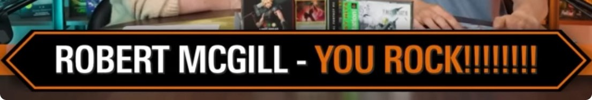</a></td>
    </tr>
    <tr>
      <td><strong>Matthew Jecelin</strong></td>
      <td><a href="https://www.youtube.com/watch?v=f4Rf4EeMh1w&amp;t=238s">#673 — We HATED these Commanders! Are They Still Bad?</a> Date unavailable</td>
      <td><a href="https://www.youtube.com/watch?v=f4Rf4EeMh1w&amp;t=238s"><strong>3:58</strong></a></td>
      <td><a href="screenshots/f4Rf4EeMh1w-238-bookmark.jpg">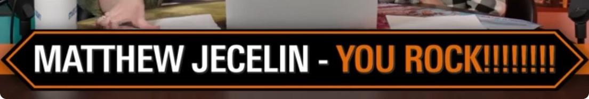</a></td>
    </tr>
    <tr>
      <td><strong>Garret Trimmer R</strong></td>
      <td><a href="https://www.youtube.com/watch?v=6q0NW3lcEVI&amp;t=288s">#672 — How Bad is Braids, Anyway?</a> Date unavailable</td>
      <td><a href="https://www.youtube.com/watch?v=6q0NW3lcEVI&amp;t=288s"><strong>4:48</strong></a></td>
      <td><a href="screenshots/6q0NW3lcEVI-288-bookmark.jpg">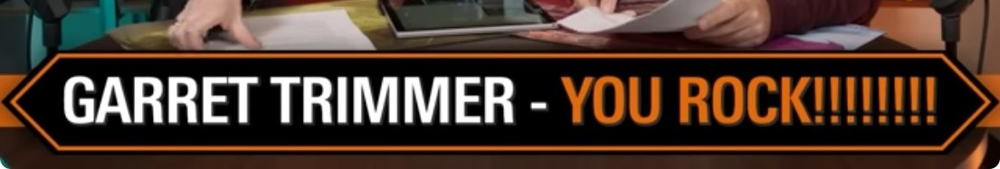</a></td>
    </tr>
    <tr>
      <td><strong>Larry Weddle</strong></td>
      <td><a href="https://www.youtube.com/watch?v=jQAJM1Mtoco&amp;t=285s">#671 — What’s Wrong with the Commander Brackets?</a> Date unavailable</td>
      <td><a href="https://www.youtube.com/watch?v=jQAJM1Mtoco&amp;t=285s"><strong>4:45</strong></a></td>
      <td><a href="screenshots/jQAJM1Mtoco-285-bookmark.jpg">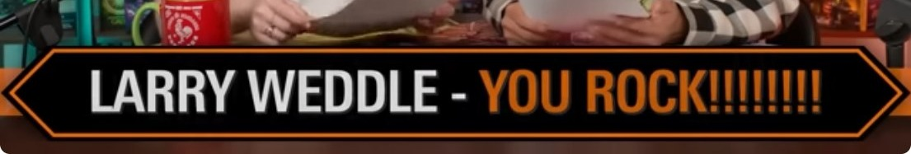</a></td>
    </tr>
    <tr>
      <td><strong>Brandon Peterson</strong></td>
      <td><a href="https://www.youtube.com/watch?v=SowjUi0QZfo&amp;t=279s">#670 — Major Commander UNBAN Announcement!</a> Date unavailable</td>
      <td><a href="https://www.youtube.com/watch?v=SowjUi0QZfo&amp;t=279s"><strong>4:39</strong></a></td>
      <td><a href="screenshots/SowjUi0QZfo-279-bookmark.jpg">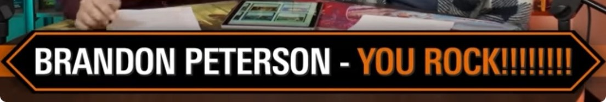</a></td>
    </tr>
    <tr>
      <td><strong>Yann-michael Gagnon</strong></td>
      <td><a href="https://www.youtube.com/watch?v=rBlD6rkZpHs&amp;t=317s">#669 — Tarkir: Dragonstorm’s Best Cards (In the 99)</a> Date unavailable</td>
      <td><a href="https://www.youtube.com/watch?v=rBlD6rkZpHs&amp;t=317s"><strong>5:17</strong></a></td>
      <td><a href="screenshots/rBlD6rkZpHs-317-bookmark.jpg">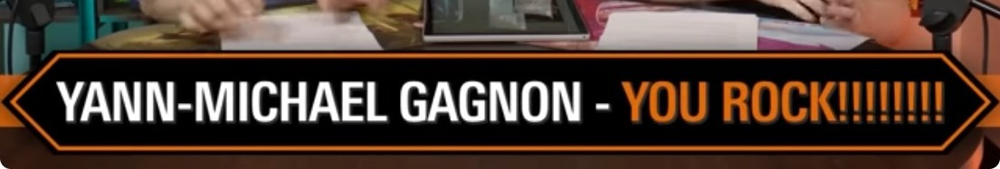</a></td>
    </tr>
    <tr>
      <td><strong>Rob Pierce</strong></td>
      <td><a href="https://www.youtube.com/watch?v=D1mxqk8enBI&amp;t=256s">#668 — “Mardu Surge” Precon Upgrade | Tarkir: Dragonstorm</a> Date unavailable</td>
      <td><a href="https://www.youtube.com/watch?v=D1mxqk8enBI&amp;t=256s"><strong>4:16</strong></a></td>
      <td><a href="screenshots/D1mxqk8enBI-256-bookmark.jpg">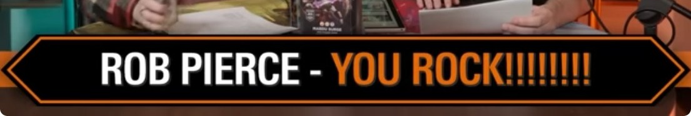</a></td>
    </tr>
    <tr>
      <td><strong>Alfredo Navarrete</strong></td>
      <td><a href="https://www.youtube.com/watch?v=Zh6se3FAglk&amp;t=256s">#667 — “Abzan Armor” Precon Upgrade | Tarkir: Dragonstorm</a> Date unavailable</td>
      <td><a href="https://www.youtube.com/watch?v=Zh6se3FAglk&amp;t=256s"><strong>4:16</strong></a></td>
      <td><a href="screenshots/Zh6se3FAglk-256-bookmark.jpg">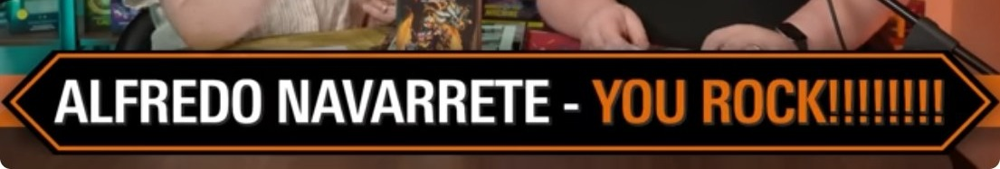</a></td>
    </tr>
    <tr>
      <td><strong>Ashton Mccombs</strong></td>
      <td><a href="https://www.youtube.com/watch?v=P0pjdWWi7bs&amp;t=259s">#666 — Most Powerful Commanders in Tarkir: Dragonstorm</a> Date unavailable</td>
      <td><a href="https://www.youtube.com/watch?v=P0pjdWWi7bs&amp;t=259s"><strong>4:19</strong></a></td>
      <td><a href="screenshots/P0pjdWWi7bs-259-bookmark.jpg">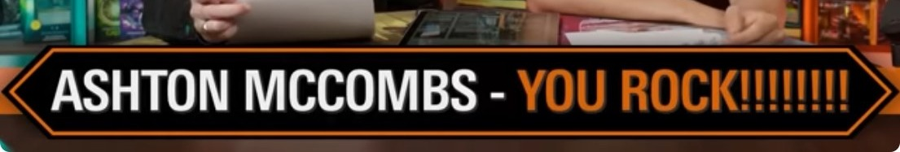</a></td>
    </tr>
    <tr>
      <td><strong>Noah Ulrey</strong></td>
      <td><a href="https://www.youtube.com/watch?v=eP1HquJbP_A&amp;t=266s">#665 — “Temur Roar” Precon Upgrade | Tarkir: Dragonstorm</a> Date unavailable</td>
      <td><a href="https://www.youtube.com/watch?v=eP1HquJbP_A&amp;t=266s"><strong>4:26</strong></a></td>
      <td></td>
    </tr>
    <tr>
      <td><strong>Mooniwallace</strong></td>
      <td><a href="https://www.youtube.com/watch?v=L1d7uUR02kg&amp;t=288s">#664 — “Sultai Arisen” Precon Upgrade | Tarkir: Dragonstorm</a> Date unavailable</td>
      <td><a href="https://www.youtube.com/watch?v=L1d7uUR02kg&amp;t=288s"><strong>4:48</strong></a></td>
      <td></td>
    </tr>
    <tr>
      <td><strong>Jake Therault</strong></td>
      <td><a href="https://www.youtube.com/watch?v=0mB6NqCZSnc&amp;t=278s">#662 — The Complete Guide to Cutting Cards</a> Date unavailable</td>
      <td><a href="https://www.youtube.com/watch?v=0mB6NqCZSnc&amp;t=278s"><strong>4:38</strong></a></td>
      <td></td>
    </tr>
    <tr>
      <td><strong>Scott Steele</strong></td>
      <td><a href="https://www.youtube.com/watch?v=3u1bZQS2zdU&amp;t=221s">#661 — The Magic Movie: Baseless Speculation</a> Date unavailable</td>
      <td><a href="https://www.youtube.com/watch?v=3u1bZQS2zdU&amp;t=221s"><strong>3:41</strong></a></td>
      <td></td>
    </tr>
    <tr>
      <td><strong>Tyler T Ballard</strong></td>
      <td><a href="https://www.youtube.com/watch?v=8lchMqp1sZE&amp;t=239s">#660 — Conceding is Salty! | Fact or Fiction?</a> Date unavailable</td>
      <td><a href="https://www.youtube.com/watch?v=8lchMqp1sZE&amp;t=239s"><strong>3:59</strong></a></td>
      <td></td>
    </tr>
    <tr>
      <td><strong>Jacob Breithaupt T</strong></td>
      <td><a href="https://www.youtube.com/watch?v=PUrQpnQ7bi8&amp;t=326s">#659 — The Problem with Deckbuilding Templates</a> Date unavailable</td>
      <td><a href="https://www.youtube.com/watch?v=PUrQpnQ7bi8&amp;t=326s"><strong>5:26</strong></a></td>
      <td></td>
    </tr>
    <tr>
      <td><strong>Nathan Pond</strong></td>
      <td><a href="https://www.youtube.com/watch?v=P1GFbX_7Iok&amp;t=309s">#657 — Will [Brackets] Solve The Power Level Problem?</a> Date unavailable</td>
      <td><a href="https://www.youtube.com/watch?v=P1GFbX_7Iok&amp;t=309s"><strong>5:09</strong></a></td>
      <td></td>
    </tr>
    <tr>
      <td><strong>Max Tannenbaum</strong></td>
      <td><a href="https://www.youtube.com/watch?v=DN_6bNCJ-kk&amp;t=288s">#652 — Who’s the Target? Lessons in Threat Assessment</a> Date unavailable</td>
      <td><a href="https://www.youtube.com/watch?v=DN_6bNCJ-kk&amp;t=288s"><strong>4:48</strong></a></td>
      <td></td>
    </tr>
    <tr>
      <td><strong>Gage Manapat</strong></td>
      <td><a href="https://www.youtube.com/watch?v=MJiOaK8HiYE&amp;t=279s">#651 — Commanders We Refuse to Play Against</a> Date unavailable</td>
      <td><a href="https://www.youtube.com/watch?v=MJiOaK8HiYE&amp;t=279s"><strong>4:39</strong></a></td>
      <td></td>
    </tr>
    <tr>
      <td><strong>Pedro Luiz</strong></td>
      <td><a href="https://www.youtube.com/watch?v=Pi9UEf2o-8U&amp;t=285s">#650 — MTG in 2024 - Year in Review</a> Date unavailable</td>
      <td><a href="https://www.youtube.com/watch?v=Pi9UEf2o-8U&amp;t=285s"><strong>4:45</strong></a></td>
      <td></td>
    </tr>
    <tr>
      <td><strong>Jen Wentworth</strong></td>
      <td><a href="https://www.youtube.com/watch?v=Dqaxd8fmBIw&amp;t=293s">#649 — A Masterclass in Priority &amp; The Stack</a> Date unavailable</td>
      <td><a href="https://www.youtube.com/watch?v=Dqaxd8fmBIw&amp;t=293s"><strong>4:53</strong></a></td>
      <td></td>
    </tr>
    <tr>
      <td><strong>William Coyle</strong></td>
      <td><a href="https://www.youtube.com/watch?v=peTijsKyeG0&amp;t=217s">#648 — We Rank Every Set from 2024</a> Date unavailable</td>
      <td><a href="https://www.youtube.com/watch?v=peTijsKyeG0&amp;t=217s"><strong>3:37</strong></a></td>
      <td></td>
    </tr>
    <tr>
      <td><strong>Brandon M Altemus</strong></td>
      <td><a href="https://www.youtube.com/watch?v=c6NFHG3Xk-w&amp;t=296s">#647 — The Best Cards of 2024</a> Date unavailable</td>
      <td><a href="https://www.youtube.com/watch?v=c6NFHG3Xk-w&amp;t=296s"><strong>4:56</strong></a></td>
      <td></td>
    </tr>
    <tr>
      <td><strong>Joseph Koo</strong></td>
      <td><a href="https://www.youtube.com/watch?v=Ycy2XIPk900&amp;t=286s">#646 — Tips for Teaching Magic: The Gathering</a> Date unavailable</td>
      <td><a href="https://www.youtube.com/watch?v=Ycy2XIPk900&amp;t=286s"><strong>4:46</strong></a></td>
      <td></td>
    </tr>
    <tr>
      <td><strong>Michael Gomez</strong></td>
      <td><a href="https://www.youtube.com/watch?v=CtzeJSx0Vk0&amp;t=271s">#645 — We Rank Every Precon from 2024</a> Date unavailable</td>
      <td><a href="https://www.youtube.com/watch?v=CtzeJSx0Vk0&amp;t=271s"><strong>4:31</strong></a></td>
      <td></td>
    </tr>
    <tr>
      <td><strong>Martin Castonguay</strong></td>
      <td><a href="https://www.youtube.com/watch?v=EHIN-1EC-KU&amp;t=251s">#644 — Do We Need the “Banned as a Commander” Rule Back?</a> Date unavailable</td>
      <td><a href="https://www.youtube.com/watch?v=EHIN-1EC-KU&amp;t=251s"><strong>4:11</strong></a></td>
      <td></td>
    </tr>
    <tr>
      <td><strong>Dylan Bruno</strong></td>
      <td><a href="https://www.youtube.com/watch?v=JHSPSeFCaxs&amp;t=270s">#643 — Start Playing Commander w/ the Foundations Starter Kit</a> Date unavailable</td>
      <td><a href="https://www.youtube.com/watch?v=JHSPSeFCaxs&amp;t=270s"><strong>4:30</strong></a></td>
      <td></td>
    </tr>
    <tr>
      <td><strong>Lyle Jones</strong></td>
      <td><a href="https://www.youtube.com/watch?v=wuXUVMysjpA&amp;t=308s">#641 — Most Powerful Commanders | Foundations Jumpstart</a> Date unavailable</td>
      <td><a href="https://www.youtube.com/watch?v=wuXUVMysjpA&amp;t=308s"><strong>5:08</strong></a></td>
      <td></td>
    </tr>
    <tr>
      <td><strong>Michael D Bass</strong></td>
      <td><a href="https://www.youtube.com/watch?v=fA6LwoKDq6s&amp;t=395s">#640 — Foundations&#x27; Best Cards (In the 99)</a> Date unavailable</td>
      <td><a href="https://www.youtube.com/watch?v=fA6LwoKDq6s&amp;t=395s"><strong>6:35</strong></a></td>
      <td></td>
    </tr>
    <tr>
      <td><strong>Damien Pacheco</strong></td>
      <td><a href="https://www.youtube.com/watch?v=O-cfZ5_OMQ0&amp;t=284s">#638 — The Most Powerful Commanders | Foundations</a> Date unavailable</td>
      <td><a href="https://www.youtube.com/watch?v=O-cfZ5_OMQ0&amp;t=284s"><strong>4:44</strong></a></td>
      <td></td>
    </tr>
    <tr>
      <td><strong>Josiah Baron</strong></td>
      <td><a href="https://www.youtube.com/watch?v=hke5GiWgMLA&amp;t=220s">#637 — What Are the Best 3+ Mana Rocks in Commander?</a> Date unavailable</td>
      <td><a href="https://www.youtube.com/watch?v=hke5GiWgMLA&amp;t=220s"><strong>3:40</strong></a></td>
      <td></td>
    </tr>
    <tr>
      <td><strong>Robert Flores Iii</strong></td>
      <td><a href="https://www.youtube.com/watch?v=rN4-IbjxY10&amp;t=220s">#636 — How to Play BLUE w/ Josh Lee Kwai</a> Date unavailable</td>
      <td><a href="https://www.youtube.com/watch?v=rN4-IbjxY10&amp;t=220s"><strong>3:40</strong></a></td>
      <td></td>
    </tr>
    <tr>
      <td><strong>Ryan Freeburger</strong></td>
      <td><a href="https://www.youtube.com/watch?v=r9wck1hVYAY&amp;t=261s">#635 — What Should Be Unbanned?</a> Date unavailable</td>
      <td><a href="https://www.youtube.com/watch?v=r9wck1hVYAY&amp;t=261s"><strong>4:21</strong></a></td>
      <td></td>
    </tr>
    <tr>
      <td><strong>Andrew Roach</strong></td>
      <td><a href="https://www.youtube.com/watch?v=eYbTaGqTwDg&amp;t=219s">#634 — Duskmourn’s Best Cards (In the 99)</a> Date unavailable</td>
      <td><a href="https://www.youtube.com/watch?v=eYbTaGqTwDg&amp;t=219s"><strong>3:39</strong></a></td>
      <td></td>
    </tr>
    <tr>
      <td><strong>Juan Ochoa</strong></td>
      <td><a href="https://www.youtube.com/watch?v=0bM6dBnKjHw&amp;t=189s">#633 — “Miracle Worker” Precon Upgrade | Duskmourn</a> Date unavailable</td>
      <td><a href="https://www.youtube.com/watch?v=0bM6dBnKjHw&amp;t=189s"><strong>3:09</strong></a></td>
      <td></td>
    </tr>
    <tr>
      <td><strong>Soon Hui Loh</strong></td>
      <td><a href="https://www.youtube.com/watch?v=dLWVLujnKLM&amp;t=217s">#632 — The Most Powerful Commanders | Duskmourn</a> Date unavailable</td>
      <td><a href="https://www.youtube.com/watch?v=dLWVLujnKLM&amp;t=217s"><strong>3:37</strong></a></td>
      <td></td>
    </tr>
    <tr>
      <td><strong>Eric Jeff</strong></td>
      <td><a href="https://www.youtube.com/watch?v=2O9jWyIGqYY&amp;t=183s">#631 — “Jump Scare” Precon Upgrade | Duskmourn</a> Date unavailable</td>
      <td><a href="https://www.youtube.com/watch?v=2O9jWyIGqYY&amp;t=183s"><strong>3:03</strong></a></td>
      <td></td>
    </tr>
    <tr>
      <td><strong>Andreas Hock</strong></td>
      <td><a href="https://www.youtube.com/watch?v=RfnOeHj9c7w&amp;t=216s">#630 — “Endless Punishment” Precon Upgrade | Duskmourn</a> Date unavailable</td>
      <td><a href="https://www.youtube.com/watch?v=RfnOeHj9c7w&amp;t=216s"><strong>3:36</strong></a></td>
      <td></td>
    </tr>
    <tr>
      <td><strong>Iain Barnfather</strong></td>
      <td><a href="https://www.youtube.com/watch?v=uZY_rkEpTcQ&amp;t=317s">#629 — “Death Toll” Full Deck Reveal &amp; Upgrade | Duskmourn</a> Date unavailable</td>
      <td><a href="https://www.youtube.com/watch?v=uZY_rkEpTcQ&amp;t=317s"><strong>5:17</strong></a></td>
      <td></td>
    </tr>
    <tr>
      <td><strong>Dylan Bruno</strong></td>
      <td><a href="https://www.youtube.com/watch?v=yQcH5K-oEqY&amp;t=182s">#628 — The Stupidest Deck I’ve Ever Built</a> Date unavailable</td>
      <td><a href="https://www.youtube.com/watch?v=yQcH5K-oEqY&amp;t=182s"><strong>3:02</strong></a></td>
      <td></td>
    </tr>
    <tr>
      <td><strong>Joseph Hollis</strong></td>
      <td><a href="https://www.youtube.com/watch?v=RwZiW5qBynM&amp;t=202s">#627 — The Most Annoying Cards in Commander</a> Date unavailable</td>
      <td><a href="https://www.youtube.com/watch?v=RwZiW5qBynM&amp;t=202s"><strong>3:22</strong></a></td>
      <td></td>
    </tr>
    <tr>
      <td><strong>Blayne Hejduk</strong></td>
      <td><a href="https://www.youtube.com/watch?v=gM_Q4_3-rFk&amp;t=223s">#626 — How to Play Group Hug w/ Jumbo Commander</a> Date unavailable</td>
      <td><a href="https://www.youtube.com/watch?v=gM_Q4_3-rFk&amp;t=223s"><strong>3:43</strong></a></td>
      <td></td>
    </tr>
    <tr>
      <td><strong>Lance Olsen</strong></td>
      <td><a href="https://www.youtube.com/watch?v=mABwgkaYD78&amp;t=328s">#625 — Bloomburrow&#x27;s Best Cards (In the 99)</a> Date unavailable</td>
      <td><a href="https://www.youtube.com/watch?v=mABwgkaYD78&amp;t=328s"><strong>5:28</strong></a></td>
      <td></td>
    </tr>
    <tr>
      <td><strong>Rachel Barrett</strong></td>
      <td><a href="https://www.youtube.com/watch?v=gAEp0ji6K3U&amp;t=301s">#624 — “Family Matters” Precon Upgrade | Bloomburrow</a> Date unavailable</td>
      <td><a href="https://www.youtube.com/watch?v=gAEp0ji6K3U&amp;t=301s"><strong>5:01</strong></a></td>
      <td></td>
    </tr>
    <tr>
      <td><strong>Arun Senthil</strong></td>
      <td><a href="https://www.youtube.com/watch?v=yfvXfOtAulY&amp;t=224s">#623 — The Most Powerful Commanders | Bloomburrow</a> Date unavailable</td>
      <td><a href="https://www.youtube.com/watch?v=yfvXfOtAulY&amp;t=224s"><strong>3:44</strong></a></td>
      <td></td>
    </tr>
    <tr>
      <td><strong>Olivia Gobert-hicks</strong></td>
      <td><a href="https://www.youtube.com/watch?v=JAmxY_hPdn8&amp;t=253s">#622 — “Animated Army” Precon Upgrade | Bloomburrow</a> Date unavailable</td>
      <td><a href="https://www.youtube.com/watch?v=JAmxY_hPdn8&amp;t=253s"><strong>4:13</strong></a></td>
      <td></td>
    </tr>
    <tr>
      <td><strong>Erik Woolley</strong></td>
      <td><a href="https://www.youtube.com/watch?v=QGeWljZSLcA&amp;t=240s">#621 — “Peace Offering” Precon Upgrade | Bloomburrow</a> Date unavailable</td>
      <td><a href="https://www.youtube.com/watch?v=QGeWljZSLcA&amp;t=240s"><strong>4:00</strong></a></td>
      <td></td>
    </tr>
    <tr>
      <td><strong>Shaun In The Ice</strong></td>
      <td><a href="https://www.youtube.com/watch?v=gkwO1W3YU6Q&amp;t=285s">#620 — “Squirreled Away” Full Deck Reveal &amp; Upgrade - Bloomburrow</a> Date unavailable</td>
      <td><a href="https://www.youtube.com/watch?v=gkwO1W3YU6Q&amp;t=285s"><strong>4:45</strong></a></td>
      <td></td>
    </tr>
    <tr>
      <td><strong>Francis A Leyco</strong></td>
      <td><a href="https://www.youtube.com/watch?v=YBoVPW0wvhY&amp;t=218s">#619 — We Draft the Best “Gotcha&quot; Spells in Commander</a> Date unavailable</td>
      <td><a href="https://www.youtube.com/watch?v=YBoVPW0wvhY&amp;t=218s"><strong>3:38</strong></a></td>
      <td></td>
    </tr>
    <tr>
      <td><strong>Caleb Stallings</strong></td>
      <td><a href="https://www.youtube.com/watch?v=DbZ06RkMzZM&amp;t=303s">#618 — Cards You Need to Know from Assassin’s Creed</a> Date unavailable</td>
      <td><a href="https://www.youtube.com/watch?v=DbZ06RkMzZM&amp;t=303s"><strong>5:03</strong></a></td>
      <td></td>
    </tr>
    <tr>
      <td><strong>Donovan Kwiatkowski</strong></td>
      <td><a href="https://www.youtube.com/watch?v=Cms0pC17QOI&amp;t=256s">#617 — “Tricky Terrain” Precon Upgrade | Modern Horizons 3</a> Date unavailable</td>
      <td><a href="https://www.youtube.com/watch?v=Cms0pC17QOI&amp;t=256s"><strong>4:16</strong></a></td>
      <td></td>
    </tr>
    <tr>
      <td><strong>Lydia Johnson</strong></td>
      <td><a href="https://www.youtube.com/watch?v=JKQZ8pSh730&amp;t=336s">#616 — The Best Cards (In the 99) from Modern Horizons 3</a> Date unavailable</td>
      <td><a href="https://www.youtube.com/watch?v=JKQZ8pSh730&amp;t=336s"><strong>5:36</strong></a></td>
      <td></td>
    </tr>
    <tr>
      <td><strong>Stuart Hodge</strong></td>
      <td><a href="https://www.youtube.com/watch?v=-hvdCNLnfo8&amp;t=270s">#615 — We Rank the MDFCs in MH3</a> Date unavailable</td>
      <td><a href="https://www.youtube.com/watch?v=-hvdCNLnfo8&amp;t=270s"><strong>4:30</strong></a></td>
      <td></td>
    </tr>
    <tr>
      <td><strong>Natalie Gosselin</strong></td>
      <td><a href="https://www.youtube.com/watch?v=WrP4EbXCi9Y&amp;t=299s">#614 — We Reveal a Brand New Assassin’s Creed Card</a> Date unavailable</td>
      <td><a href="https://www.youtube.com/watch?v=WrP4EbXCi9Y&amp;t=299s"><strong>4:59</strong></a></td>
      <td></td>
    </tr>
    <tr>
      <td><strong>Hellfire Dragon</strong></td>
      <td><a href="https://www.youtube.com/watch?v=LR5HnlH1qcA&amp;t=243s">#613 — “Graveyard Overdrive” Precon Upgrade | Modern Horizons 3</a> Date unavailable</td>
      <td><a href="https://www.youtube.com/watch?v=LR5HnlH1qcA&amp;t=243s"><strong>4:03</strong></a></td>
      <td></td>
    </tr>
    <tr>
      <td><strong>Jayden Sorin</strong></td>
      <td><a href="https://www.youtube.com/watch?v=ChVK6K-BzaQ&amp;t=326s">#612 — “Eldrazi Incursion” Precon Upgrade | Modern Horizons 3</a> Date unavailable</td>
      <td><a href="https://www.youtube.com/watch?v=ChVK6K-BzaQ&amp;t=326s"><strong>5:26</strong></a></td>
      <td></td>
    </tr>
    <tr>
      <td><strong>Connor Tilton</strong></td>
      <td><a href="https://www.youtube.com/watch?v=CLdcW1y_JFs&amp;t=343s">#611 — Most Powerful Commanders from Modern Horizons 3</a> Date unavailable</td>
      <td><a href="https://www.youtube.com/watch?v=CLdcW1y_JFs&amp;t=343s"><strong>5:43</strong></a></td>
      <td></td>
    </tr>
    <tr>
      <td><strong>Lee Buckner</strong></td>
      <td><a href="https://www.youtube.com/watch?v=aMDfxMA0w3k&amp;t=272s">#610 — “Creative Energy” Precon Upgrade | Modern Horizons 3</a> Date unavailable</td>
      <td><a href="https://www.youtube.com/watch?v=aMDfxMA0w3k&amp;t=272s"><strong>4:32</strong></a></td>
      <td></td>
    </tr>
    <tr>
      <td><strong>Dex Riddlewell</strong></td>
      <td><a href="https://www.youtube.com/watch?v=MPpkIP1U8KM&amp;t=284s">#609 — “Tricky Terrain” Full Deck Reveal - Modern Horizons 3</a> Date unavailable</td>
      <td><a href="https://www.youtube.com/watch?v=MPpkIP1U8KM&amp;t=284s"><strong>4:44</strong></a></td>
      <td></td>
    </tr>
    <tr>
      <td><strong>Stef Van De Poel</strong></td>
      <td><a href="https://www.youtube.com/watch?v=NNv2uWeCS50&amp;t=339s">#608 — Master Deck Building w/ These Scryfall Hacks</a> Date unavailable</td>
      <td><a href="https://www.youtube.com/watch?v=NNv2uWeCS50&amp;t=339s"><strong>5:39</strong></a></td>
      <td></td>
    </tr>
    <tr>
      <td><strong>Hendrick Deleon</strong></td>
      <td><a href="https://www.youtube.com/watch?v=36mEaTK9Fu4&amp;t=319s">#607 — Level Up Your Combat Phase</a> Date unavailable</td>
      <td><a href="https://www.youtube.com/watch?v=36mEaTK9Fu4&amp;t=319s"><strong>5:19</strong></a></td>
      <td></td>
    </tr>
    <tr>
      <td><strong>Cameron Konop</strong></td>
      <td><a href="https://www.youtube.com/watch?v=n-s47Bf93rU&amp;t=189s">#606 — How to Play GREEN w/ Brian Kibler</a> Date unavailable</td>
      <td><a href="https://www.youtube.com/watch?v=n-s47Bf93rU&amp;t=189s"><strong>3:09</strong></a></td>
      <td></td>
    </tr>
    <tr>
      <td><strong>Jirawat Sannoi</strong></td>
      <td><a href="https://www.youtube.com/watch?v=knhnCHaNZRQ&amp;t=270s">#605 — Game Knights Isn’t Scripted, BUT…</a> Date unavailable</td>
      <td><a href="https://www.youtube.com/watch?v=knhnCHaNZRQ&amp;t=270s"><strong>4:30</strong></a></td>
      <td></td>
    </tr>
    <tr>
      <td><strong>Timothy Melvin</strong></td>
      <td><a href="https://www.youtube.com/watch?v=URtAGnwD_Ho&amp;t=265s">#604 — The Best Cards (In the 99) from Outlaws of Thunder Junction</a> Date unavailable</td>
      <td><a href="https://www.youtube.com/watch?v=URtAGnwD_Ho&amp;t=265s"><strong>4:25</strong></a></td>
      <td></td>
    </tr>
    <tr>
      <td><strong>Vincent Ethier</strong></td>
      <td><a href="https://www.youtube.com/watch?v=9d9zqLvzR_E&amp;t=309s">#603 — “Most Wanted” Precon Upgrade | Outlaws of Thunder Junction</a> Date unavailable</td>
      <td><a href="https://www.youtube.com/watch?v=9d9zqLvzR_E&amp;t=309s"><strong>5:09</strong></a></td>
      <td></td>
    </tr>
    <tr>
      <td><strong>Eric Chang</strong></td>
      <td><a href="https://www.youtube.com/watch?v=gnUsQg6NNV4&amp;t=229s">#602 — “Grand Larceny” Precon Upgrade | Outlaws of Thunder Junction</a> Date unavailable</td>
      <td><a href="https://www.youtube.com/watch?v=gnUsQg6NNV4&amp;t=229s"><strong>3:49</strong></a></td>
      <td></td>
    </tr>
    <tr>
      <td><strong>Demetrius Martin</strong></td>
      <td><a href="https://www.youtube.com/watch?v=noRbaO3CirU&amp;t=258s">#601 — “Desert Bloom” Precon Upgrade | Outlaws of Thunder Junction</a> Date unavailable</td>
      <td><a href="https://www.youtube.com/watch?v=noRbaO3CirU&amp;t=258s"><strong>4:18</strong></a></td>
      <td></td>
    </tr>
    <tr>
      <td><strong>Julio Uribe</strong></td>
      <td><a href="https://www.youtube.com/watch?v=H8ZUxaeyvlY&amp;t=267s">#600 — “Quick Draw” Precon Upgrade | Outlaws of Thunder Junction</a> Date unavailable</td>
      <td><a href="https://www.youtube.com/watch?v=H8ZUxaeyvlY&amp;t=267s"><strong>4:27</strong></a></td>
      <td></td>
    </tr>
    <tr>
      <td><strong>Rj Conley</strong></td>
      <td><a href="https://www.youtube.com/watch?v=L22gaWp6GVQ&amp;t=256s">#599 — Most Powerful Commanders from Outlaws of Thunder Junction</a> Date unavailable</td>
      <td><a href="https://www.youtube.com/watch?v=L22gaWp6GVQ&amp;t=256s"><strong>4:16</strong></a></td>
      <td></td>
    </tr>
    <tr>
      <td><strong>Kenji Madden</strong></td>
      <td><a href="https://www.youtube.com/watch?v=fWiXZAfIH2Y&amp;t=348s">#597 — The Unwritten Rules of Commander</a> Date unavailable</td>
      <td><a href="https://www.youtube.com/watch?v=fWiXZAfIH2Y&amp;t=348s"><strong>5:48</strong></a></td>
      <td></td>
    </tr>
    <tr>
      <td><strong>Casey Comisky Y</strong></td>
      <td><a href="https://www.youtube.com/watch?v=swjL6prGShE&amp;t=348s">#596 — Do This One Thing to Win More Games | How to Playtest</a> Date unavailable</td>
      <td><a href="https://www.youtube.com/watch?v=swjL6prGShE&amp;t=348s"><strong>5:48</strong></a></td>
      <td></td>
    </tr>
    <tr>
      <td><strong>William Segletes</strong></td>
      <td><a href="https://www.youtube.com/watch?v=w_d47pXuCOo&amp;t=246s">#595 — We Draft the Best Planeswalkers in Commander</a> Date unavailable</td>
      <td><a href="https://www.youtube.com/watch?v=w_d47pXuCOo&amp;t=246s"><strong>4:06</strong></a></td>
      <td></td>
    </tr>
    <tr>
      <td><strong>Caleb Hayes</strong></td>
      <td><a href="https://www.youtube.com/watch?v=bIGbLd3_8AE&amp;t=199s">#594 — Every Card You Need to Know from Fallout</a> Date unavailable</td>
      <td><a href="https://www.youtube.com/watch?v=bIGbLd3_8AE&amp;t=199s"><strong>3:19</strong></a></td>
      <td></td>
    </tr>
    <tr>
      <td><strong>Taylor Palmer</strong></td>
      <td><a href="https://www.youtube.com/watch?v=jOzucv3vc74&amp;t=314s">#593 — Fallout Precon Upgrade Guide w/ Kyle Hill | SCIENCE! vs Mutant Menace</a> Date unavailable</td>
      <td><a href="https://www.youtube.com/watch?v=jOzucv3vc74&amp;t=314s"><strong>5:14</strong></a></td>
      <td></td>
    </tr>
    <tr>
      <td><strong>Brennan Huffman</strong></td>
      <td><a href="https://www.youtube.com/watch?v=yXVt0ILwvVY&amp;t=297s">#592 — Fallout Precon Upgrade Guides | Hail, Caesar vs Scrappy Survivors</a> Date unavailable</td>
      <td><a href="https://www.youtube.com/watch?v=yXVt0ILwvVY&amp;t=297s"><strong>4:57</strong></a></td>
      <td></td>
    </tr>
    <tr>
      <td><strong>Bryan Grieme</strong></td>
      <td><a href="https://www.youtube.com/watch?v=lhU4LTnwQQA&amp;t=181s">#591 — How to Become a GENIUS at Commander</a> Date unavailable</td>
      <td><a href="https://www.youtube.com/watch?v=lhU4LTnwQQA&amp;t=181s"><strong>3:01</strong></a></td>
      <td></td>
    </tr>
    <tr>
      <td><strong>Lunafreya Wootton</strong></td>
      <td><a href="https://www.youtube.com/watch?v=jDUwuYQt48s&amp;t=204s">#590 — Official Fallout Preview Card</a> Date unavailable</td>
      <td><a href="https://www.youtube.com/watch?v=jDUwuYQt48s&amp;t=204s"><strong>3:24</strong></a></td>
      <td></td>
    </tr>
    <tr>
      <td><strong>Devan Pierce</strong></td>
      <td><a href="https://www.youtube.com/watch?v=aMqF_1SzFt4&amp;t=182s">#589 — The Best Cards (In the 99) from Murders at Karlov Manor</a> Date unavailable</td>
      <td><a href="https://www.youtube.com/watch?v=aMqF_1SzFt4&amp;t=182s"><strong>3:02</strong></a></td>
      <td></td>
    </tr>
    <tr>
      <td><strong>Matt Chu</strong></td>
      <td><a href="https://www.youtube.com/watch?v=9LqXl99Uv-s&amp;t=260s">#588 — Karlov Manor Precon Upgrades &amp; Comparison | Deep Clue Sea vs Blame Game</a> Date unavailable</td>
      <td><a href="https://www.youtube.com/watch?v=9LqXl99Uv-s&amp;t=260s"><strong>4:20</strong></a></td>
      <td></td>
    </tr>
    <tr>
      <td><strong>John Moseman</strong></td>
      <td><a href="https://www.youtube.com/watch?v=5T3pMi6o2zM&amp;t=214s">#587 — Karlov Manor Precon Upgrades &amp; Comparison | Deadly Disguise vs Revenant Recon</a> Date unavailable</td>
      <td><a href="https://www.youtube.com/watch?v=5T3pMi6o2zM&amp;t=214s"><strong>3:34</strong></a></td>
      <td></td>
    </tr>
    <tr>
      <td><strong>Jacob Little</strong></td>
      <td><a href="https://www.youtube.com/watch?v=PHV1VtYof98&amp;t=333s">#586 — Most Powerful Commanders from Murders at Karlov Manor</a> Date unavailable</td>
      <td><a href="https://www.youtube.com/watch?v=PHV1VtYof98&amp;t=333s"><strong>5:33</strong></a></td>
      <td></td>
    </tr>
    <tr>
      <td><strong>Andrew James Ringrose</strong></td>
      <td><a href="https://www.youtube.com/watch?v=0qnFxDNz0bI&amp;t=278s">#584 — Cards that Change Your Deck&#x27;s Power Level</a> Date unavailable</td>
      <td><a href="https://www.youtube.com/watch?v=0qnFxDNz0bI&amp;t=278s"><strong>4:38</strong></a></td>
      <td></td>
    </tr>
    <tr>
      <td><strong>Trevor Rumaugh</strong></td>
      <td><a href="https://www.youtube.com/watch?v=wO0e2Bmb3Ac&amp;t=233s">#582 — Our Commander New Year&#x27;s Resolutions</a> Date unavailable</td>
      <td><a href="https://www.youtube.com/watch?v=wO0e2Bmb3Ac&amp;t=233s"><strong>3:53</strong></a></td>
      <td></td>
    </tr>
    <tr>
      <td><strong>James Lavengood</strong></td>
      <td><a href="https://www.youtube.com/watch?v=yyKTuO3f6Zg&amp;t=235s">#581 — MTG in 2023 - Year in Review</a> Date unavailable</td>
      <td><a href="https://www.youtube.com/watch?v=yyKTuO3f6Zg&amp;t=235s"><strong>3:55</strong></a></td>
      <td></td>
    </tr>
    <tr>
      <td><strong>Rebecca Crane</strong></td>
      <td><a href="https://www.youtube.com/watch?v=oYdyAQkJyik&amp;t=322s">#580 — We Rank Every Precon from 2023</a> Date unavailable</td>
      <td><a href="https://www.youtube.com/watch?v=oYdyAQkJyik&amp;t=322s"><strong>5:22</strong></a></td>
      <td></td>
    </tr>
    <tr>
      <td><strong>Brad Ezzell</strong></td>
      <td><a href="https://www.youtube.com/watch?v=ERcLhi1LTMU&amp;t=202s">#579 — Jimmy’s Personal Commander Decks</a> Date unavailable</td>
      <td><a href="https://www.youtube.com/watch?v=ERcLhi1LTMU&amp;t=202s"><strong>3:22</strong></a></td>
      <td></td>
    </tr>
    <tr>
      <td><strong>Bryan Timlin</strong></td>
      <td><a href="https://www.youtube.com/watch?v=OYKcJZ61Vv4&amp;t=213s">#578 — How to Play BLACK w/ Ladee Danger</a> Date unavailable</td>
      <td><a href="https://www.youtube.com/watch?v=OYKcJZ61Vv4&amp;t=213s"><strong>3:33</strong></a></td>
      <td></td>
    </tr>
    <tr>
      <td><strong>Cooper Bennett</strong></td>
      <td><a href="https://www.youtube.com/watch?v=sIyNw06rTko&amp;t=242s">#577 — We Draft the Best Utility Lands in Commander</a> Date unavailable</td>
      <td><a href="https://www.youtube.com/watch?v=sIyNw06rTko&amp;t=242s"><strong>4:02</strong></a></td>
      <td></td>
    </tr>
    <tr>
      <td><strong>First Order Wookiee</strong></td>
      <td><a href="https://www.youtube.com/watch?v=eDllfszXP0U&amp;t=231s">#576 — Vampire Precon Upgrade Guide | “Blood Rites” | Lost Caverns of Ixalan</a> Date unavailable</td>
      <td><a href="https://www.youtube.com/watch?v=eDllfszXP0U&amp;t=231s"><strong>3:51</strong></a></td>
      <td></td>
    </tr>
    <tr>
      <td><strong>Alex Ippolito</strong></td>
      <td><a href="https://www.youtube.com/watch?v=SoGS7ve9MGM&amp;t=221s">#574 — Pirate Precon Upgrade Guide | “Ahoy Mateys” | Lost Caverns of Ixalan</a> Date unavailable</td>
      <td><a href="https://www.youtube.com/watch?v=SoGS7ve9MGM&amp;t=221s"><strong>3:41</strong></a></td>
      <td></td>
    </tr>
    <tr>
      <td><strong>Randall Flud</strong></td>
      <td><a href="https://www.youtube.com/watch?v=Dyp5B4jutCY&amp;t=276s">#573 — Merfolk Precon Upgrade | “Explorers of the Deep” | Lost Caverns of Ixalan</a> Date unavailable</td>
      <td><a href="https://www.youtube.com/watch?v=Dyp5B4jutCY&amp;t=276s"><strong>4:36</strong></a></td>
      <td></td>
    </tr>
    <tr>
      <td><strong>Conor Salinas</strong></td>
      <td><a href="https://www.youtube.com/watch?v=Gd6HeLT4hrY&amp;t=204s">#572 — Dinosaur Precon Upgrade Guide | “Veloci-Ramp-Tor” | Lost Caverns of Ixalan</a> Date unavailable</td>
      <td><a href="https://www.youtube.com/watch?v=Gd6HeLT4hrY&amp;t=204s"><strong>3:24</strong></a></td>
      <td></td>
    </tr>
    <tr>
      <td><strong>Waila Skinner</strong></td>
      <td><a href="https://www.youtube.com/watch?v=MTbT-2xYfAU&amp;t=306s">#570 — “Blood Rites” Full Deck Reveal - Lost Caverns of Ixalan</a> Date unavailable</td>
      <td><a href="https://www.youtube.com/watch?v=MTbT-2xYfAU&amp;t=306s"><strong>5:06</strong></a></td>
      <td></td>
    </tr>
    <tr>
      <td><strong>Dylan Howard</strong></td>
      <td><a href="https://www.youtube.com/watch?v=IOCar-pgdh4&amp;t=251s">#569 — The Best Cards (In the 99) from Doctor Who</a> Date unavailable</td>
      <td><a href="https://www.youtube.com/watch?v=IOCar-pgdh4&amp;t=251s"><strong>4:11</strong></a></td>
      <td></td>
    </tr>
    <tr>
      <td><strong>Tyson Janney</strong></td>
      <td><a href="https://www.youtube.com/watch?v=upV7Q0YND3c&amp;t=258s">#568 — “Paradox Power” Doctor Who Precon Upgrade</a> Date unavailable</td>
      <td><a href="https://www.youtube.com/watch?v=upV7Q0YND3c&amp;t=258s"><strong>4:18</strong></a></td>
      <td></td>
    </tr>
    <tr>
      <td><strong>Mario Benkert</strong></td>
      <td><a href="https://www.youtube.com/watch?v=G5nicVKE5p8&amp;t=271s">#567 — The Best Doctors (and Companions) in Doctor Who</a> Date unavailable</td>
      <td><a href="https://www.youtube.com/watch?v=G5nicVKE5p8&amp;t=271s"><strong>4:31</strong></a></td>
      <td></td>
    </tr>
    <tr>
      <td><strong>Emperor Dom</strong></td>
      <td><a href="https://www.youtube.com/watch?v=hePGRRVKhkI&amp;t=289s">#565 — “Masters of Evil” Doctor Who Precon Upgrade</a> Date unavailable</td>
      <td><a href="https://www.youtube.com/watch?v=hePGRRVKhkI&amp;t=289s"><strong>4:49</strong></a></td>
      <td></td>
    </tr>
    <tr>
      <td><strong>John Antkowiak</strong></td>
      <td><a href="https://www.youtube.com/watch?v=q8Q4H27nN9k&amp;t=220s">#564 — “Timey-Wimey” Doctor Who Precon Upgrade</a> Date unavailable</td>
      <td><a href="https://www.youtube.com/watch?v=q8Q4H27nN9k&amp;t=220s"><strong>3:40</strong></a></td>
      <td></td>
    </tr>
    <tr>
      <td><strong>Brad Springall</strong></td>
      <td><a href="https://www.youtube.com/watch?v=C8tdw7pAFBA&amp;t=173s">#563 — The Most Powerful Commanders in Doctor Who</a> Date unavailable</td>
      <td><a href="https://www.youtube.com/watch?v=C8tdw7pAFBA&amp;t=173s"><strong>2:53</strong></a></td>
      <td></td>
    </tr>
    <tr>
      <td><strong>Maarten Van Ginhoven</strong></td>
      <td><a href="https://www.youtube.com/watch?v=pS13XyQcD5k&amp;t=259s">#562 — We Draft the Best Equipment in Commander</a> Date unavailable</td>
      <td><a href="https://www.youtube.com/watch?v=pS13XyQcD5k&amp;t=259s"><strong>4:19</strong></a></td>
      <td></td>
    </tr>
    <tr>
      <td><strong>Zach Tutosi</strong></td>
      <td><a href="https://www.youtube.com/watch?v=5lOVb4885_I&amp;t=271s">#561 — Commanders We Hate Playing Against</a> Date unavailable</td>
      <td><a href="https://www.youtube.com/watch?v=5lOVb4885_I&amp;t=271s"><strong>4:31</strong></a></td>
      <td></td>
    </tr>
    <tr>
      <td><strong>Jonathan Bund</strong></td>
      <td><a href="https://www.youtube.com/watch?v=7eBGjtysGcY&amp;t=246s">#560 — You&#x27;re Reading Cards WRONG</a> Date unavailable</td>
      <td><a href="https://www.youtube.com/watch?v=7eBGjtysGcY&amp;t=246s"><strong>4:06</strong></a></td>
      <td></td>
    </tr>
    <tr>
      <td><strong>Spencer Rabourn</strong></td>
      <td><a href="https://www.youtube.com/watch?v=xW7oc4hxeLE&amp;t=536s">#559 — The Best Wilds of Eldraine Cards (In The 99)</a> Date unavailable</td>
      <td><a href="https://www.youtube.com/watch?v=xW7oc4hxeLE&amp;t=536s"><strong>8:56</strong></a></td>
      <td></td>
    </tr>
    <tr>
      <td><strong>Gary Wilton</strong></td>
      <td><a href="https://www.youtube.com/watch?v=daqy8_hvsRA&amp;t=225s">#558 — “Fae Dominion” Wilds of Eldraine Precon Upgrade Guide</a> Date unavailable</td>
      <td><a href="https://www.youtube.com/watch?v=daqy8_hvsRA&amp;t=225s"><strong>3:45</strong></a></td>
      <td></td>
    </tr>
    <tr>
      <td><strong>Mike Claerhout T</strong></td>
      <td><a href="https://www.youtube.com/watch?v=XSqsxRT4NVU&amp;t=265s">#557 — The Spiciest Wilds of Eldraine Commanders</a> Date unavailable</td>
      <td><a href="https://www.youtube.com/watch?v=XSqsxRT4NVU&amp;t=265s"><strong>4:25</strong></a></td>
      <td></td>
    </tr>
    <tr>
      <td><strong>Nichole Woods</strong></td>
      <td><a href="https://www.youtube.com/watch?v=p7bqTM3yAPI&amp;t=216s">#556 — “Virtue and Valor” Wilds of Eldraine Precon Upgrade Guide</a> Date unavailable</td>
      <td><a href="https://www.youtube.com/watch?v=p7bqTM3yAPI&amp;t=216s"><strong>3:36</strong></a></td>
      <td></td>
    </tr>
    <tr>
      <td><strong>Phillip Ash</strong></td>
      <td><a href="https://www.youtube.com/watch?v=1DXu-QRjL4c&amp;t=252s">#555 — Wilds of Eldraine Commanders You HAVE to Build</a> Date unavailable</td>
      <td><a href="https://www.youtube.com/watch?v=1DXu-QRjL4c&amp;t=252s"><strong>4:12</strong></a></td>
      <td></td>
    </tr>
    <tr>
      <td><strong>Daniel Ortega</strong></td>
      <td><a href="https://www.youtube.com/watch?v=-bY4zxb_U3Q&amp;t=295s">#554 — “Fae Dominion” Full Deck Reveal - Wilds of Eldraine</a> Date unavailable</td>
      <td><a href="https://www.youtube.com/watch?v=-bY4zxb_U3Q&amp;t=295s"><strong>4:55</strong></a></td>
      <td></td>
    </tr>
    <tr>
      <td><strong>Sarah Pisula</strong></td>
      <td><a href="https://www.youtube.com/watch?v=pZammxuR_PY&amp;t=250s">#553 — Underrated Commanders that Should Be More Popular</a> Date unavailable</td>
      <td><a href="https://www.youtube.com/watch?v=pZammxuR_PY&amp;t=250s"><strong>4:10</strong></a></td>
      <td></td>
    </tr>
    <tr>
      <td><strong>Andrew Chen</strong></td>
      <td><a href="https://www.youtube.com/watch?v=cJdyAZ-btWU&amp;t=241s">#552 — “Enduring Enchantments” Commander Masters Precon Upgrade Guide</a> Date unavailable</td>
      <td><a href="https://www.youtube.com/watch?v=cJdyAZ-btWU&amp;t=241s"><strong>4:01</strong></a></td>
      <td></td>
    </tr>
    <tr>
      <td><strong>Joshua Weagle</strong></td>
      <td><a href="https://www.youtube.com/watch?v=-xHia4igdVM&amp;t=259s">#551 — “Eldrazi Unbound” Commander Masters Precon Upgrade Guide</a> Date unavailable</td>
      <td><a href="https://www.youtube.com/watch?v=-xHia4igdVM&amp;t=259s"><strong>4:19</strong></a></td>
      <td></td>
    </tr>
    <tr>
      <td><strong>Brandon Clyburn</strong></td>
      <td><a href="https://www.youtube.com/watch?v=lut1vHn4FxA&amp;t=249s">#550 — Most BUSTED New Cards from CMM</a> Date unavailable</td>
      <td><a href="https://www.youtube.com/watch?v=lut1vHn4FxA&amp;t=249s"><strong>4:09</strong></a></td>
      <td></td>
    </tr>
    <tr>
      <td><strong>Michael Fine</strong></td>
      <td><a href="https://www.youtube.com/watch?v=XvLWezTXjMk&amp;t=277s">#549 — “Sliver Swarm” Commander Masters Precon Upgrade Guide</a> Date unavailable</td>
      <td><a href="https://www.youtube.com/watch?v=XvLWezTXjMk&amp;t=277s"><strong>4:37</strong></a></td>
      <td></td>
    </tr>
    <tr>
      <td><strong>Justin Bulgarelli Jr</strong></td>
      <td><a href="https://www.youtube.com/watch?v=TC0DXuCK2AI&amp;t=246s">#548 — “Planeswalker Party” Commander Masters Precon Upgrade Guide</a> Date unavailable</td>
      <td><a href="https://www.youtube.com/watch?v=TC0DXuCK2AI&amp;t=246s"><strong>4:06</strong></a></td>
      <td></td>
    </tr>
    <tr>
      <td><strong>Alex Kalish</strong></td>
      <td><a href="https://www.youtube.com/watch?v=WARcYHfIbeg&amp;t=280s">#547 — Commander Masters “Enduring Enchantments” Full Precon Reveal</a> Date unavailable</td>
      <td><a href="https://www.youtube.com/watch?v=WARcYHfIbeg&amp;t=280s"><strong>4:40</strong></a></td>
      <td></td>
    </tr>
    <tr>
      <td><strong>Dexter Ancheta</strong></td>
      <td><a href="https://www.youtube.com/watch?v=Hvfa6p10H6c&amp;t=205s">#546 — How to Play WHITE w/ Rachel Weeks</a> Date unavailable</td>
      <td><a href="https://www.youtube.com/watch?v=Hvfa6p10H6c&amp;t=205s"><strong>3:25</strong></a></td>
      <td></td>
    </tr>
    <tr>
      <td><strong>Joseph Vespucci</strong></td>
      <td><a href="https://www.youtube.com/watch?v=GHK0whGDyEM&amp;t=258s">#544 — “Riders of Rohan” LOTR Precon Upgrade Guide</a> Date unavailable</td>
      <td><a href="https://www.youtube.com/watch?v=GHK0whGDyEM&amp;t=258s"><strong>4:18</strong></a></td>
      <td></td>
    </tr>
    <tr>
      <td><strong>Paul Karyakos</strong></td>
      <td><a href="https://www.youtube.com/watch?v=zgM_XDIYtag&amp;t=274s">#543 — The Most Flavorful Commanders in LOTR</a> Date unavailable</td>
      <td><a href="https://www.youtube.com/watch?v=zgM_XDIYtag&amp;t=274s"><strong>4:34</strong></a></td>
      <td></td>
    </tr>
    <tr>
      <td><strong>Brian Hook</strong></td>
      <td><a href="https://www.youtube.com/watch?v=GRbhbfUP7VQ&amp;t=258s">#542 — The Best LOTR Cards (In the 99)</a> Date unavailable</td>
      <td><a href="https://www.youtube.com/watch?v=GRbhbfUP7VQ&amp;t=258s"><strong>4:18</strong></a></td>
      <td></td>
    </tr>
    <tr>
      <td><strong>Becky Wheeler</strong></td>
      <td><a href="https://www.youtube.com/watch?v=aLK7p5EOWFE&amp;t=286s">#541 — “Hosts of Mordor” LOTR Precon Upgrade Guide</a> Date unavailable</td>
      <td><a href="https://www.youtube.com/watch?v=aLK7p5EOWFE&amp;t=286s"><strong>4:46</strong></a></td>
      <td></td>
    </tr>
    <tr>
      <td><strong>Scott Fryer</strong></td>
      <td><a href="https://www.youtube.com/watch?v=XPh0M1TPzwY&amp;t=299s">#540 — “Elven Council” LOTR Precon Upgrade Guide</a> Date unavailable</td>
      <td><a href="https://www.youtube.com/watch?v=XPh0M1TPzwY&amp;t=299s"><strong>4:59</strong></a></td>
      <td></td>
    </tr>
    <tr>
      <td><strong>Luke Diabo</strong></td>
      <td><a href="https://www.youtube.com/watch?v=j0pTBs2CeKo&amp;t=215s">#538 — “Food and Fellowship” LOTR Precon Upgrade</a> Date unavailable</td>
      <td><a href="https://www.youtube.com/watch?v=j0pTBs2CeKo&amp;t=215s"><strong>3:35</strong></a></td>
      <td></td>
    </tr>
    <tr>
      <td><strong>Dakota Dillard</strong></td>
      <td><a href="https://www.youtube.com/watch?v=9Lo-e9WynqA&amp;t=299s">#537 — These LOTR Commanders are BUSTED!</a> Date unavailable</td>
      <td><a href="https://www.youtube.com/watch?v=9Lo-e9WynqA&amp;t=299s"><strong>4:59</strong></a></td>
      <td></td>
    </tr>
    <tr>
      <td><strong>Caleb Doucet</strong></td>
      <td><a href="https://www.youtube.com/watch?v=bDmPfEeo69o&amp;t=230s">#536 — LOTR “Riders of Rohan” Full Precon Reveal</a> Date unavailable</td>
      <td><a href="https://www.youtube.com/watch?v=bDmPfEeo69o&amp;t=230s"><strong>3:50</strong></a></td>
      <td></td>
    </tr>
    <tr>
      <td><strong>Sean Logue</strong></td>
      <td><a href="https://www.youtube.com/watch?v=LCqGf27Xyvk&amp;t=210s">#535 — Rachel’s Personal Commander Decks</a> Date unavailable</td>
      <td><a href="https://www.youtube.com/watch?v=LCqGf27Xyvk&amp;t=210s"><strong>3:30</strong></a></td>
      <td></td>
    </tr>
    <tr>
      <td><strong>Ryanne Harris</strong></td>
      <td><a href="https://www.youtube.com/watch?v=_zYgDmEOxNE&amp;t=234s">#534 — How to Play RED with Jimmy Wong</a> Date unavailable</td>
      <td><a href="https://www.youtube.com/watch?v=_zYgDmEOxNE&amp;t=234s"><strong>3:54</strong></a></td>
      <td></td>
    </tr>
    <tr>
      <td><strong>Cody Simpson</strong></td>
      <td><a href="https://www.youtube.com/watch?v=gaJ_2gyLbC4&amp;t=214s">#533 — Compleated Commanders - March of the Machine</a> Date unavailable</td>
      <td><a href="https://www.youtube.com/watch?v=gaJ_2gyLbC4&amp;t=214s"><strong>3:34</strong></a></td>
      <td></td>
    </tr>
    <tr>
      <td><strong>Edoardo Mies</strong></td>
      <td><a href="https://www.youtube.com/watch?v=go8LnaazQ60&amp;t=305s">#531 — “Cavalry Charge” Precon Budget Upgrade - March of the Machine</a> Date unavailable</td>
      <td><a href="https://www.youtube.com/watch?v=go8LnaazQ60&amp;t=305s"><strong>5:05</strong></a></td>
      <td></td>
    </tr>
    <tr>
      <td><strong>Bradley Spice</strong></td>
      <td><a href="https://www.youtube.com/watch?v=KGLtZ4DledU&amp;t=256s">#530 — AFTERMATH: Cards You Need to Know</a> Date unavailable</td>
      <td><a href="https://www.youtube.com/watch?v=KGLtZ4DledU&amp;t=256s"><strong>4:16</strong></a></td>
      <td></td>
    </tr>
    <tr>
      <td><strong>Mark Akers</strong></td>
      <td><a href="https://www.youtube.com/watch?v=J3ADtaBWX68&amp;t=178s">#529 — The Best Cards (In the 99) - March of the Machine</a> Date unavailable</td>
      <td><a href="https://www.youtube.com/watch?v=J3ADtaBWX68&amp;t=178s"><strong>2:58</strong></a></td>
      <td></td>
    </tr>
    <tr>
      <td><strong>Kevin Phillips</strong></td>
      <td><a href="https://www.youtube.com/watch?v=-PBKuwy3YZ4&amp;t=286s">#528 — “Call for Backup” Precon Budget Upgrade - March of the Machine</a> Date unavailable</td>
      <td><a href="https://www.youtube.com/watch?v=-PBKuwy3YZ4&amp;t=286s"><strong>4:46</strong></a></td>
      <td></td>
    </tr>
    <tr>
      <td><strong>Daniel Best</strong></td>
      <td><a href="https://www.youtube.com/watch?v=7FgN_8JFclc&amp;t=347s">#527 — “Tinker Time” Precon Budget Upgrade - March of the Machine</a> Date unavailable</td>
      <td><a href="https://www.youtube.com/watch?v=7FgN_8JFclc&amp;t=347s"><strong>5:47</strong></a></td>
      <td></td>
    </tr>
    <tr>
      <td><strong>Cricket Floyd</strong></td>
      <td><a href="https://www.youtube.com/watch?v=GjvdYPVQze8&amp;t=223s">#526 — Which Praetor Is Most Powerful? | March of the Machine</a> Date unavailable</td>
      <td><a href="https://www.youtube.com/watch?v=GjvdYPVQze8&amp;t=223s"><strong>3:43</strong></a></td>
      <td></td>
    </tr>
    <tr>
      <td><strong>Alissa Telling</strong></td>
      <td><a href="https://www.youtube.com/watch?v=vqI6jVCv-bs&amp;t=253s">#525 — “Growing Threat” Precon Budget Upgrade - March of the Machine</a> Date unavailable</td>
      <td><a href="https://www.youtube.com/watch?v=vqI6jVCv-bs&amp;t=253s"><strong>4:13</strong></a></td>
      <td></td>
    </tr>
    <tr>
      <td><strong>Cooper Johnson</strong></td>
      <td><a href="https://www.youtube.com/watch?v=BCGVRxP68LE&amp;t=245s">#524 — March of the Machine - Team Up Commanders (Part 2)</a> Date unavailable</td>
      <td><a href="https://www.youtube.com/watch?v=BCGVRxP68LE&amp;t=245s"><strong>4:05</strong></a></td>
      <td></td>
    </tr>
    <tr>
      <td><strong>Alec Mcphillips</strong></td>
      <td><a href="https://www.youtube.com/watch?v=AgsbvCiFnvg&amp;t=229s">#523 — March of the Machine - Team Up Commanders (Part 1)</a> Date unavailable</td>
      <td><a href="https://www.youtube.com/watch?v=AgsbvCiFnvg&amp;t=229s"><strong>3:49</strong></a></td>
      <td></td>
    </tr>
    <tr>
      <td><strong>Samantha Burbank</strong></td>
      <td><a href="https://www.youtube.com/watch?v=ShTFssyDRio&amp;t=278s">#521 — Rules Magic Players Keep Getting Wrong</a> Date unavailable</td>
      <td><a href="https://www.youtube.com/watch?v=ShTFssyDRio&amp;t=278s"><strong>4:38</strong></a></td>
      <td></td>
    </tr>
    <tr>
      <td><strong>Austin Morris</strong></td>
      <td><a href="https://www.youtube.com/watch?v=ZA7nX9f19yw&amp;t=296s">#520 — Scariest Commanders to Play Against</a> Date unavailable</td>
      <td><a href="https://www.youtube.com/watch?v=ZA7nX9f19yw&amp;t=296s"><strong>4:56</strong></a></td>
      <td></td>
    </tr>
    <tr>
      <td><strong>David Le</strong></td>
      <td><a href="https://www.youtube.com/watch?v=-1cF7-WCQeQ&amp;t=225s">#519 — How to Build a Deck You Love to Play</a> Date unavailable</td>
      <td><a href="https://www.youtube.com/watch?v=-1cF7-WCQeQ&amp;t=225s"><strong>3:45</strong></a></td>
      <td></td>
    </tr>
    <tr>
      <td><strong>Abe Hazway Y</strong></td>
      <td><a href="https://www.youtube.com/watch?v=PlTuYh5hXIc&amp;t=316s">#501 — Transformers: Autobot Commanders - The Brothers War</a> Date unavailable</td>
      <td><a href="https://www.youtube.com/watch?v=PlTuYh5hXIc&amp;t=316s"><strong>5:16</strong></a></td>
      <td></td>
    </tr>
    <tr>
      <td><strong>Keon Warren</strong></td>
      <td><a href="https://www.youtube.com/watch?v=l-W7AvbhufQ&amp;t=179s">#490 — Mono-Colored &amp; Uncommon Commanders - Dominaria United</a> Date unavailable</td>
      <td><a href="https://www.youtube.com/watch?v=l-W7AvbhufQ&amp;t=179s"><strong>2:59</strong></a></td>
      <td></td>
    </tr>
    <tr>
      <td><strong>Grant Mason</strong></td>
      <td><a href="https://www.youtube.com/watch?v=GVezVQMYDi4&amp;t=262s">#484 — Dominaria United - Best Multi-colored Commanders (Part 2)</a> Date unavailable</td>
      <td><a href="https://www.youtube.com/watch?v=GVezVQMYDi4&amp;t=262s"><strong>4:22</strong></a></td>
      <td></td>
    </tr>
    <tr>
      <td><strong>Kyle Deyette</strong></td>
      <td><a href="https://www.youtube.com/watch?v=DliVsku3kJE&amp;t=181s">#481 — “Painbow” Full Deck Reveal - Dominaria United</a> Date unavailable</td>
      <td><a href="https://www.youtube.com/watch?v=DliVsku3kJE&amp;t=181s"><strong>3:01</strong></a></td>
      <td></td>
    </tr>
    <tr>
      <td><strong>Christopher Walker</strong></td>
      <td><a href="https://www.youtube.com/watch?v=WmBnjwW_mtU&amp;t=286s">#476 — Is 2X2 the Highest Value Reprint Set Ever?!?!</a> Date unavailable</td>
      <td><a href="https://www.youtube.com/watch?v=WmBnjwW_mtU&amp;t=286s"><strong>4:46</strong></a></td>
      <td></td>
    </tr>
    <tr>
      <td><strong>Alex Rouse</strong></td>
      <td><a href="https://www.youtube.com/watch?v=czSzF8FBzlg&amp;t=148s">#474 — “Draconic Dissent” Budget Upgrade Guide - Baldur’s Gate</a> Date unavailable</td>
      <td><a href="https://www.youtube.com/watch?v=czSzF8FBzlg&amp;t=148s"><strong>2:28</strong></a></td>
      <td></td>
    </tr>
    <tr>
      <td><strong>Alex Shaw</strong></td>
      <td><a href="https://www.youtube.com/watch?v=advSNUKAVbM&amp;t=188s">#471 — “Mind Flayarrrrs” Budget Upgrade Guide - Baldur’s Gate</a> Date unavailable</td>
      <td><a href="https://www.youtube.com/watch?v=advSNUKAVbM&amp;t=188s"><strong>3:08</strong></a></td>
      <td></td>
    </tr>
    <tr>
      <td><strong>Chris Tabberer</strong></td>
      <td><a href="https://www.youtube.com/watch?v=8UkleX_mZMM&amp;t=208s">#468 — Baldur&#x27;s Gate - Best Multicolored Commanders (Pt2)</a> Date unavailable</td>
      <td><a href="https://www.youtube.com/watch?v=8UkleX_mZMM&amp;t=208s"><strong>3:28</strong></a></td>
      <td></td>
    </tr>
    <tr>
      <td><strong>Bobby Bickford</strong></td>
      <td><a href="https://www.youtube.com/watch?v=NNjDtl-u-rs&amp;t=341s">#464 — Cards You’re Playing WRONG</a> Date unavailable</td>
      <td><a href="https://www.youtube.com/watch?v=NNjDtl-u-rs&amp;t=341s"><strong>5:41</strong></a></td>
      <td></td>
    </tr>
    <tr>
      <td><strong>Tyler Wigley</strong></td>
      <td><a href="https://www.youtube.com/watch?v=Ogh52RYCUm0&amp;t=179s">#463 — “Riveteers Rampage” Budget Upgrade Guide - New Capenna</a> Date unavailable</td>
      <td><a href="https://www.youtube.com/watch?v=Ogh52RYCUm0&amp;t=179s"><strong>2:59</strong></a></td>
      <td></td>
    </tr>
    <tr>
      <td><strong>Lauri Lannetta</strong></td>
      <td><a href="https://www.youtube.com/watch?v=ga2JC8uFl7o&amp;t=153s">#460 — “Bedecked Brokers” Budget Upgrade Guide - New Capenna</a> Date unavailable</td>
      <td><a href="https://www.youtube.com/watch?v=ga2JC8uFl7o&amp;t=153s"><strong>2:33</strong></a></td>
      <td></td>
    </tr>
    <tr>
      <td><strong>Jeremy Dennis</strong></td>
      <td><a href="https://www.youtube.com/watch?v=yWqmMTiTAi8&amp;t=305s">#457 — “Cabaretti Cacophony” Budget Upgrade Guide - New Capenna</a> Date unavailable</td>
      <td><a href="https://www.youtube.com/watch?v=yWqmMTiTAi8&amp;t=305s"><strong>5:05</strong></a></td>
      <td></td>
    </tr>
    <tr>
      <td><strong>Broderick Hanson</strong></td>
      <td><a href="https://www.youtube.com/watch?v=LB6HotI0ntI&amp;t=391s">#453 — Advanced Deckbuilding: Mastering Your Mana Curve</a> Date unavailable</td>
      <td><a href="https://www.youtube.com/watch?v=LB6HotI0ntI&amp;t=391s"><strong>6:31</strong></a></td>
      <td></td>
    </tr>
    <tr>
      <td><strong>Joseph Slade</strong></td>
      <td><a href="https://www.youtube.com/watch?v=AvmMur5Lni8&amp;t=274s">#428 — Commander Politics: Dealing with Dealers</a> Date unavailable</td>
      <td><a href="https://www.youtube.com/watch?v=AvmMur5Lni8&amp;t=274s"><strong>4:34</strong></a></td>
      <td></td>
    </tr>
    <tr>
      <td><strong>Roger Porcelli</strong></td>
      <td><a href="https://www.youtube.com/watch?v=WNJMZauf0hw&amp;t=396s">#422 — The Mono-Colored Commanders from Midnight Hunt</a> Date unavailable</td>
      <td><a href="https://www.youtube.com/watch?v=WNJMZauf0hw&amp;t=396s"><strong>6:36</strong></a></td>
      <td></td>
    </tr>
    <tr>
      <td><strong>Jacob Smith</strong></td>
      <td><a href="https://www.youtube.com/watch?v=AhOQeftJ0_g&amp;t=246s">#420 — Midnight Hunt - Best New Multi-Colored Commanders</a> Date unavailable</td>
      <td><a href="https://www.youtube.com/watch?v=AhOQeftJ0_g&amp;t=246s"><strong>4:06</strong></a></td>
      <td></td>
    </tr>
    <tr>
      <td><strong>Max Lunden</strong></td>
      <td><a href="https://www.youtube.com/watch?v=HEKZOcV3bKU&amp;t=145s">#417 — Upgrade Your Interaction</a> Date unavailable</td>
      <td><a href="https://www.youtube.com/watch?v=HEKZOcV3bKU&amp;t=145s"><strong>2:25</strong></a></td>
      <td></td>
    </tr>
    <tr>
      <td><strong>William Gerwig</strong></td>
      <td><a href="https://www.youtube.com/watch?v=GuYNc7u5ud0&amp;t=192s">#416 — AFC Best New Cards</a> Date unavailable</td>
      <td><a href="https://www.youtube.com/watch?v=GuYNc7u5ud0&amp;t=192s"><strong>3:12</strong></a></td>
      <td></td>
    </tr>
    <tr>
      <td><strong>Jacob Heckman</strong></td>
      <td><a href="https://www.youtube.com/watch?v=hyZmrhgjIlc&amp;t=109s">#415 — AFC New Commander Analysis</a> Date unavailable</td>
      <td><a href="https://www.youtube.com/watch?v=hyZmrhgjIlc&amp;t=109s"><strong>1:49</strong></a></td>
      <td></td>
    </tr>
    <tr>
      <td><strong>Danny Montgomery</strong></td>
      <td><a href="https://www.youtube.com/watch?v=vL7-jRXICFE&amp;t=206s">#413 — AFR - Green, Multicolored &amp; Colorless Review</a> Date unavailable</td>
      <td><a href="https://www.youtube.com/watch?v=vL7-jRXICFE&amp;t=206s"><strong>3:26</strong></a></td>
      <td></td>
    </tr>
    <tr>
      <td><strong>Steve Boettjer</strong></td>
      <td><a href="https://www.youtube.com/watch?v=xzsnmobugl8&amp;t=219s">#412 — AFR - Black &amp; White Review Forgotten Realms</a> Date unavailable</td>
      <td><a href="https://www.youtube.com/watch?v=xzsnmobugl8&amp;t=219s"><strong>3:39</strong></a></td>
      <td></td>
    </tr>
    <tr>
      <td><strong>Jonathan Steinman</strong></td>
      <td><a href="https://www.youtube.com/watch?v=LSuPBKZoVAQ&amp;t=194s">#411 — AFR - Red &amp; Blue Review - Forgotten Realms</a> Date unavailable</td>
      <td><a href="https://www.youtube.com/watch?v=LSuPBKZoVAQ&amp;t=194s"><strong>3:14</strong></a></td>
      <td></td>
    </tr>
    <tr>
      <td><strong>Tristan Sprowls</strong></td>
      <td><a href="https://www.youtube.com/watch?v=_BWguwtx40c&amp;t=105s">#403 — MH2 - Green &amp; Red Review</a> Date unavailable</td>
      <td><a href="https://www.youtube.com/watch?v=_BWguwtx40c&amp;t=105s"><strong>1:45</strong></a></td>
      <td></td>
    </tr>
    <tr>
      <td><strong>Irvin Zubia</strong></td>
      <td><a href="https://www.youtube.com/watch?v=y8LFCjTzCOc&amp;t=146s">#401 — MH2 - White, Black &amp; Multicolored Review</a> Date unavailable</td>
      <td><a href="https://www.youtube.com/watch?v=y8LFCjTzCOc&amp;t=146s"><strong>2:26</strong></a></td>
      <td></td>
    </tr>
    <tr>
      <td><strong>Jason Clissold</strong></td>
      <td><a href="https://www.youtube.com/watch?v=dvVVleUWbVo&amp;t=209s">#399 — The Best New Commanders from Modern Horizons 2</a> Date unavailable</td>
      <td><a href="https://www.youtube.com/watch?v=dvVVleUWbVo&amp;t=209s"><strong>3:29</strong></a></td>
      <td></td>
    </tr>
    <tr>
      <td><strong>Paul Tracey</strong></td>
      <td><a href="https://www.youtube.com/watch?v=KwrSB085FSw&amp;t=278s">#398 — C21 New Commander Deep Dive (Part Two)</a> Date unavailable</td>
      <td><a href="https://www.youtube.com/watch?v=KwrSB085FSw&amp;t=278s"><strong>4:38</strong></a></td>
      <td></td>
    </tr>
    <tr>
      <td><strong>Kelsea Smothers</strong></td>
      <td><a href="https://www.youtube.com/watch?v=P1O9h5vsLmY&amp;t=136s">#396 — C21 New Card Analysis (Part Two)</a> Date unavailable</td>
      <td><a href="https://www.youtube.com/watch?v=P1O9h5vsLmY&amp;t=136s"><strong>2:16</strong></a></td>
      <td></td>
    </tr>
    <tr>
      <td><strong>Daniel Woodling</strong></td>
      <td><a href="https://www.youtube.com/watch?v=2ajwEJ3typc&amp;t=150s">#395 — C21 New Card Analysis (Part One)</a> Date unavailable</td>
      <td><a href="https://www.youtube.com/watch?v=2ajwEJ3typc&amp;t=150s"><strong>2:30</strong></a></td>
      <td></td>
    </tr>
    <tr>
      <td><strong>Erick Martinez</strong></td>
      <td><a href="https://www.youtube.com/watch?v=2TF9wQvOzCI&amp;t=169s">#394 — Witherbloom Precon - Budget Upgrade Guide</a> Date unavailable</td>
      <td><a href="https://www.youtube.com/watch?v=2TF9wQvOzCI&amp;t=169s"><strong>2:49</strong></a></td>
      <td></td>
    </tr>
    <tr>
      <td><strong>Tyler Cadden</strong></td>
      <td><a href="https://www.youtube.com/watch?v=c1WJs00XRfY&amp;t=187s">#392 — Strixhaven Set Review (Part One)</a> Date unavailable</td>
      <td><a href="https://www.youtube.com/watch?v=c1WJs00XRfY&amp;t=187s"><strong>3:07</strong></a></td>
      <td></td>
    </tr>
    <tr>
      <td><strong>Adam Marthaler</strong></td>
      <td><a href="https://www.youtube.com/watch?v=EbLmvADJoug&amp;t=202s">#391 — Silverquill Precon - Budget Upgrade Guide</a> Date unavailable</td>
      <td><a href="https://www.youtube.com/watch?v=EbLmvADJoug&amp;t=202s"><strong>3:22</strong></a></td>
      <td></td>
    </tr>
    <tr>
      <td><strong>Evan Limberger</strong></td>
      <td><a href="https://www.youtube.com/watch?v=H0ue3q8FUls&amp;t=224s">#390 — Strixhaven Traditional Commander Review</a> Date unavailable</td>
      <td><a href="https://www.youtube.com/watch?v=H0ue3q8FUls&amp;t=224s"><strong>3:44</strong></a></td>
      <td></td>
    </tr>
    <tr>
      <td><strong>Luis Magana</strong></td>
      <td><a href="https://www.youtube.com/watch?v=rWaKrL5pSqA&amp;t=287s">#388 — Quandrix Precon - Budget Upgrade Guide</a> Date unavailable</td>
      <td><a href="https://www.youtube.com/watch?v=rWaKrL5pSqA&amp;t=287s"><strong>4:47</strong></a></td>
      <td></td>
    </tr>
    <tr>
      <td><strong>Kristen North</strong></td>
      <td><a href="https://www.youtube.com/watch?v=TvNxaEtpxF4&amp;t=170s">#384 — Strixhaven Preview Card - Tempted by the Oriq</a> Date unavailable</td>
      <td><a href="https://www.youtube.com/watch?v=TvNxaEtpxF4&amp;t=170s"><strong>2:50</strong></a></td>
      <td></td>
    </tr>
    <tr>
      <td><strong>Kevin Smith</strong></td>
      <td><a href="https://www.youtube.com/watch?v=BN3-OJgW_mc&amp;t=247s">#383 — The Most Powerful Synergies in Commander</a> Date unavailable</td>
      <td><a href="https://www.youtube.com/watch?v=BN3-OJgW_mc&amp;t=247s"><strong>4:07</strong></a></td>
      <td></td>
    </tr>
    <tr>
      <td><strong>Tim Langermann</strong></td>
      <td><a href="https://www.youtube.com/watch?v=Jxng3koUR5o&amp;t=239s">#378 — Azorius &quot;Phantom Premonition&quot; Budget Upgrade</a> Date unavailable</td>
      <td><a href="https://www.youtube.com/watch?v=Jxng3koUR5o&amp;t=239s"><strong>3:59</strong></a></td>
      <td></td>
    </tr>
    <tr>
      <td><strong>Keegan Genie</strong></td>
      <td><a href="https://www.youtube.com/watch?v=3D_tsJsnG9A&amp;t=250s">#377 — Golgari &quot;Elven Empire&quot; Budget Upgrade Guide</a> Date unavailable</td>
      <td><a href="https://www.youtube.com/watch?v=3D_tsJsnG9A&amp;t=250s"><strong>4:10</strong></a></td>
      <td></td>
    </tr>
    <tr>
      <td><strong>Jacob Pratt</strong></td>
      <td><a href="https://www.youtube.com/watch?v=ZjWR90dc6YI&amp;t=172s">#376 — Kaldheim Set Review</a> Date unavailable</td>
      <td><a href="https://www.youtube.com/watch?v=ZjWR90dc6YI&amp;t=172s"><strong>2:52</strong></a></td>
      <td></td>
    </tr>
    <tr>
      <td><strong>Josh Garza</strong></td>
      <td><a href="https://www.youtube.com/watch?v=cv4bMZd6e2w&amp;t=211s">#375 — Kaldheim - Traditional Commanders</a> Date unavailable</td>
      <td><a href="https://www.youtube.com/watch?v=cv4bMZd6e2w&amp;t=211s"><strong>3:31</strong></a></td>
      <td></td>
    </tr>
    <tr>
      <td><strong>Nick Genovese</strong></td>
      <td><a href="https://www.youtube.com/watch?v=iqV6Ytnzn4c&amp;t=264s">#373 — Life Lessons Learned from Commander</a> Date unavailable</td>
      <td><a href="https://www.youtube.com/watch?v=iqV6Ytnzn4c&amp;t=264s"><strong>4:24</strong></a></td>
      <td></td>
    </tr>
    <tr>
      <td><strong>Paul Dyson</strong></td>
      <td><a href="https://www.youtube.com/watch?v=CrWXs5KQo0I&amp;t=243s">#369 — Commander Legends - New Card Analysis (Part 1)</a> Date unavailable</td>
      <td><a href="https://www.youtube.com/watch?v=CrWXs5KQo0I&amp;t=243s"><strong>4:03</strong></a></td>
      <td></td>
    </tr>
    <tr>
      <td><strong>Marcel Prinsloo</strong></td>
      <td><a href="https://www.youtube.com/watch?v=_p0SBuCVb84&amp;t=213s">#368 — Blue Partner Review - Commander Legends</a> Date unavailable</td>
      <td><a href="https://www.youtube.com/watch?v=_p0SBuCVb84&amp;t=213s"><strong>3:33</strong></a></td>
      <td></td>
    </tr>
    <tr>
      <td><strong>Nick Campbell</strong></td>
      <td><a href="https://www.youtube.com/watch?v=cYRom4Yex6w&amp;t=216s">#367 — Black Partner Review - Commander Legends</a> Date unavailable</td>
      <td><a href="https://www.youtube.com/watch?v=cYRom4Yex6w&amp;t=216s"><strong>3:36</strong></a></td>
      <td></td>
    </tr>
    <tr>
      <td><strong>Spencer Cubberly</strong></td>
      <td><a href="https://www.youtube.com/watch?v=ndBshxnDIC4&amp;t=156s">#365 — Simic Landfall &quot;Reap the Tides&quot; Budget Upgrade Guide</a> Date unavailable</td>
      <td><a href="https://www.youtube.com/watch?v=ndBshxnDIC4&amp;t=156s"><strong>2:36</strong></a></td>
      <td></td>
    </tr>
    <tr>
      <td><strong>Taisha Garcia</strong></td>
      <td><a href="https://www.youtube.com/watch?v=uu6Bdv_aIrs&amp;t=231s">#364 — Boros Equipment &quot;Arm for Battle&quot; Budget Upgrade Guide</a> Date unavailable</td>
      <td><a href="https://www.youtube.com/watch?v=uu6Bdv_aIrs&amp;t=231s"><strong>3:51</strong></a></td>
      <td></td>
    </tr>
    <tr>
      <td><strong>Robert Negrete</strong></td>
      <td><a href="https://www.youtube.com/watch?v=BhwEa-jS7AE&amp;t=252s">#361 — Best New Solo Commanders from CMR (Part 2)</a> Date unavailable</td>
      <td><a href="https://www.youtube.com/watch?v=BhwEa-jS7AE&amp;t=252s"><strong>4:12</strong></a></td>
      <td></td>
    </tr>
    <tr>
      <td><strong>Dennis Savetun</strong></td>
      <td><a href="https://www.youtube.com/watch?v=hRcpRl4R6Fc&amp;t=105s">#360 — Commander Legends - Are These Design Mistakes?</a> Date unavailable</td>
      <td><a href="https://www.youtube.com/watch?v=hRcpRl4R6Fc&amp;t=105s"><strong>1:45</strong></a></td>
      <td></td>
    </tr>
    <tr>
      <td><strong>Brett Merkes</strong></td>
      <td><a href="https://www.youtube.com/watch?v=Yc_clSPaPyA&amp;t=228s">#357 — Commander Legends Preview Card(s)</a> Date unavailable</td>
      <td><a href="https://www.youtube.com/watch?v=Yc_clSPaPyA&amp;t=228s"><strong>3:48</strong></a></td>
      <td></td>
    </tr>
    <tr>
      <td><strong>August Undin</strong></td>
      <td><a href="https://www.youtube.com/watch?v=9Mq4lEB3z-4&amp;t=212s">#354 — Walking Dead Secret Lair: EXPOSED</a> Date unavailable</td>
      <td><a href="https://www.youtube.com/watch?v=9Mq4lEB3z-4&amp;t=212s"><strong>3:32</strong></a></td>
      <td></td>
    </tr>
    <tr>
      <td><strong>Nicolas Larranaga</strong></td>
      <td><a href="https://www.youtube.com/watch?v=jajh9x0_3tI&amp;t=327s">#353 — Game Knights Deck Talks - Akiri &amp; Phylath</a> Date unavailable</td>
      <td><a href="https://www.youtube.com/watch?v=jajh9x0_3tI&amp;t=327s"><strong>5:27</strong></a></td>
      <td></td>
    </tr>
    <tr>
      <td><strong>Bobby Ens</strong></td>
      <td><a href="https://www.youtube.com/watch?v=WziX_aqdGeU&amp;t=224s">#352 — Are MDFC&#x27;s New Commander Staples</a> Date unavailable</td>
      <td><a href="https://www.youtube.com/watch?v=WziX_aqdGeU&amp;t=224s"><strong>3:44</strong></a></td>
      <td></td>
    </tr>
    <tr>
      <td><strong>Nat Thompson</strong></td>
      <td><a href="https://www.youtube.com/watch?v=_R61_iFXisE&amp;t=233s">#351 — Zendikar Rising Set Review</a> Date unavailable</td>
      <td><a href="https://www.youtube.com/watch?v=_R61_iFXisE&amp;t=233s"><strong>3:53</strong></a></td>
      <td></td>
    </tr>
    <tr>
      <td><strong>Samuel Stokes</strong></td>
      <td><a href="https://www.youtube.com/watch?v=iyTTFy9cXYo&amp;t=212s">Our Final Fantasy Preview Card is a BEAST</a> Date unavailable</td>
      <td><a href="https://www.youtube.com/watch?v=iyTTFy9cXYo&amp;t=212s"><strong>3:32</strong></a></td>
      <td></td>
    </tr>
  </tbody>
</table>

## Data

The CSV file is the canonical dataset. This page is rebuilt from verified rows after each review change or by running `yourock build`.
