# The Command Zone ?You Rock? Shout-Outs

**544 verified shout-outs** across **544 episodes**.

This page is generated from [`data/shoutouts.csv`](data/shoutouts.csv).

| Shout-out | Episode | Date | Watch | Proof |
|---|---|---|---|---|
| Joshua Hollands | #760 ? We Upgrade Each Other’s Decks w/ Murph | Sep 1, 2026 | [12:39](https://www.youtube.com/watch?v=hokDxT8sc78&amp;t=759s) | [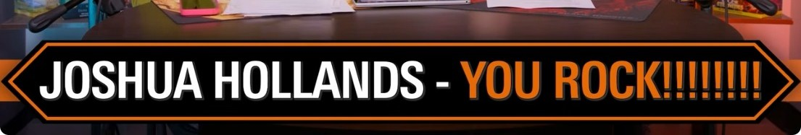](https://www.youtube.com/watch?v=hokDxT8sc78&amp;t=759s) |
| Brentyn Tate | #759 ? Mystery Booster Commander’s Most Powerful New Legends | Aug 25, 2026 | [12:05](https://www.youtube.com/watch?v=7XpHTfYG_X0&amp;t=725s) | [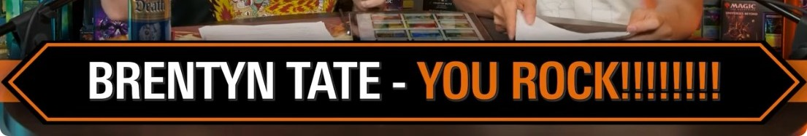](https://www.youtube.com/watch?v=7XpHTfYG_X0&amp;t=725s) |
| Peter Mercado | #758 ? The Hobbit’s Best New Cards (In the 99) | Aug 18, 2026 | [14:47](https://www.youtube.com/watch?v=KNkN2usl80I&amp;t=887s) | [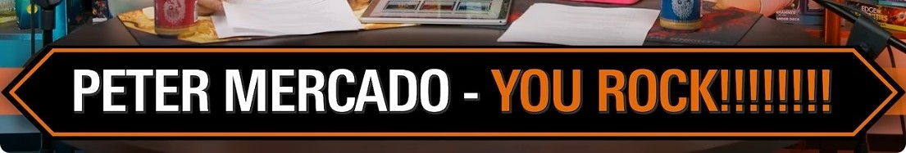](https://www.youtube.com/watch?v=KNkN2usl80I&amp;t=887s) |
| Nick Bunn | #757 ? Four Hobbit Commander Decks to Build Right Now | Aug 11, 2026 | [18:30](https://www.youtube.com/watch?v=2ZIKJYzsZtw&amp;t=1110s) | [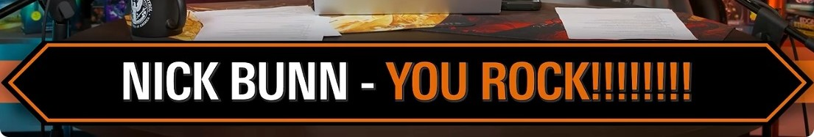](https://www.youtube.com/watch?v=2ZIKJYzsZtw&amp;t=1110s) |
| Orion Moore | #756 ? The Hobbit’s Most Powerful New Commanders | Date unavailable | [13:13](https://www.youtube.com/watch?v=2UjW3dT3MXA&amp;t=793s) | [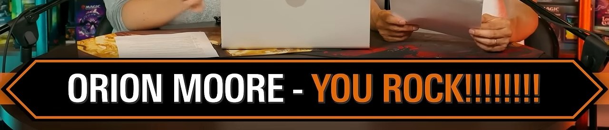](https://www.youtube.com/watch?v=2UjW3dT3MXA&amp;t=793s) |
| Duncan Robb | #750 ? “Fantastic Four” Precon Upgrade Guide \| Marvel Super Heroes | Jun 26, 2026 | [17:21](https://www.youtube.com/watch?v=hcdAy7ne04U&amp;t=1041s) | [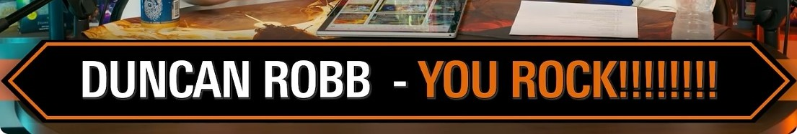](https://www.youtube.com/watch?v=hcdAy7ne04U&amp;t=1041s) |
| Wordpuncher | #749 ? “Wakanda Forever” Precon Upgrade Guide \| Marvel Super Heroes | Jun 23, 2026 | [13:40](https://www.youtube.com/watch?v=hqCE1M41Ro0&amp;t=820s) | [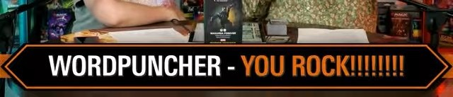](https://www.youtube.com/watch?v=hqCE1M41Ro0&amp;t=820s) |
| Davy Perez | #748 ? Marvel Super Heroes Most Powerful New Commanders | Jun 18, 2026 | [17:20](https://www.youtube.com/watch?v=Z0iX5xQ0_HA&amp;t=1040s) | [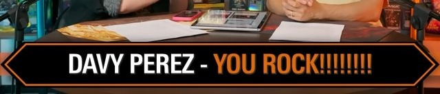](https://www.youtube.com/watch?v=Z0iX5xQ0_HA&amp;t=1040s) |
| Campbell Walters | #747 ? “Doom Prevails" Precon Upgrade Guide \| Marvel Super Heroes | Jun 11, 2026 | [8:34](https://www.youtube.com/watch?v=TUN9HwLWRb4&amp;t=514s) | [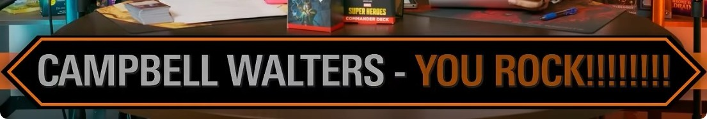](https://www.youtube.com/watch?v=TUN9HwLWRb4&amp;t=514s) |
| Kidany Cruz | #746 ? “Avengers Assemble” Full Deck Reveal + Upgrade \| Marvel Super Heroes | Jun 8, 2026 | [7:38](https://www.youtube.com/watch?v=NtA9z2wO4iM&amp;t=458s) | [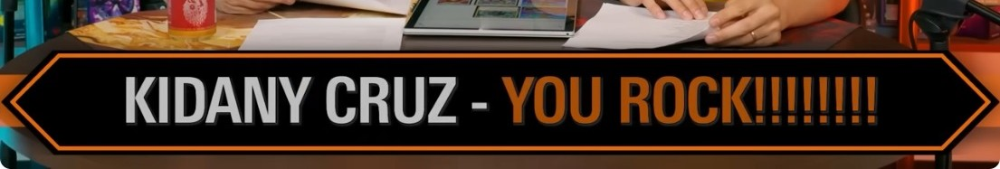](https://www.youtube.com/watch?v=NtA9z2wO4iM&amp;t=458s) |
| Ben Wyrosdick | #745 ? How to Play Commander | Jun 3, 2026 | [14:38](https://www.youtube.com/watch?v=ftCPe3Yxztk&amp;t=878s) | [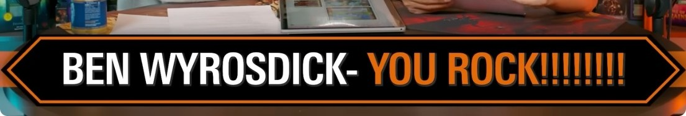](https://www.youtube.com/watch?v=ftCPe3Yxztk&amp;t=878s) |
| Wes Stone | #744 ? Commander Cards We Were Wrong About | May 28, 2026 | [19:40](https://www.youtube.com/watch?v=4aGmNlEqb7o&amp;t=1180s) | [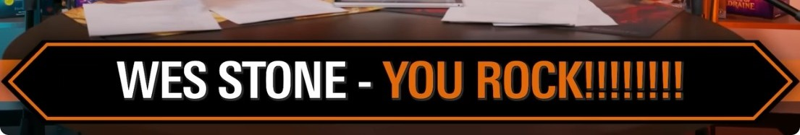](https://www.youtube.com/watch?v=4aGmNlEqb7o&amp;t=1180s) |
| Sideshot | #743 ? Stop Building Like Everyone Else | May 19, 2026 | [14:09](https://www.youtube.com/watch?v=e3qGnuupp8U&amp;t=849s) | [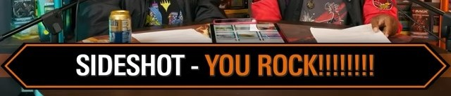](https://www.youtube.com/watch?v=e3qGnuupp8U&amp;t=849s) |
| Brian Kendall | #742 ? We Roast Each Other's Decks w/ Tomer (MTGGoldfish) | May 13, 2026 | [11:31](https://www.youtube.com/watch?v=Ncj_HZkRXlc&amp;t=691s) |  |
| Austin Gatzemeyer | #741 ? “Witherbloom Pestilence” Precon Upgrade \| Secrets of Strixhaven | May 8, 2026 | [7:52](https://www.youtube.com/watch?v=c3F0h4um8sY&amp;t=472s) | [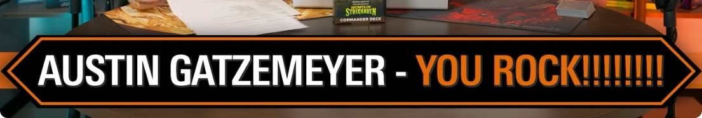](https://www.youtube.com/watch?v=c3F0h4um8sY&amp;t=472s) |
| Jay Ewing | #740 ? Your Commander May Be The Problem | May 5, 2026 | [13:02](https://www.youtube.com/watch?v=Xf7p7GcDON8&amp;t=782s) | [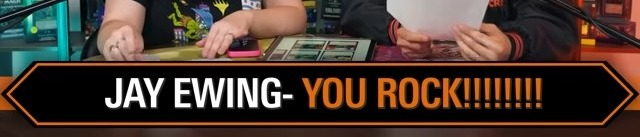](https://www.youtube.com/watch?v=Xf7p7GcDON8&amp;t=782s) |
| Princessariel | #739 ? Secrets of Strixhaven’s Best New Cards (In the 99) | Apr 30, 2026 | [15:40](https://www.youtube.com/watch?v=2OOHw-ytDy0&amp;t=940s) |  |
| Tennojack | #738 ? “Silverquill Influence” Precon Upgrade \| Secrets of Strixhaven | Apr 24, 2026 | [9:34](https://www.youtube.com/watch?v=W1-msyO9yQQ&amp;t=574s) | [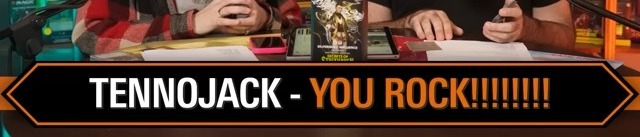](https://www.youtube.com/watch?v=W1-msyO9yQQ&amp;t=574s) |
| Tony Borth | #737 ? “Quandrix Unlimited” Precon Upgrade \| Secrets of Strixhaven | Apr 21, 2026 | [8:58](https://www.youtube.com/watch?v=yaqvE9rYUkA&amp;t=538s) | [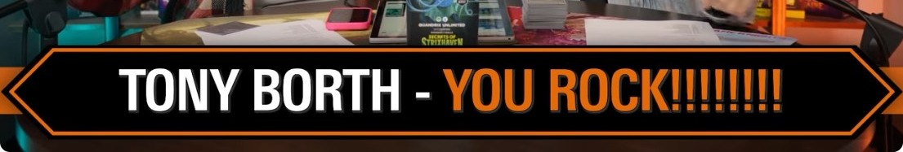](https://www.youtube.com/watch?v=yaqvE9rYUkA&amp;t=538s) |
| Immanuel Kerr-brown | #736 ? Secrets of Strixhaven’s Most Powerful New Commanders \| Command Zone 736 \| MTG EDH Magic Gathering | Apr 17, 2026 | [28:51](https://www.youtube.com/watch?v=rc2TAwL663A&amp;t=1731s) | [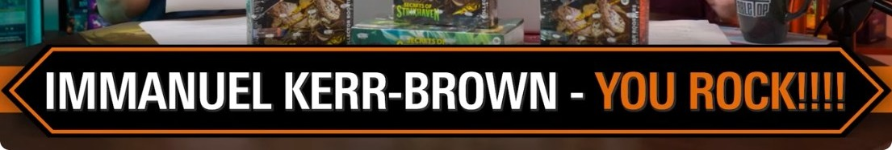](https://www.youtube.com/watch?v=rc2TAwL663A&amp;t=1731s) |
| Kevin Gudino | #735 ? “Lorehold Spirit” Precon Upgrade \| Secrets of Strixhaven | Apr 9, 2026 | [10:07](https://www.youtube.com/watch?v=rNUv0ZWrJeE&amp;t=607s) | [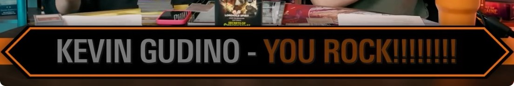](https://www.youtube.com/watch?v=rNUv0ZWrJeE&amp;t=607s) |
| Blake Carel | #734 ? “Prismari Artistry” Precon Upgrade \| Secrets of Strixhaven | Apr 7, 2026 | [8:45](https://www.youtube.com/watch?v=5vGsFMCOW5M&amp;t=525s) | [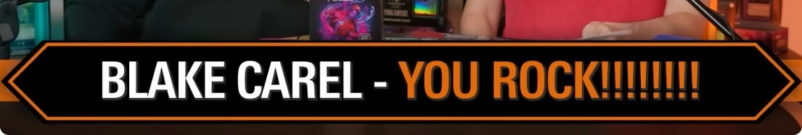](https://www.youtube.com/watch?v=5vGsFMCOW5M&amp;t=525s) |
| Erin Fosnocht Largen | #733 ? Level Up Your Deck Building w/ This One Hack | Apr 1, 2026 | [6:03](https://www.youtube.com/watch?v=fxBCPGaWu9Y&amp;t=363s) | [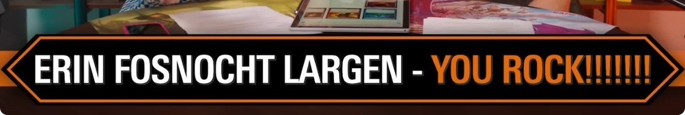](https://www.youtube.com/watch?v=fxBCPGaWu9Y&amp;t=363s) |
| Michael Fong | #732 ? What's Fun About Bracket 1? | Mar 23, 2026 | [17:56](https://www.youtube.com/watch?v=8oAvrETrQEM&amp;t=1076s) | [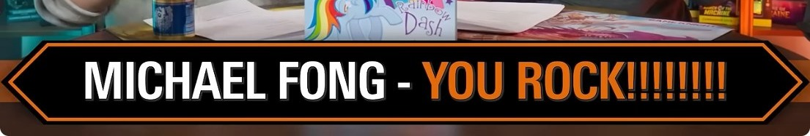](https://www.youtube.com/watch?v=8oAvrETrQEM&amp;t=1076s) |
| Will Norris | #731 ? What's Up w/ Bracket 4? | Mar 17, 2026 | [17:11](https://www.youtube.com/watch?v=jzeTz9clIC8&amp;t=1031s) | [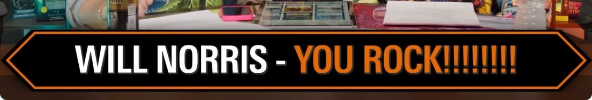](https://www.youtube.com/watch?v=jzeTz9clIC8&amp;t=1031s) |
| Brian Praamsma | #730 ? Why Your Deck Feels Clunky and How to Fix It | Mar 10, 2026 | [9:19](https://www.youtube.com/watch?v=6oS1E5BGi0U&amp;t=559s) | [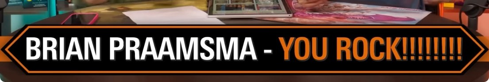](https://www.youtube.com/watch?v=6oS1E5BGi0U&amp;t=559s) |
| Jared Davenport | #729 ? The Best Commander Card from EVERY Magic Set Ever | Mar 3, 2026 | [14:59](https://www.youtube.com/watch?v=8LfhhUD3lVc&amp;t=899s) |  |
| David Hurse | #728 ? The TMNT Cards You Need to Know | Feb 24, 2026 | [16:24](https://www.youtube.com/watch?v=DbcbZmQbTm0&amp;t=984s) | [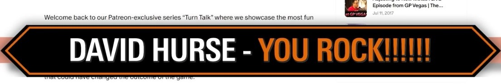](https://www.youtube.com/watch?v=DbcbZmQbTm0&amp;t=984s) |
| Juan Ochoa | #727 ? “Turtle Power!” Full Deck Reveal + Upgrade \| Teenage Mutant Ninja Turtles | Feb 18, 2026 | [15:40](https://www.youtube.com/watch?v=lq102tK_CV8&amp;t=940s) | [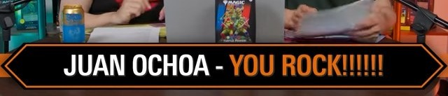](https://www.youtube.com/watch?v=lq102tK_CV8&amp;t=940s) |
| Kathleen Kennedy | #726 ? Wizards Makes It Official re: Hybrid Mana, Bans/Unbans, and More | Feb 10, 2026 | [12:11](https://www.youtube.com/watch?v=9XzCokjm5Vs&amp;t=731s) | [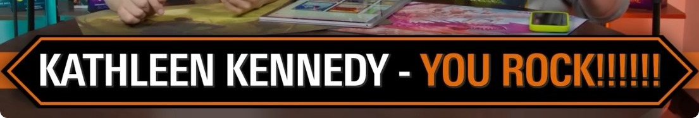](https://www.youtube.com/watch?v=9XzCokjm5Vs&amp;t=731s) |
| 32bit | #724 ? “Dance of the Elements” Precon Upgrade \| Lorwyn Eclipsed | Jan 27, 2026 | [8:53](https://www.youtube.com/watch?v=IBxHD3M87e8&amp;t=533s) | [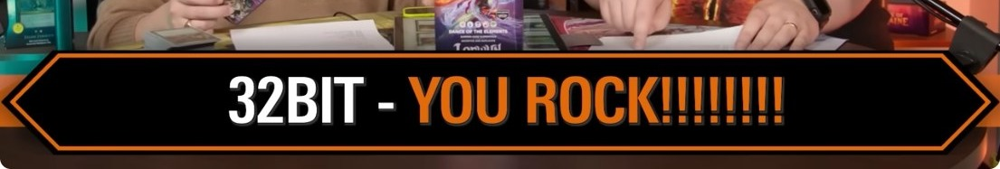](https://www.youtube.com/watch?v=IBxHD3M87e8&amp;t=533s) |
| Justkyle | #723 ? Lorwyn Eclipsed’s Best New Cards (In the 99) | Jan 20, 2026 | [13:42](https://www.youtube.com/watch?v=fta32vuFOok&amp;t=822s) | [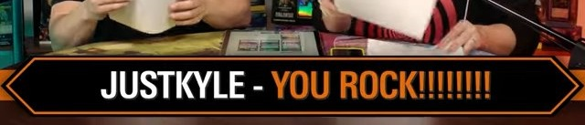](https://www.youtube.com/watch?v=fta32vuFOok&amp;t=822s) |
| Eddieroaddogg | #722 ? “Blight Curse” Precon Upgrade \| Lorwyn Eclipsed | Jan 15, 2026 | [8:19](https://www.youtube.com/watch?v=DlUqF9W8E7M&amp;t=499s) | [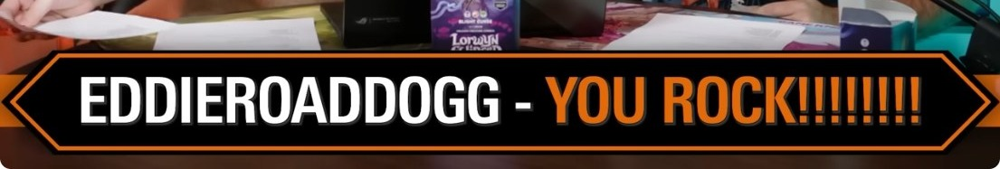](https://www.youtube.com/watch?v=DlUqF9W8E7M&amp;t=499s) |
| Caleb John | #721 ? Lorwyn Eclipsed’s Most Powerful New Commanders | Jan 12, 2026 | [29:40](https://www.youtube.com/watch?v=iqjLbIJOMlw&amp;t=1780s) | [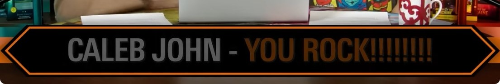](https://www.youtube.com/watch?v=iqjLbIJOMlw&amp;t=1780s) |
| Paul D Halbert | #720 ? Don’t Ignore These Commander Red Flags | Jan 6, 2026 | [10:57](https://www.youtube.com/watch?v=QjYvM7f8bIY&amp;t=657s) |  |
| Felipe Spinelli | #719 ? MTG in 2025 - Year in Review | Dec 30, 2025 | [20:36](https://www.youtube.com/watch?v=pOVmxbpkp9c&amp;t=1236s) | [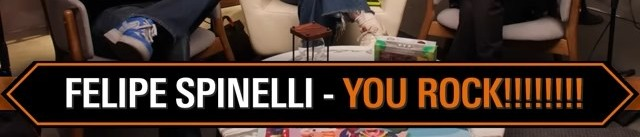](https://www.youtube.com/watch?v=pOVmxbpkp9c&amp;t=1236s) |
| Jagethemage | #718 ? This Will Change How You Play Commander | Dec 23, 2025 | [13:53](https://www.youtube.com/watch?v=zZi5dyiStNw&amp;t=833s) | [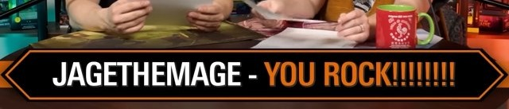](https://www.youtube.com/watch?v=zZi5dyiStNw&amp;t=833s) |
| Jarrad Hayes-Pyne | #717 ? The Best Cards of 2025 | Dec 18, 2025 | [17:50](https://www.youtube.com/watch?v=QG5KDhlmFRI&amp;t=1070s) |  |
| Travis Morin | #716 ? How to Make Your Decks Less Boring | Dec 11, 2025 | [12:29](https://www.youtube.com/watch?v=yOKIc0vTnvU&amp;t=749s) | [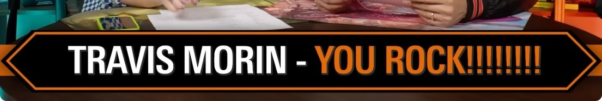](https://www.youtube.com/watch?v=yOKIc0vTnvU&amp;t=749s) |
| Carina Holste | #715 ? Play These Cards At Your Own Risk | Dec 9, 2025 | [14:42](https://www.youtube.com/watch?v=Cwz_GemcWg4&amp;t=882s) | [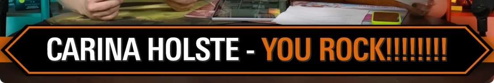](https://www.youtube.com/watch?v=Cwz_GemcWg4&amp;t=882s) |
| Ryan Greene | #714 ? Commanders We Just Can’t Crack | Dec 3, 2025 | [30:43](https://www.youtube.com/watch?v=kdsXbCeaQDU&amp;t=1843s) | [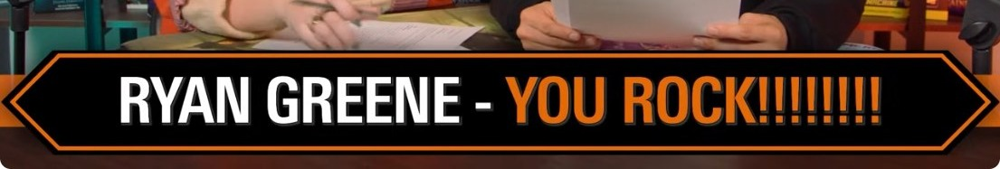](https://www.youtube.com/watch?v=kdsXbCeaQDU&amp;t=1843s) |
| Daniel Hempen | #713 ? We Rank Every Precon from 2025 | Nov 25, 2025 | [7:16](https://www.youtube.com/watch?v=nP3rO_7bqGI&amp;t=436s) |  |
| Brady White | #712 ? The Best Budget Cards in Every Color Pair | Nov 21, 2025 | [14:01](https://www.youtube.com/watch?v=JnITPj7bsmA&amp;t=841s) | [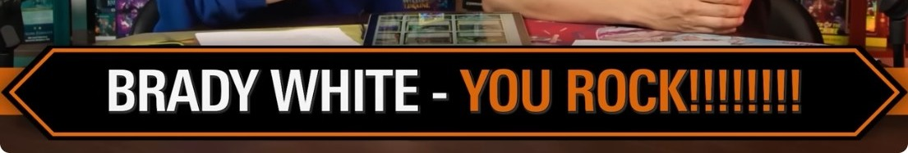](https://www.youtube.com/watch?v=JnITPj7bsmA&amp;t=841s) |
| Kevin Bennett | #711 ? 4 Avatar Commander Decks to Build Right Now | Nov 18, 2025 | [16:09](https://www.youtube.com/watch?v=0dBH8QxdpAE&amp;t=969s) | [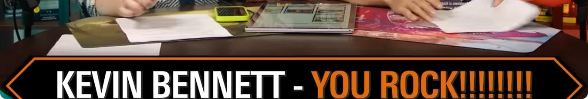](https://www.youtube.com/watch?v=0dBH8QxdpAE&amp;t=969s) |
| Matt Gardner | #710 ? Avatar’s Best New Cards (In the 99) | Nov 13, 2025 | [14:43](https://www.youtube.com/watch?v=4SBoXXN1VCA&amp;t=883s) | [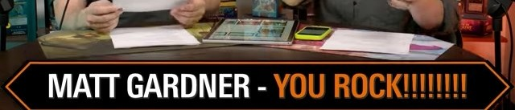](https://www.youtube.com/watch?v=4SBoXXN1VCA&amp;t=883s) |
| Caleb John | #709 ? Avatar’s Most Powerful New Commanders | Nov 7, 2025 | [16:09](https://www.youtube.com/watch?v=f9320Lqo4eI&amp;t=969s) | [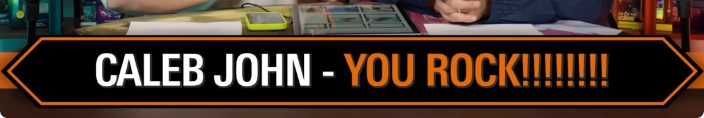](https://www.youtube.com/watch?v=f9320Lqo4eI&amp;t=969s) |
| Steven Rosenberg | #708 ? We Like The Hybrid Change, Actually | Nov 4, 2025 | [14:12](https://www.youtube.com/watch?v=MnS91-08rO0&amp;t=852s) |  |
| Lissa Metzler | #707 ? These New Avatar Cards Will Blow You Away | Oct 31, 2025 | [7:15](https://www.youtube.com/watch?v=DxIomU_20bc&amp;t=435s) |  |
| Elaine And Darrell | #706 ? Pro Level Commander Advice from Actual Pros | Oct 29, 2025 | [14:41](https://www.youtube.com/watch?v=5kDU67RVIhY&amp;t=881s) | [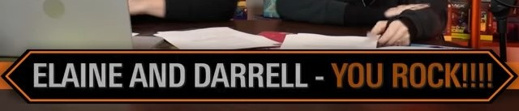](https://www.youtube.com/watch?v=5kDU67RVIhY&amp;t=881s) |
| Michael Flesh | #703 ? We Draft the Best Game Changers | Oct 14, 2025 | [5:36](https://www.youtube.com/watch?v=Q6gZ3OHqTcc&amp;t=336s) | [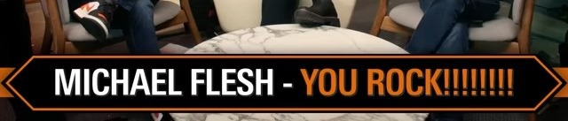](https://www.youtube.com/watch?v=Q6gZ3OHqTcc&amp;t=336s) |
| Torrence Pfatenhauer | #702 ? What are we even doing? | Oct 8, 2025 | [14:04](https://www.youtube.com/watch?v=hHrjnIpiU74&amp;t=844s) | [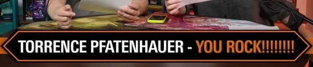](https://www.youtube.com/watch?v=hHrjnIpiU74&amp;t=844s) |
| Jordan Travers | #701 ? Our Favorite NEW Decks | Oct 2, 2025 | [27:11](https://www.youtube.com/watch?v=Nu8bL0cCLkA&amp;t=1631s) | [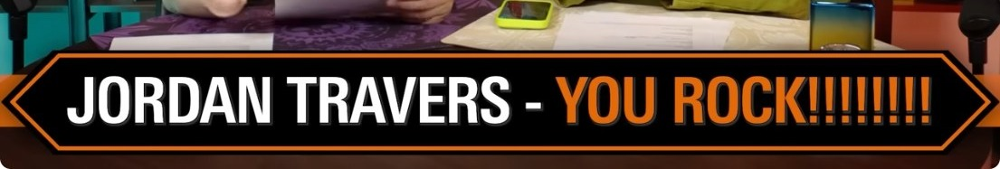](https://www.youtube.com/watch?v=Nu8bL0cCLkA&amp;t=1631s) |
| Noah Boes | #700 ? The Complete Guide to Mass Disruption | Sep 23, 2025 | [14:02](https://www.youtube.com/watch?v=ZTw7phD0_Mc&amp;t=842s) | [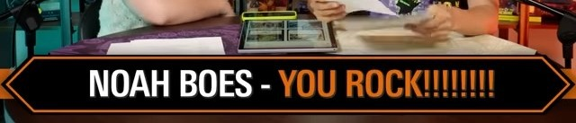](https://www.youtube.com/watch?v=ZTw7phD0_Mc&amp;t=842s) |
| Brian Miller | #699 ? 4x Awesome Spider-Man Commander Decks to Build Right Now | Sep 18, 2025 | [17:28](https://www.youtube.com/watch?v=agL2LV596Kc&amp;t=1048s) | [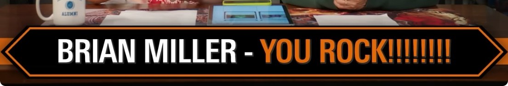](https://www.youtube.com/watch?v=agL2LV596Kc&amp;t=1048s) |
| Ty Schalter | #698 ? Spider-Man’s Best Cards (In the 99) | Sep 11, 2025 | [20:44](https://www.youtube.com/watch?v=KMYOoWD3UN4&amp;t=1244s) | [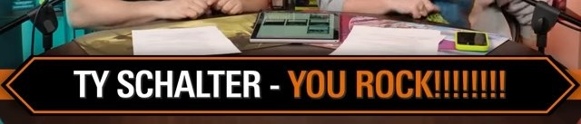](https://www.youtube.com/watch?v=KMYOoWD3UN4&amp;t=1244s) |
| Fenris Wolf | #697 ? Spider-Man’s Most Powerful Commanders | Sep 5, 2025 | [26:10](https://www.youtube.com/watch?v=TXHP1X6mN9k&amp;t=1570s) |  |
| Rick Price | #696 ? BROKEN NEWS: New Spider-Man Villain ALWAYS has Blue Mana Open | Sep 2, 2025 | [9:47](https://www.youtube.com/watch?v=aLNJ9JEWFaw&amp;t=587s) | [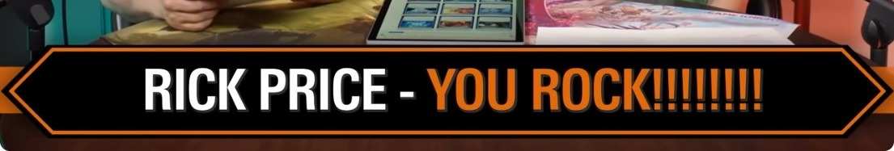](https://www.youtube.com/watch?v=aLNJ9JEWFaw&amp;t=587s) |
| Greg Wilson | #695 ? JLK’s Personal Commander Decks | Aug 28, 2025 | [17:04](https://www.youtube.com/watch?v=ARaFN9tFTGA&amp;t=1024s) | [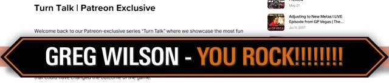](https://www.youtube.com/watch?v=ARaFN9tFTGA&amp;t=1024s) |
| Marc Ross | #694 ? The Best Commander in All 32 Color Combos | Aug 20, 2025 | [15:07](https://www.youtube.com/watch?v=mfZ58jxjqds&amp;t=907s) | [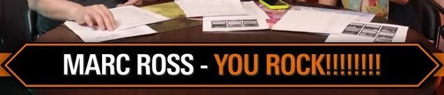](https://www.youtube.com/watch?v=mfZ58jxjqds&amp;t=907s) |
| Jackpk7s | #693 ? 10 Utility Lands You Should Buy for $10 | Date unavailable | [12:38](https://www.youtube.com/watch?v=Xm3e_f6XzV8&amp;t=758s) |  |
| Danielle Citron | #692 ? How to BEAT Green Decks w/ Brian Kibler | Aug 12, 2025 | [12:27](https://www.youtube.com/watch?v=hue9ZWRMaYo&amp;t=747s) | [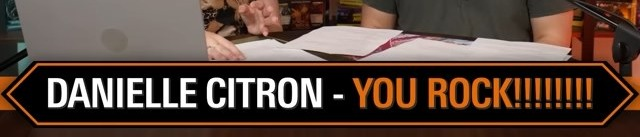](https://www.youtube.com/watch?v=hue9ZWRMaYo&amp;t=747s) |
| Brenton Barber | #691 ? Why Commander SUCKS Sometimes | Date unavailable | [14:55](https://www.youtube.com/watch?v=qtML-Alod6A&amp;t=895s) |  |
| Jade Eyes | #690 ? When Your Deck is Too Good (But Also Too Bad) | Aug 1, 2025 | [9:02](https://www.youtube.com/watch?v=I6kd3ggg81w&amp;t=542s) | [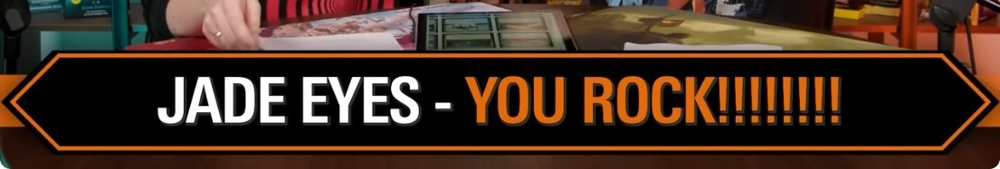](https://www.youtube.com/watch?v=I6kd3ggg81w&amp;t=542s) |
| Ethan Mollick | #689 ? 10 Disruption Spells You Should Buy for $10 | Jul 29, 2025 | [9:54](https://www.youtube.com/watch?v=0M_l2efjTys&amp;t=594s) | [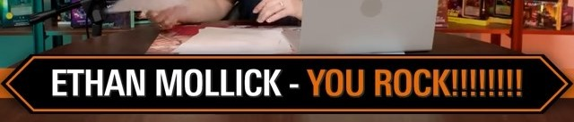](https://www.youtube.com/watch?v=0M_l2efjTys&amp;t=594s) |
| Derek Blodgett | #688 ? Edge of Eternities’s Best Cards (In the 99) | Jul 24, 2025 | [18:25](https://www.youtube.com/watch?v=eMmY2at6oL8&amp;t=1105s) |  |
| Clem Healy | #687 ? Most Powerful Commanders in Edge of Eternities | Jul 18, 2025 | [13:21](https://www.youtube.com/watch?v=ys0pgB72LIk&amp;t=801s) | [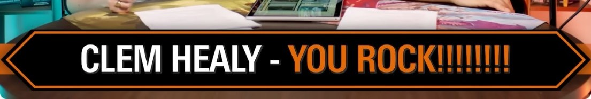](https://www.youtube.com/watch?v=ys0pgB72LIk&amp;t=801s) |
| Drago Duncan | #686 ? “Counter Intelligence” Precon Upgrade \| Edge of Eternities | Jul 15, 2025 | [7:56](https://www.youtube.com/watch?v=0xOXEYmbDnk&amp;t=476s) | [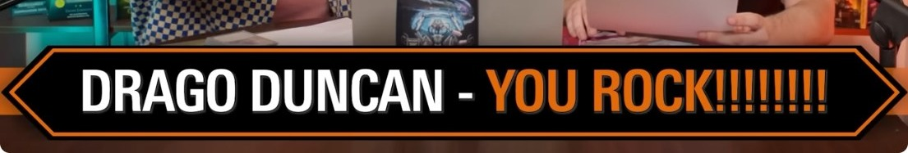](https://www.youtube.com/watch?v=0xOXEYmbDnk&amp;t=476s) |
| Leon Foret IV | #685 ? “World Shaper” Full Deck Reveal & Upgrade \| Edge of Eternities | Jul 9, 2025 | [9:03](https://www.youtube.com/watch?v=HxXLWC_JRdM&amp;t=543s) |  |
| John Libid | #684 ? You're Doing Commander Politics Wrong | Jul 3, 2025 | [13:41](https://www.youtube.com/watch?v=3qeyIICCcqQ&amp;t=821s) | [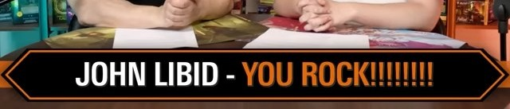](https://www.youtube.com/watch?v=3qeyIICCcqQ&amp;t=821s) |
| Jonathan Stier | #683 ? The Best Token Commanders | Jul 1, 2025 | [13:59](https://www.youtube.com/watch?v=8uxFeTgcEQY&amp;t=839s) | [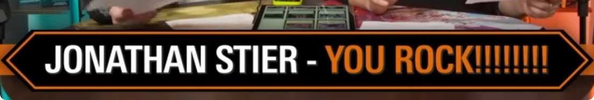](https://www.youtube.com/watch?v=8uxFeTgcEQY&amp;t=839s) |
| James Wood | #682 ? Are These Commander Staples Worth It? | Jun 26, 2025 | [12:57](https://www.youtube.com/watch?v=ioB2d5WW1f8&amp;t=777s) | [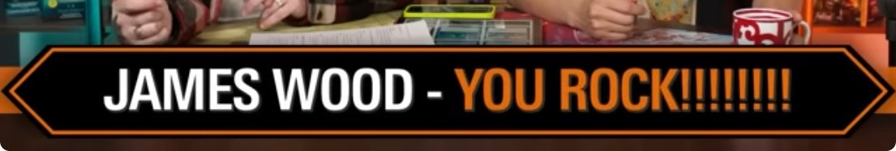](https://www.youtube.com/watch?v=ioB2d5WW1f8&amp;t=777s) |
| Adam Garcia | #681 ? We Draft the BIGGEST SPLASHY SORCERIES | Jun 18, 2025 | [3:27](https://www.youtube.com/watch?v=im_5XbHu4-U&amp;t=207s) | [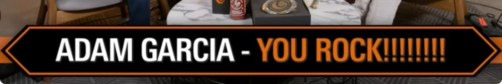](https://www.youtube.com/watch?v=im_5XbHu4-U&amp;t=207s) |
| Timothy Maher | #680 ? Final Fantasy’s Most Iconic Commanders | Jun 12, 2025 | [13:10](https://www.youtube.com/watch?v=v3qeDhgVakw&amp;t=790s) | [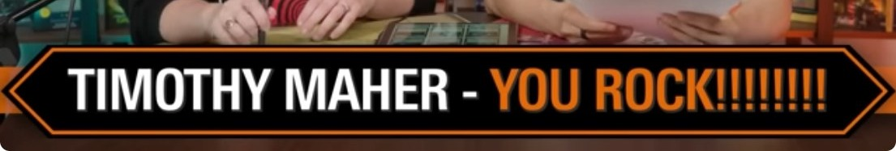](https://www.youtube.com/watch?v=v3qeDhgVakw&amp;t=790s) |
| Rachelle Kanippayoor | #679 ? The Best Final Fantasy Cards (In the 99) | Jun 3, 2025 | [13:41](https://www.youtube.com/watch?v=tLncdhJj5jw&amp;t=821s) |  |
| Stuart Hodge | #678 ? Final Fantasy’s Most Powerful Commanders | May 30, 2025 | [13:22](https://www.youtube.com/watch?v=oKzgROnDNPI&amp;t=802s) | [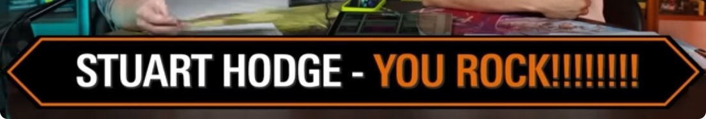](https://www.youtube.com/watch?v=oKzgROnDNPI&amp;t=802s) |
| Kevin O | #677 ? Final Fantasy 6 - Commander Deck Upgrade Guide \| “Revival Trance” | May 27, 2025 | [4:52](https://www.youtube.com/watch?v=ZqI_-DH7lBc&amp;t=292s) | [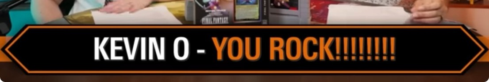](https://www.youtube.com/watch?v=ZqI_-DH7lBc&amp;t=292s) |
| Tony Borth | #676 ? Final Fantasy 10 - Commander Deck Upgrade Guide \| “Counter Blitz” | May 21, 2025 | [4:08](https://www.youtube.com/watch?v=0_18LXLvR9Y&amp;t=248s) | [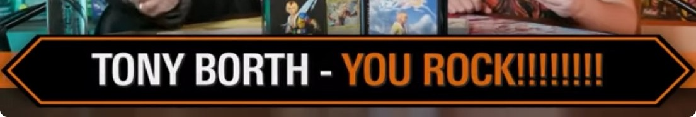](https://www.youtube.com/watch?v=0_18LXLvR9Y&amp;t=248s) |
| Eric Threadgold | #675 ? Final Fantasy 14 - Commander Deck Upgrade Guide \| “Scions & Spellcraft” | May 15, 2025 | [3:31](https://www.youtube.com/watch?v=N63rsMxeOYA&amp;t=211s) | [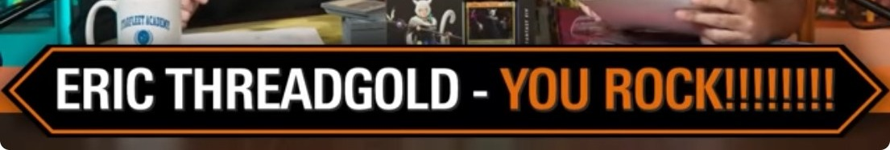](https://www.youtube.com/watch?v=N63rsMxeOYA&amp;t=211s) |
| Robert Mcgill | #674 ? Final Fantasy 7 - Commander Deck Upgrade Guide \| “Limit Break” | May 13, 2025 | [3:58](https://www.youtube.com/watch?v=xkypTAiPbkU&amp;t=238s) | [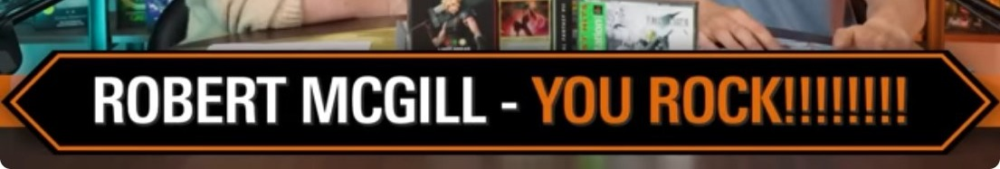](https://www.youtube.com/watch?v=xkypTAiPbkU&amp;t=238s) |
| Matthew Jecelin | #673 ? We HATED these Commanders! Are They Still Bad? | May 7, 2025 | [3:58](https://www.youtube.com/watch?v=f4Rf4EeMh1w&amp;t=238s) | [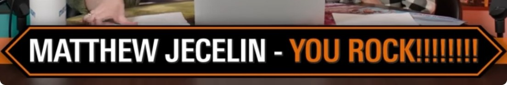](https://www.youtube.com/watch?v=f4Rf4EeMh1w&amp;t=238s) |
| Garret Trimmer | #672 ? How Bad is Braids, Anyway? | May 2, 2025 | [4:48](https://www.youtube.com/watch?v=6q0NW3lcEVI&amp;t=288s) | [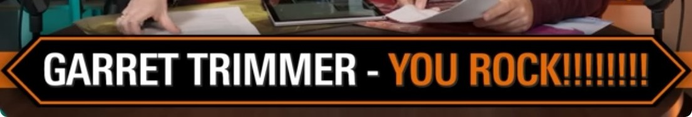](https://www.youtube.com/watch?v=6q0NW3lcEVI&amp;t=288s) |
| Larry Weddle | #671 ? What’s Wrong with the Commander Brackets? | Apr 29, 2025 | [4:45](https://www.youtube.com/watch?v=jQAJM1Mtoco&amp;t=285s) | [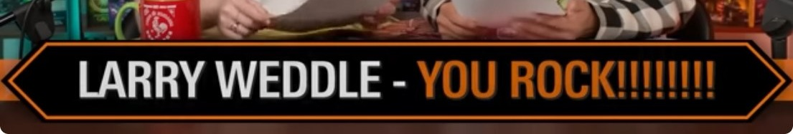](https://www.youtube.com/watch?v=jQAJM1Mtoco&amp;t=285s) |
| Brandon Peterson | #670 ? Major Commander UNBAN Announcement! | Apr 23, 2025 | [4:39](https://www.youtube.com/watch?v=SowjUi0QZfo&amp;t=279s) | [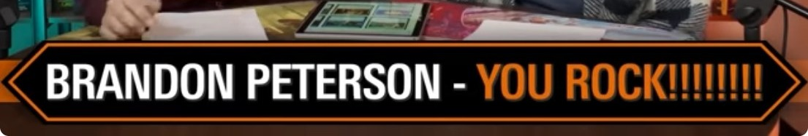](https://www.youtube.com/watch?v=SowjUi0QZfo&amp;t=279s) |
| Yann-michael Gagnon | #669 ? Tarkir: Dragonstorm’s Best Cards (In the 99) | Apr 16, 2025 | [5:17](https://www.youtube.com/watch?v=rBlD6rkZpHs&amp;t=317s) | [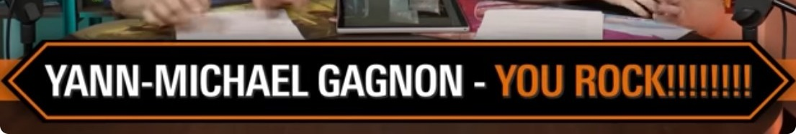](https://www.youtube.com/watch?v=rBlD6rkZpHs&amp;t=317s) |
| Rob Pierce | #668 ? “Mardu Surge” Precon Upgrade \| Tarkir: Dragonstorm | Apr 11, 2025 | [4:16](https://www.youtube.com/watch?v=D1mxqk8enBI&amp;t=256s) | [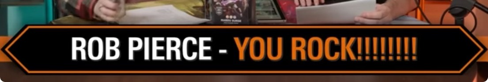](https://www.youtube.com/watch?v=D1mxqk8enBI&amp;t=256s) |
| Alfredo Navarrete | #667 ? “Abzan Armor” Precon Upgrade \| Tarkir: Dragonstorm | Apr 8, 2025 | [4:16](https://www.youtube.com/watch?v=Zh6se3FAglk&amp;t=256s) | [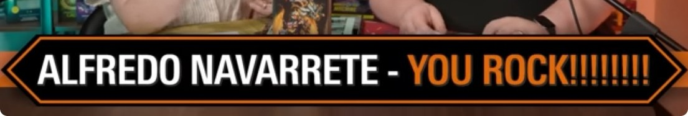](https://www.youtube.com/watch?v=Zh6se3FAglk&amp;t=256s) |
| Ashton Mccombs | #666 ? Most Powerful Commanders in Tarkir: Dragonstorm | Mar 31, 2025 | [4:19](https://www.youtube.com/watch?v=P0pjdWWi7bs&amp;t=259s) | [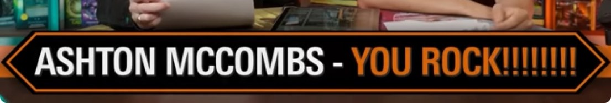](https://www.youtube.com/watch?v=P0pjdWWi7bs&amp;t=259s) |
| Noah Ulrey | #665 ? “Temur Roar” Precon Upgrade \| Tarkir: Dragonstorm | Mar 28, 2025 | [4:26](https://www.youtube.com/watch?v=eP1HquJbP_A&amp;t=266s) | [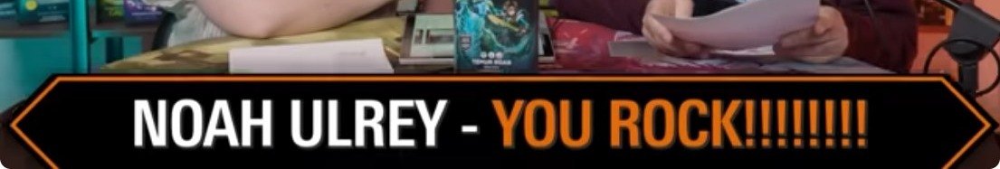](https://www.youtube.com/watch?v=eP1HquJbP_A&amp;t=266s) |
| Mooniwallace | #664 ? “Sultai Arisen” Precon Upgrade \| Tarkir: Dragonstorm | Mar 25, 2025 | [4:48](https://www.youtube.com/watch?v=L1d7uUR02kg&amp;t=288s) | [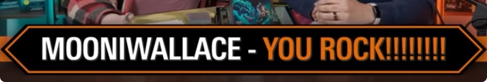](https://www.youtube.com/watch?v=L1d7uUR02kg&amp;t=288s) |
| Spoticus | #663 ? “Jeskai Striker” Full Deck Reveal & Upgrade \| Tarkir: Dragonstorm | Mar 19, 2025 | [4:43](https://www.youtube.com/watch?v=e-P3IO_aAhI&amp;t=283s) | [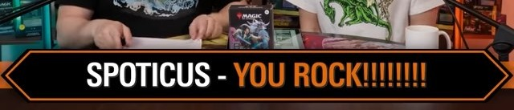](https://www.youtube.com/watch?v=e-P3IO_aAhI&amp;t=283s) |
| Jake Therault | #662 ? The Complete Guide to Cutting Cards | Mar 12, 2025 | [4:38](https://www.youtube.com/watch?v=0mB6NqCZSnc&amp;t=278s) | [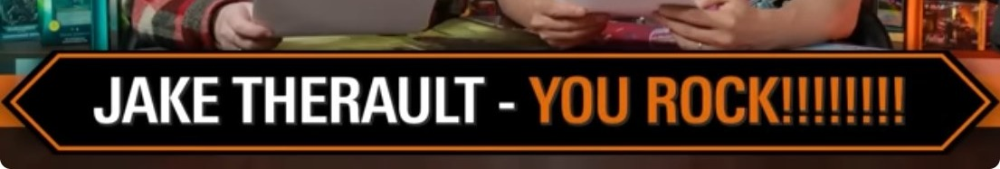](https://www.youtube.com/watch?v=0mB6NqCZSnc&amp;t=278s) |
| Scott Steele | #661 ? The Magic Movie: Baseless Speculation | Mar 6, 2025 | [3:41](https://www.youtube.com/watch?v=3u1bZQS2zdU&amp;t=221s) | [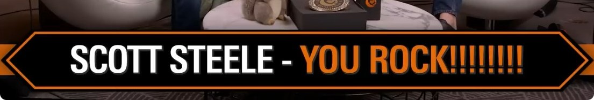](https://www.youtube.com/watch?v=3u1bZQS2zdU&amp;t=221s) |
| Tyler T Ballard | #660 ? Conceding is Salty! \| Fact or Fiction? | Mar 4, 2025 | [3:59](https://www.youtube.com/watch?v=8lchMqp1sZE&amp;t=239s) | [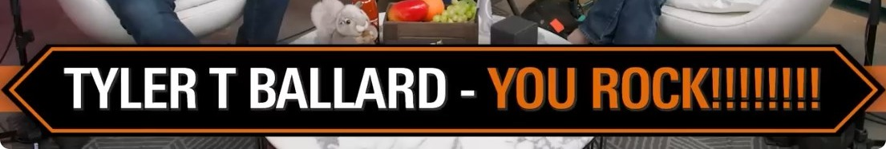](https://www.youtube.com/watch?v=8lchMqp1sZE&amp;t=239s) |
| Jacob Breithaupt | #659 ? The Problem with Deckbuilding Templates | Feb 26, 2025 | [5:26](https://www.youtube.com/watch?v=PUrQpnQ7bi8&amp;t=326s) | [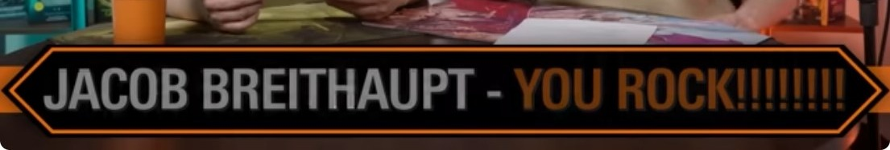](https://www.youtube.com/watch?v=PUrQpnQ7bi8&amp;t=326s) |
| Corrina Poole | #658 ? Commander Deckbuilding Template for the New Era | Feb 18, 2025 | [5:04](https://www.youtube.com/watch?v=OSNV6224cHg&amp;t=304s) | [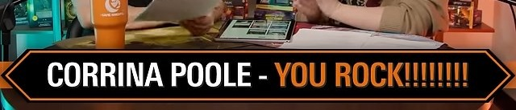](https://www.youtube.com/watch?v=OSNV6224cHg&amp;t=304s) |
| Nathan Pond | #657 ? Will [Brackets] Solve The Power Level Problem? | Feb 11, 2025 | [5:09](https://www.youtube.com/watch?v=P1GFbX_7Iok&amp;t=309s) | [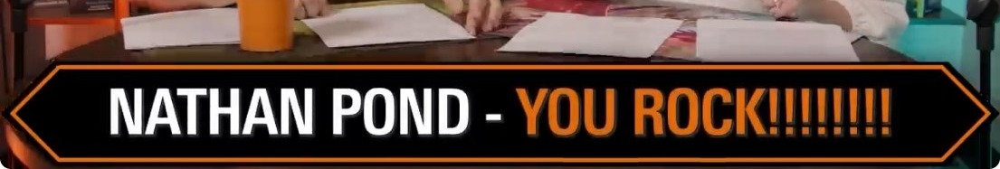](https://www.youtube.com/watch?v=P1GFbX_7Iok&amp;t=309s) |
| Kael Brown | #656 ? Aetherdrift’s Best Cards (In the 99) | Feb 5, 2025 | [4:37](https://www.youtube.com/watch?v=Yh0MkQcaPS0&amp;t=277s) | [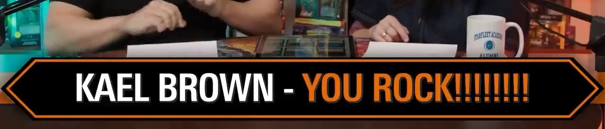](https://www.youtube.com/watch?v=Yh0MkQcaPS0&amp;t=277s) |
| Wes Mangum | #655 ? The Most Powerful Commanders in Aetherdrift | Jan 31, 2025 | [4:24](https://www.youtube.com/watch?v=KLn9enP4owU&amp;t=264s) | [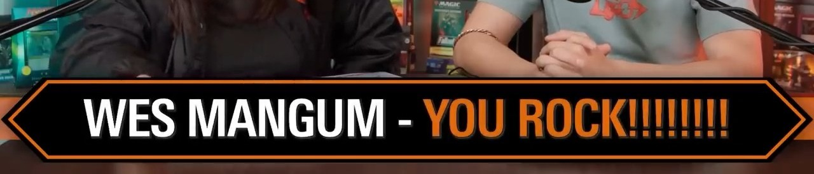](https://www.youtube.com/watch?v=KLn9enP4owU&amp;t=264s) |
| Andrew Smeragliuolo | #654 ? “Eternal Might” Precon Upgrade \| Aetherdrift | Jan 28, 2025 | [5:04](https://www.youtube.com/watch?v=8J9lOe-NhZg&amp;t=304s) | [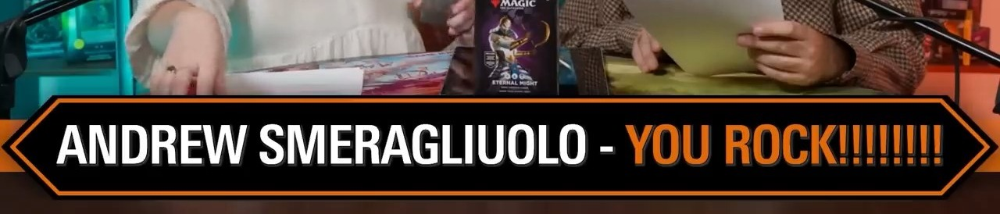](https://www.youtube.com/watch?v=8J9lOe-NhZg&amp;t=304s) |
| Nova Cat | #653 ? “Living Energy” Full Deck Reveal & Upgrade \| Aetherdrift | Jan 23, 2025 | [5:06](https://www.youtube.com/watch?v=km1f1W0Tl6k&amp;t=306s) | [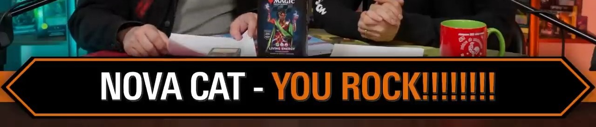](https://www.youtube.com/watch?v=km1f1W0Tl6k&amp;t=306s) |
| Max Tannenbaum | #652 ? Who’s the Target? Lessons in Threat Assessment | Jan 16, 2025 | [4:48](https://www.youtube.com/watch?v=DN_6bNCJ-kk&amp;t=288s) | [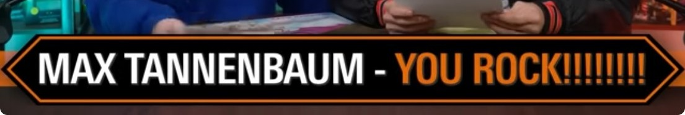](https://www.youtube.com/watch?v=DN_6bNCJ-kk&amp;t=288s) |
| Gage Manapat | #651 ? Commanders We Refuse to Play Against | Jan 9, 2025 | [4:39](https://www.youtube.com/watch?v=MJiOaK8HiYE&amp;t=279s) | [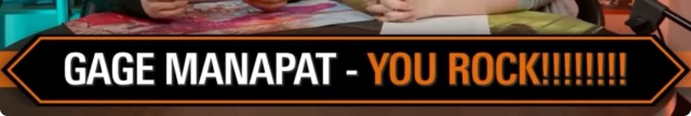](https://www.youtube.com/watch?v=MJiOaK8HiYE&amp;t=279s) |
| Pedro Luiz | #650 ? MTG in 2024 - Year in Review | Jan 2, 2025 | [4:45](https://www.youtube.com/watch?v=Pi9UEf2o-8U&amp;t=285s) | [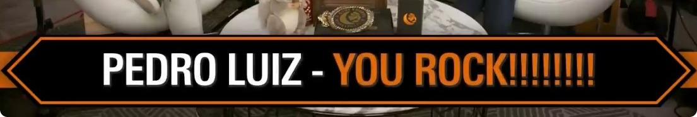](https://www.youtube.com/watch?v=Pi9UEf2o-8U&amp;t=285s) |
| Jen Wentworth | #649 ? A Masterclass in Priority & The Stack | Dec 27, 2024 | [4:53](https://www.youtube.com/watch?v=Dqaxd8fmBIw&amp;t=293s) |  |
| William Coyle | #648 ? We Rank Every Set from 2024 | Dec 23, 2024 | [3:37](https://www.youtube.com/watch?v=peTijsKyeG0&amp;t=217s) | [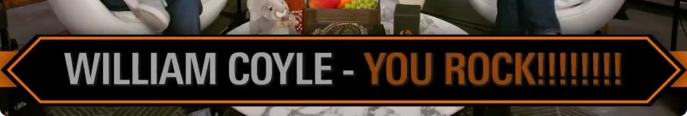](https://www.youtube.com/watch?v=peTijsKyeG0&amp;t=217s) |
| Brandon M Altemus | #647 ? The Best Cards of 2024 | Dec 17, 2024 | [4:56](https://www.youtube.com/watch?v=c6NFHG3Xk-w&amp;t=296s) | [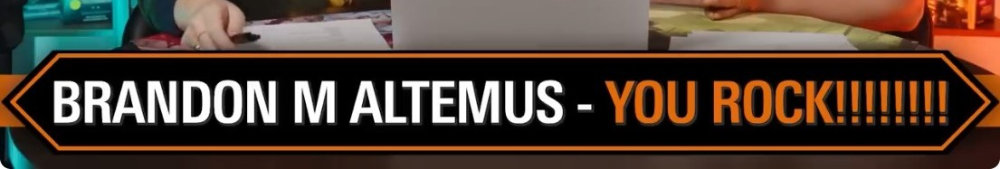](https://www.youtube.com/watch?v=c6NFHG3Xk-w&amp;t=296s) |
| Joseph Koo | #646 ? Tips for Teaching Magic: The Gathering | Dec 13, 2024 | [4:46](https://www.youtube.com/watch?v=Ycy2XIPk900&amp;t=286s) | [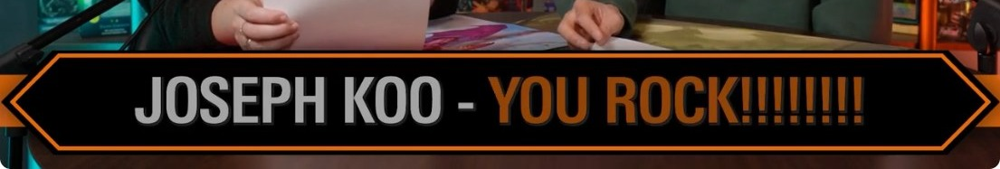](https://www.youtube.com/watch?v=Ycy2XIPk900&amp;t=286s) |
| Michael Gomez | #645 ? We Rank Every Precon from 2024 | Dec 10, 2024 | [4:31](https://www.youtube.com/watch?v=CtzeJSx0Vk0&amp;t=271s) |  |
| Martin Castonguay | #644 ? Do We Need the “Banned as a Commander” Rule Back? | Dec 5, 2024 | [4:11](https://www.youtube.com/watch?v=EHIN-1EC-KU&amp;t=251s) | [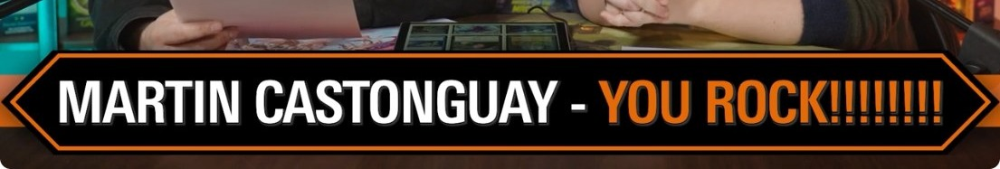](https://www.youtube.com/watch?v=EHIN-1EC-KU&amp;t=251s) |
| Dylan Bruno | #643 ? Start Playing Commander w/ the Foundations Starter Kit | Dec 3, 2024 | [4:30](https://www.youtube.com/watch?v=JHSPSeFCaxs&amp;t=270s) | [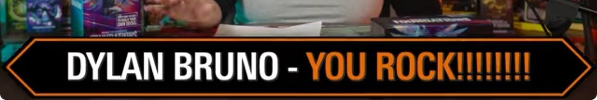](https://www.youtube.com/watch?v=JHSPSeFCaxs&amp;t=270s) |
| Lyle Jones | #641 ? Most Powerful Commanders \| Foundations Jumpstart | Nov 20, 2024 | [5:08](https://www.youtube.com/watch?v=wuXUVMysjpA&amp;t=308s) | [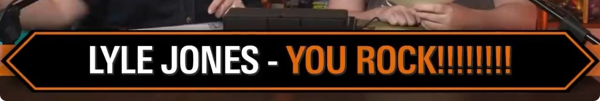](https://www.youtube.com/watch?v=wuXUVMysjpA&amp;t=308s) |
| Michael D Bass | #640 ? Foundations' Best Cards (In the 99) | Nov 12, 2024 | [6:35](https://www.youtube.com/watch?v=fA6LwoKDq6s&amp;t=395s) | [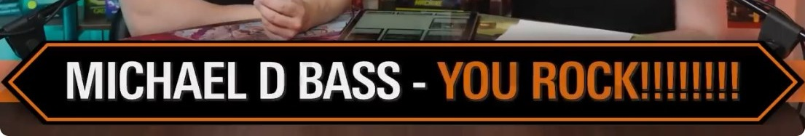](https://www.youtube.com/watch?v=fA6LwoKDq6s&amp;t=395s) |
| Gravy Train | #639 ? MARVEL + MTG: Earth’s Mightiest New Commanders! | Nov 7, 2024 | [4:41](https://www.youtube.com/watch?v=WWfcx4i3Ia8&amp;t=281s) | [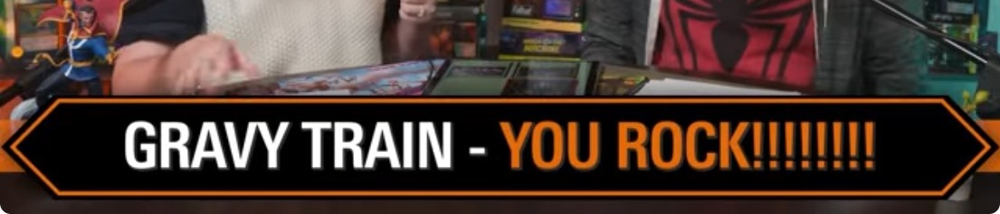](https://www.youtube.com/watch?v=WWfcx4i3Ia8&amp;t=281s) |
| Damien Pacheco | #638 ? The Most Powerful Commanders \| Foundations | Nov 4, 2024 | [4:44](https://www.youtube.com/watch?v=O-cfZ5_OMQ0&amp;t=284s) | [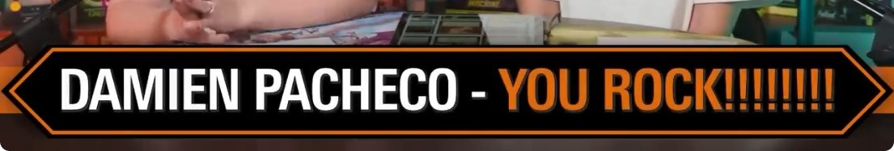](https://www.youtube.com/watch?v=O-cfZ5_OMQ0&amp;t=284s) |
| Josiah Baron | #637 ? What Are the Best 3+ Mana Rocks in Commander? | Oct 30, 2024 | [3:40](https://www.youtube.com/watch?v=hke5GiWgMLA&amp;t=220s) | [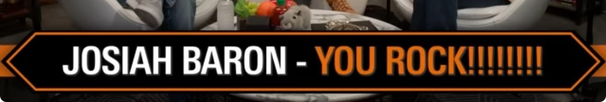](https://www.youtube.com/watch?v=hke5GiWgMLA&amp;t=220s) |
| Robert Flores III | #636 ? How to Play BLUE w/ Josh Lee Kwai | Oct 23, 2024 | [3:40](https://www.youtube.com/watch?v=rN4-IbjxY10&amp;t=220s) |  |
| Ryan Freeburger | #635 ? What Should Be Unbanned? | Oct 17, 2024 | [4:21](https://www.youtube.com/watch?v=r9wck1hVYAY&amp;t=261s) | [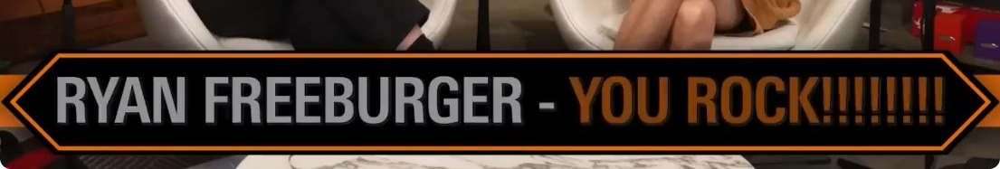](https://www.youtube.com/watch?v=r9wck1hVYAY&amp;t=261s) |
| Andrew Roach | #634 ? Duskmourn’s Best Cards (In the 99) | Oct 11, 2024 | [3:39](https://www.youtube.com/watch?v=eYbTaGqTwDg&amp;t=219s) | [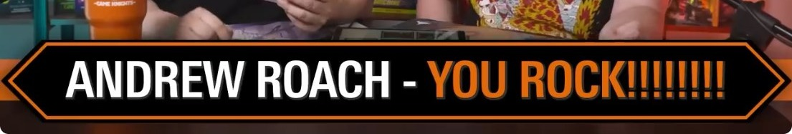](https://www.youtube.com/watch?v=eYbTaGqTwDg&amp;t=219s) |
| Juan Ochoa | #633 ? “Miracle Worker” Precon Upgrade \| Duskmourn | Oct 1, 2024 | [3:09](https://www.youtube.com/watch?v=0bM6dBnKjHw&amp;t=189s) | [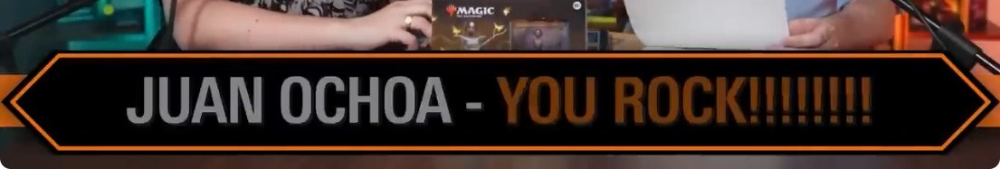](https://www.youtube.com/watch?v=0bM6dBnKjHw&amp;t=189s) |
| Soon Hui Loh | #632 ? The Most Powerful Commanders \| Duskmourn | Sep 24, 2024 | [3:37](https://www.youtube.com/watch?v=dLWVLujnKLM&amp;t=217s) | [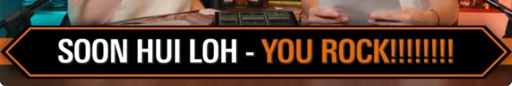](https://www.youtube.com/watch?v=dLWVLujnKLM&amp;t=217s) |
| Eric Jeff | #631 ? “Jump Scare” Precon Upgrade \| Duskmourn | Sep 20, 2024 | [3:03](https://www.youtube.com/watch?v=2O9jWyIGqYY&amp;t=183s) | [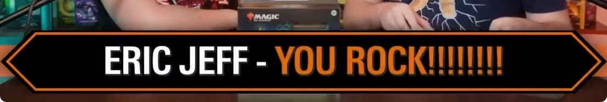](https://www.youtube.com/watch?v=2O9jWyIGqYY&amp;t=183s) |
| Andreas Hock | #630 ? “Endless Punishment” Precon Upgrade \| Duskmourn | Sep 17, 2024 | [3:36](https://www.youtube.com/watch?v=RfnOeHj9c7w&amp;t=216s) | [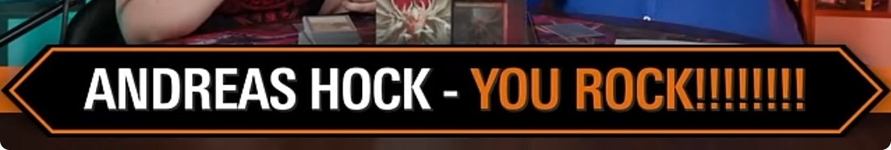](https://www.youtube.com/watch?v=RfnOeHj9c7w&amp;t=216s) |
| Iain Barnfather | #629 ? “Death Toll” Full Deck Reveal & Upgrade \| Duskmourn | Sep 12, 2024 | [5:17](https://www.youtube.com/watch?v=uZY_rkEpTcQ&amp;t=317s) | [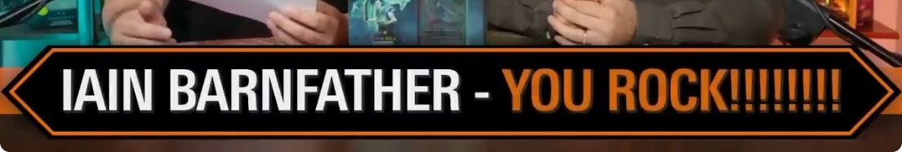](https://www.youtube.com/watch?v=uZY_rkEpTcQ&amp;t=317s) |
| Dylan Bruno | #628 ? The Stupidest Deck I’ve Ever Built | Sep 4, 2024 | [3:02](https://www.youtube.com/watch?v=yQcH5K-oEqY&amp;t=182s) | [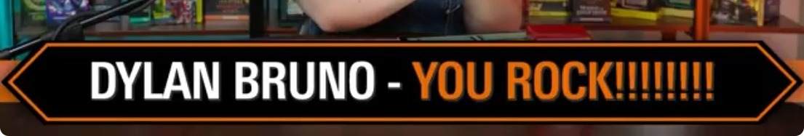](https://www.youtube.com/watch?v=yQcH5K-oEqY&amp;t=182s) |
| Joseph Hollis | #627 ? The Most Annoying Cards in Commander | Aug 29, 2024 | [3:22](https://www.youtube.com/watch?v=RwZiW5qBynM&amp;t=202s) | [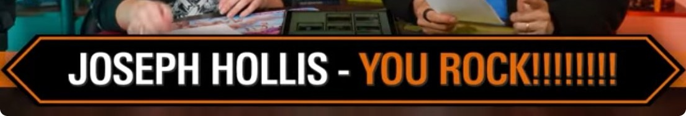](https://www.youtube.com/watch?v=RwZiW5qBynM&amp;t=202s) |
| Blayne Hejduk | #626 ? How to Play Group Hug w/ Jumbo Commander | Aug 22, 2024 | [3:43](https://www.youtube.com/watch?v=gM_Q4_3-rFk&amp;t=223s) | [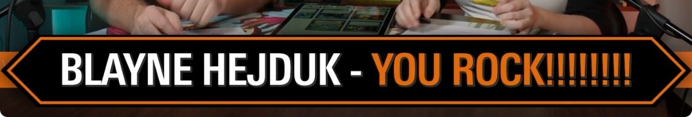](https://www.youtube.com/watch?v=gM_Q4_3-rFk&amp;t=223s) |
| Lance Olsen | #625 ? Bloomburrow's Best Cards (In the 99) | Aug 13, 2024 | [5:28](https://www.youtube.com/watch?v=mABwgkaYD78&amp;t=328s) | [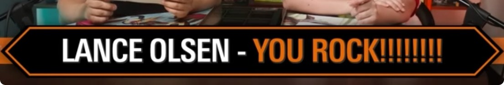](https://www.youtube.com/watch?v=mABwgkaYD78&amp;t=328s) |
| Rachel Barrett | #624 ? “Family Matters” Precon Upgrade \| Bloomburrow | Aug 6, 2024 | [5:01](https://www.youtube.com/watch?v=gAEp0ji6K3U&amp;t=301s) | [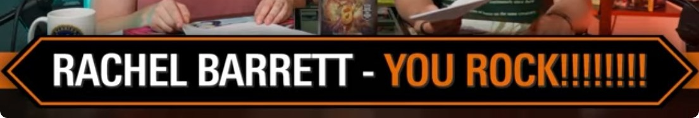](https://www.youtube.com/watch?v=gAEp0ji6K3U&amp;t=301s) |
| Arun Senthil | #623 ? The Most Powerful Commanders \| Bloomburrow | Jul 30, 2024 | [3:44](https://www.youtube.com/watch?v=yfvXfOtAulY&amp;t=224s) | [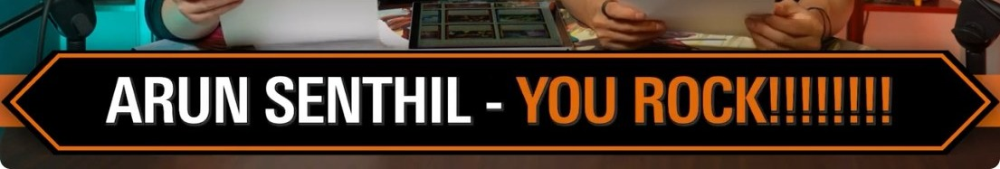](https://www.youtube.com/watch?v=yfvXfOtAulY&amp;t=224s) |
| Olivia Gobert-hicks | #622 ? “Animated Army” Precon Upgrade \| Bloomburrow | Jul 26, 2024 | [4:13](https://www.youtube.com/watch?v=JAmxY_hPdn8&amp;t=253s) |  |
| Erik Woolley | #621 ? “Peace Offering” Precon Upgrade \| Bloomburrow | Jul 23, 2024 | [4:00](https://www.youtube.com/watch?v=QGeWljZSLcA&amp;t=240s) | [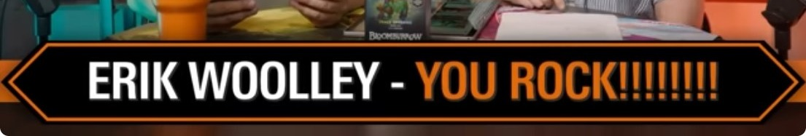](https://www.youtube.com/watch?v=QGeWljZSLcA&amp;t=240s) |
| Shaun In The Ice | #620 ? “Squirreled Away” Full Deck Reveal & Upgrade - Bloomburrow | Jul 18, 2024 | [4:45](https://www.youtube.com/watch?v=gkwO1W3YU6Q&amp;t=285s) | [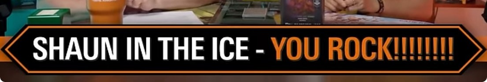](https://www.youtube.com/watch?v=gkwO1W3YU6Q&amp;t=285s) |
| Francis A Leyco | #619 ? We Draft the Best “Gotcha" Spells in Commander | Jul 11, 2024 | [3:38](https://www.youtube.com/watch?v=YBoVPW0wvhY&amp;t=218s) | [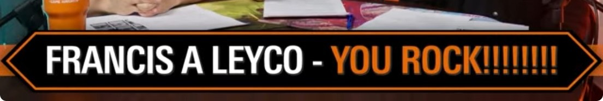](https://www.youtube.com/watch?v=YBoVPW0wvhY&amp;t=218s) |
| Caleb Stallings | #618 ? Cards You Need to Know from Assassin’s Creed | Jul 5, 2024 | [5:03](https://www.youtube.com/watch?v=DbZ06RkMzZM&amp;t=303s) | [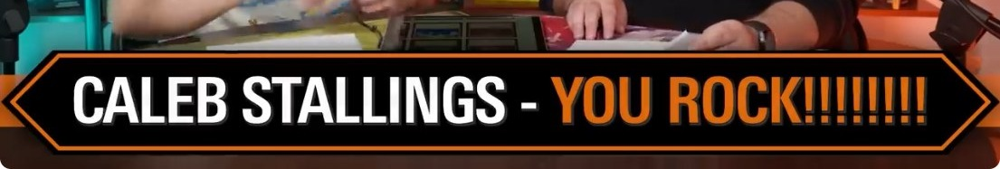](https://www.youtube.com/watch?v=DbZ06RkMzZM&amp;t=303s) |
| Donovan Kwiatkowski | #617 ? “Tricky Terrain” Precon Upgrade \| Modern Horizons 3 | Jun 28, 2024 | [4:16](https://www.youtube.com/watch?v=Cms0pC17QOI&amp;t=256s) |  |
| Lydia Johnson | #616 ? The Best Cards (In the 99) from Modern Horizons 3 | Jun 25, 2024 | [5:36](https://www.youtube.com/watch?v=JKQZ8pSh730&amp;t=336s) | [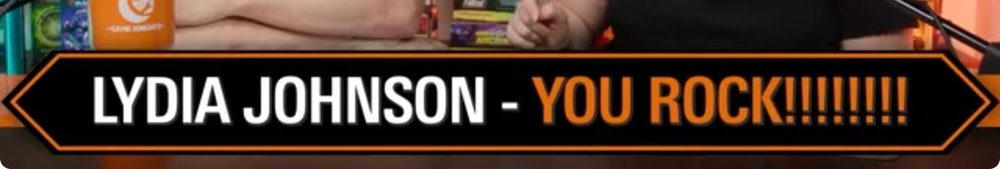](https://www.youtube.com/watch?v=JKQZ8pSh730&amp;t=336s) |
| Stuart Hodge | #615 ? We Rank the MDFCs in MH3 | Jun 19, 2024 | [4:30](https://www.youtube.com/watch?v=-hvdCNLnfo8&amp;t=270s) | [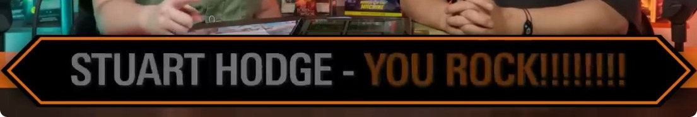](https://www.youtube.com/watch?v=-hvdCNLnfo8&amp;t=270s) |
| Natalie Gosselin | #614 ? We Reveal a Brand New Assassin’s Creed Card | Jun 18, 2024 | [4:59](https://www.youtube.com/watch?v=WrP4EbXCi9Y&amp;t=299s) | [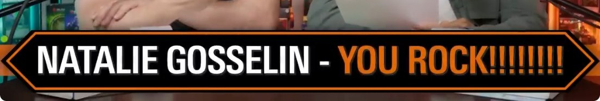](https://www.youtube.com/watch?v=WrP4EbXCi9Y&amp;t=299s) |
| Hellfire Dragon | #613 ? “Graveyard Overdrive” Precon Upgrade \| Modern Horizons 3 | Jun 14, 2024 | [4:03](https://www.youtube.com/watch?v=LR5HnlH1qcA&amp;t=243s) | [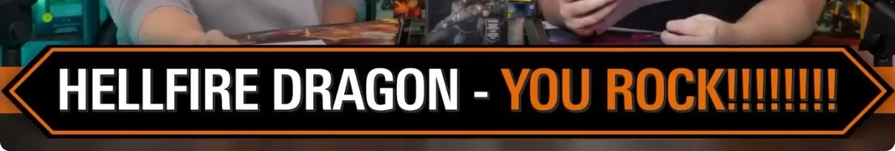](https://www.youtube.com/watch?v=LR5HnlH1qcA&amp;t=243s) |
| Jayden Sorin | #612 ? “Eldrazi Incursion” Precon Upgrade \| Modern Horizons 3 | Jun 11, 2024 | [5:26](https://www.youtube.com/watch?v=ChVK6K-BzaQ&amp;t=326s) | [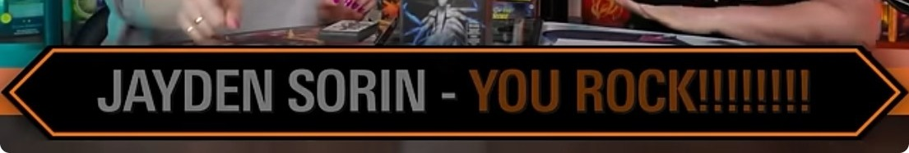](https://www.youtube.com/watch?v=ChVK6K-BzaQ&amp;t=326s) |
| Connor Tilton | #611 ? Most Powerful Commanders from Modern Horizons 3 | Jun 5, 2024 | [5:43](https://www.youtube.com/watch?v=CLdcW1y_JFs&amp;t=343s) | [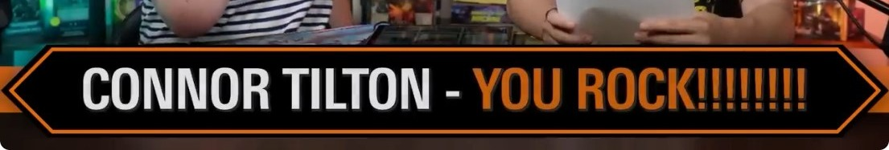](https://www.youtube.com/watch?v=CLdcW1y_JFs&amp;t=343s) |
| Lee Buckner | #610 ? “Creative Energy” Precon Upgrade \| Modern Horizons 3 | May 31, 2024 | [4:32](https://www.youtube.com/watch?v=aMDfxMA0w3k&amp;t=272s) | [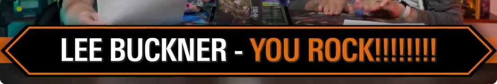](https://www.youtube.com/watch?v=aMDfxMA0w3k&amp;t=272s) |
| Dex Riddlewell | #609 ? “Tricky Terrain” Full Deck Reveal - Modern Horizons 3 | May 29, 2024 | [4:44](https://www.youtube.com/watch?v=MPpkIP1U8KM&amp;t=284s) | [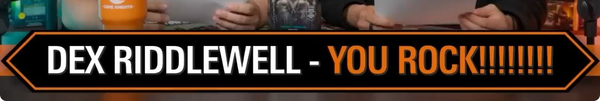](https://www.youtube.com/watch?v=MPpkIP1U8KM&amp;t=284s) |
| Stef Van De Poel | #608 ? Master Deck Building w/ These Scryfall Hacks | May 23, 2024 | [5:39](https://www.youtube.com/watch?v=NNv2uWeCS50&amp;t=339s) | [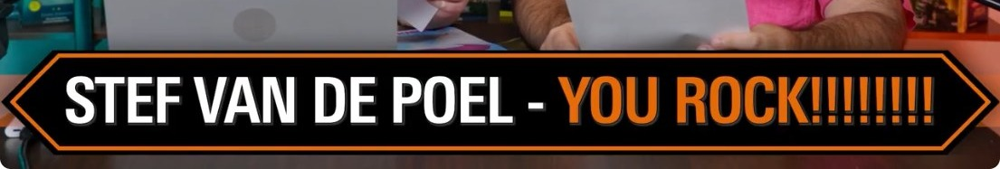](https://www.youtube.com/watch?v=NNv2uWeCS50&amp;t=339s) |
| Hendrick Deleon | #607 ? Level Up Your Combat Phase | May 15, 2024 | [5:19](https://www.youtube.com/watch?v=36mEaTK9Fu4&amp;t=319s) | [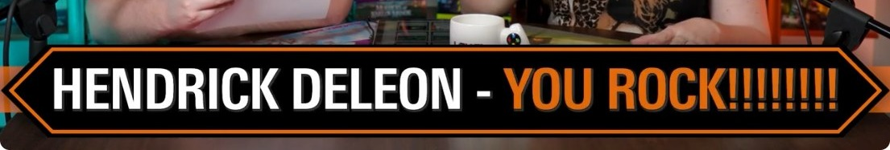](https://www.youtube.com/watch?v=36mEaTK9Fu4&amp;t=319s) |
| Cameron Konop | #606 ? How to Play GREEN w/ Brian Kibler | May 8, 2024 | [3:09](https://www.youtube.com/watch?v=n-s47Bf93rU&amp;t=189s) | [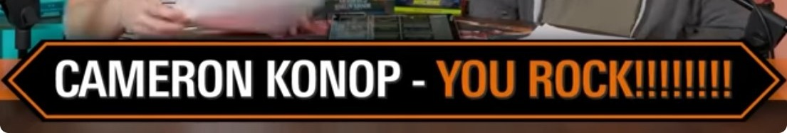](https://www.youtube.com/watch?v=n-s47Bf93rU&amp;t=189s) |
| Jirawat Sannoi | #605 ? Game Knights Isn’t Scripted, BUT… | May 2, 2024 | [4:30](https://www.youtube.com/watch?v=knhnCHaNZRQ&amp;t=270s) | [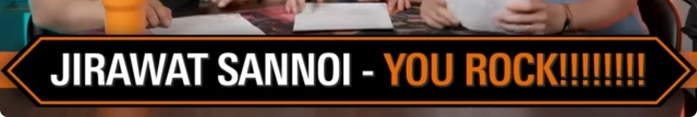](https://www.youtube.com/watch?v=knhnCHaNZRQ&amp;t=270s) |
| Timothy Melvin | #604 ? The Best Cards (In the 99) from Outlaws of Thunder Junction | Apr 25, 2024 | [4:25](https://www.youtube.com/watch?v=URtAGnwD_Ho&amp;t=265s) | [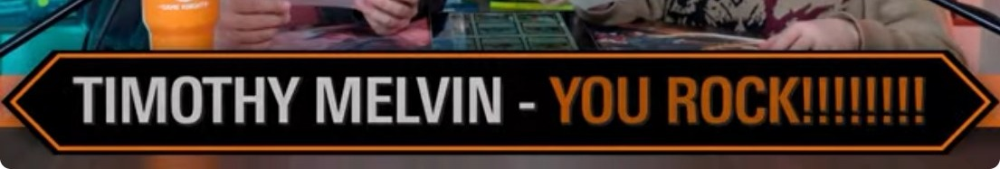](https://www.youtube.com/watch?v=URtAGnwD_Ho&amp;t=265s) |
| Vincent Ethier | #603 ? “Most Wanted” Precon Upgrade \| Outlaws of Thunder Junction | Apr 19, 2024 | [5:09](https://www.youtube.com/watch?v=9d9zqLvzR_E&amp;t=309s) | [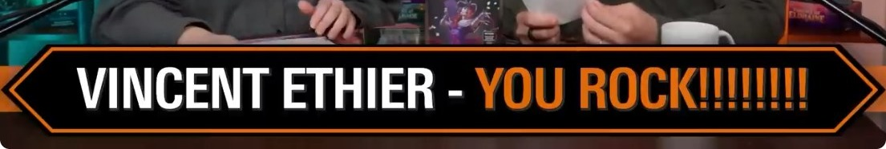](https://www.youtube.com/watch?v=9d9zqLvzR_E&amp;t=309s) |
| Eric Chang | #602 ? “Grand Larceny” Precon Upgrade \| Outlaws of Thunder Junction | Apr 16, 2024 | [3:49](https://www.youtube.com/watch?v=gnUsQg6NNV4&amp;t=229s) | [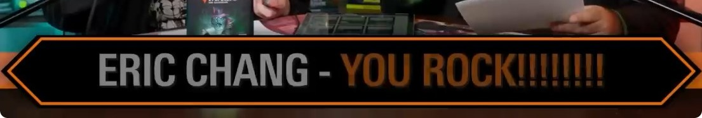](https://www.youtube.com/watch?v=gnUsQg6NNV4&amp;t=229s) |
| Demetrius Martin | #601 ? “Desert Bloom” Precon Upgrade \| Outlaws of Thunder Junction | Apr 11, 2024 | [4:18](https://www.youtube.com/watch?v=noRbaO3CirU&amp;t=258s) | [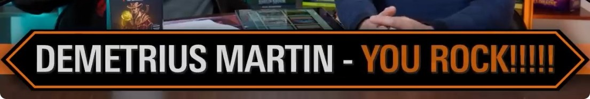](https://www.youtube.com/watch?v=noRbaO3CirU&amp;t=258s) |
| Julio Uribe | #600 ? “Quick Draw” Precon Upgrade \| Outlaws of Thunder Junction | Apr 9, 2024 | [4:27](https://www.youtube.com/watch?v=H8ZUxaeyvlY&amp;t=267s) | [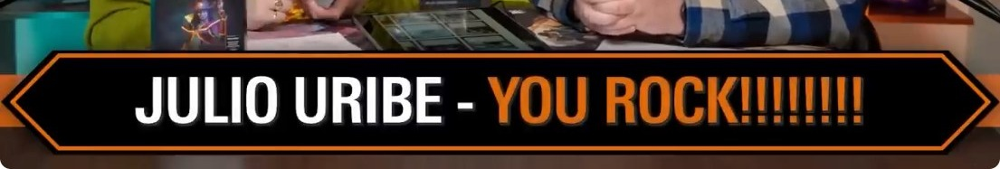](https://www.youtube.com/watch?v=H8ZUxaeyvlY&amp;t=267s) |
| Rj Conley | #599 ? Most Powerful Commanders from Outlaws of Thunder Junction | Apr 5, 2024 | [4:16](https://www.youtube.com/watch?v=L22gaWp6GVQ&amp;t=256s) | [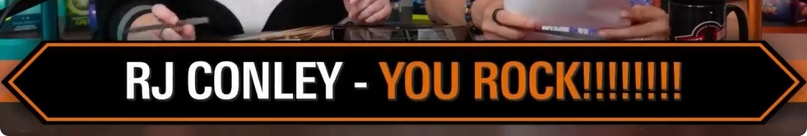](https://www.youtube.com/watch?v=L22gaWp6GVQ&amp;t=256s) |
| Robert Greco | #598 ? “Most Wanted” Full Deck Reveal - Outlaws of Thunder Junction | Apr 4, 2024 | [4:26](https://www.youtube.com/watch?v=rURePA5zR6M&amp;t=266s) | [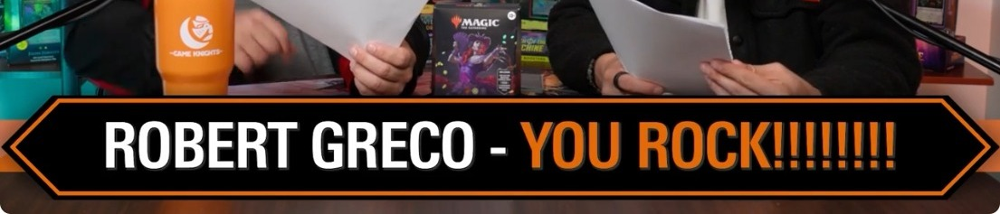](https://www.youtube.com/watch?v=rURePA5zR6M&amp;t=266s) |
| Kenji Madden | #597 ? The Unwritten Rules of Commander | Mar 28, 2024 | [5:48](https://www.youtube.com/watch?v=fWiXZAfIH2Y&amp;t=348s) | [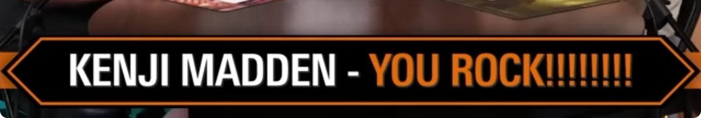](https://www.youtube.com/watch?v=fWiXZAfIH2Y&amp;t=348s) |
| Casey Comisky | #596 ? Do This One Thing to Win More Games \| How to Playtest | Mar 19, 2024 | [5:48](https://www.youtube.com/watch?v=swjL6prGShE&amp;t=348s) | [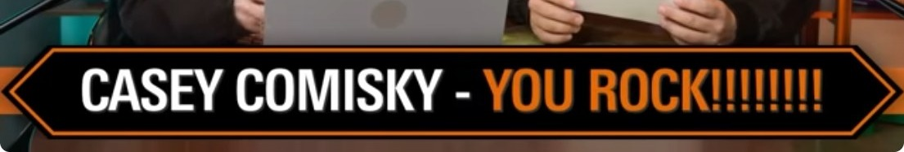](https://www.youtube.com/watch?v=swjL6prGShE&amp;t=348s) |
| William Segletes | #595 ? We Draft the Best Planeswalkers in Commander | Mar 14, 2024 | [4:06](https://www.youtube.com/watch?v=w_d47pXuCOo&amp;t=246s) | [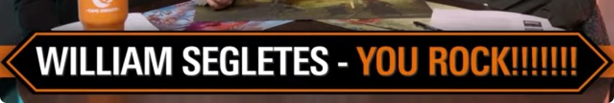](https://www.youtube.com/watch?v=w_d47pXuCOo&amp;t=246s) |
| Caleb Hayes | #594 ? Every Card You Need to Know from Fallout | Mar 5, 2024 | [3:19](https://www.youtube.com/watch?v=bIGbLd3_8AE&amp;t=199s) | [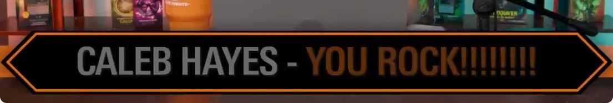](https://www.youtube.com/watch?v=bIGbLd3_8AE&amp;t=199s) |
| Taylor Palmer | #593 ? Fallout Precon Upgrade Guide w/ Kyle Hill \| SCIENCE! vs Mutant Menace | Feb 29, 2024 | [5:14](https://www.youtube.com/watch?v=jOzucv3vc74&amp;t=314s) | [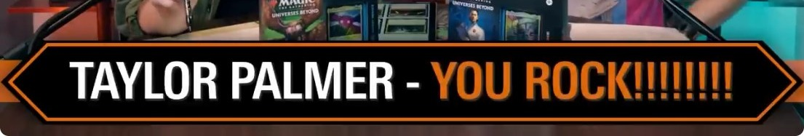](https://www.youtube.com/watch?v=jOzucv3vc74&amp;t=314s) |
| Brennan Huffman | #592 ? Fallout Precon Upgrade Guides \| Hail, Caesar vs Scrappy Survivors | Feb 27, 2024 | [4:57](https://www.youtube.com/watch?v=yXVt0ILwvVY&amp;t=297s) | [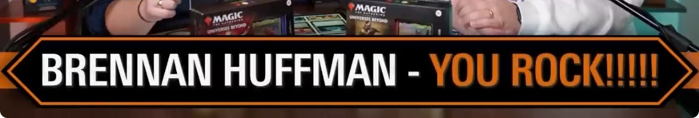](https://www.youtube.com/watch?v=yXVt0ILwvVY&amp;t=297s) |
| Bryan Grieme | #591 ? How to Become a GENIUS at Commander | Feb 22, 2024 | [3:01](https://www.youtube.com/watch?v=lhU4LTnwQQA&amp;t=181s) | [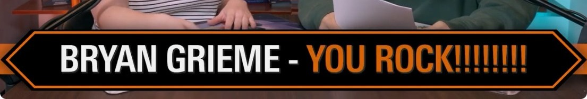](https://www.youtube.com/watch?v=lhU4LTnwQQA&amp;t=181s) |
| Lunafreya Wootton | #590 ? Official Fallout Preview Card | Feb 21, 2024 | [3:24](https://www.youtube.com/watch?v=jDUwuYQt48s&amp;t=204s) | [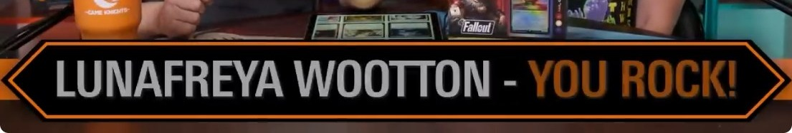](https://www.youtube.com/watch?v=jDUwuYQt48s&amp;t=204s) |
| Devan Pierce | #589 ? The Best Cards (In the 99) from Murders at Karlov Manor | Feb 13, 2024 | [3:02](https://www.youtube.com/watch?v=aMqF_1SzFt4&amp;t=182s) | [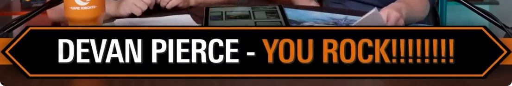](https://www.youtube.com/watch?v=aMqF_1SzFt4&amp;t=182s) |
| Matt Chu | #588 ? Karlov Manor Precon Upgrades & Comparison \| Deep Clue Sea vs Blame Game | Feb 5, 2024 | [4:20](https://www.youtube.com/watch?v=9LqXl99Uv-s&amp;t=260s) |  |
| John Moseman | #587 ? Karlov Manor Precon Upgrades & Comparison \| Deadly Disguise vs Revenant Recon | Jan 31, 2024 | [3:34](https://www.youtube.com/watch?v=5T3pMi6o2zM&amp;t=214s) | [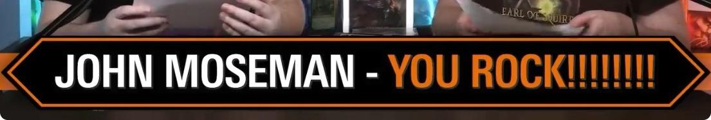](https://www.youtube.com/watch?v=5T3pMi6o2zM&amp;t=214s) |
| Jacob Little | #586 ? Most Powerful Commanders from Murders at Karlov Manor | Jan 26, 2024 | [5:33](https://www.youtube.com/watch?v=PHV1VtYof98&amp;t=333s) | [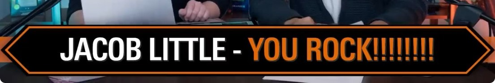](https://www.youtube.com/watch?v=PHV1VtYof98&amp;t=333s) |
| Niall Hopkins | #585 ? “Deep Clue Sea” Full Deck Reveal - Murders at Karlov Manor | Jan 24, 2024 | [4:39](https://www.youtube.com/watch?v=053iZT8Lqws&amp;t=279s) | [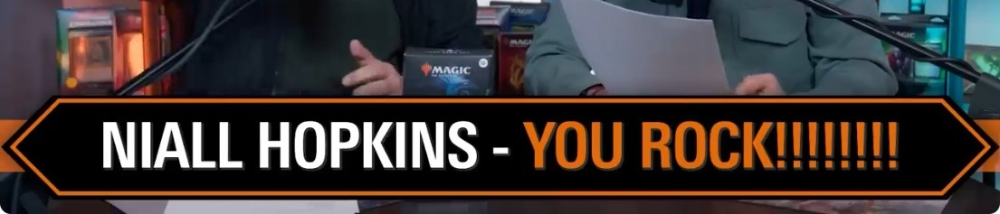](https://www.youtube.com/watch?v=053iZT8Lqws&amp;t=279s) |
| Andrew James Ringrose | #584 ? Cards that Change Your Deck's Power Level | Jan 17, 2024 | [4:38](https://www.youtube.com/watch?v=0qnFxDNz0bI&amp;t=278s) |  |
| Beau Lee | #583 ? Most Powerful Old School Commanders | Jan 10, 2024 | [4:26](https://www.youtube.com/watch?v=gjFvLb3tM5U&amp;t=266s) | [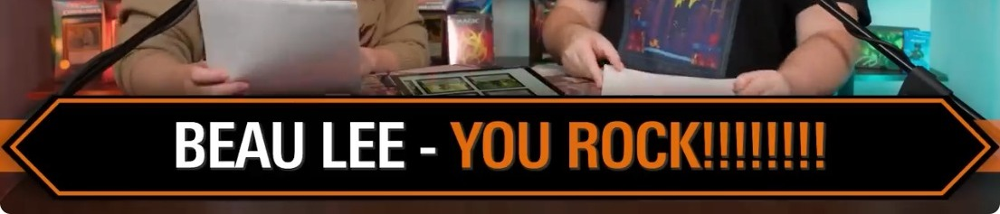](https://www.youtube.com/watch?v=gjFvLb3tM5U&amp;t=266s) |
| Trevor Rumaugh | #582 ? Our Commander New Year's Resolutions | Jan 4, 2024 | [3:53](https://www.youtube.com/watch?v=wO0e2Bmb3Ac&amp;t=233s) | [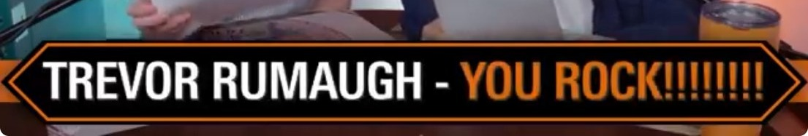](https://www.youtube.com/watch?v=wO0e2Bmb3Ac&amp;t=233s) |
| James Lavengood | #581 ? MTG in 2023 - Year in Review | Dec 28, 2023 | [3:55](https://www.youtube.com/watch?v=yyKTuO3f6Zg&amp;t=235s) | [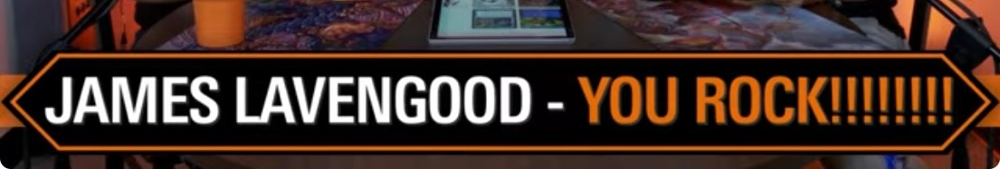](https://www.youtube.com/watch?v=yyKTuO3f6Zg&amp;t=235s) |
| Rebecca Crane | #580 ? We Rank Every Precon from 2023 | Dec 19, 2023 | [5:22](https://www.youtube.com/watch?v=oYdyAQkJyik&amp;t=322s) | [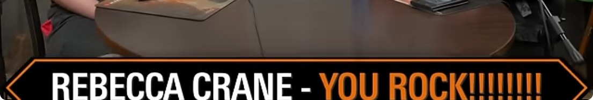](https://www.youtube.com/watch?v=oYdyAQkJyik&amp;t=322s) |
| Brad Ezzell | #579 ? Jimmy’s Personal Commander Decks | Dec 13, 2023 | [3:22](https://www.youtube.com/watch?v=ERcLhi1LTMU&amp;t=202s) | [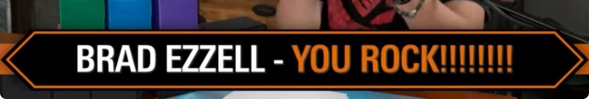](https://www.youtube.com/watch?v=ERcLhi1LTMU&amp;t=202s) |
| Bryan Timlin | #578 ? How to Play BLACK w/ Ladee Danger | Dec 5, 2023 | [3:33](https://www.youtube.com/watch?v=OYKcJZ61Vv4&amp;t=213s) | [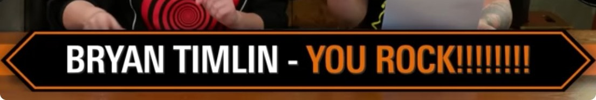](https://www.youtube.com/watch?v=OYKcJZ61Vv4&amp;t=213s) |
| Cooper Bennett | #577 ? We Draft the Best Utility Lands in Commander | Nov 27, 2023 | [4:02](https://www.youtube.com/watch?v=sIyNw06rTko&amp;t=242s) | [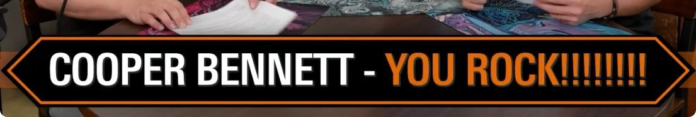](https://www.youtube.com/watch?v=sIyNw06rTko&amp;t=242s) |
| First Order Wookiee | #576 ? Vampire Precon Upgrade Guide \| “Blood Rites” \| Lost Caverns of Ixalan | Nov 22, 2023 | [3:51](https://www.youtube.com/watch?v=eDllfszXP0U&amp;t=231s) |  |
| Jared Coleman | #575 ? The Best Cards (In the 99) from Lost Caverns of Ixalan | Nov 20, 2023 | [3:36](https://www.youtube.com/watch?v=a3a9nXnCiRs&amp;t=216s) |  |
| Alex Ippolito | #574 ? Pirate Precon Upgrade Guide \| “Ahoy Mateys” \| Lost Caverns of Ixalan | Nov 17, 2023 | [3:41](https://www.youtube.com/watch?v=SoGS7ve9MGM&amp;t=221s) | [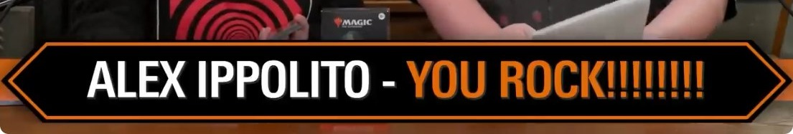](https://www.youtube.com/watch?v=SoGS7ve9MGM&amp;t=221s) |
| Randall Flud | #573 ? Merfolk Precon Upgrade \| “Explorers of the Deep” \| Lost Caverns of Ixalan | Nov 13, 2023 | [4:36](https://www.youtube.com/watch?v=Dyp5B4jutCY&amp;t=276s) | [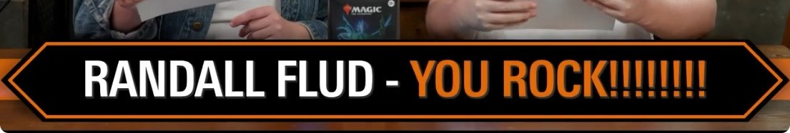](https://www.youtube.com/watch?v=Dyp5B4jutCY&amp;t=276s) |
| Conor Salinas | #572 ? Dinosaur Precon Upgrade Guide \| “Veloci-Ramp-Tor” \| Lost Caverns of Ixalan | Nov 9, 2023 | [3:24](https://www.youtube.com/watch?v=Gd6HeLT4hrY&amp;t=204s) | [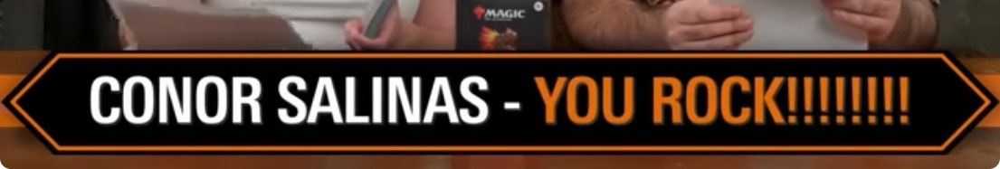](https://www.youtube.com/watch?v=Gd6HeLT4hrY&amp;t=204s) |
| Alex Quintero | #571 ? Most Powerful Commanders from Lost Caverns of Ixalan | Nov 7, 2023 | [3:36](https://www.youtube.com/watch?v=pjAn9kSqhfs&amp;t=216s) | [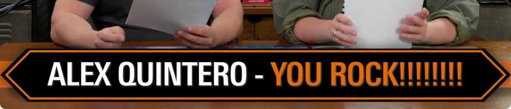](https://www.youtube.com/watch?v=pjAn9kSqhfs&amp;t=216s) |
| Waila Skinner | #570 ? “Blood Rites” Full Deck Reveal - Lost Caverns of Ixalan | Nov 1, 2023 | [5:06](https://www.youtube.com/watch?v=MTbT-2xYfAU&amp;t=306s) | [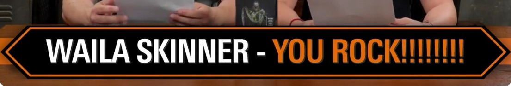](https://www.youtube.com/watch?v=MTbT-2xYfAU&amp;t=306s) |
| Dylan Howard | #569 ? The Best Cards (In the 99) from Doctor Who | Oct 30, 2023 | [4:11](https://www.youtube.com/watch?v=IOCar-pgdh4&amp;t=251s) | [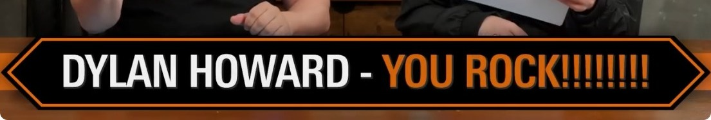](https://www.youtube.com/watch?v=IOCar-pgdh4&amp;t=251s) |
| Tyson Janney | #568 ? “Paradox Power” Doctor Who Precon Upgrade | Oct 25, 2023 | [4:18](https://www.youtube.com/watch?v=upV7Q0YND3c&amp;t=258s) | [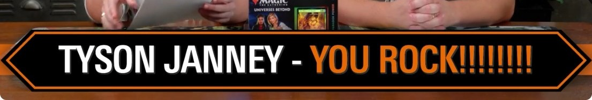](https://www.youtube.com/watch?v=upV7Q0YND3c&amp;t=258s) |
| Mario Benkert | #567 ? The Best Doctors (and Companions) in Doctor Who | Oct 23, 2023 | [4:31](https://www.youtube.com/watch?v=G5nicVKE5p8&amp;t=271s) | [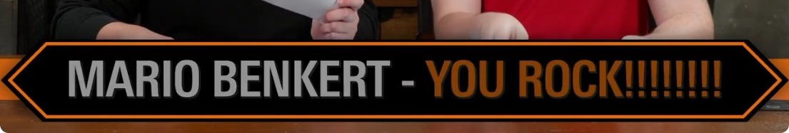](https://www.youtube.com/watch?v=G5nicVKE5p8&amp;t=271s) |
| Steven Strickland Jr. | #566 ? “Blast from the Past” Doctor Who Precon Upgrade | Oct 20, 2023 | [3:43](https://www.youtube.com/watch?v=DYH4rKEVfsw&amp;t=223s) |  |
| Emperor Dom | #565 ? “Masters of Evil” Doctor Who Precon Upgrade | Oct 16, 2023 | [4:49](https://www.youtube.com/watch?v=hePGRRVKhkI&amp;t=289s) | [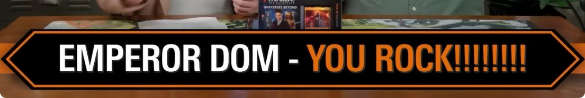](https://www.youtube.com/watch?v=hePGRRVKhkI&amp;t=289s) |
| John Antkowiak | #564 ? “Timey-Wimey” Doctor Who Precon Upgrade | Oct 13, 2023 | [3:40](https://www.youtube.com/watch?v=q8Q4H27nN9k&amp;t=220s) | [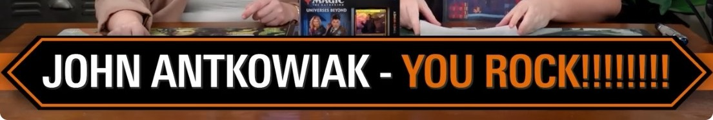](https://www.youtube.com/watch?v=q8Q4H27nN9k&amp;t=220s) |
| Brad Springall | #563 ? The Most Powerful Commanders in Doctor Who | Oct 9, 2023 | [2:53](https://www.youtube.com/watch?v=C8tdw7pAFBA&amp;t=173s) | [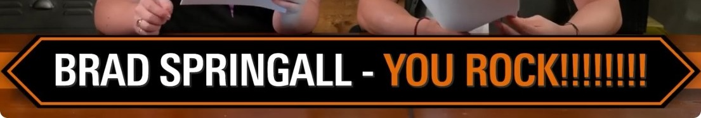](https://www.youtube.com/watch?v=C8tdw7pAFBA&amp;t=173s) |
| Maarten Van Ginhoven | #562 ? We Draft the Best Equipment in Commander | Oct 2, 2023 | [4:19](https://www.youtube.com/watch?v=pS13XyQcD5k&amp;t=259s) |  |
| Zach Tutosi | #561 ? Commanders We Hate Playing Against | Sep 26, 2023 | [4:31](https://www.youtube.com/watch?v=5lOVb4885_I&amp;t=271s) | [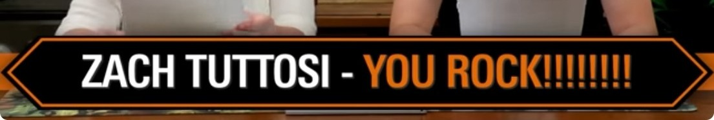](https://www.youtube.com/watch?v=5lOVb4885_I&amp;t=271s) |
| Jonathan Bund | #560 ? You're Reading Cards WRONG | Sep 19, 2023 | [4:06](https://www.youtube.com/watch?v=7eBGjtysGcY&amp;t=246s) | [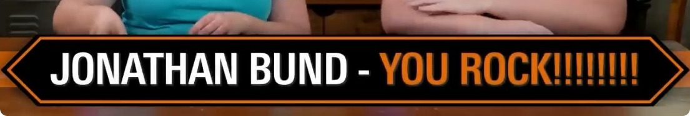](https://www.youtube.com/watch?v=7eBGjtysGcY&amp;t=246s) |
| Spencer Rabourn | #559 ? The Best Wilds of Eldraine Cards (In The 99) | Sep 12, 2023 | [8:56](https://www.youtube.com/watch?v=xW7oc4hxeLE&amp;t=536s) | [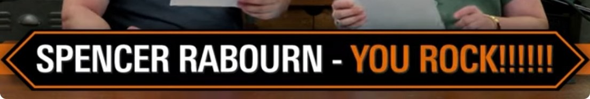](https://www.youtube.com/watch?v=xW7oc4hxeLE&amp;t=536s) |
| Gary Wilton | #558 ? “Fae Dominion” Wilds of Eldraine Precon Upgrade Guide | Sep 4, 2023 | [3:45](https://www.youtube.com/watch?v=daqy8_hvsRA&amp;t=225s) | [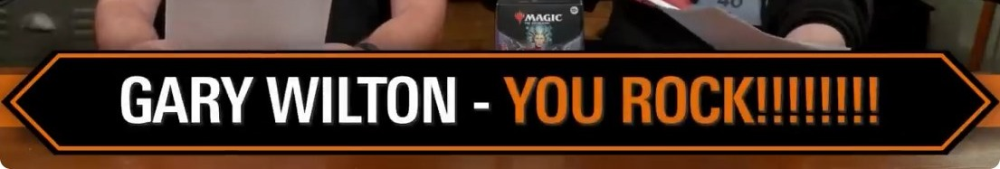](https://www.youtube.com/watch?v=daqy8_hvsRA&amp;t=225s) |
| Mike Claerhout | #557 ? The Spiciest Wilds of Eldraine Commanders | Aug 31, 2023 | [4:25](https://www.youtube.com/watch?v=XSqsxRT4NVU&amp;t=265s) | [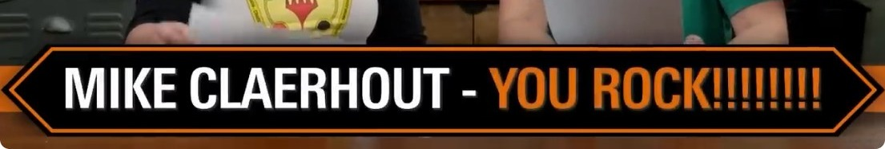](https://www.youtube.com/watch?v=XSqsxRT4NVU&amp;t=265s) |
| Nichole Woods | #556 ? “Virtue and Valor” Wilds of Eldraine Precon Upgrade Guide | Aug 29, 2023 | [3:36](https://www.youtube.com/watch?v=p7bqTM3yAPI&amp;t=216s) | [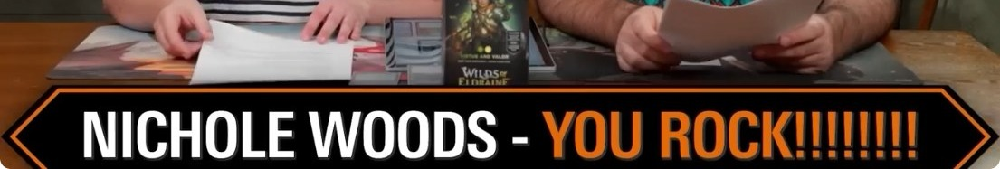](https://www.youtube.com/watch?v=p7bqTM3yAPI&amp;t=216s) |
| Phillip Ash | #555 ? Wilds of Eldraine Commanders You HAVE to Build | Aug 25, 2023 | [4:12](https://www.youtube.com/watch?v=1DXu-QRjL4c&amp;t=252s) | [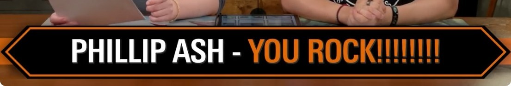](https://www.youtube.com/watch?v=1DXu-QRjL4c&amp;t=252s) |
| Daniel Ortega | #554 ? “Fae Dominion” Full Deck Reveal - Wilds of Eldraine | Aug 23, 2023 | [4:55](https://www.youtube.com/watch?v=-bY4zxb_U3Q&amp;t=295s) | [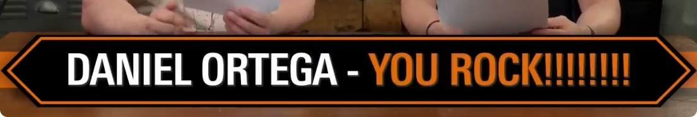](https://www.youtube.com/watch?v=-bY4zxb_U3Q&amp;t=295s) |
| Sarah Pisula | #553 ? Underrated Commanders that Should Be More Popular | Aug 15, 2023 | [4:10](https://www.youtube.com/watch?v=pZammxuR_PY&amp;t=250s) | [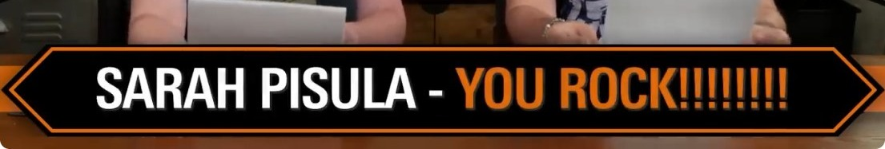](https://www.youtube.com/watch?v=pZammxuR_PY&amp;t=250s) |
| Andrew Chen | #552 ? “Enduring Enchantments” Commander Masters Precon Upgrade Guide | Aug 8, 2023 | [4:01](https://www.youtube.com/watch?v=cJdyAZ-btWU&amp;t=241s) | [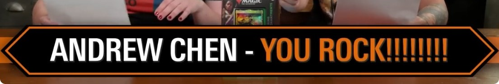](https://www.youtube.com/watch?v=cJdyAZ-btWU&amp;t=241s) |
| Joshua Weagle | #551 ? “Eldrazi Unbound” Commander Masters Precon Upgrade Guide | Aug 4, 2023 | [4:19](https://www.youtube.com/watch?v=-xHia4igdVM&amp;t=259s) | [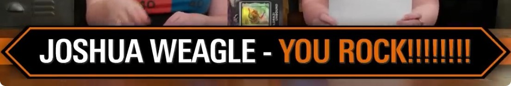](https://www.youtube.com/watch?v=-xHia4igdVM&amp;t=259s) |
| Brandon Clyburn | #550 ? Most BUSTED New Cards from CMM | Aug 1, 2023 | [4:09](https://www.youtube.com/watch?v=lut1vHn4FxA&amp;t=249s) | [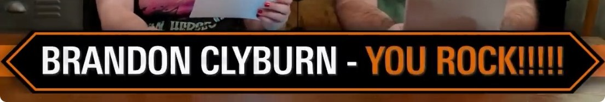](https://www.youtube.com/watch?v=lut1vHn4FxA&amp;t=249s) |
| Michael Fine | #549 ? “Sliver Swarm” Commander Masters Precon Upgrade Guide | Jul 27, 2023 | [4:37](https://www.youtube.com/watch?v=XvLWezTXjMk&amp;t=277s) | [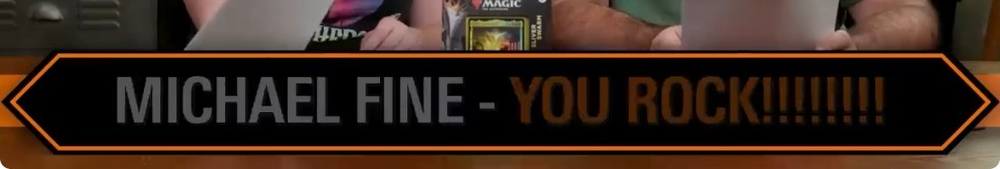](https://www.youtube.com/watch?v=XvLWezTXjMk&amp;t=277s) |
| Justin Bulgarelli Jr | #548 ? “Planeswalker Party” Commander Masters Precon Upgrade Guide | Jul 25, 2023 | [4:06](https://www.youtube.com/watch?v=TC0DXuCK2AI&amp;t=246s) | [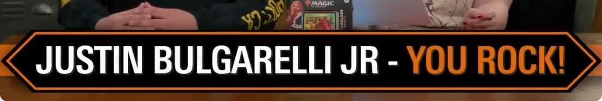](https://www.youtube.com/watch?v=TC0DXuCK2AI&amp;t=246s) |
| Alex Kalish | #547 ? Commander Masters “Enduring Enchantments” Full Precon Reveal | Jul 19, 2023 | [4:40](https://www.youtube.com/watch?v=WARcYHfIbeg&amp;t=280s) | [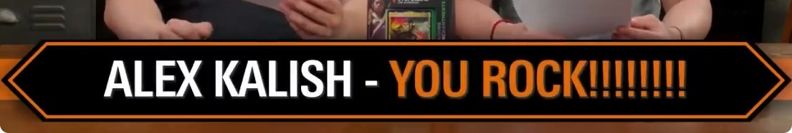](https://www.youtube.com/watch?v=WARcYHfIbeg&amp;t=280s) |
| Dexter Ancheta | #546 ? How to Play WHITE w/ Rachel Weeks | Jul 17, 2023 | [3:25](https://www.youtube.com/watch?v=Hvfa6p10H6c&amp;t=205s) | [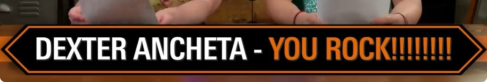](https://www.youtube.com/watch?v=Hvfa6p10H6c&amp;t=205s) |
| Kyle Bruns | #545 ? The Most Interesting Commanders in LOTR | Jul 11, 2023 | [3:43](https://www.youtube.com/watch?v=CKw9MNliFSs&amp;t=223s) | [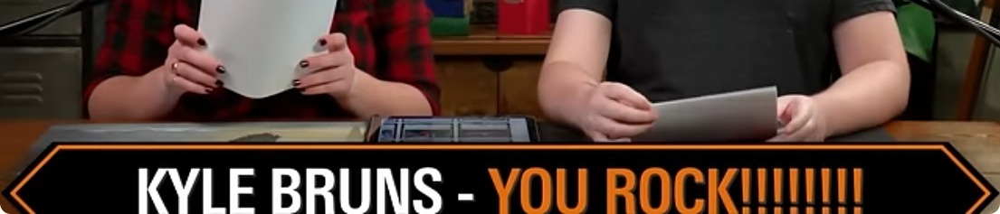](https://www.youtube.com/watch?v=CKw9MNliFSs&amp;t=223s) |
| Joseph Vespucci | #544 ? “Riders of Rohan” LOTR Precon Upgrade Guide | Jul 7, 2023 | [4:18](https://www.youtube.com/watch?v=GHK0whGDyEM&amp;t=258s) | [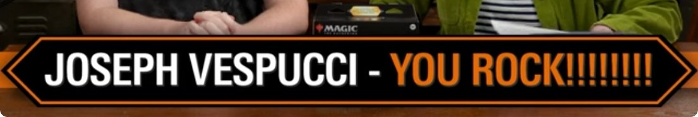](https://www.youtube.com/watch?v=GHK0whGDyEM&amp;t=258s) |
| Paul Karyakos | #543 ? The Most Flavorful Commanders in LOTR | Jul 5, 2023 | [4:34](https://www.youtube.com/watch?v=zgM_XDIYtag&amp;t=274s) | [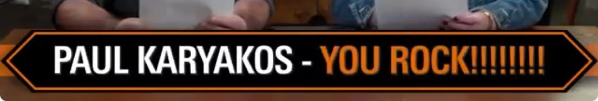](https://www.youtube.com/watch?v=zgM_XDIYtag&amp;t=274s) |
| Brian Hook | #542 ? The Best LOTR Cards (In the 99) | Jun 30, 2023 | [4:18](https://www.youtube.com/watch?v=GRbhbfUP7VQ&amp;t=258s) | [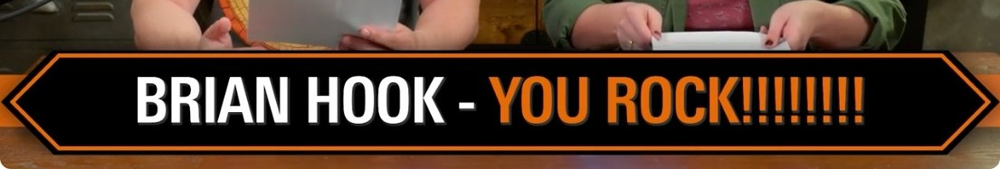](https://www.youtube.com/watch?v=GRbhbfUP7VQ&amp;t=258s) |
| Becky Wheeler | #541 ? “Hosts of Mordor” LOTR Precon Upgrade Guide | Jun 26, 2023 | [4:46](https://www.youtube.com/watch?v=aLK7p5EOWFE&amp;t=286s) | [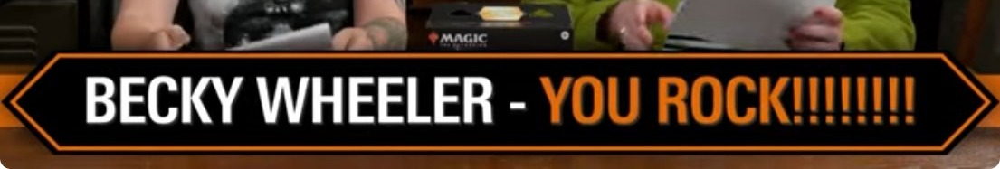](https://www.youtube.com/watch?v=aLK7p5EOWFE&amp;t=286s) |
| Scott Fryer | #540 ? “Elven Council” LOTR Precon Upgrade Guide | Jun 19, 2023 | [4:59](https://www.youtube.com/watch?v=XPh0M1TPzwY&amp;t=299s) | [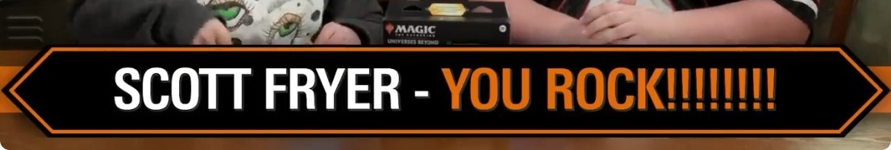](https://www.youtube.com/watch?v=XPh0M1TPzwY&amp;t=299s) |
| Jeremiah Benson | #539 ? LOTR’s New Mechanic is ALL POWERFUL | Jun 16, 2023 | [4:54](https://www.youtube.com/watch?v=N4VUMc0GCvo&amp;t=294s) | [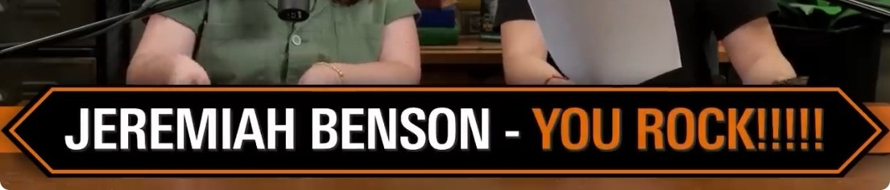](https://www.youtube.com/watch?v=N4VUMc0GCvo&amp;t=294s) |
| Luke Diabo | #538 ? “Food and Fellowship” LOTR Precon Upgrade | Jun 14, 2023 | [3:35](https://www.youtube.com/watch?v=j0pTBs2CeKo&amp;t=215s) |  |
| Dakota Dillard | #537 ? These LOTR Commanders are BUSTED! | Jun 12, 2023 | [4:59](https://www.youtube.com/watch?v=9Lo-e9WynqA&amp;t=299s) | [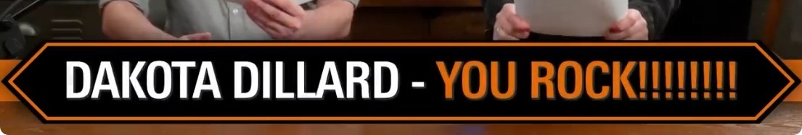](https://www.youtube.com/watch?v=9Lo-e9WynqA&amp;t=299s) |
| Caleb Doucet | #536 ? LOTR “Riders of Rohan” Full Precon Reveal | Jun 8, 2023 | [3:50](https://www.youtube.com/watch?v=bDmPfEeo69o&amp;t=230s) | [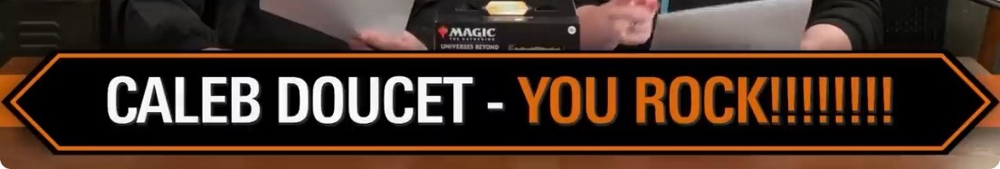](https://www.youtube.com/watch?v=bDmPfEeo69o&amp;t=230s) |
| Sean Logue | #535 ? Rachel’s Personal Commander Decks | Jun 6, 2023 | [3:30](https://www.youtube.com/watch?v=LCqGf27Xyvk&amp;t=210s) | [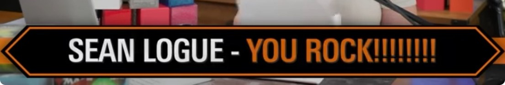](https://www.youtube.com/watch?v=LCqGf27Xyvk&amp;t=210s) |
| Ryanne Harris | #534 ? How to Play RED with Jimmy Wong | Jun 1, 2023 | [3:54](https://www.youtube.com/watch?v=_zYgDmEOxNE&amp;t=234s) | [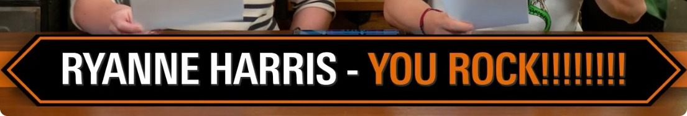](https://www.youtube.com/watch?v=_zYgDmEOxNE&amp;t=234s) |
| Cody Simpson | #533 ? Compleated Commanders - March of the Machine | May 23, 2023 | [3:34](https://www.youtube.com/watch?v=gaJ_2gyLbC4&amp;t=214s) | [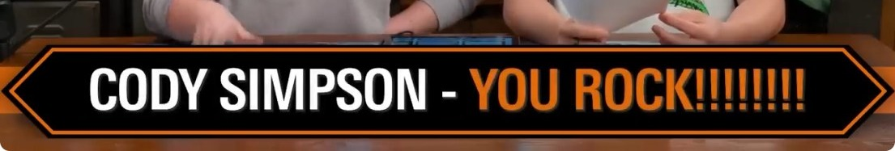](https://www.youtube.com/watch?v=gaJ_2gyLbC4&amp;t=214s) |
| Edoardo Mies | #531 ? “Cavalry Charge” Precon Budget Upgrade - March of the Machine | May 10, 2023 | [5:05](https://www.youtube.com/watch?v=go8LnaazQ60&amp;t=305s) | [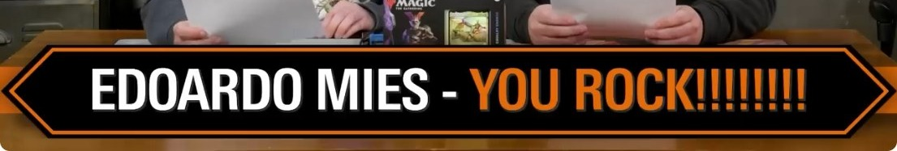](https://www.youtube.com/watch?v=go8LnaazQ60&amp;t=305s) |
| Bradley Spice | #530 ? AFTERMATH: Cards You Need to Know | May 4, 2023 | [4:16](https://www.youtube.com/watch?v=KGLtZ4DledU&amp;t=256s) | [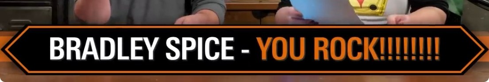](https://www.youtube.com/watch?v=KGLtZ4DledU&amp;t=256s) |
| Mark Akers | #529 ? The Best Cards (In the 99) - March of the Machine | May 2, 2023 | [2:58](https://www.youtube.com/watch?v=J3ADtaBWX68&amp;t=178s) | [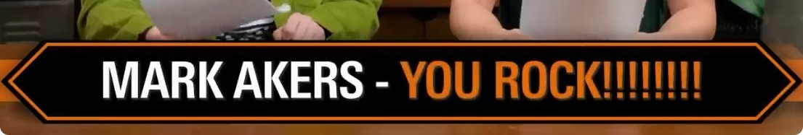](https://www.youtube.com/watch?v=J3ADtaBWX68&amp;t=178s) |
| Kevin Phillips | #528 ? “Call for Backup” Precon Budget Upgrade - March of the Machine | Apr 25, 2023 | [4:46](https://www.youtube.com/watch?v=-PBKuwy3YZ4&amp;t=286s) | [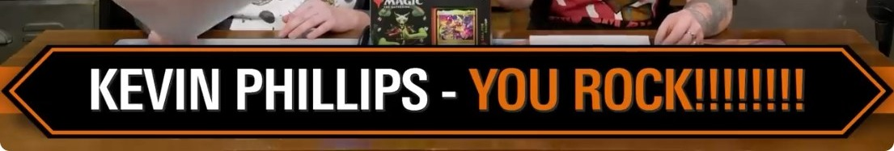](https://www.youtube.com/watch?v=-PBKuwy3YZ4&amp;t=286s) |
| Daniel Best | #527 ? “Tinker Time” Precon Budget Upgrade - March of the Machine | Apr 17, 2023 | [5:47](https://www.youtube.com/watch?v=7FgN_8JFclc&amp;t=347s) | [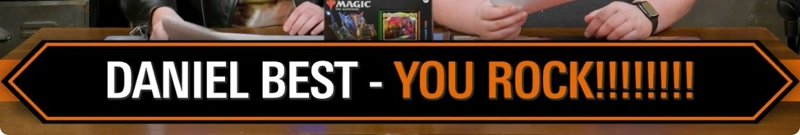](https://www.youtube.com/watch?v=7FgN_8JFclc&amp;t=347s) |
| Cricket Floyd | #526 ? Which Praetor Is Most Powerful? \| March of the Machine | Apr 14, 2023 | [3:43](https://www.youtube.com/watch?v=GjvdYPVQze8&amp;t=223s) | [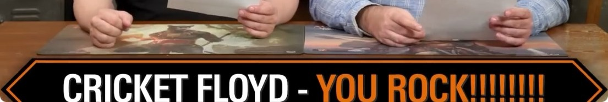](https://www.youtube.com/watch?v=GjvdYPVQze8&amp;t=223s) |
| Alissa Telling | #525 ? “Growing Threat” Precon Budget Upgrade - March of the Machine | Apr 12, 2023 | [4:13](https://www.youtube.com/watch?v=vqI6jVCv-bs&amp;t=253s) | [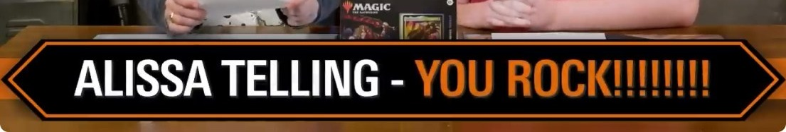](https://www.youtube.com/watch?v=vqI6jVCv-bs&amp;t=253s) |
| Cooper Johnson | #524 ? March of the Machine - Team Up Commanders (Part 2) | Apr 10, 2023 | [4:05](https://www.youtube.com/watch?v=BCGVRxP68LE&amp;t=245s) |  |
| Alec Mcphillips | #523 ? March of the Machine - Team Up Commanders (Part 1) | Apr 6, 2023 | [3:49](https://www.youtube.com/watch?v=AgsbvCiFnvg&amp;t=229s) | [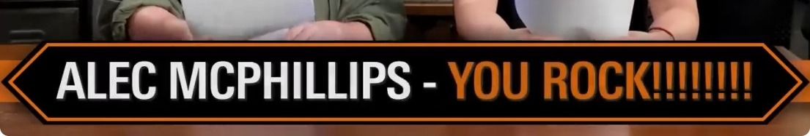](https://www.youtube.com/watch?v=AgsbvCiFnvg&amp;t=229s) |
| Travis Walters | #522 ? “Divine Convocation” Precon Reveal - March of the Machine | Apr 4, 2023 | [3:22](https://www.youtube.com/watch?v=ztAt03EG140&amp;t=202s) | [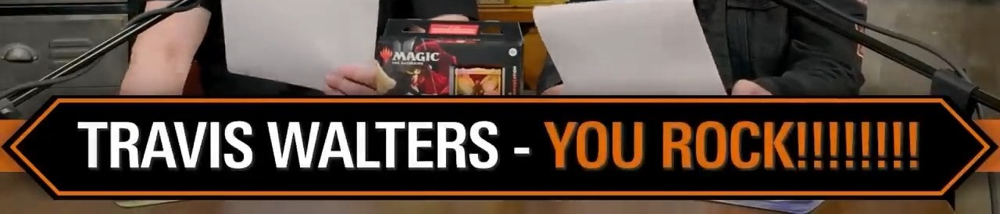](https://www.youtube.com/watch?v=ztAt03EG140&amp;t=202s) |
| Samantha Burbank | #521 ? Rules Magic Players Keep Getting Wrong | Mar 28, 2023 | [4:38](https://www.youtube.com/watch?v=ShTFssyDRio&amp;t=278s) | [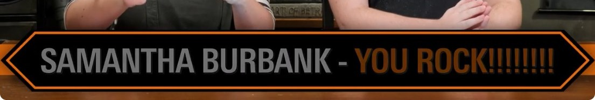](https://www.youtube.com/watch?v=ShTFssyDRio&amp;t=278s) |
| Austin Morris | #520 ? Scariest Commanders to Play Against | Mar 21, 2023 | [4:56](https://www.youtube.com/watch?v=ZA7nX9f19yw&amp;t=296s) | [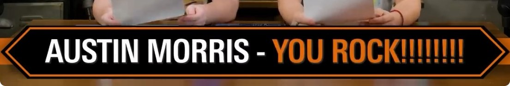](https://www.youtube.com/watch?v=ZA7nX9f19yw&amp;t=296s) |
| David Le | #519 ? How to Build a Deck You Love to Play | Mar 14, 2023 | [3:45](https://www.youtube.com/watch?v=-1cF7-WCQeQ&amp;t=225s) | [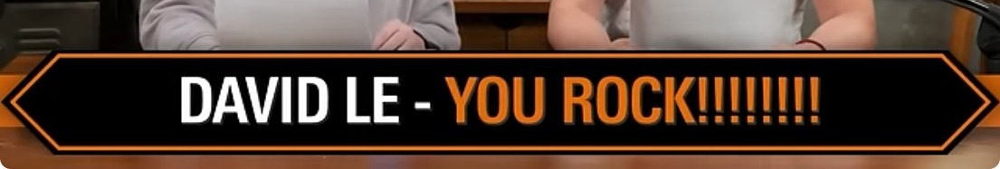](https://www.youtube.com/watch?v=-1cF7-WCQeQ&amp;t=225s) |
| Adam Shepherd | #518 ? Commander Staples That Aren’t Worth the Price | Mar 7, 2023 | [4:09](https://www.youtube.com/watch?v=BTsMQiKb8jA&amp;t=249s) | [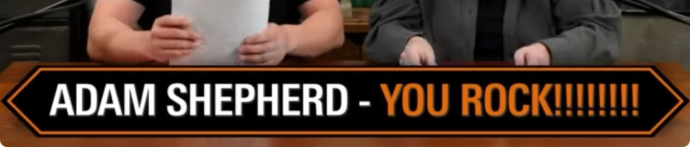](https://www.youtube.com/watch?v=BTsMQiKb8jA&amp;t=249s) |
| Aaron Kozub | #517 ? Bad Magic Cards (We Play Them Anyway) | Feb 28, 2023 | [4:29](https://www.youtube.com/watch?v=iSfD_dI9SQc&amp;t=269s) | [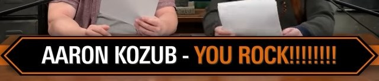](https://www.youtube.com/watch?v=iSfD_dI9SQc&amp;t=269s) |
| Kayla Nordstrom | #516 ? How To Play Infect with Mr. Infect | Feb 22, 2023 | [3:29](https://www.youtube.com/watch?v=osaumP0BPCs&amp;t=209s) |  |
| Wilfredo Yau | #515 ? The Best Cards (In the 99) from All Will Be One | Feb 14, 2023 | [3:31](https://www.youtube.com/watch?v=1Ibh_3qF2ac&amp;t=211s) | [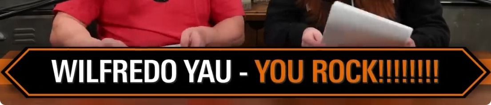](https://www.youtube.com/watch?v=1Ibh_3qF2ac&amp;t=211s) |
| Kelly Grisom | #514 ? New Commander Staples from All Will Be One? | Feb 6, 2023 | [2:40](https://www.youtube.com/watch?v=a4v6pSOsC9c&amp;t=160s) | [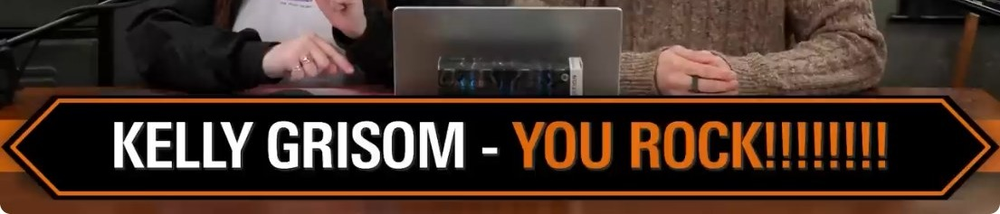](https://www.youtube.com/watch?v=a4v6pSOsC9c&amp;t=160s) |
| Danny Mercado | #513 ? The Best Mono-Colored Commanders from All Will Be One | Feb 3, 2023 | [3:16](https://www.youtube.com/watch?v=5gL8VKohPF4&amp;t=196s) | [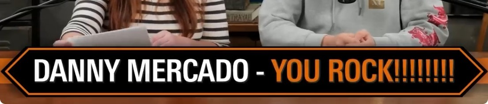](https://www.youtube.com/watch?v=5gL8VKohPF4&amp;t=196s) |
| Thomas Brooks | #512 ? The Best Multi-Colored Commanders from All Will Be One | Jan 27, 2023 | [3:43](https://www.youtube.com/watch?v=VsVloLR-cgo&amp;t=223s) | [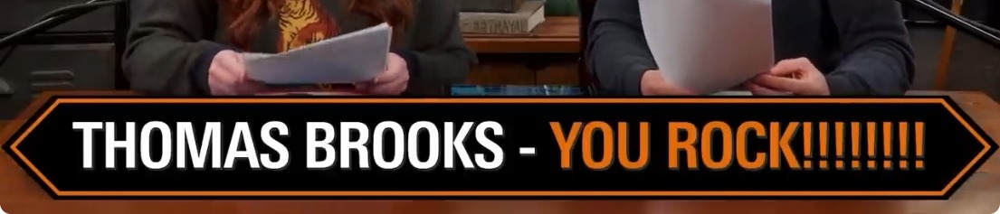](https://www.youtube.com/watch?v=VsVloLR-cgo&amp;t=223s) |
| Stuart King | #511 ? “Corrupting Influence” Budget Upgrade Guide - Phyrexia: All Will Be One | Jan 23, 2023 | [3:35](https://www.youtube.com/watch?v=21ExoXSsFvU&amp;t=215s) | [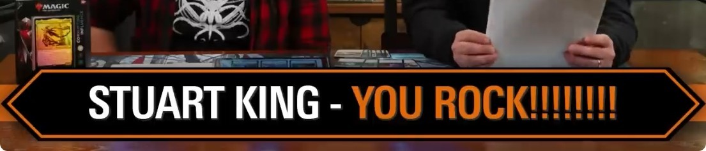](https://www.youtube.com/watch?v=21ExoXSsFvU&amp;t=215s) |
| Stephen Wagner | #510 ? “Rebellion Rising” Budget Upgrade Guide - Phyrexia: All Will Be One | Jan 20, 2023 | [4:37](https://www.youtube.com/watch?v=NFR6GxUuKqI&amp;t=277s) | [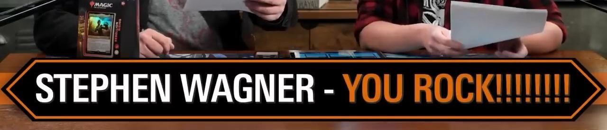](https://www.youtube.com/watch?v=NFR6GxUuKqI&amp;t=277s) |
| Kody Blatt | #509 ? “Corrupting Influence” Full Deck Reveal - All Will Be One | Jan 18, 2023 | [3:13](https://www.youtube.com/watch?v=YreZouGlA4I&amp;t=193s) | [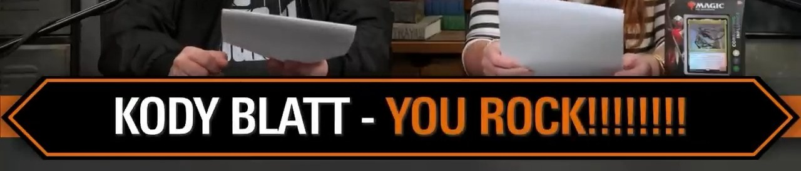](https://www.youtube.com/watch?v=YreZouGlA4I&amp;t=193s) |
| Mitch Walker | #508 ? Good Cards We Don’t Play | Jan 12, 2023 | [4:47](https://www.youtube.com/watch?v=kM3nZS_hd4o&amp;t=287s) |  |
| Eric Hanna | #507 ? Commander Bad Habits You Need to Quit | Jan 5, 2023 | [3:21](https://www.youtube.com/watch?v=20Csgb67ylE&amp;t=201s) |  |
| Tyler Owens | #506 ? MTG in 2022 - Year In Review | Dec 30, 2022 | [3:56](https://www.youtube.com/watch?v=u0AqnI-arFM&amp;t=236s) | [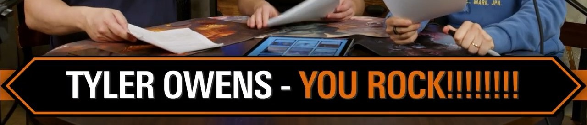](https://www.youtube.com/watch?v=u0AqnI-arFM&amp;t=236s) |
| Alvaro Gutierrez | #505 ? The Best New Commanders From Jumpstart 2022 | Dec 19, 2022 | [3:25](https://www.youtube.com/watch?v=bTRKPnIKglY&amp;t=205s) | [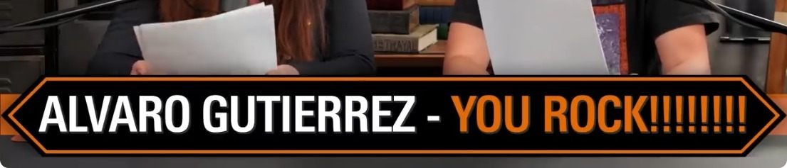](https://www.youtube.com/watch?v=bTRKPnIKglY&amp;t=205s) |
| Des1redplays | #504 ? How to Mulligan | Dec 14, 2022 | [2:31](https://www.youtube.com/watch?v=aWoEzXLUppM&amp;t=151s) | [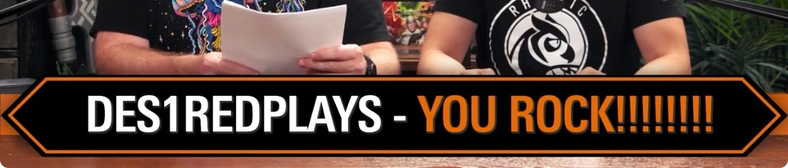](https://www.youtube.com/watch?v=aWoEzXLUppM&amp;t=151s) |
| Casey Mclara | #503 ? Cards That Matter - The Brothers War - In the 99 Analysis | Dec 8, 2022 | [4:47](https://www.youtube.com/watch?v=jN4TlMcHZNU&amp;t=287s) | [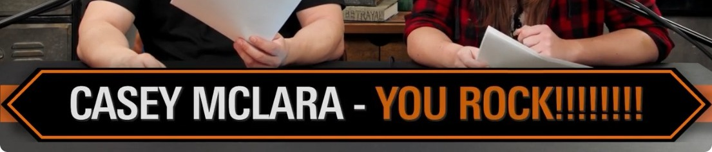](https://www.youtube.com/watch?v=jN4TlMcHZNU&amp;t=287s) |
| Dallas Roberts | #502 ? Transformers: Decepticon Commanders - The Brothers War | Dec 1, 2022 | [3:12](https://www.youtube.com/watch?v=uIgjQVq3LdE&amp;t=192s) |  |
| Abe Hazway | #501 ? Transformers: Autobot Commanders - The Brothers War | Nov 22, 2022 | [5:16](https://www.youtube.com/watch?v=PlTuYh5hXIc&amp;t=316s) | [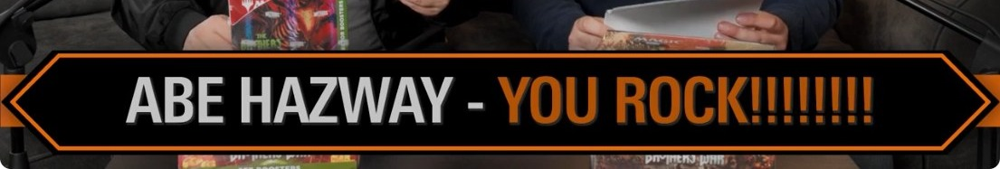](https://www.youtube.com/watch?v=PlTuYh5hXIc&amp;t=316s) |
| Brian Praamsma | #500 ? How Good Are the Meld Commanders? \| The Brothers' War | Nov 14, 2022 | [5:15](https://www.youtube.com/watch?v=2qYRuxQWcKU&amp;t=315s) |  |
| David Petracca | #499 ? The Brothers’ War - The Best Multi-Colored Commanders | Nov 9, 2022 | [3:11](https://www.youtube.com/watch?v=DTRoxd-RS-8&amp;t=191s) |  |
| Andrew Calhoun | #498 ? “Mishra’s Burnished Banner” Budget Upgrade Guide - Brothers War | Nov 3, 2022 | [4:43](https://www.youtube.com/watch?v=6rSkge558Ts&amp;t=283s) | [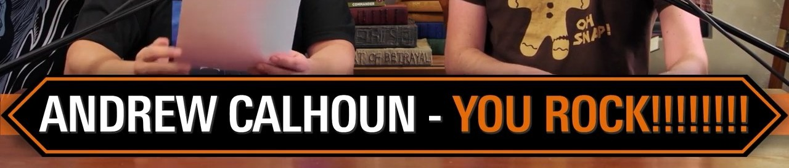](https://www.youtube.com/watch?v=6rSkge558Ts&amp;t=283s) |
| David Petracca | #497 ? “Urza’s Iron Alliance” Budget Upgrade Guide - Brothers War | Nov 1, 2022 | [2:21](https://www.youtube.com/watch?v=NICPkDlAXio&amp;t=141s) | [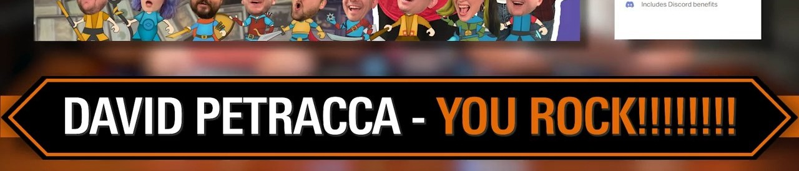](https://www.youtube.com/watch?v=NICPkDlAXio&amp;t=141s) |
| Robby Sarson | #496 ? Our Favorite Unfinity Cards | Oct 27, 2022 | [4:06](https://www.youtube.com/watch?v=1zoGTCrQmuk&amp;t=246s) |  |
| Robbie Stricklin | #495 ? The Best Cards from Warhammer 40K | Oct 18, 2022 | [4:21](https://www.youtube.com/watch?v=PHm-egAUuwo&amp;t=261s) | [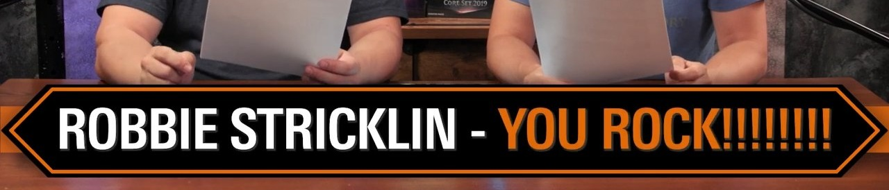](https://www.youtube.com/watch?v=PHm-egAUuwo&amp;t=261s) |
| Ricardo Pila | #494 ? “Tyranid Swarm” Budget Upgrade Guide - Warhammer 40K | Oct 14, 2022 | [5:52](https://www.youtube.com/watch?v=EqPqp8TyHnA&amp;t=352s) | [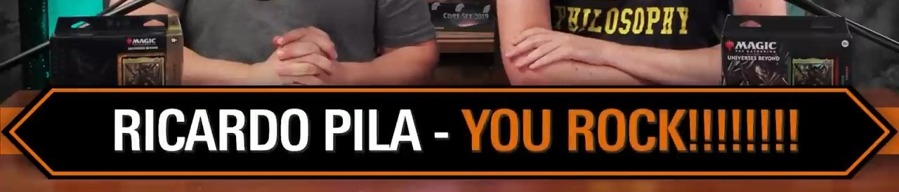](https://www.youtube.com/watch?v=EqPqp8TyHnA&amp;t=352s) |
| Joel Quinn | #492 ? “The Ruinous Powers” Budget Upgrade Guide - Warhammer 40K | Oct 10, 2022 | [2:59](https://www.youtube.com/watch?v=oWlnFBs0p7k&amp;t=179s) | [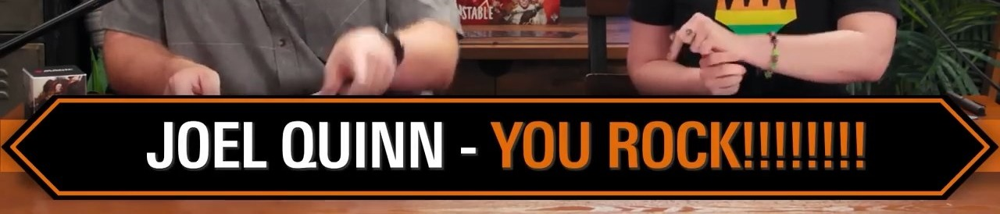](https://www.youtube.com/watch?v=oWlnFBs0p7k&amp;t=179s) |
| Nich Grayson | #491 ? “Necron Dynasties” Budget Upgrade Guide - Warhammer 40K | Oct 3, 2022 | [3:36](https://www.youtube.com/watch?v=KZaENTo8viA&amp;t=216s) | [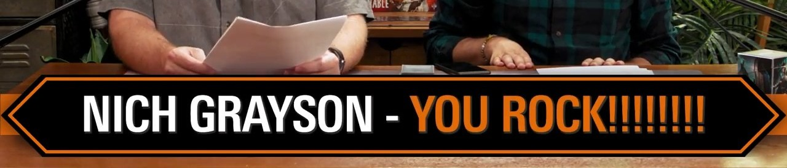](https://www.youtube.com/watch?v=KZaENTo8viA&amp;t=216s) |
| Keon Warren | #490 ? Mono-Colored & Uncommon Commanders - Dominaria United | Sep 29, 2022 | [2:59](https://www.youtube.com/watch?v=l-W7AvbhufQ&amp;t=179s) | [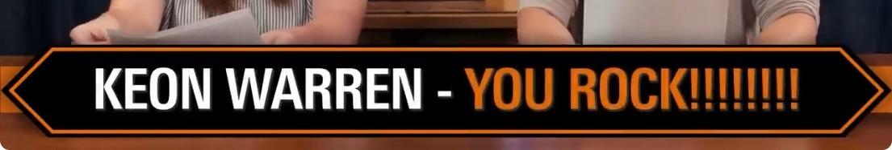](https://www.youtube.com/watch?v=l-W7AvbhufQ&amp;t=179s) |
| Wes Seigler | #489 ? Cards That Matter - Dominaria United - In the 99 Analysis | Sep 22, 2022 | [4:11](https://www.youtube.com/watch?v=XXIY8pH-NyE&amp;t=251s) | [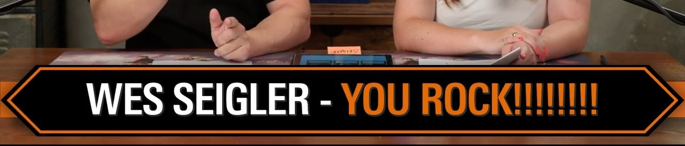](https://www.youtube.com/watch?v=XXIY8pH-NyE&amp;t=251s) |
| Shane Swope | #488 ? Box Topper Lost Legends Review (Part 2) Dominaria United | Sep 20, 2022 | [2:21](https://www.youtube.com/watch?v=3TCgV7c2si0&amp;t=141s) | [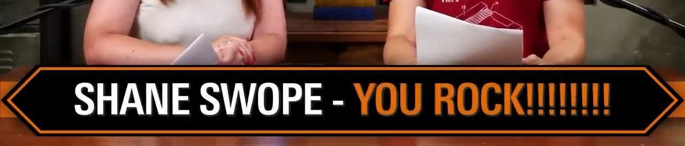](https://www.youtube.com/watch?v=3TCgV7c2si0&amp;t=141s) |
| Noah Pickens | #487 ? “Necron Dynasties” Full Deck Reveal - Warhammer 40K | Sep 15, 2022 | [5:11](https://www.youtube.com/watch?v=g2UWu8lKU5k&amp;t=311s) | [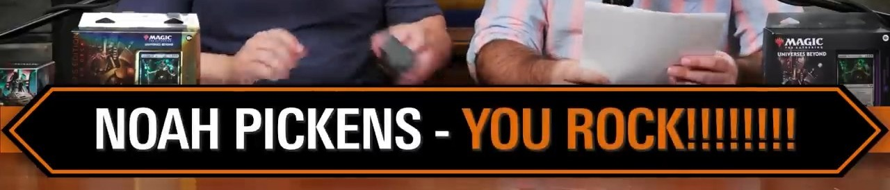](https://www.youtube.com/watch?v=g2UWu8lKU5k&amp;t=311s) |
| Scott Mandarano | #486 ? Box Topper Lost Legends Review (Part 1) Dominaria United | Sep 14, 2022 | [3:56](https://www.youtube.com/watch?v=JD6znIigKJ4&amp;t=236s) | [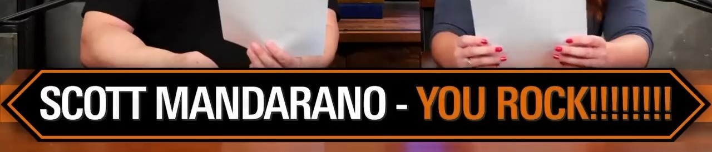](https://www.youtube.com/watch?v=JD6znIigKJ4&amp;t=236s) |
| Marc Ross | #485 ? “Painbow” Budget Precon Upgrade Guide - Dominaria United | Sep 12, 2022 | [4:31](https://www.youtube.com/watch?v=JR8tsyLRPoo&amp;t=271s) | [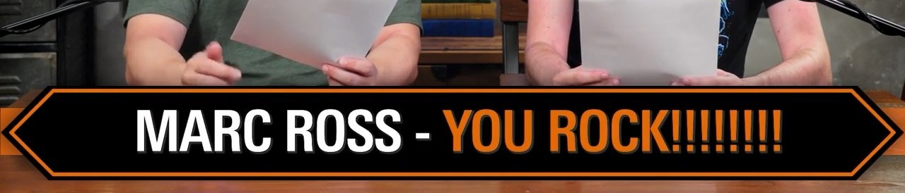](https://www.youtube.com/watch?v=JR8tsyLRPoo&amp;t=271s) |
| Grant Mason | #484 ? Dominaria United - Best Multi-colored Commanders (Part 2) | Sep 7, 2022 | [4:22](https://www.youtube.com/watch?v=GVezVQMYDi4&amp;t=262s) | [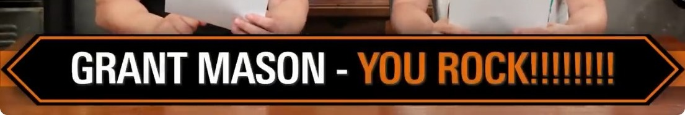](https://www.youtube.com/watch?v=GVezVQMYDi4&amp;t=262s) |
| Jonathan Ebert | #483 ? Dominaria United - Best Multicolored Commanders (Part 1) | Aug 29, 2022 | [6:13](https://www.youtube.com/watch?v=u7AnyFlDSPo&amp;t=373s) | [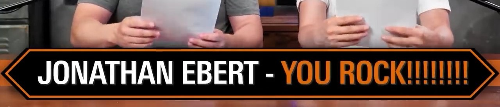](https://www.youtube.com/watch?v=u7AnyFlDSPo&amp;t=373s) |
| Sean Brown | #482 ? “Legends’ Legacy” Budget Precon Upgrade Guide - Dominaria United | Aug 23, 2022 | [4:37](https://www.youtube.com/watch?v=30DePFcGU9g&amp;t=277s) | [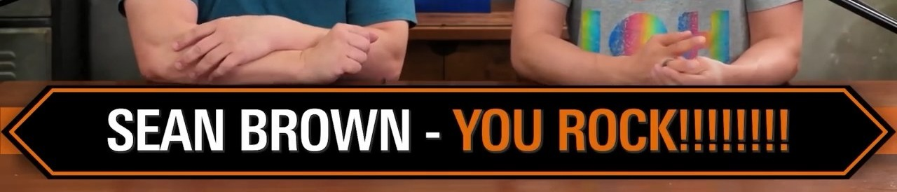](https://www.youtube.com/watch?v=30DePFcGU9g&amp;t=277s) |
| Kyle Deyette | #481 ? “Painbow” Full Deck Reveal - Dominaria United | Aug 19, 2022 | [3:01](https://www.youtube.com/watch?v=DliVsku3kJE&amp;t=181s) |  |
| Karac Rooney II | #480 ? Playing Competitive w/ Cassius Marsh | Aug 17, 2022 | [2:28](https://www.youtube.com/watch?v=y6vfTRAs63o&amp;t=148s) | [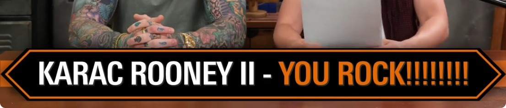](https://www.youtube.com/watch?v=y6vfTRAs63o&amp;t=148s) |
| Kristen North | #479 ? Good Cards That Make Us Salty | Aug 8, 2022 | [2:59](https://www.youtube.com/watch?v=z5XQcnQf2ks&amp;t=179s) | [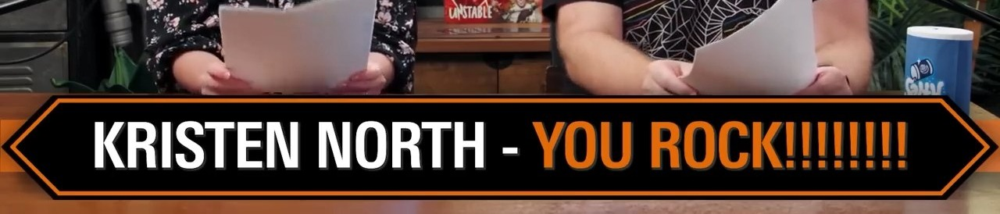](https://www.youtube.com/watch?v=z5XQcnQf2ks&amp;t=179s) |
| Devin Tuck | #478 ? "Must Have" Cards For Your Commander Collection | Aug 2, 2022 | [5:17](https://www.youtube.com/watch?v=-nDOElrvgR8&amp;t=317s) | [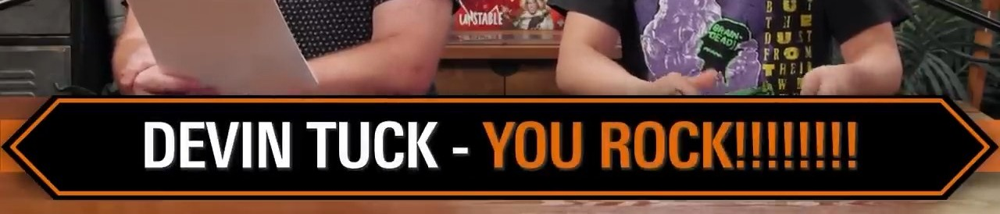](https://www.youtube.com/watch?v=-nDOElrvgR8&amp;t=317s) |
| Mark Michaud | #477 ? The Best 1-Drops in Commander (besides Sol Ring) | Jul 28, 2022 | [4:41](https://www.youtube.com/watch?v=TYmHbqObgo8&amp;t=281s) | [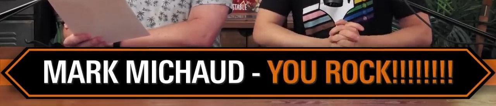](https://www.youtube.com/watch?v=TYmHbqObgo8&amp;t=281s) |
| Christopher Walker | #476 ? Is 2X2 the Highest Value Reprint Set Ever?!?! | Jul 19, 2022 | [4:46](https://www.youtube.com/watch?v=WmBnjwW_mtU&amp;t=286s) | [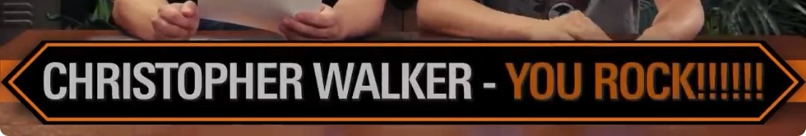](https://www.youtube.com/watch?v=WmBnjwW_mtU&amp;t=286s) |
| Ricardo Cruz | #475 ? The Most Obscure & Underrated Cards | Jul 12, 2022 | [5:07](https://www.youtube.com/watch?v=SjNaPdvbPQE&amp;t=307s) | [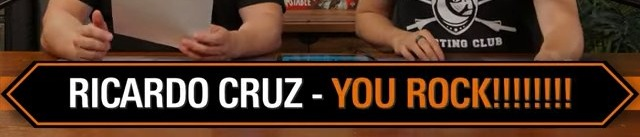](https://www.youtube.com/watch?v=SjNaPdvbPQE&amp;t=307s) |
| Alex Rouse | #474 ? “Draconic Dissent” Budget Upgrade Guide - Baldur’s Gate | Jul 7, 2022 | [2:28](https://www.youtube.com/watch?v=czSzF8FBzlg&amp;t=148s) | [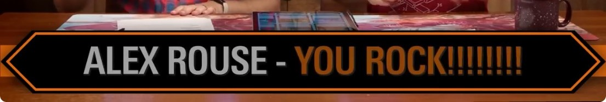](https://www.youtube.com/watch?v=czSzF8FBzlg&amp;t=148s) |
| Christopher T Shepard | #473 ? In the 99 Analysis - Baldur’s Gate | Jun 28, 2022 | [2:56](https://www.youtube.com/watch?v=dwoKpq1hMtU&amp;t=176s) | [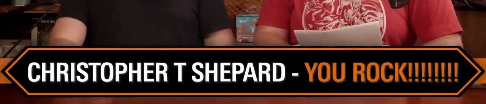](https://www.youtube.com/watch?v=dwoKpq1hMtU&amp;t=176s) |
| Alex Shaw | #471 ? “Mind Flayarrrrs” Budget Upgrade Guide - Baldur’s Gate | Jun 16, 2022 | [3:08](https://www.youtube.com/watch?v=advSNUKAVbM&amp;t=188s) | [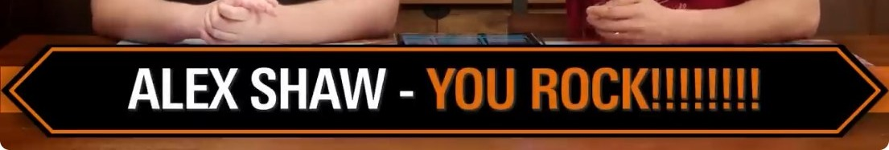](https://www.youtube.com/watch?v=advSNUKAVbM&amp;t=188s) |
| Scott Chilson | #469 ? "Exit From Exile Budget" Budget Upgrade Guide - Baldur’s Gate | Jun 6, 2022 | [2:47](https://www.youtube.com/watch?v=J1DnIDv5Gts&amp;t=167s) | [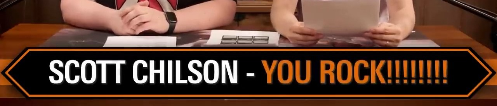](https://www.youtube.com/watch?v=J1DnIDv5Gts&amp;t=167s) |
| Chris Tabberer | #468 ? Baldur's Gate - Best Multicolored Commanders (Pt2) | Jun 2, 2022 | [3:28](https://www.youtube.com/watch?v=8UkleX_mZMM&amp;t=208s) | [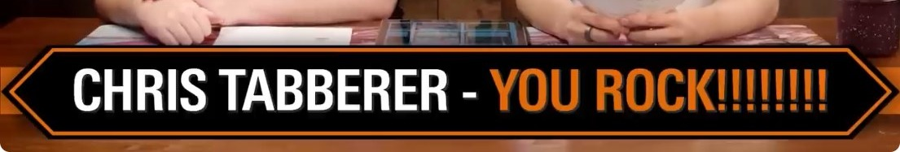](https://www.youtube.com/watch?v=8UkleX_mZMM&amp;t=208s) |
| Heather Lipsius | #467 ? “Party Time” Full Deck Reveal - Baldur's Gate | May 31, 2022 | [3:57](https://www.youtube.com/watch?v=pgvR_RlGmNQ&amp;t=237s) | [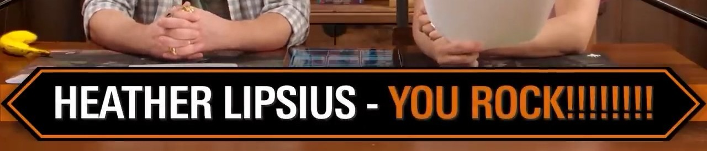](https://www.youtube.com/watch?v=pgvR_RlGmNQ&amp;t=237s) |
| Wreck Deck | #466 ? Baldur's Gate - Best Multicolored Commanders (Pt1) | May 27, 2022 | [2:45](https://www.youtube.com/watch?v=9xaOajblmsc&amp;t=165s) | [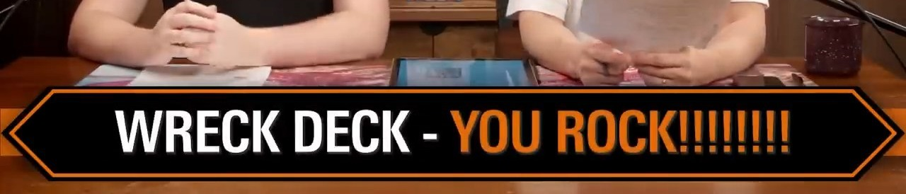](https://www.youtube.com/watch?v=9xaOajblmsc&amp;t=165s) |
| Noah Pickens | #465 ? How to Organize Your Magic Card Collection | May 24, 2022 | [3:50](https://www.youtube.com/watch?v=B6CTZTywzbo&amp;t=230s) | [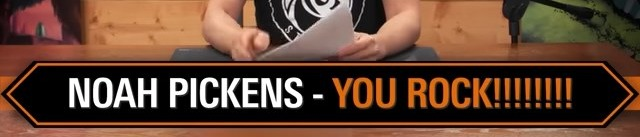](https://www.youtube.com/watch?v=B6CTZTywzbo&amp;t=230s) |
| Bobby Bickford | #464 ? Cards You’re Playing WRONG | May 18, 2022 | [5:41](https://www.youtube.com/watch?v=NNjDtl-u-rs&amp;t=341s) | [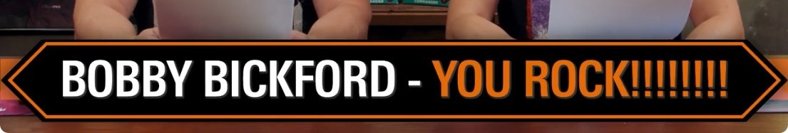](https://www.youtube.com/watch?v=NNjDtl-u-rs&amp;t=341s) |
| Tyler Wigley | #463 ? “Riveteers Rampage” Budget Upgrade Guide - New Capenna | May 13, 2022 | [2:59](https://www.youtube.com/watch?v=Ogh52RYCUm0&amp;t=179s) | [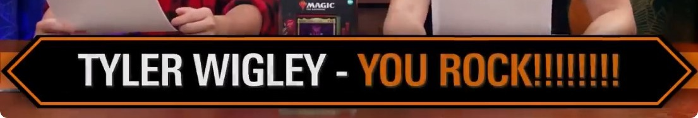](https://www.youtube.com/watch?v=Ogh52RYCUm0&amp;t=179s) |
| Bryant Whitney | #461 ? In the 99 Analysis - New Capenna | May 5, 2022 | [4:03](https://www.youtube.com/watch?v=HNceyx4L0Lc&amp;t=243s) | [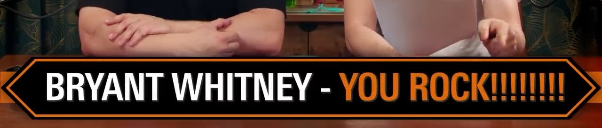](https://www.youtube.com/watch?v=HNceyx4L0Lc&amp;t=243s) |
| Lauri Lannetta | #460 ? “Bedecked Brokers” Budget Upgrade Guide - New Capenna | May 3, 2022 | [2:33](https://www.youtube.com/watch?v=ga2JC8uFl7o&amp;t=153s) | [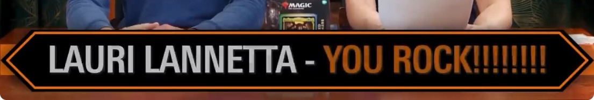](https://www.youtube.com/watch?v=ga2JC8uFl7o&amp;t=153s) |
| Jeremy Dennis | #457 ? “Cabaretti Cacophony” Budget Upgrade Guide - New Capenna | Apr 19, 2022 | [5:05](https://www.youtube.com/watch?v=yWqmMTiTAi8&amp;t=305s) | [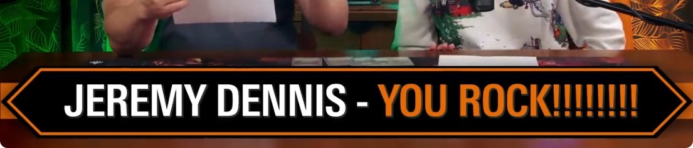](https://www.youtube.com/watch?v=yWqmMTiTAi8&amp;t=305s) |
| Zac Derenne | #456 ? “Maestros Massacre” Budget Upgrade Guide - New Capenna | Apr 18, 2022 | [4:16](https://www.youtube.com/watch?v=mCPn7j15oUY&amp;t=256s) | [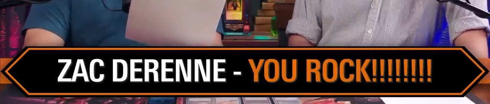](https://www.youtube.com/watch?v=mCPn7j15oUY&amp;t=256s) |
| Greg Taylor | #455 ? The Ultimate Guide to Lands | Apr 12, 2022 | [4:26](https://www.youtube.com/watch?v=Hg7nFiDNeHs&amp;t=266s) | [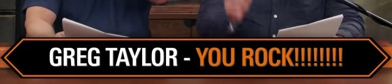](https://www.youtube.com/watch?v=Hg7nFiDNeHs&amp;t=266s) |
| Christopher Lamb | #454 ? Cards We Keep Trying To Crack | Apr 6, 2022 | [3:14](https://www.youtube.com/watch?v=RGdYUoQXnn8&amp;t=194s) | [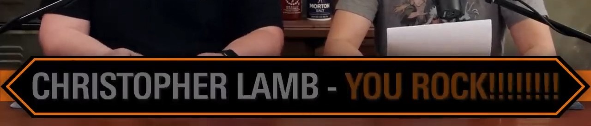](https://www.youtube.com/watch?v=RGdYUoQXnn8&amp;t=194s) |
| Broderick Hanson | #453 ? Advanced Deckbuilding: Mastering Your Mana Curve | Mar 28, 2022 | [6:31](https://www.youtube.com/watch?v=LB6HotI0ntI&amp;t=391s) | [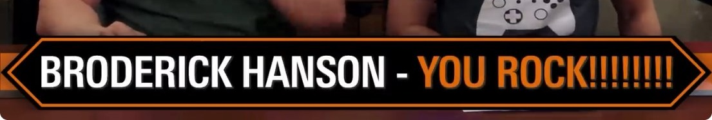](https://www.youtube.com/watch?v=LB6HotI0ntI&amp;t=391s) |
| David Urias | #452 ? How To Get Into Commander | Mar 21, 2022 | [5:23](https://www.youtube.com/watch?v=GoFgsybYKdc&amp;t=323s) | [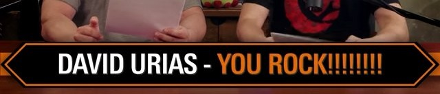](https://www.youtube.com/watch?v=GoFgsybYKdc&amp;t=323s) |
| Barry Ohnmeiss | #451 ? Our Biggest Commander Level-Up Moments | Mar 16, 2022 | [4:55](https://www.youtube.com/watch?v=DykU-eK7bz8&amp;t=295s) | [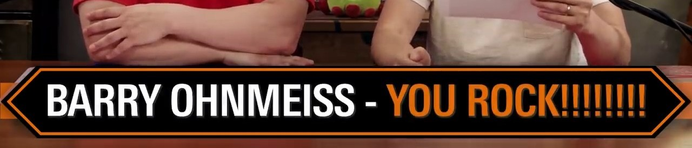](https://www.youtube.com/watch?v=DykU-eK7bz8&amp;t=295s) |
| AJ Adams | #430 ? "Vampiric Bloodline" Full Deck Reveal - Crimson Vow | Nov 8, 2021 | [3:12](https://www.youtube.com/watch?v=5mCh6QKH6-Y&amp;t=192s) | [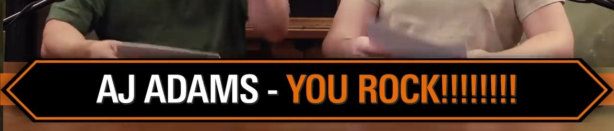](https://www.youtube.com/watch?v=5mCh6QKH6-Y&amp;t=192s) |
| Joseph Slade | #428 ? Commander Politics: Dealing with Dealers | Nov 2, 2021 | [4:34](https://www.youtube.com/watch?v=AvmMur5Lni8&amp;t=274s) |  |
| David Axford | #426 ? Decks We Built...But Hated | Oct 20, 2021 | [5:14](https://www.youtube.com/watch?v=6BpqARm8zZI&amp;t=314s) | [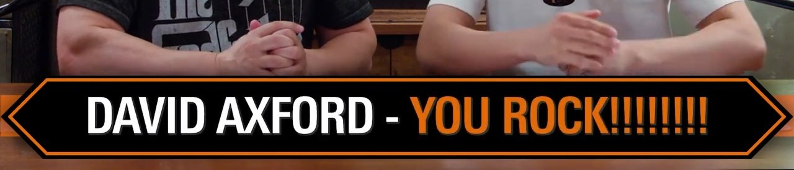](https://www.youtube.com/watch?v=6BpqARm8zZI&amp;t=314s) |
| Elias Schenk | #425 ? Midnight Hunt - In the 99 Analysis | Oct 5, 2021 | [4:15](https://www.youtube.com/watch?v=GKNcCw6_Ju8&amp;t=255s) | [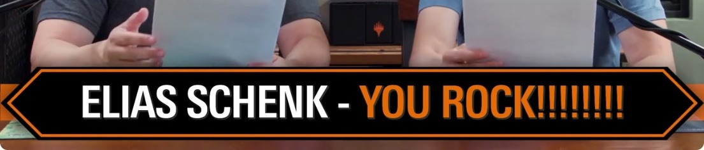](https://www.youtube.com/watch?v=GKNcCw6_Ju8&amp;t=255s) |
| Roger Porcelli | #422 ? The Mono-Colored Commanders from Midnight Hunt | Sep 17, 2021 | [6:36](https://www.youtube.com/watch?v=WNJMZauf0hw&amp;t=396s) |  |
| Jacob Smith | #420 ? Midnight Hunt - Best New Multi-Colored Commanders | Sep 10, 2021 | [4:06](https://www.youtube.com/watch?v=AhOQeftJ0_g&amp;t=246s) | [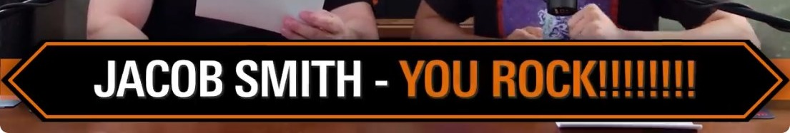](https://www.youtube.com/watch?v=AhOQeftJ0_g&amp;t=246s) |
| Kelvin Avery | #419 ? The Most Cutthroat Cards in Commander | Sep 2, 2021 | [1:50](https://www.youtube.com/watch?v=Da3cUsqxvks&amp;t=110s) | [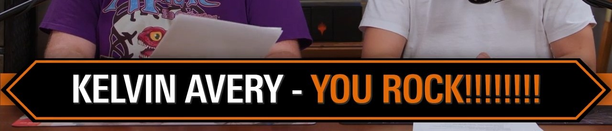](https://www.youtube.com/watch?v=Da3cUsqxvks&amp;t=110s) |
| Sebastien Bond | #418 ? How to Have More FUN in Commander | Aug 26, 2021 | [2:03](https://www.youtube.com/watch?v=oDpjyGdxsJA&amp;t=123s) | [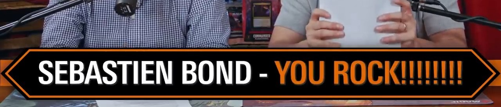](https://www.youtube.com/watch?v=oDpjyGdxsJA&amp;t=123s) |
| Max Lunden | #417 ? Upgrade Your Interaction | Aug 17, 2021 | [2:25](https://www.youtube.com/watch?v=HEKZOcV3bKU&amp;t=145s) |  |
| William Gerwig | #416 ? AFC Best New Cards | Aug 11, 2021 | [3:12](https://www.youtube.com/watch?v=GuYNc7u5ud0&amp;t=192s) | [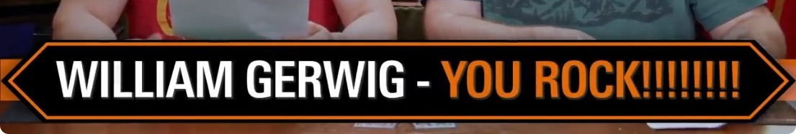](https://www.youtube.com/watch?v=GuYNc7u5ud0&amp;t=192s) |
| Jacob Heckman | #415 ? AFC New Commander Analysis | Aug 5, 2021 | [1:49](https://www.youtube.com/watch?v=hyZmrhgjIlc&amp;t=109s) |  |
| Curt Mcclure | #414 ? Bant Equipment - Budget Precon Upgrade Guide - AFC | Aug 3, 2021 | [2:14](https://www.youtube.com/watch?v=blqiTJG2Img&amp;t=134s) | [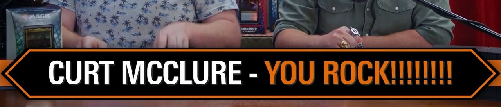](https://www.youtube.com/watch?v=blqiTJG2Img&amp;t=134s) |
| Danny Montgomery | #413 ? AFR - Green, Multicolored & Colorless Review | Jul 30, 2021 | [3:26](https://www.youtube.com/watch?v=vL7-jRXICFE&amp;t=206s) | [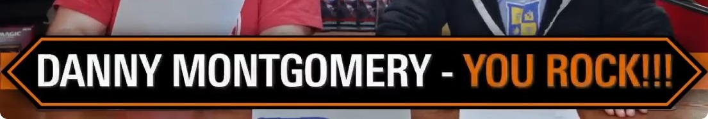](https://www.youtube.com/watch?v=vL7-jRXICFE&amp;t=206s) |
| Steve Boettjer | #412 ? AFR - Black & White Review Forgotten Realms | Jul 26, 2021 | [3:39](https://www.youtube.com/watch?v=xzsnmobugl8&amp;t=219s) | [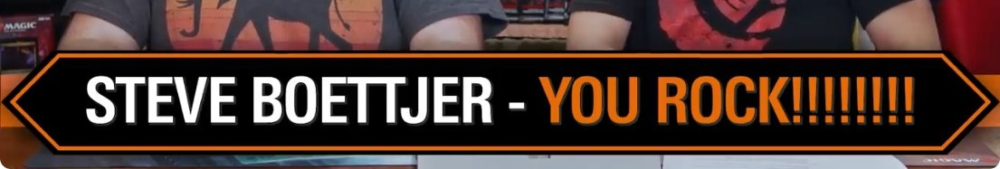](https://www.youtube.com/watch?v=xzsnmobugl8&amp;t=219s) |
| Jonathan Steinman | #411 ? AFR - Red & Blue Review - Forgotten Realms | Jul 23, 2021 | [3:14](https://www.youtube.com/watch?v=LSuPBKZoVAQ&amp;t=194s) |  |
| Jonathan Phousirith | #410 ? Rakdos Treasures - Budget Precon Upgrade Guide - AFC | Jul 19, 2021 | [5:37](https://www.youtube.com/watch?v=C1BWlypcPa4&amp;t=337s) | [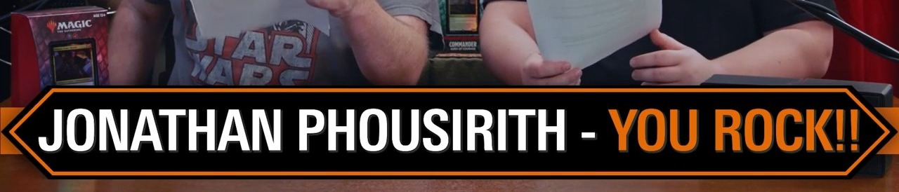](https://www.youtube.com/watch?v=C1BWlypcPa4&amp;t=337s) |
| Roxanne Rasco | #409 ? Forgotten Realms - Best New Mono Colored Commanders | Jul 16, 2021 | [4:32](https://www.youtube.com/watch?v=xOW7tUftC4o&amp;t=272s) | [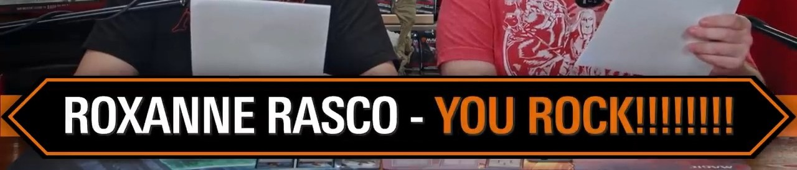](https://www.youtube.com/watch?v=xOW7tUftC4o&amp;t=272s) |
| Sam Otterbourg | #408 ? Gruul Dragons Budget Precon Upgrade Guide - AFC | Jul 14, 2021 | [4:13](https://www.youtube.com/watch?v=qZR83W0ruFI&amp;t=253s) | [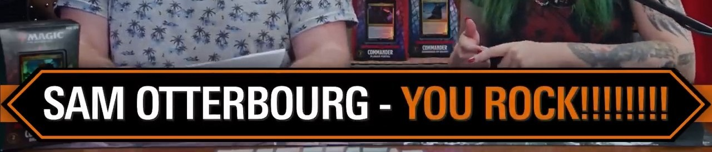](https://www.youtube.com/watch?v=qZR83W0ruFI&amp;t=253s) |
| Luis Magana | #407 ? Esper Dungeons Precon Budget Upgrade Guide - AFC | Jul 12, 2021 | [3:31](https://www.youtube.com/watch?v=Rxngk4FZcI8&amp;t=211s) | [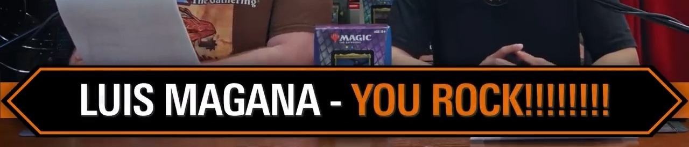](https://www.youtube.com/watch?v=Rxngk4FZcI8&amp;t=211s) |
| Mike Lopez | #406 ? Bant Equipment Full Deck Reveal - Forgotten Realms | Jul 9, 2021 | [3:15](https://www.youtube.com/watch?v=qLRkVvg2a-Y&amp;t=195s) | [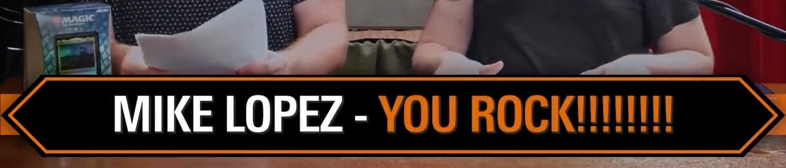](https://www.youtube.com/watch?v=qLRkVvg2a-Y&amp;t=195s) |
| Andreas Máni | #405 ? Forgotten Realms - Best New Multicolored Commanders | Jul 7, 2021 | [4:17](https://www.youtube.com/watch?v=oX3VTbifVic&amp;t=257s) | [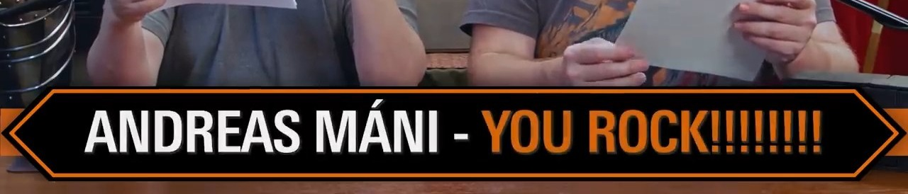](https://www.youtube.com/watch?v=oX3VTbifVic&amp;t=257s) |
| Dhruv Seth | #404 ? The Best Game Enders in Commander | Jul 1, 2021 | [1:57](https://www.youtube.com/watch?v=w7aC6TQSE8E&amp;t=117s) | [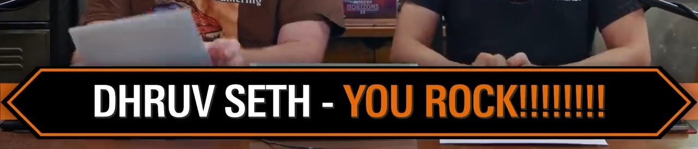](https://www.youtube.com/watch?v=w7aC6TQSE8E&amp;t=117s) |
| Tristan Sprowls | #403 ? MH2 - Green & Red Review | Jun 28, 2021 | [1:45](https://www.youtube.com/watch?v=_BWguwtx40c&amp;t=105s) | [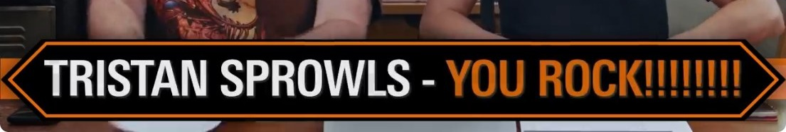](https://www.youtube.com/watch?v=_BWguwtx40c&amp;t=105s) |
| Denton Yorkirons | #402 ? MH2 - Blue & Colorless Review | Jun 21, 2021 | [3:01](https://www.youtube.com/watch?v=OvWv7Os9kg4&amp;t=181s) |  |
| Irvin Zubia | #401 ? MH2 - White, Black & Multicolored Review | Jun 15, 2021 | [2:26](https://www.youtube.com/watch?v=y8LFCjTzCOc&amp;t=146s) | [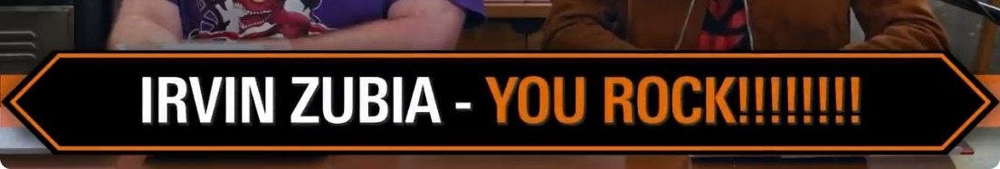](https://www.youtube.com/watch?v=y8LFCjTzCOc&amp;t=146s) |
| Jason Clissold | #399 ? The Best New Commanders from Modern Horizons 2 | Jun 3, 2021 | [3:29](https://www.youtube.com/watch?v=dvVVleUWbVo&amp;t=209s) | [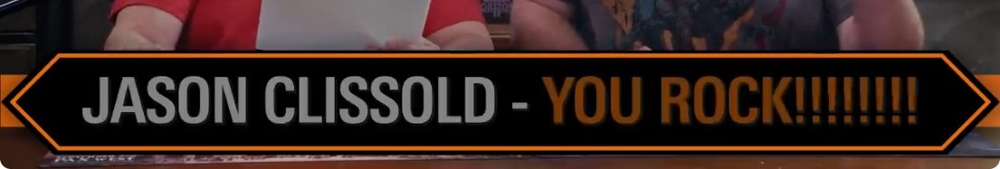](https://www.youtube.com/watch?v=dvVVleUWbVo&amp;t=209s) |
| Paul Tracey | #398 ? C21 New Commander Deep Dive (Part Two) | May 27, 2021 | [4:38](https://www.youtube.com/watch?v=KwrSB085FSw&amp;t=278s) | [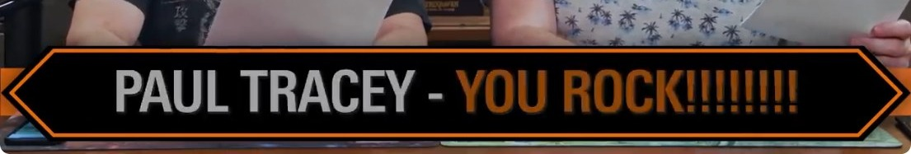](https://www.youtube.com/watch?v=KwrSB085FSw&amp;t=278s) |
| Oskar Modig | #397 ? C21 New Commander Deep Dive (Part One) | May 18, 2021 | [4:23](https://www.youtube.com/watch?v=FT4IROaDnGk&amp;t=263s) | [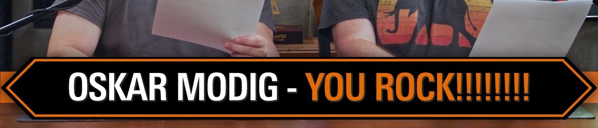](https://www.youtube.com/watch?v=FT4IROaDnGk&amp;t=263s) |
| Kelsea Smothers | #396 ? C21 New Card Analysis (Part Two) | May 14, 2021 | [2:16](https://www.youtube.com/watch?v=P1O9h5vsLmY&amp;t=136s) | [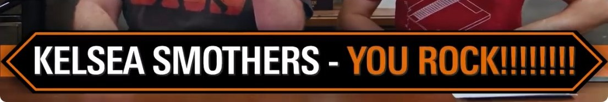](https://www.youtube.com/watch?v=P1O9h5vsLmY&amp;t=136s) |
| Daniel Woodling | #395 ? C21 New Card Analysis (Part One) | May 5, 2021 | [2:30](https://www.youtube.com/watch?v=2ajwEJ3typc&amp;t=150s) | [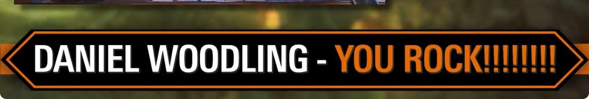](https://www.youtube.com/watch?v=2ajwEJ3typc&amp;t=150s) |
| Erick Martinez | #394 ? Witherbloom Precon - Budget Upgrade Guide | Apr 29, 2021 | [2:49](https://www.youtube.com/watch?v=2TF9wQvOzCI&amp;t=169s) | [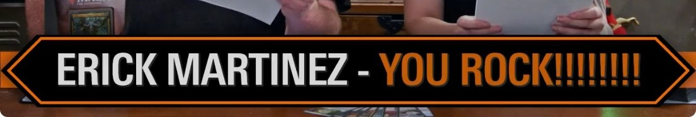](https://www.youtube.com/watch?v=2TF9wQvOzCI&amp;t=169s) |
| Ervine Gates | #393 ? Strixhaven Set Review (Part Two) | Apr 27, 2021 | [2:15](https://www.youtube.com/watch?v=q0chC-yoQ4E&amp;t=135s) | [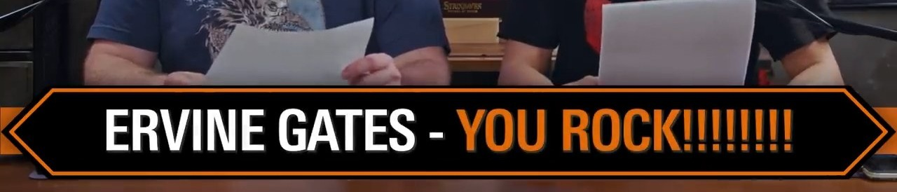](https://www.youtube.com/watch?v=q0chC-yoQ4E&amp;t=135s) |
| Tyler Cadden | #392 ? Strixhaven Set Review (Part One) | Apr 23, 2021 | [3:07](https://www.youtube.com/watch?v=c1WJs00XRfY&amp;t=187s) | [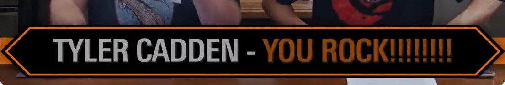](https://www.youtube.com/watch?v=c1WJs00XRfY&amp;t=187s) |
| Adam Marthaler | #391 ? Silverquill Precon - Budget Upgrade Guide | Apr 19, 2021 | [3:22](https://www.youtube.com/watch?v=EbLmvADJoug&amp;t=202s) | [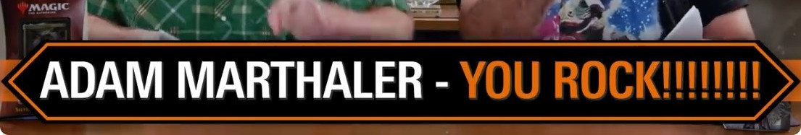](https://www.youtube.com/watch?v=EbLmvADJoug&amp;t=202s) |
| Evan Limberger | #390 ? Strixhaven Traditional Commander Review | Apr 16, 2021 | [3:44](https://www.youtube.com/watch?v=H0ue3q8FUls&amp;t=224s) | [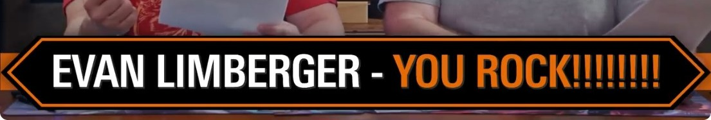](https://www.youtube.com/watch?v=H0ue3q8FUls&amp;t=224s) |
| Luis Magana | #388 ? Quandrix Precon - Budget Upgrade Guide | Apr 12, 2021 | [4:47](https://www.youtube.com/watch?v=rWaKrL5pSqA&amp;t=287s) | [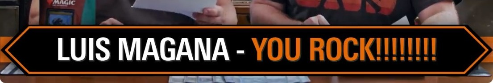](https://www.youtube.com/watch?v=rWaKrL5pSqA&amp;t=287s) |
| Kody Blatt | #387 ? Strixhaven MDFCommanders | Apr 9, 2021 | [2:37](https://www.youtube.com/watch?v=rv7O1xMNCvs&amp;t=157s) | [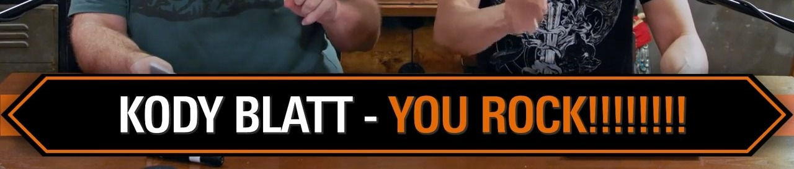](https://www.youtube.com/watch?v=rv7O1xMNCvs&amp;t=157s) |
| Andrew Whalon | #386 ? Prismari Precon - Budget Upgrade Guide | Apr 7, 2021 | [2:57](https://www.youtube.com/watch?v=hdyRJsTQfTk&amp;t=177s) | [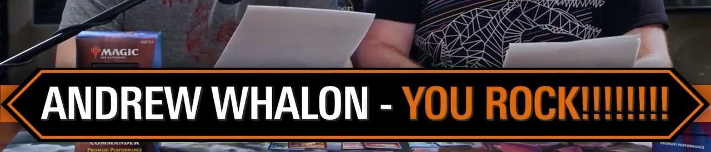](https://www.youtube.com/watch?v=hdyRJsTQfTk&amp;t=177s) |
| Brandon Swiss | #385 ? Lorehold Precon Full Deck Reveal Strixhaven | Apr 5, 2021 | [2:28](https://www.youtube.com/watch?v=ipS8qV-qiCU&amp;t=148s) | [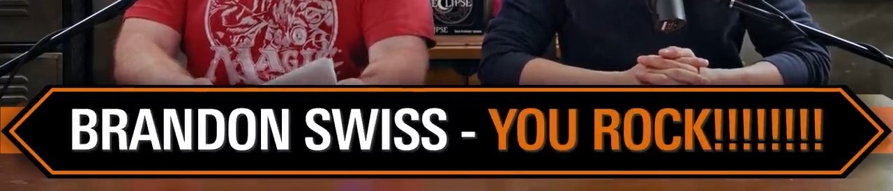](https://www.youtube.com/watch?v=ipS8qV-qiCU&amp;t=148s) |
| Kristen North | #384 ? Strixhaven Preview Card - Tempted by the Oriq | Apr 2, 2021 | [2:50](https://www.youtube.com/watch?v=TvNxaEtpxF4&amp;t=170s) |  |
| Kevin Smith | #383 ? The Most Powerful Synergies in Commander | Mar 31, 2021 | [4:07](https://www.youtube.com/watch?v=BN3-OJgW_mc&amp;t=247s) | [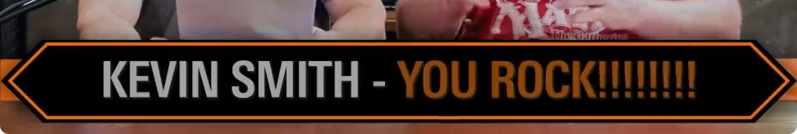](https://www.youtube.com/watch?v=BN3-OJgW_mc&amp;t=247s) |
| Brandon Swiss | #382 ? The Art of the Board Wipe | Mar 16, 2021 | [5:30](https://www.youtube.com/watch?v=ZrYvJqAuM-k&amp;t=330s) | [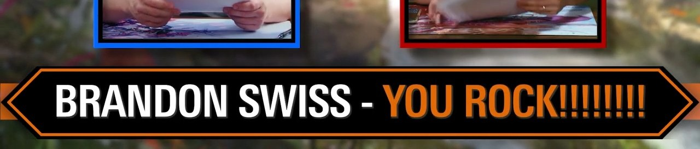](https://www.youtube.com/watch?v=ZrYvJqAuM-k&amp;t=330s) |
| Mick Bergeron | #379 ? The NEW Commander Deck Building Template | Mar 2, 2021 | [1:58](https://www.youtube.com/watch?v=3K9PEeLG_6M&amp;t=118s) | [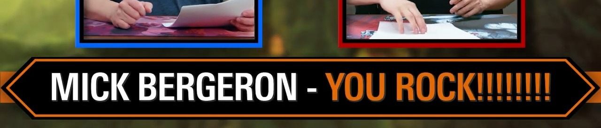](https://www.youtube.com/watch?v=3K9PEeLG_6M&amp;t=118s) |
| Tim Langermann | #378 ? Azorius "Phantom Premonition" Budget Upgrade | Feb 23, 2021 | [3:59](https://www.youtube.com/watch?v=Jxng3koUR5o&amp;t=239s) | [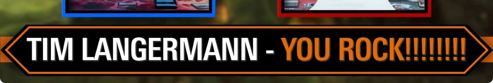](https://www.youtube.com/watch?v=Jxng3koUR5o&amp;t=239s) |
| Keegan Genie | #377 ? Golgari "Elven Empire" Budget Upgrade Guide | Feb 15, 2021 | [4:10](https://www.youtube.com/watch?v=3D_tsJsnG9A&amp;t=250s) | [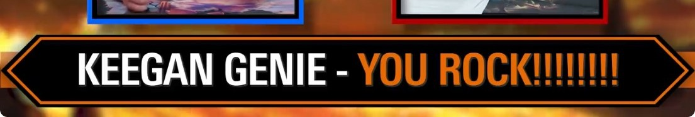](https://www.youtube.com/watch?v=3D_tsJsnG9A&amp;t=250s) |
| Jacob Pratt | #376 ? Kaldheim Set Review | Feb 10, 2021 | [2:52](https://www.youtube.com/watch?v=ZjWR90dc6YI&amp;t=172s) | [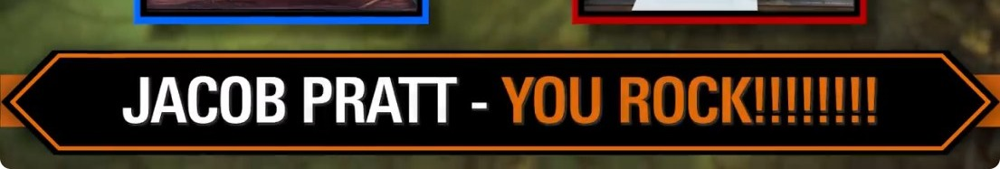](https://www.youtube.com/watch?v=ZjWR90dc6YI&amp;t=172s) |
| Josh Garza | #375 ? Kaldheim - Traditional Commanders | Feb 1, 2021 | [3:31](https://www.youtube.com/watch?v=cv4bMZd6e2w&amp;t=211s) | [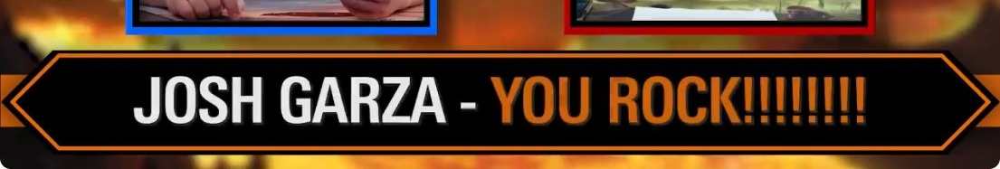](https://www.youtube.com/watch?v=cv4bMZd6e2w&amp;t=211s) |
| Jeff Mobley | #374 ? Kaldheim MDFCommanders | Jan 27, 2021 | [4:51](https://www.youtube.com/watch?v=VCr6GstBLpk&amp;t=291s) | [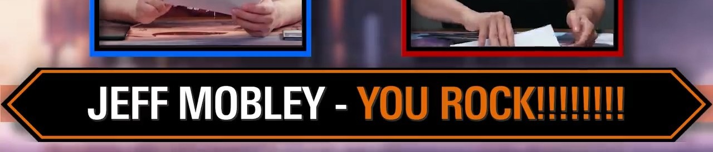](https://www.youtube.com/watch?v=VCr6GstBLpk&amp;t=291s) |
| Nick Genovese | #373 ? Life Lessons Learned from Commander | Jan 19, 2021 | [4:24](https://www.youtube.com/watch?v=iqV6Ytnzn4c&amp;t=264s) |  |
| Brendon Nguyen | #372 ? Introduction to Commander Deck Building | Jan 13, 2021 | [4:12](https://www.youtube.com/watch?v=_W4a25ty1Ao&amp;t=252s) | [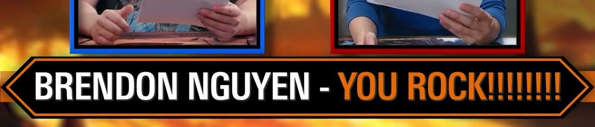](https://www.youtube.com/watch?v=_W4a25ty1Ao&amp;t=252s) |
| Hayden Steele | #371 ? Was the "Year of Commander" a Success? | Jan 7, 2021 | [3:55](https://www.youtube.com/watch?v=VGWVgEfEpSQ&amp;t=235s) | [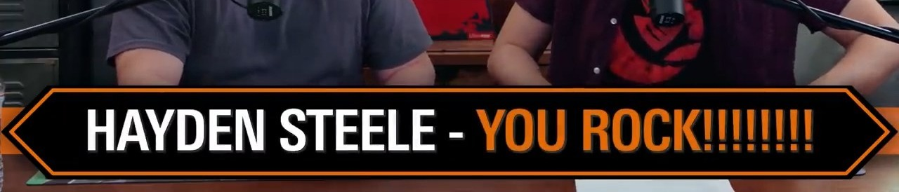](https://www.youtube.com/watch?v=VGWVgEfEpSQ&amp;t=235s) |
| Seth Hellenbrand | #370 ? Commander Legends - New Card Analysis (Part 2) | Dec 29, 2020 | [4:01](https://www.youtube.com/watch?v=OmZPZOB4-_U&amp;t=241s) | [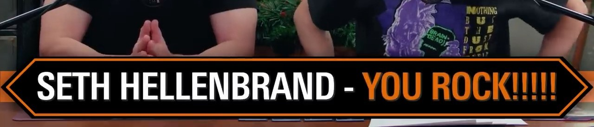](https://www.youtube.com/watch?v=OmZPZOB4-_U&amp;t=241s) |
| Paul Dyson | #369 ? Commander Legends - New Card Analysis (Part 1) | Dec 23, 2020 | [4:03](https://www.youtube.com/watch?v=CrWXs5KQo0I&amp;t=243s) |  |
| Marcel Prinsloo | #368 ? Blue Partner Review - Commander Legends | Dec 15, 2020 | [3:33](https://www.youtube.com/watch?v=_p0SBuCVb84&amp;t=213s) | [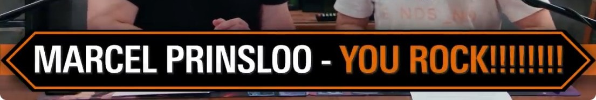](https://www.youtube.com/watch?v=_p0SBuCVb84&amp;t=213s) |
| Nick Campbell | #367 ? Black Partner Review - Commander Legends | Dec 10, 2020 | [3:36](https://www.youtube.com/watch?v=cYRom4Yex6w&amp;t=216s) | [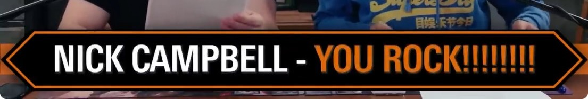](https://www.youtube.com/watch?v=cYRom4Yex6w&amp;t=216s) |
| Elijah McGill | #366 ? Green Partner Review - Commander Legends | Dec 7, 2020 | [3:40](https://www.youtube.com/watch?v=Q2XZ369bRkk&amp;t=220s) | [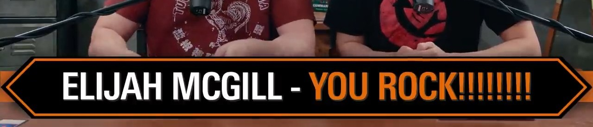](https://www.youtube.com/watch?v=Q2XZ369bRkk&amp;t=220s) |
| Spencer Cubberly | #365 ? Simic Landfall "Reap the Tides" Budget Upgrade Guide | Dec 3, 2020 | [2:36](https://www.youtube.com/watch?v=ndBshxnDIC4&amp;t=156s) | [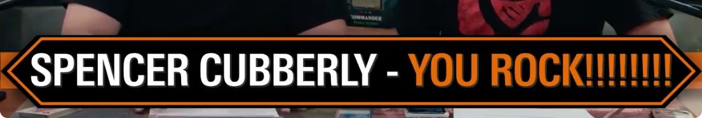](https://www.youtube.com/watch?v=ndBshxnDIC4&amp;t=156s) |
| Taisha Garcia | #364 ? Boros Equipment "Arm for Battle" Budget Upgrade Guide | Nov 23, 2020 | [3:51](https://www.youtube.com/watch?v=uu6Bdv_aIrs&amp;t=231s) |  |
| Logan Hamm | #363 ? White Partner Review - Commander Legends | Nov 16, 2020 | [3:12](https://www.youtube.com/watch?v=XtZLq8TEmEU&amp;t=192s) | [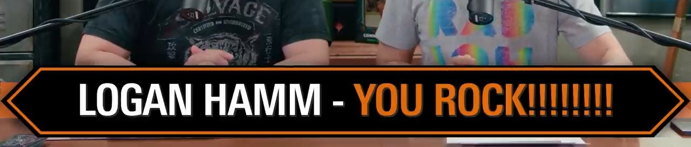](https://www.youtube.com/watch?v=XtZLq8TEmEU&amp;t=192s) |
| Isaiah Kahler | #362 ? Red Partner Review - Commander Legends | Nov 12, 2020 | [4:01](https://www.youtube.com/watch?v=xSovYJURG40&amp;t=241s) | [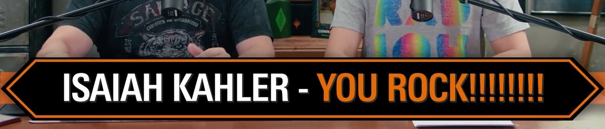](https://www.youtube.com/watch?v=xSovYJURG40&amp;t=241s) |
| Robert Negrete | #361 ? Best New Solo Commanders from CMR (Part 2) | Nov 10, 2020 | [4:12](https://www.youtube.com/watch?v=BhwEa-jS7AE&amp;t=252s) |  |
| Dennis Savetun | #360 ? Commander Legends - Are These Design Mistakes? | Nov 7, 2020 | [1:45](https://www.youtube.com/watch?v=hRcpRl4R6Fc&amp;t=105s) | [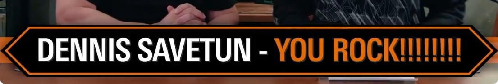](https://www.youtube.com/watch?v=hRcpRl4R6Fc&amp;t=105s) |
| Verita Raizel | #359 ? Best New Solo Commanders from CMR (Part 1) | Nov 5, 2020 | [4:29](https://www.youtube.com/watch?v=4_8Y_hxCADw&amp;t=269s) | [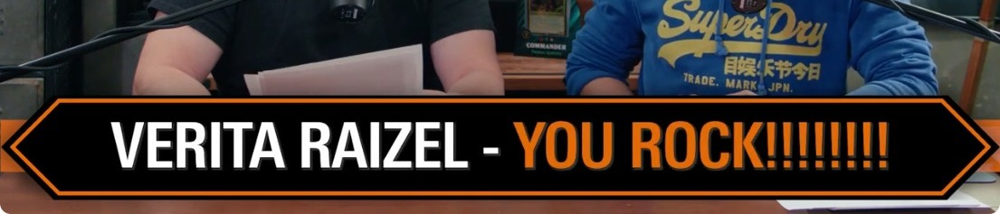](https://www.youtube.com/watch?v=4_8Y_hxCADw&amp;t=269s) |
| Dakota Collins | #358 ? Decks Everyone Should Build (At Least Once) | Nov 3, 2020 | [4:49](https://www.youtube.com/watch?v=BSAWf0rLe3s&amp;t=289s) | [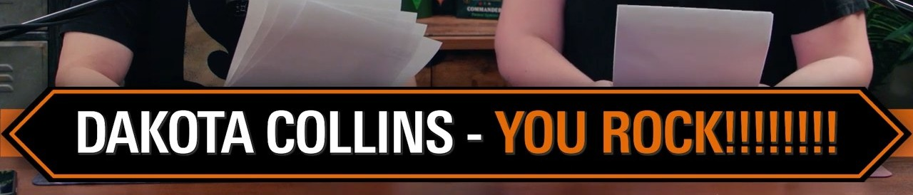](https://www.youtube.com/watch?v=BSAWf0rLe3s&amp;t=289s) |
| Brett Merkes | #357 ? Commander Legends Preview Card(s) | Oct 29, 2020 | [3:48](https://www.youtube.com/watch?v=Yc_clSPaPyA&amp;t=228s) | [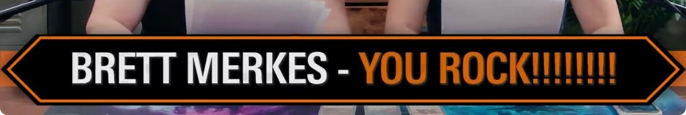](https://www.youtube.com/watch?v=Yc_clSPaPyA&amp;t=228s) |
| Daniel Jarabah | #356 ? Halloween Hot Takes | Oct 27, 2020 | [2:55](https://www.youtube.com/watch?v=-NWmnh19toU&amp;t=175s) |  |
| Joe Greenwood | #355 ? Cards That Aren't Good Enough (Anymore) | Oct 21, 2020 | [4:04](https://www.youtube.com/watch?v=0Z9qaRJFuVA&amp;t=244s) | [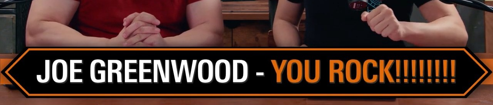](https://www.youtube.com/watch?v=0Z9qaRJFuVA&amp;t=244s) |
| August Undin | #354 ? Walking Dead Secret Lair: EXPOSED | Oct 14, 2020 | [3:32](https://www.youtube.com/watch?v=9Mq4lEB3z-4&amp;t=212s) | [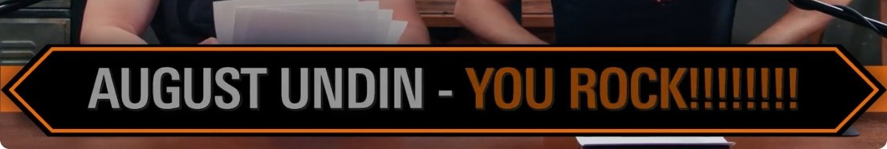](https://www.youtube.com/watch?v=9Mq4lEB3z-4&amp;t=212s) |
| Nicolas Larranaga | #353 ? Game Knights Deck Talks - Akiri & Phylath | Oct 7, 2020 | [5:27](https://www.youtube.com/watch?v=jajh9x0_3tI&amp;t=327s) | [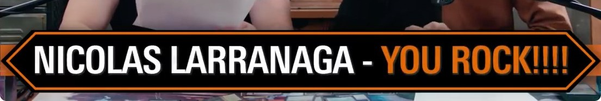](https://www.youtube.com/watch?v=jajh9x0_3tI&amp;t=327s) |
| Bobby Ens | #352 ? Are MDFC's New Commander Staples | Sep 29, 2020 | [3:44](https://www.youtube.com/watch?v=WziX_aqdGeU&amp;t=224s) | [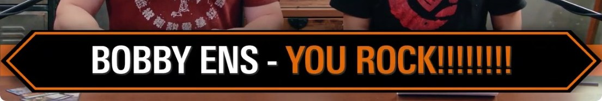](https://www.youtube.com/watch?v=WziX_aqdGeU&amp;t=224s) |
| Nat Thompson | #351 ? Zendikar Rising Set Review | Sep 21, 2020 | [3:53](https://www.youtube.com/watch?v=_R61_iFXisE&amp;t=233s) | [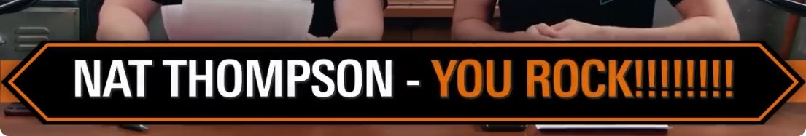](https://www.youtube.com/watch?v=_R61_iFXisE&amp;t=233s) |
| Wyatt Drake | #350 ? The Best New Commanders from Zendikar Rising | Sep 16, 2020 | [3:52](https://www.youtube.com/watch?v=yP1K9p33g0w&amp;t=232s) | [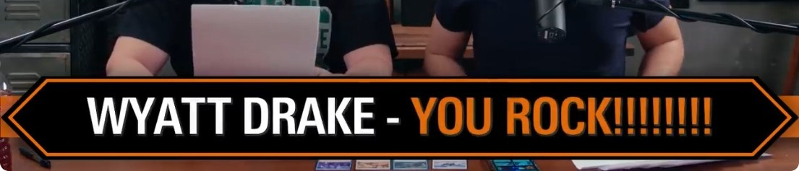](https://www.youtube.com/watch?v=yP1K9p33g0w&amp;t=232s) |
| Jonas Turner | #349 ? Rogue Tribal "Sneak Attack" Budget Upgrade Guide | Sep 11, 2020 | [4:21](https://www.youtube.com/watch?v=rEVzq9BFAVI&amp;t=261s) | [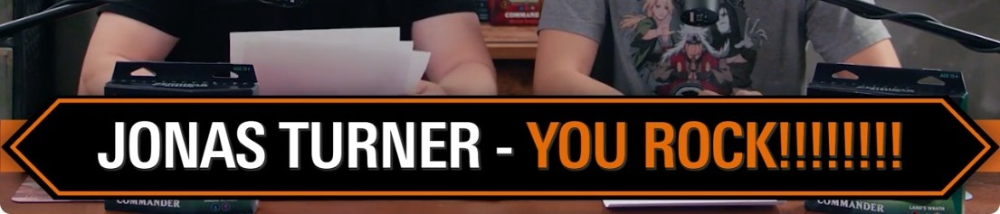](https://www.youtube.com/watch?v=rEVzq9BFAVI&amp;t=261s) |
| Simon Wellsted | #348 ? Naya Landfall "Land's Wrath" Budget Upgrade Guide | Sep 10, 2020 | [4:49](https://www.youtube.com/watch?v=SpQ6sGkWTcA&amp;t=289s) | [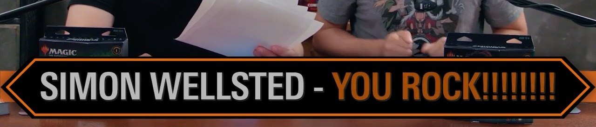](https://www.youtube.com/watch?v=SpQ6sGkWTcA&amp;t=289s) |
| Alexander Juliano | #347 ? ROGUE TRIBAL "Sneak Attack" ZNR Full Deck Reveal | Sep 9, 2020 | [5:32](https://www.youtube.com/watch?v=EkE_Hyyxhoc&amp;t=332s) | [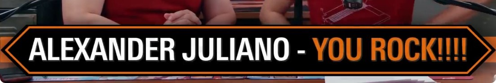](https://www.youtube.com/watch?v=EkE_Hyyxhoc&amp;t=332s) |
| Andreas Máni | #346 ? The Mulan Episode! Deck Tech + Giveaways | Sep 2, 2020 | [6:56](https://www.youtube.com/watch?v=DuasEh88Rxc&amp;t=416s) | [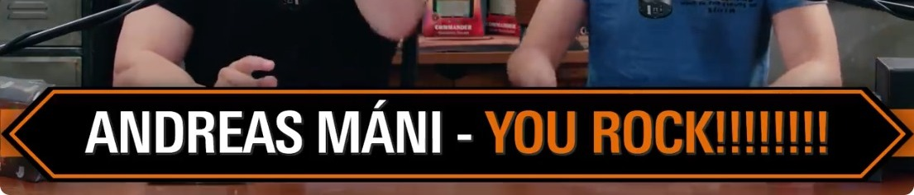](https://www.youtube.com/watch?v=DuasEh88Rxc&amp;t=416s) |
| Marcos Luevano | #345 ? Stopping the Opponent from Winning | Aug 26, 2020 | [7:25](https://www.youtube.com/watch?v=bACV94alOuM&amp;t=445s) | [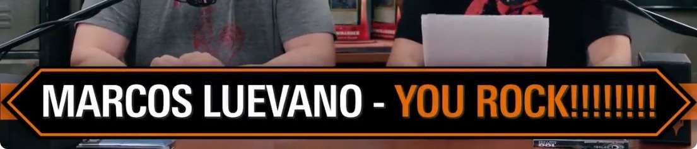](https://www.youtube.com/watch?v=bACV94alOuM&amp;t=445s) |
| Levi Hamer | #344 ? How To Make Your Decks Unique | Aug 20, 2020 | [5:04](https://www.youtube.com/watch?v=HjzPu9FLVmo&amp;t=304s) | [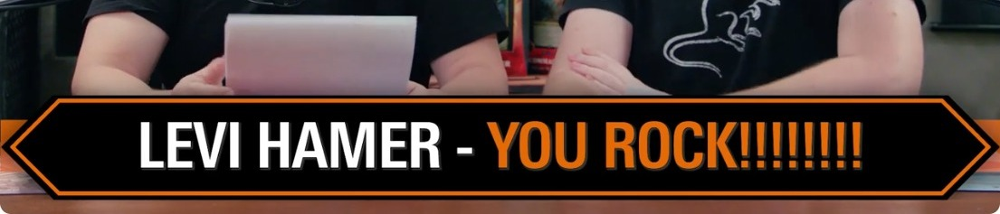](https://www.youtube.com/watch?v=HjzPu9FLVmo&amp;t=304s) |
| Alison Wilcox | #343 ? The Complete Guide to Card Draw | Aug 3, 2020 | [3:59](https://www.youtube.com/watch?v=L57DvLqmxLw&amp;t=239s) |  |
| Samuel Mcleod | #342 ? Double Masters Preview Card(s) + Extra Turns Game Analysis | Jul 27, 2020 | [3:04](https://www.youtube.com/watch?v=kNMs32ahSE4&amp;t=184s) | [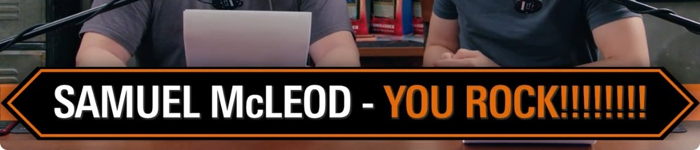](https://www.youtube.com/watch?v=kNMs32ahSE4&amp;t=184s) |
| Jamie Edelen | #341 ? The Truth About Working With WotC - Commander Convos: The Professor | Jul 22, 2020 | [2:18](https://www.youtube.com/watch?v=pDT-4-mDkjo&amp;t=138s) | [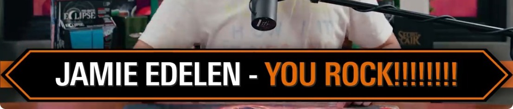](https://www.youtube.com/watch?v=pDT-4-mDkjo&amp;t=138s) |
| Taylor Safford | #340 ? Jumpstart: Most Powerful Cards | Jul 15, 2020 | [3:28](https://www.youtube.com/watch?v=CCwAv0yg8is&amp;t=208s) | [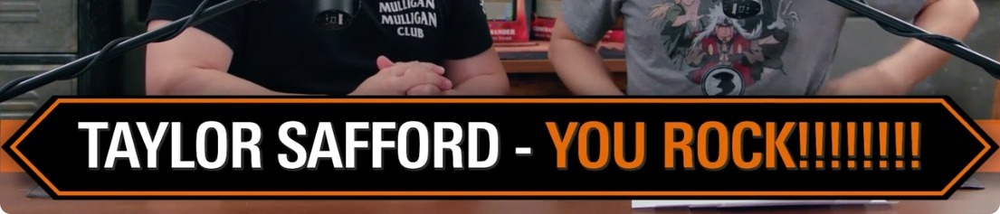](https://www.youtube.com/watch?v=CCwAv0yg8is&amp;t=208s) |
| Heather Phelps | #339 ? The Best New Commanders from Jumpstart | Jun 29, 2020 | [3:28](https://www.youtube.com/watch?v=YmQkZfi5WxI&amp;t=208s) | [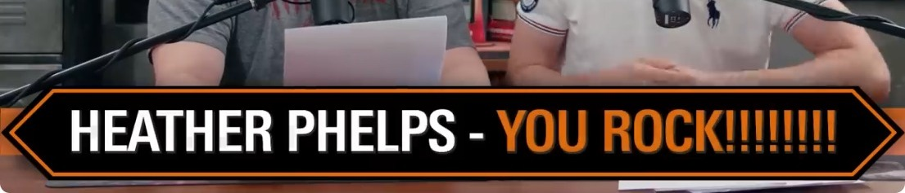](https://www.youtube.com/watch?v=YmQkZfi5WxI&amp;t=208s) |
| Jayden Holley | #338 ? M21 Set Review - Part Two | Jun 25, 2020 | [3:36](https://www.youtube.com/watch?v=s--h9IItl8g&amp;t=216s) | [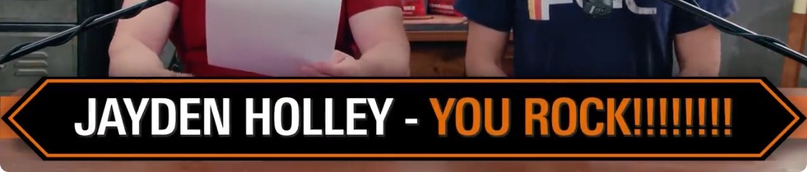](https://www.youtube.com/watch?v=s--h9IItl8g&amp;t=216s) |
| Kyle Carrasco | #337 ? M21 Set Review - Part One | Jun 23, 2020 | [3:34](https://www.youtube.com/watch?v=_RyEzaHThrY&amp;t=214s) | [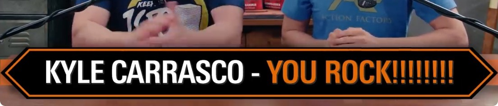](https://www.youtube.com/watch?v=_RyEzaHThrY&amp;t=214s) |
| Karl Isensee | #336 ? The Best New Commanders from M21 | Jun 18, 2020 | [4:05](https://www.youtube.com/watch?v=T2sFaOgxNhQ&amp;t=245s) | [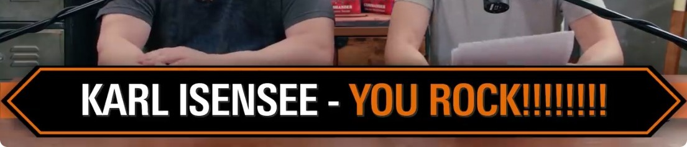](https://www.youtube.com/watch?v=T2sFaOgxNhQ&amp;t=245s) |
| Austin Breyman | #335 ? Commander Mythbusters | Jun 11, 2020 | [4:01](https://www.youtube.com/watch?v=Pr91Crzl7DI&amp;t=241s) |  |
| Phil Wong | #333 ? M21 Preview Card - Chromatic Orrery | Jun 5, 2020 | [8:41](https://www.youtube.com/watch?v=MkukDIHnrBk&amp;t=521s) | [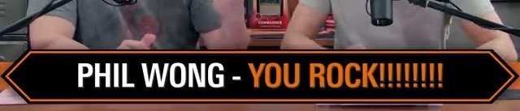](https://www.youtube.com/watch?v=MkukDIHnrBk&amp;t=521s) |
| Chris Doucette | #332 ? Should WotC Print Problematic Cards? | Jun 2, 2020 | [4:24](https://www.youtube.com/watch?v=5hPU1eNxWis&amp;t=264s) | [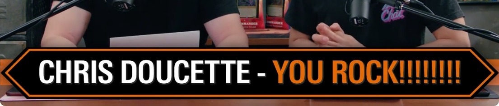](https://www.youtube.com/watch?v=5hPU1eNxWis&amp;t=264s) |
| Rowdy Gray | #331 ? Pako & Haldan - Budget Deck Tech | May 26, 2020 | [4:37](https://www.youtube.com/watch?v=rtfqJjLbADA&amp;t=277s) | [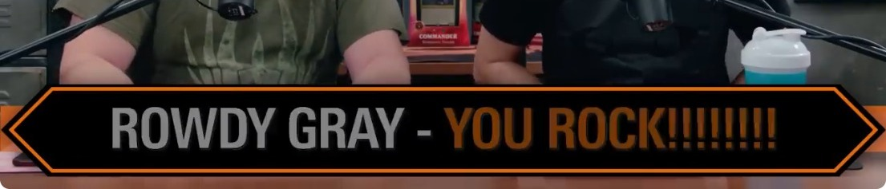](https://www.youtube.com/watch?v=rtfqJjLbADA&amp;t=277s) |
| Shannon Pilato | #330 ? Obosh - Deck Tech | May 21, 2020 | [3:59](https://www.youtube.com/watch?v=_U8YEzosz2E&amp;t=239s) | [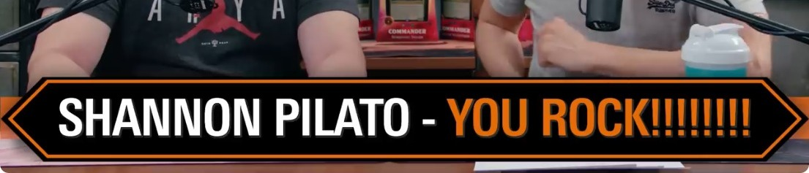](https://www.youtube.com/watch?v=_U8YEzosz2E&amp;t=239s) |
| Jordan Kiffmeyer | #329 ? Ikoria: Lair of Behemoths - Set Review | May 11, 2020 | [2:58](https://www.youtube.com/watch?v=51IvO2U_WKA&amp;t=178s) | [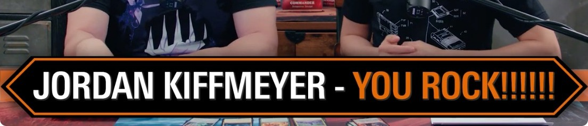](https://www.youtube.com/watch?v=51IvO2U_WKA&amp;t=178s) |
| Phillip Mccreless | #328 ? The Best New Commanders from Ikoria | May 5, 2020 | [2:48](https://www.youtube.com/watch?v=EncOrEf2fxU&amp;t=168s) | [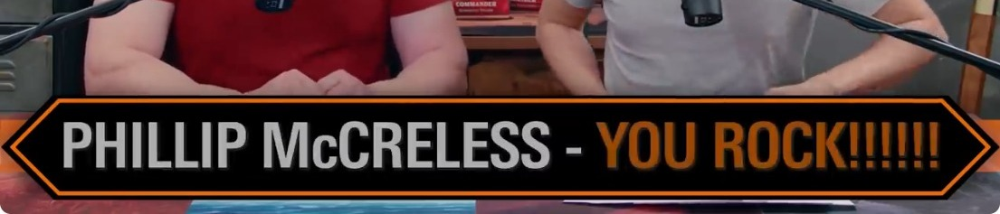](https://www.youtube.com/watch?v=EncOrEf2fxU&amp;t=168s) |
| Tyler Metully-Stone | #327 ? Ikoria - New Mechanics & Rules Breakdown | Apr 28, 2020 | [3:22](https://www.youtube.com/watch?v=vHNqIjxMYhQ&amp;t=202s) | [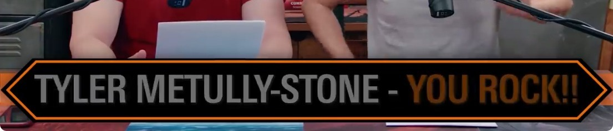](https://www.youtube.com/watch?v=vHNqIjxMYhQ&amp;t=202s) |
| Kyle Carrasco | #326 ? C20 - New Card Analysis | Apr 23, 2020 | [3:20](https://www.youtube.com/watch?v=5aXNLpibQIs&amp;t=200s) | [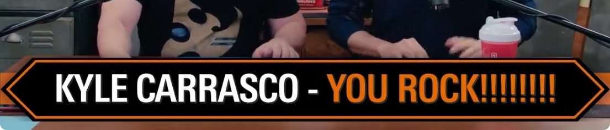](https://www.youtube.com/watch?v=5aXNLpibQIs&amp;t=200s) |
| Hank Newton | #325 ? The Best New Commanders from C20 | Apr 17, 2020 | [3:15](https://www.youtube.com/watch?v=q5nF14sk_X8&amp;t=195s) | [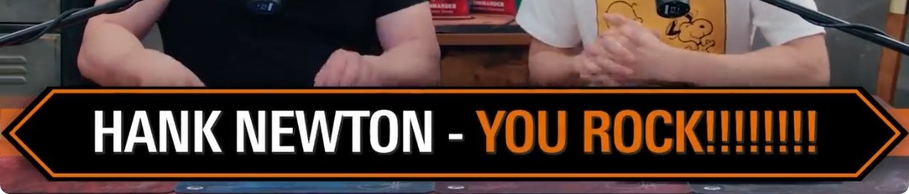](https://www.youtube.com/watch?v=q5nF14sk_X8&amp;t=195s) |
| Ethan Pie | #324 ? Abzan Ability Counters - Precon Upgrade Guide \| C20 | Apr 15, 2020 | [3:34](https://www.youtube.com/watch?v=9Y5Wms1gMaA&amp;t=214s) | [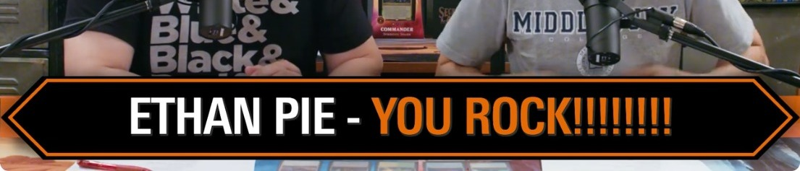](https://www.youtube.com/watch?v=9Y5Wms1gMaA&amp;t=214s) |
| Joe Lussier | #323 ? Sultai Mutate - Precon Upgrade Guide \| C20 | Apr 13, 2020 | [5:43](https://www.youtube.com/watch?v=oMCG4vAIGLs&amp;t=343s) | [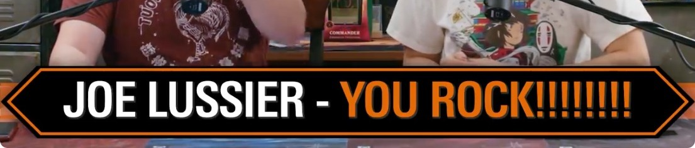](https://www.youtube.com/watch?v=oMCG4vAIGLs&amp;t=343s) |
| Sean Skinner | #322 ? Jeskai Cycling - Precon Upgrade Guide \| C20 | Apr 10, 2020 | [2:46](https://www.youtube.com/watch?v=z_Ac-5U6VLE&amp;t=166s) | [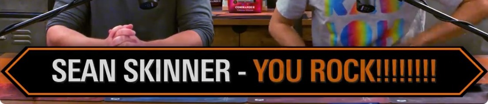](https://www.youtube.com/watch?v=z_Ac-5U6VLE&amp;t=166s) |
| Josh Garza | #321 ? Mardu Humans- Precon Upgrade Guide \| C20 | Apr 9, 2020 | [3:54](https://www.youtube.com/watch?v=owkJUTvc1tQ&amp;t=234s) | [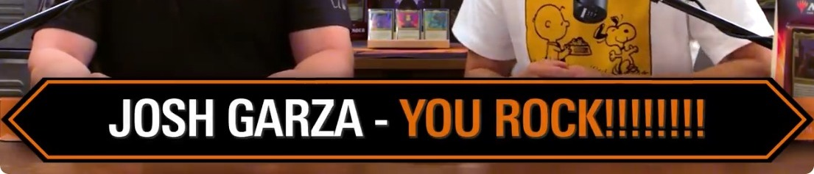](https://www.youtube.com/watch?v=owkJUTvc1tQ&amp;t=234s) |
| Emiel Sondag | #320 ? Temur Instants Matter - Precon Upgrade Guide \| C20 | Apr 7, 2020 | [3:45](https://www.youtube.com/watch?v=VzcVuJ4ZWtk&amp;t=225s) | [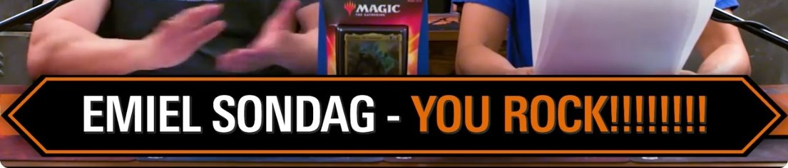](https://www.youtube.com/watch?v=VzcVuJ4ZWtk&amp;t=225s) |
| Buck Wilcox | #319 ? JESKAI CYCLING "Timeless Wisdom" C20 Full Deck Reveal | Apr 6, 2020 | [3:25](https://www.youtube.com/watch?v=ci414DwWh9o&amp;t=205s) | [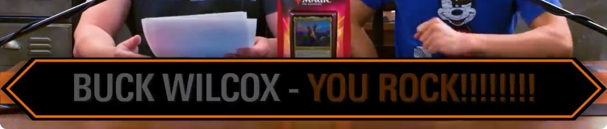](https://www.youtube.com/watch?v=ci414DwWh9o&amp;t=205s) |
| Will Valentine | #318 ? C20 Ikoria Commander Preview Card(s) | Apr 4, 2020 | [3:10](https://www.youtube.com/watch?v=UgdCRi_g5ik&amp;t=190s) | [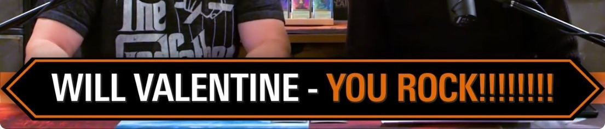](https://www.youtube.com/watch?v=UgdCRi_g5ik&amp;t=190s) |
| Sean Gao | #317 ? Ikoria Preview Card - Valiant Rescuer | Apr 3, 2020 | [3:00](https://www.youtube.com/watch?v=TZ9sg25tiW0&amp;t=180s) | [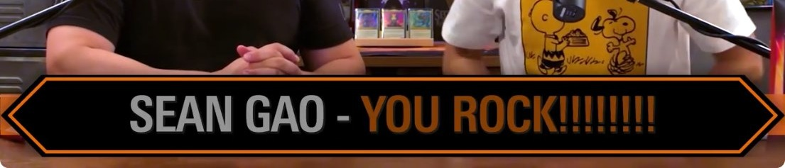](https://www.youtube.com/watch?v=TZ9sg25tiW0&amp;t=180s) |
| Lewis Haller | #316 ? The Most Fun Commanders to Play Against | Mar 24, 2020 | [3:09](https://www.youtube.com/watch?v=sA2ibLn2H1g&amp;t=189s) |  |
| Gwen Wolf | #315 ? The Worst Commanders to Play Against I The Command Zone 315 Magic: the Gathering Commander / EDH | Mar 17, 2020 | [3:18](https://www.youtube.com/watch?v=pnRVojgNVmk&amp;t=198s) | [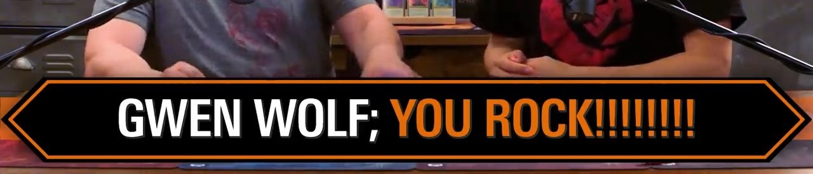](https://www.youtube.com/watch?v=pnRVojgNVmk&amp;t=198s) |
| Tyler Stankiewicz | #314 ? Proxies, Reprints  and Politics Gone Wrong I The Command Zone 314 I Magic: the Gathering Commander | Mar 10, 2020 | [3:17](https://www.youtube.com/watch?v=_PVlG0XcSz0&amp;t=197s) | [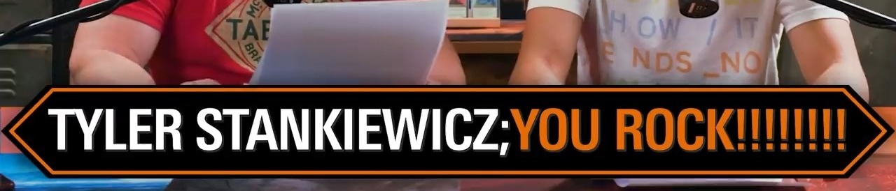](https://www.youtube.com/watch?v=_PVlG0XcSz0&amp;t=197s) |
| Peter Vays | #313 ? The Casual vs Competitive Debate w/ Kyle Hill I The Command Zone 313 I Magic: the Gathering | Mar 5, 2020 | [3:59](https://www.youtube.com/watch?v=pSbtkO4Pwk8&amp;t=239s) | [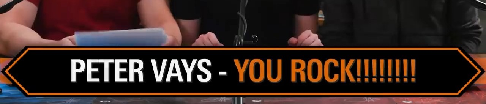](https://www.youtube.com/watch?v=pSbtkO4Pwk8&amp;t=239s) |
| Augustus Ward | #312 ? Learn from Our Mistakes I The Command Zone 312 I Magic: the Gathering Commander / EDH | Feb 25, 2020 | [3:20](https://www.youtube.com/watch?v=QMy1K2hQ15M&amp;t=200s) | [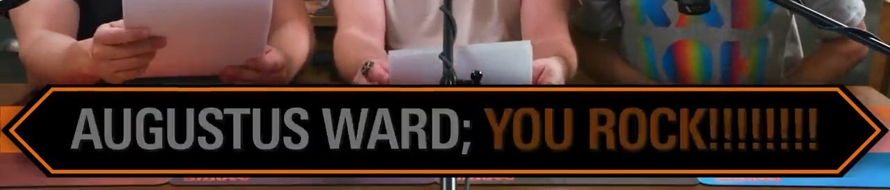](https://www.youtube.com/watch?v=QMy1K2hQ15M&amp;t=200s) |
| Bobby Wrisinger | #311 ? Our Favorite Cards | Feb 18, 2020 | [3:11](https://www.youtube.com/watch?v=AA6OSvt96iw&amp;t=191s) | [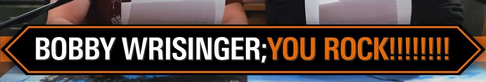](https://www.youtube.com/watch?v=AA6OSvt96iw&amp;t=191s) |
| Don Kim | #310 ? The Commander Way: Lessons from Taoism I The Command Zone 310 I Magic: the Gathering | Feb 11, 2020 | [3:46](https://www.youtube.com/watch?v=1YDfbodyxr0&amp;t=226s) | [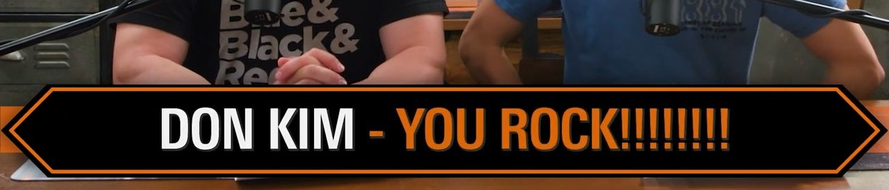](https://www.youtube.com/watch?v=1YDfbodyxr0&amp;t=226s) |
| Alexander Mikulaschek | #309 ? How to Connect with New Playgroups | Feb 4, 2020 | [3:50](https://www.youtube.com/watch?v=NhOYA_2LxzQ&amp;t=230s) | [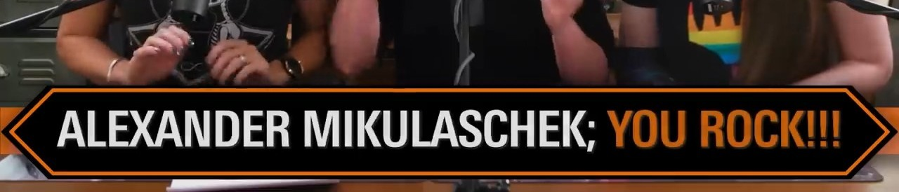](https://www.youtube.com/watch?v=NhOYA_2LxzQ&amp;t=230s) |
| Leland Nunez | #308 ? Uro – Game Knights Deck Tech I The Command Zone 308 I Magic: the Gathering | Jan 28, 2020 | [3:52](https://www.youtube.com/watch?v=SX669_q8Vyc&amp;t=232s) | [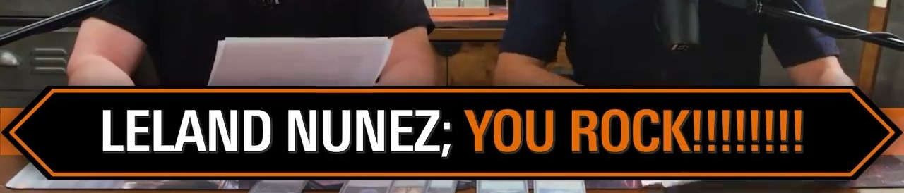](https://www.youtube.com/watch?v=SX669_q8Vyc&amp;t=232s) |
| Loris-Jade Jomok | #307 ? Dalakos – Game Knights Deck Tech I The Command Zone 307 I Magic: the Gathering | Jan 24, 2020 | [3:36](https://www.youtube.com/watch?v=RgA9KyRJNhA&amp;t=216s) | [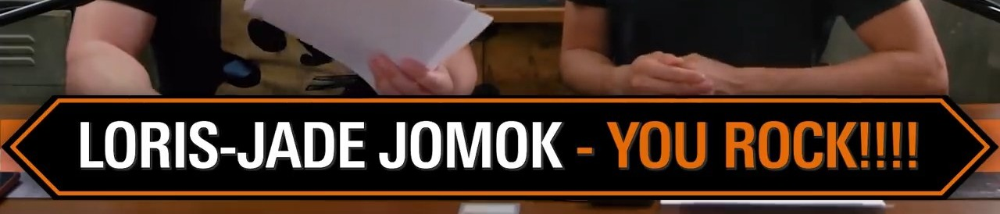](https://www.youtube.com/watch?v=RgA9KyRJNhA&amp;t=216s) |
| Ray Harsono | #306 ? Theros: Beyond Death - Set Review I The Command Zone 306 I Magic: the Gathering | Jan 15, 2020 | [2:30](https://www.youtube.com/watch?v=Bmby4KouH2o&amp;t=150s) | [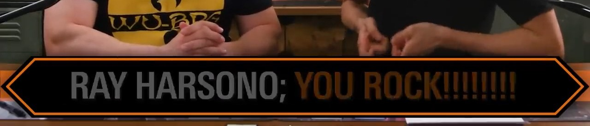](https://www.youtube.com/watch?v=Bmby4KouH2o&amp;t=150s) |
| Lucas Kvasnicki De Andrade | #305 ? The Best New Commanders from Theros: Beyond Death I The Command Zone 305 I Magic: the Gathering | Jan 10, 2020 | [4:20](https://www.youtube.com/watch?v=KuTvkkrBIcw&amp;t=260s) | [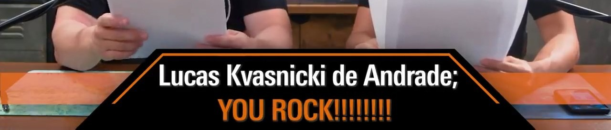](https://www.youtube.com/watch?v=KuTvkkrBIcw&amp;t=260s) |
| Ember Haines | #304 ? Theros: Beyond Death Preview Card I The Command Zone 304 I Magic: the Gathering EDH | Jan 8, 2020 | [3:21](https://www.youtube.com/watch?v=FrSbBMp45rg&amp;t=201s) | [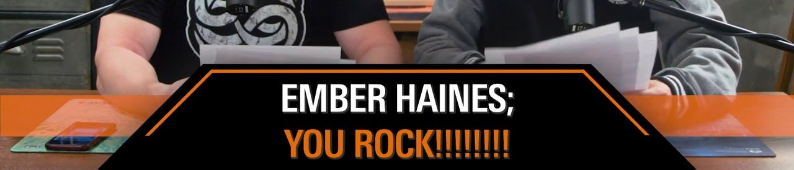](https://www.youtube.com/watch?v=FrSbBMp45rg&amp;t=201s) |
| Spencer Waters | #303 ? A Complete Guide to Mana Ramp I The Command Zone 303 I Magic: the Gathering Commander EDH | Jan 3, 2020 | [3:00](https://www.youtube.com/watch?v=73cXVWxkcwU&amp;t=180s) | [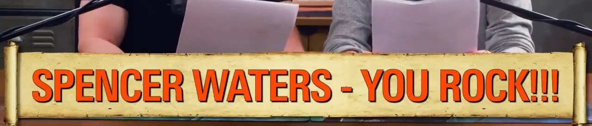](https://www.youtube.com/watch?v=73cXVWxkcwU&amp;t=180s) |
| Brian Sierakowski | #302 ? The Best of the Year - How did Magic Do in 2019? I The Command Zone 302 I Magic: the Gathering EDH | Dec 26, 2019 | [3:34](https://www.youtube.com/watch?v=RctPsvWPEpE&amp;t=214s) | [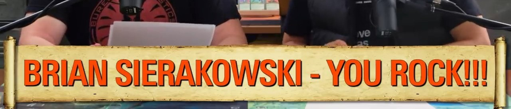](https://www.youtube.com/watch?v=RctPsvWPEpE&amp;t=214s) |
| Michael Hogaboom | #300 ? Our 300th Episode! GIVEAWAYS Galore! I The Command Zone 300 I Magic: the Gathering EDH | Dec 13, 2019 | [6:17](https://www.youtube.com/watch?v=nIdicl5L5IE&amp;t=377s) | [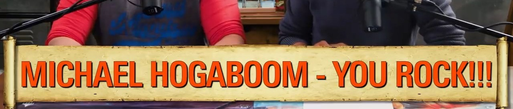](https://www.youtube.com/watch?v=nIdicl5L5IE&amp;t=377s) |
| Adam Good | #299 ? The Best Card In Your Deck I The Command Zone 299 I Magic: the Gathering EDH | Dec 5, 2019 | [3:52](https://www.youtube.com/watch?v=phEMmDPQ_5E&amp;t=232s) | [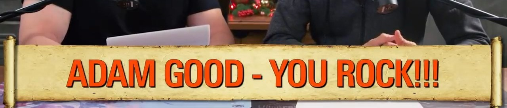](https://www.youtube.com/watch?v=phEMmDPQ_5E&amp;t=232s) |
| Kori Thomas | #298 ? Building a Commander Cube I The Command Zone 298 I Magic: the Gathering EDH | Nov 25, 2019 | [3:27](https://www.youtube.com/watch?v=SnS09LMCWLE&amp;t=207s) | [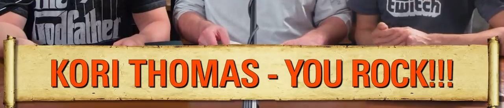](https://www.youtube.com/watch?v=SnS09LMCWLE&amp;t=207s) |
| Matt Wetter | #297 ? Let’s Fix White in Commander I The Command Zone 297 I Magic: the Gathering EDH | Nov 20, 2019 | [2:49](https://www.youtube.com/watch?v=hpHQqJsnSZI&amp;t=169s) | [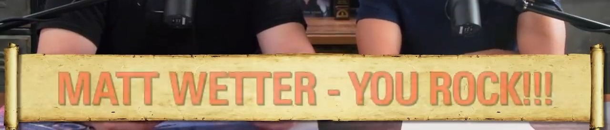](https://www.youtube.com/watch?v=hpHQqJsnSZI&amp;t=169s) |
| John Collins | #296 ? A Guide to Playing Aggro in Commander I The Command Zone 296 I Magic: the Gathering EDH | Nov 15, 2019 | [2:32](https://www.youtube.com/watch?v=6jBAj9UxNeA&amp;t=152s) | [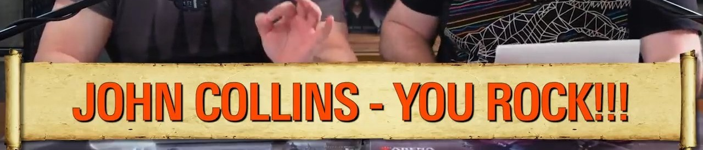](https://www.youtube.com/watch?v=6jBAj9UxNeA&amp;t=152s) |
| Blaine Waterbury | #295 ? How to Determine Your Deck’s Power Level I The Command Zone 295 I Magic: the Gathering EDH | Nov 5, 2019 | [3:43](https://www.youtube.com/watch?v=mgGm_74Lc9M&amp;t=223s) | [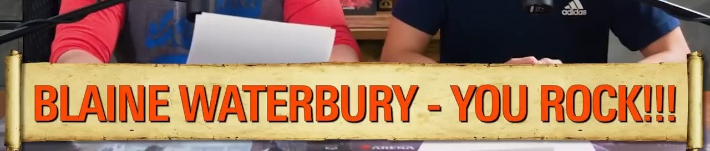](https://www.youtube.com/watch?v=mgGm_74Lc9M&amp;t=223s) |
| Katy Durbin | #294 ? The Scariest Cards in Commander I The Command Zone 294 I Magic: the Gathering EDH | Oct 31, 2019 | [3:18](https://www.youtube.com/watch?v=gDagFfCg3pU&amp;t=198s) | [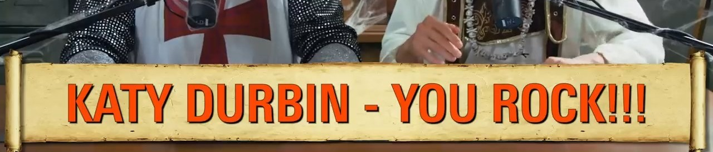](https://www.youtube.com/watch?v=gDagFfCg3pU&amp;t=198s) |
| Kirk Robertson | #293 ? Best Decks to Build on a Budget w/ The Commander’s Quarters I The Command Zone 293 I Magic MTG | Oct 23, 2019 | [3:07](https://www.youtube.com/watch?v=CPZ9E5ZzXig&amp;t=187s) | [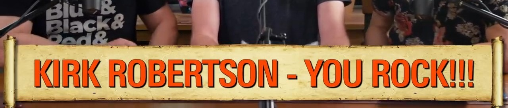](https://www.youtube.com/watch?v=CPZ9E5ZzXig&amp;t=187s) |
| Andrew Hendrix | #292 ? Mastering Mental Manipulation in Multiplayer Magic I The Command Zone 292 I Magic: the Gathering | Oct 17, 2019 | [2:49](https://www.youtube.com/watch?v=PeNZE-wH3Eo&amp;t=169s) | [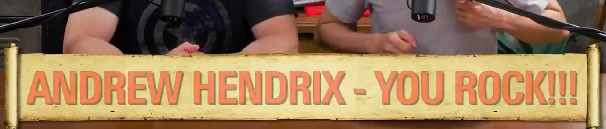](https://www.youtube.com/watch?v=PeNZE-wH3Eo&amp;t=169s) |
| Jaryn Hogan | #291 ? The Truth About Game Knights I The Command Zone 291 I Magic: the Gathering EDH | Oct 10, 2019 | [4:09](https://www.youtube.com/watch?v=UNhKNSxBmIo&amp;t=249s) | [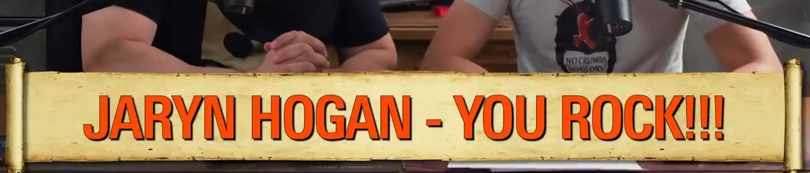](https://www.youtube.com/watch?v=UNhKNSxBmIo&amp;t=249s) |
| Leah Guskjolen | #290 ? The BEST Blue Cards in Commander I The Command Zone 290 I Magic: the Gathering EDH | Oct 1, 2019 | [3:21](https://www.youtube.com/watch?v=TZCuE2aYeIs&amp;t=201s) | [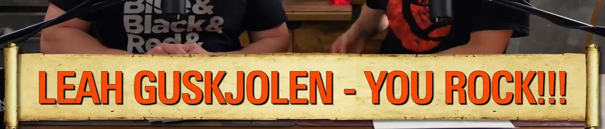](https://www.youtube.com/watch?v=TZCuE2aYeIs&amp;t=201s) |
| JT MacDonald | #289 ? Throne of Eldraine Set Review I The Command Zone 289 I Magic: the Gathering Commander EDH | Sep 26, 2019 | [2:39](https://www.youtube.com/watch?v=l9yXgf60MkA&amp;t=159s) | [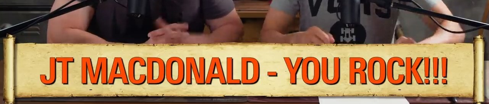](https://www.youtube.com/watch?v=l9yXgf60MkA&amp;t=159s) |
| Crispin Stopforth | #288 ? The Best New Commanders from Throne of Eldraine I The Command Zone 288 I Magic: the Gathering EDH | Sep 20, 2019 | [3:17](https://www.youtube.com/watch?v=SOKS7DITOsA&amp;t=197s) | [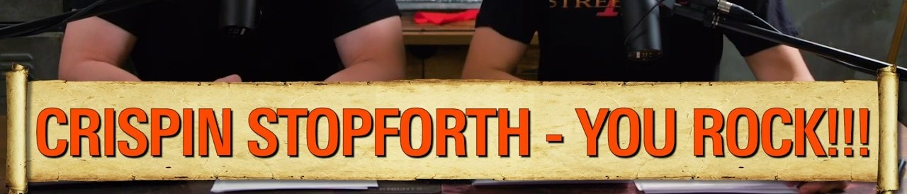](https://www.youtube.com/watch?v=SOKS7DITOsA&amp;t=197s) |
| Brock Webb | #287 ? Throne of Eldraine Preview Card I The Command Zone 287 I Magic: the Gathering EDH | Sep 11, 2019 | [4:58](https://www.youtube.com/watch?v=RYzy2drIllM&amp;t=298s) | [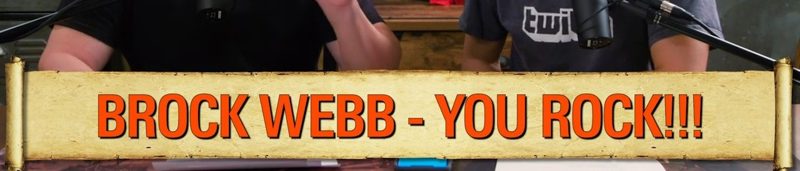](https://www.youtube.com/watch?v=RYzy2drIllM&amp;t=298s) |
| Stu Wininger | #286 ? Greven Deck Tech and MagicFest Vegas Recap I The Command Zone 286 I Magic: the Gathering EDH | Sep 3, 2019 | [3:13](https://www.youtube.com/watch?v=NIEoqjZpPuY&amp;t=193s) | [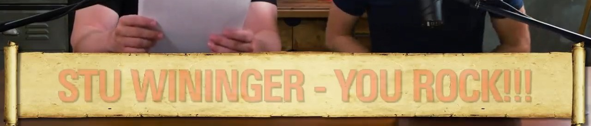](https://www.youtube.com/watch?v=NIEoqjZpPuY&amp;t=193s) |
| Matt Fluture | #285 ? Commander 2019 New Card Analysis I C19 I The Command Zone 285 I Magic: the Gathering EDH | Aug 27, 2019 | [2:58](https://www.youtube.com/watch?v=MfKwBzeaKnw&amp;t=178s) | [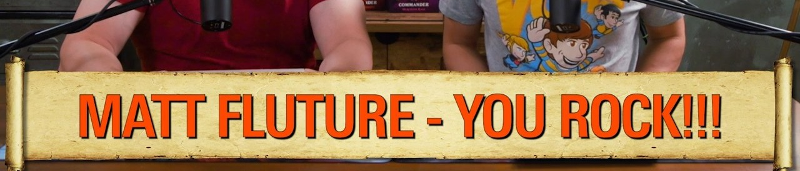](https://www.youtube.com/watch?v=MfKwBzeaKnw&amp;t=178s) |
| Ruby Stranahan | #284 ? Naya Populate Precon Upgrade Guide I C19 I The Command Zone 284 I Magic: the Gathering EDH | Aug 23, 2019 | [3:08](https://www.youtube.com/watch?v=8C7hnZMV5Ug&amp;t=188s) | [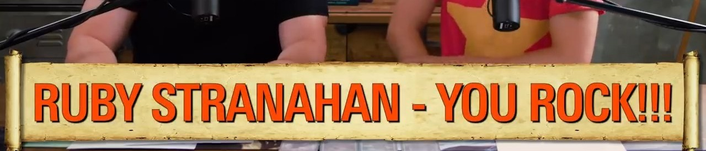](https://www.youtube.com/watch?v=8C7hnZMV5Ug&amp;t=188s) |
| Dorian Rosen | #283 ? Jeskai Flashback Precon Upgrade Guide I C19 I The Command Zone 283 I Magic: the Gathering EDH | Aug 19, 2019 | [3:37](https://www.youtube.com/watch?v=jYJFtHAp5xQ&amp;t=217s) | [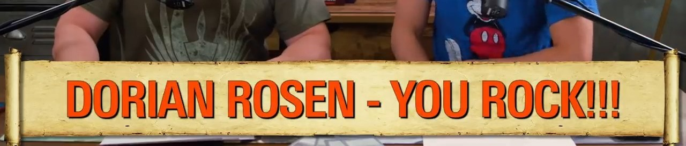](https://www.youtube.com/watch?v=jYJFtHAp5xQ&amp;t=217s) |
| Matthew Burk | #282 ? Rakdos Madness Precon Upgrade Guide I C19 I The Command Zone 282 I Magic: the Gathering EDH | Aug 15, 2019 | [3:30](https://www.youtube.com/watch?v=-DhmPsCCWGo&amp;t=210s) | [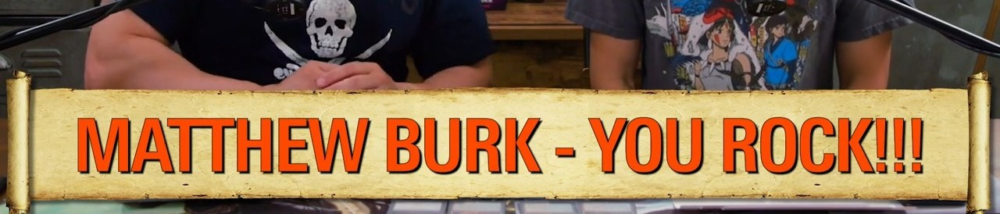](https://www.youtube.com/watch?v=-DhmPsCCWGo&amp;t=210s) |
| Dillon Mcmillen | #281 ? Sultai Morph Precon Upgrade Guide I C19 I The Command Zone 281 I Magic: the Gathering EDH | Aug 13, 2019 | [3:27](https://www.youtube.com/watch?v=agKBIK3IJaI&amp;t=207s) | [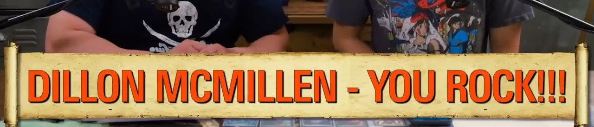](https://www.youtube.com/watch?v=agKBIK3IJaI&amp;t=207s) |
| Christopher Walker | #280 ? Breaking Down the C19 Commanders I The Command Zone 280 I Magic: the Gathering EDH | Aug 9, 2019 | [2:57](https://www.youtube.com/watch?v=JVBnkTbijl0&amp;t=177s) | [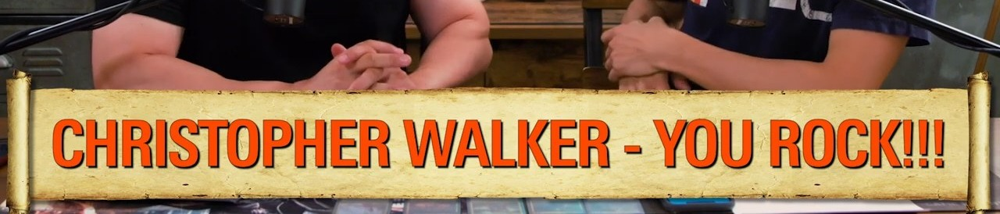](https://www.youtube.com/watch?v=JVBnkTbijl0&amp;t=177s) |
| Aspin Ramirez | #279 ? Biggest Mistakes New Players Make with Mark Rosewater and Make a Wish | Jul 25, 2019 | [6:07](https://www.youtube.com/watch?v=jPRNvnNCsvc&amp;t=367s) | [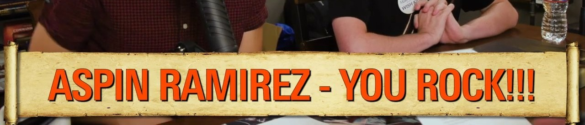](https://www.youtube.com/watch?v=jPRNvnNCsvc&amp;t=367s) |
| Evan Sparkman | #278 ? The Philosophy of Commander with The Professor l The Command Zone 278 l Magic: the Gathering EDH | Jul 17, 2019 | [3:37](https://www.youtube.com/watch?v=iEsMgvsTi14&amp;t=217s) | [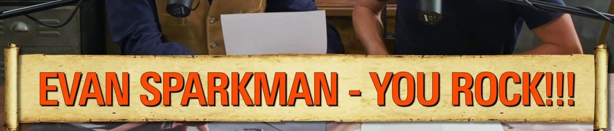](https://www.youtube.com/watch?v=iEsMgvsTi14&amp;t=217s) |
| Eric Threadgold | #277 ? Commander Summit 2019 PART TWO | Jul 9, 2019 | [2:55](https://www.youtube.com/watch?v=YMgAY7dXfiA&amp;t=175s) | [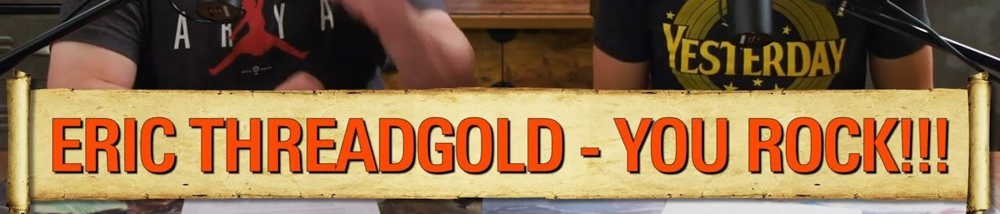](https://www.youtube.com/watch?v=YMgAY7dXfiA&amp;t=175s) |
| Joel Moore | #276 ? Major Banning Announcement - Reactions l The Command Zone 276 l Magic: the Gathering EDH | Jul 8, 2019 | [2:40](https://www.youtube.com/watch?v=sEoQepKWXQE&amp;t=160s) | [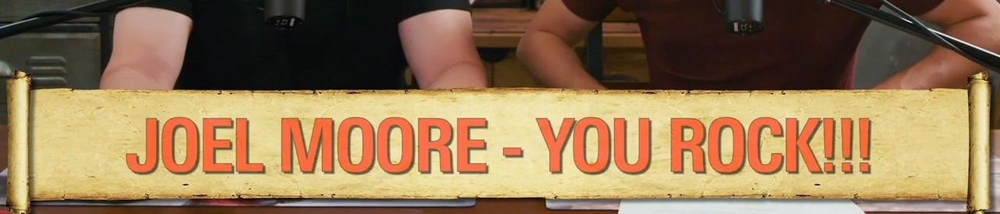](https://www.youtube.com/watch?v=sEoQepKWXQE&amp;t=160s) |
| Alvaro Gutierrez | #275 ? Commander Summit 2019 l The Command Zone 275 l Magic: the Gathering EDH | Jul 3, 2019 | [4:36](https://www.youtube.com/watch?v=WtAP2AY1hj8&amp;t=276s) | [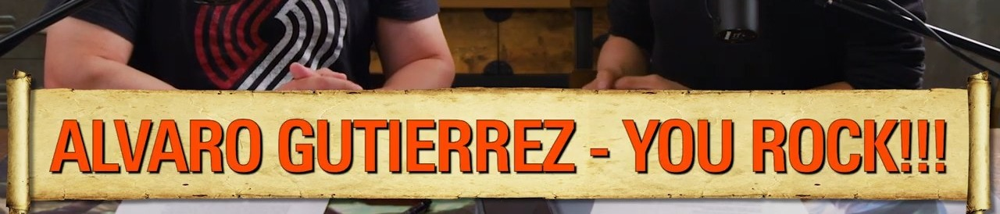](https://www.youtube.com/watch?v=WtAP2AY1hj8&amp;t=276s) |
| Magnus Vilhjalmsson | #274 ? M20 Set Review l The Command Zone 274 l Magic: the Gathering EDH | Jun 25, 2019 | [3:22](https://www.youtube.com/watch?v=yO_HGTJo3Ss&amp;t=202s) | [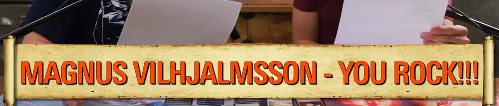](https://www.youtube.com/watch?v=yO_HGTJo3Ss&amp;t=202s) |
| Terrence O'Brien | #273 ? Maintaining Your Meta l The Command Zone 273 l Magic: the Gathering Commander EDH | Jun 20, 2019 | [3:28](https://www.youtube.com/watch?v=_Ml1DOf0tEI&amp;t=208s) | [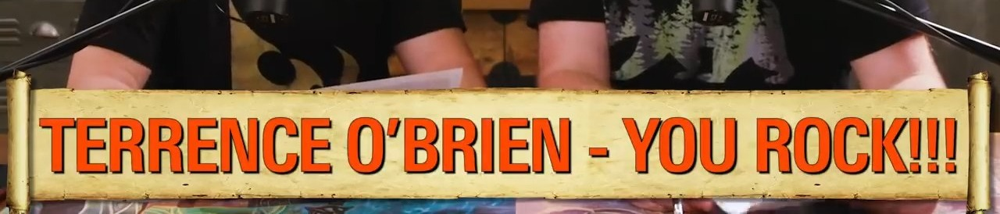](https://www.youtube.com/watch?v=_Ml1DOf0tEI&amp;t=208s) |
| Ryan Patumaka | #272 ? M20 Preview Card l The Command Zone 272 l Magic: the Gathering Commander EDH | Jun 17, 2019 | [3:05](https://www.youtube.com/watch?v=oDYrPcpEAwA&amp;t=185s) | [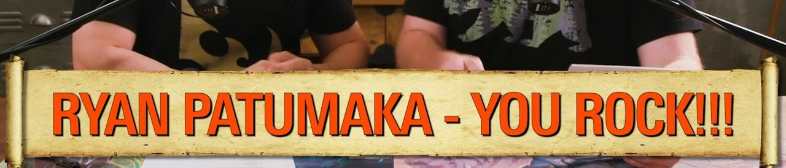](https://www.youtube.com/watch?v=oDYrPcpEAwA&amp;t=185s) |
| Mathew Lim | #271 ? Why Some Commanders Are(n’t) Popular l The Command Zone 271 l Magic: the Gathering Commander EDH | Jun 14, 2019 | [3:57](https://www.youtube.com/watch?v=oGmufQEXnac&amp;t=237s) | [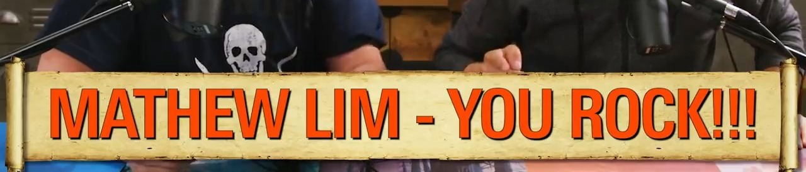](https://www.youtube.com/watch?v=oGmufQEXnac&amp;t=237s) |
| Colzy Knight | #270 ? Magic VS Hearthstone with Amaz l The Command Zone 270 l Magic: the Gathering Commander / EDH | Jun 4, 2019 | [2:53](https://www.youtube.com/watch?v=CYmj2UbNg8k&amp;t=173s) | [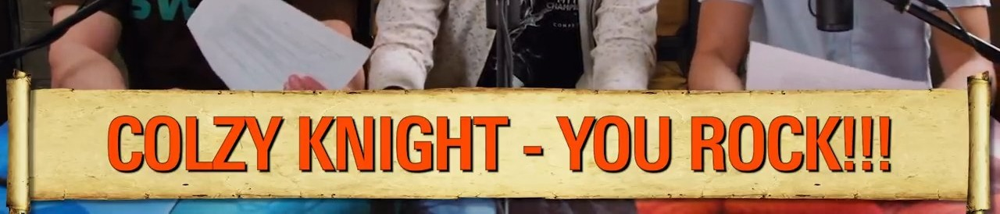](https://www.youtube.com/watch?v=CYmj2UbNg8k&amp;t=173s) |
| Christopher Zabatini | #269 ? Modern Horizons Set Review l The Command Zone 269 l Magic: the Gathering EDH | May 31, 2019 | [3:27](https://www.youtube.com/watch?v=Lzn37gsjIhM&amp;t=207s) | [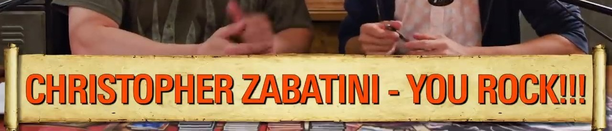](https://www.youtube.com/watch?v=Lzn37gsjIhM&amp;t=207s) |
| Michael Davignon | #268 ? Modern Horizons Preview Card l The Command Zone 268 l Magic: the Gathering Commander / EDH | May 21, 2019 | [3:09](https://www.youtube.com/watch?v=SwJxdIQKFOE&amp;t=189s) | [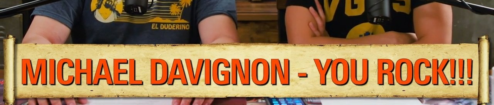](https://www.youtube.com/watch?v=SwJxdIQKFOE&amp;t=189s) |
| Quinn Lucero | #267 ? The Power of Priority (and The Stack) | May 14, 2019 | [2:54](https://www.youtube.com/watch?v=co25vcPvDsE&amp;t=174s) | [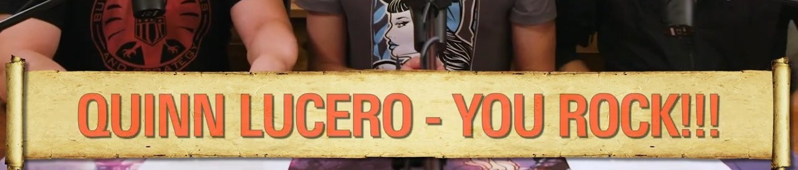](https://www.youtube.com/watch?v=co25vcPvDsE&amp;t=174s) |
| Gabbi Thompson | #266 ? Commander Variants with LoadingReadyRun l The Command Zone 266 l Magic: the Gathering EDH | May 7, 2019 | [4:08](https://www.youtube.com/watch?v=KD7odddh-ik&amp;t=248s) | [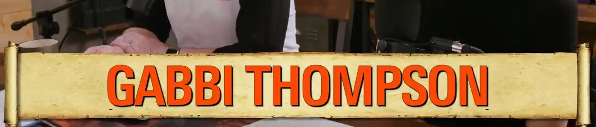](https://www.youtube.com/watch?v=KD7odddh-ik&amp;t=248s) |
| Darin Leslie | #265 ? Ultimate Guide to Planeswalkers in Commander l The Command Zone 265 l Magic: the Gathering EDH | May 3, 2019 | [3:21](https://www.youtube.com/watch?v=6lODt4BP3Qo&amp;t=201s) | [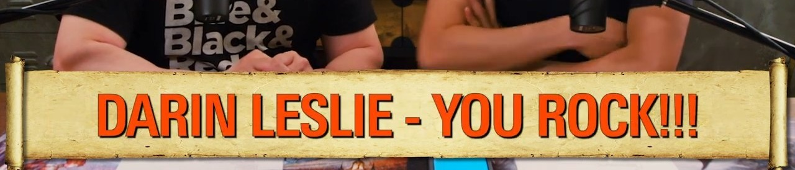](https://www.youtube.com/watch?v=6lODt4BP3Qo&amp;t=201s) |
| Shea Ridgeway | #264 ? War of the Spark Set Review l The Command Zone 264 l Magic: the Gathering EDH | Apr 23, 2019 | [3:05](https://www.youtube.com/watch?v=l81VbOU-BCA&amp;t=185s) | [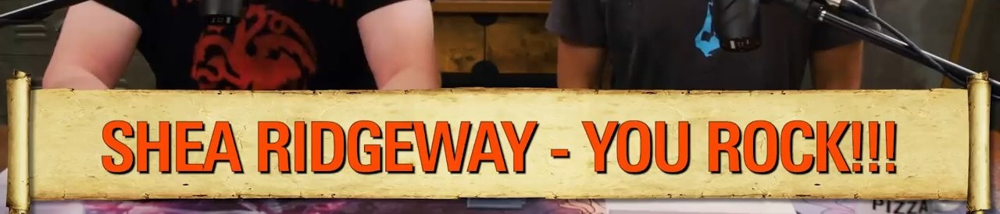](https://www.youtube.com/watch?v=l81VbOU-BCA&amp;t=185s) |
| Timothy Howard | #263 ? War of the Spark Planeswalker Set Review l The Command Zone 263 l Magic: the Gathering EDH | Apr 19, 2019 | [3:56](https://www.youtube.com/watch?v=lCwBD_VFMzs&amp;t=236s) | [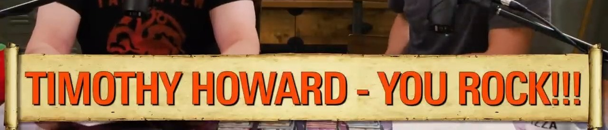](https://www.youtube.com/watch?v=lCwBD_VFMzs&amp;t=236s) |
| Keith Rupp | #262 ? Firesong and Sunspeaker Game Knights Deck Tech l The Command Zone 262 l Magic: the Gathering EDH | Apr 11, 2019 | [3:53](https://www.youtube.com/watch?v=RHRco1I3dos&amp;t=233s) | [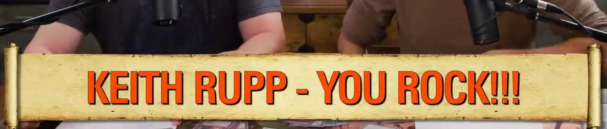](https://www.youtube.com/watch?v=RHRco1I3dos&amp;t=233s) |
| Sante Sabbatini | #261 ? MOST WANTED COMMANDER REPRINTS in Modern Horizons l The Command Zone 261 l Magic: the Gathering EDH | Apr 5, 2019 | [4:33](https://www.youtube.com/watch?v=f6tp7JbeuwQ&amp;t=273s) | [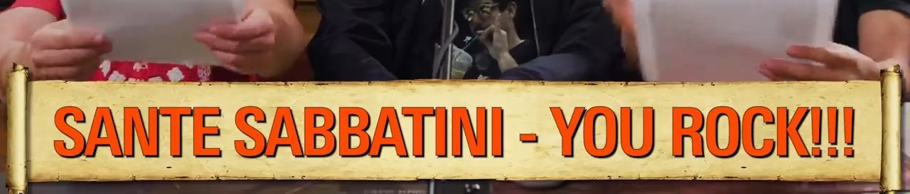](https://www.youtube.com/watch?v=f6tp7JbeuwQ&amp;t=273s) |
| Chris Rodriguez | #259 ? Ashlen’s Kozilek Game Knights Deck Tech l The Command Zone 259 l Magic: the Gathering EDH | Mar 19, 2019 | [3:16](https://www.youtube.com/watch?v=w94x0aDkOAM&amp;t=196s) | [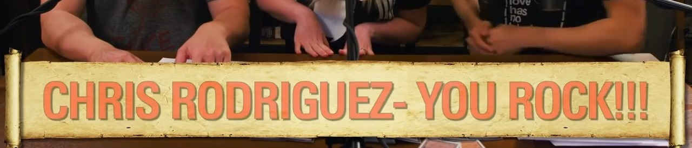](https://www.youtube.com/watch?v=w94x0aDkOAM&amp;t=196s) |
| Matthew Sneary | #258 ? Jacob’s Game Knights Deck Tech l The Command Zone 258 l Magic: the Gathering EDH | Mar 12, 2019 | [3:47](https://www.youtube.com/watch?v=hi1c2MVrWi8&amp;t=227s) | [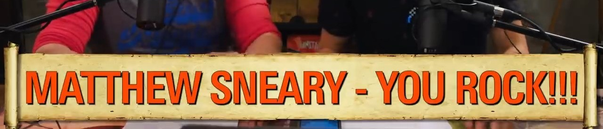](https://www.youtube.com/watch?v=hi1c2MVrWi8&amp;t=227s) |
| Roderick Kuppen | #256 ? Should Infect Be Changed in EDH? l The Command Zone 256 l Magic: the Gathering EDH | Feb 19, 2019 | [3:34](https://www.youtube.com/watch?v=us5nhRACGeU&amp;t=214s) | [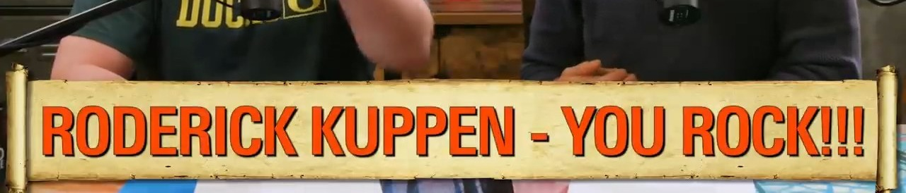](https://www.youtube.com/watch?v=us5nhRACGeU&amp;t=214s) |
| Gustavo Poscidonio | #255 ? How to BLING Out Your Deck l The Command Zone 255 l Magic: the Gathering EDH | Feb 14, 2019 | [2:51](https://www.youtube.com/watch?v=onJ-7toMx3Q&amp;t=171s) | [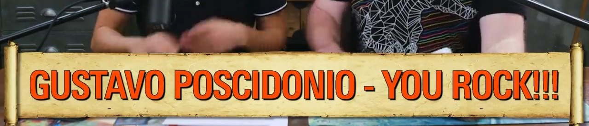](https://www.youtube.com/watch?v=onJ-7toMx3Q&amp;t=171s) |
| Shawn Cannata | #254 ? Cards You Should Be Playing (But Aren’t) l The Command Zone 254 l Magic: the Gathering EDH | Feb 5, 2019 | [2:44](https://www.youtube.com/watch?v=tSsrS0gAZ1M&amp;t=164s) | [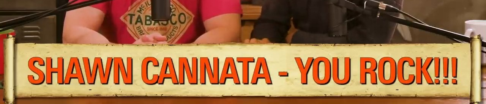](https://www.youtube.com/watch?v=tSsrS0gAZ1M&amp;t=164s) |
| Jon Vogl | #253 ? To The Rules Committee l The Command Zone 253 l Magic: the Gathering EDH | Jan 29, 2019 | [4:51](https://www.youtube.com/watch?v=LawUZZEwsJ0&amp;t=291s) | [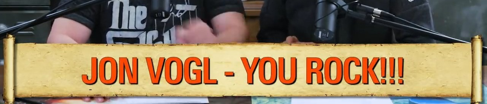](https://www.youtube.com/watch?v=LawUZZEwsJ0&amp;t=291s) |
| Ferdinand Baumgarten | #252 ? Lavinia – Game Knights Deck Tech l The Command Zone 252 l Magic: the Gathering EDH | Jan 22, 2019 | [4:11](https://www.youtube.com/watch?v=8j8f1djWsZw&amp;t=251s) | [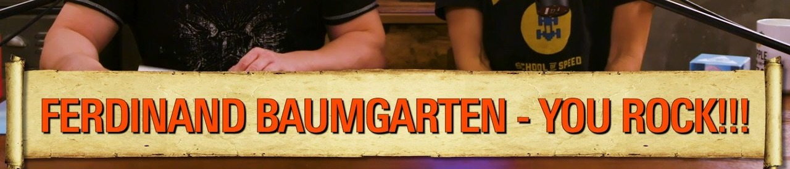](https://www.youtube.com/watch?v=8j8f1djWsZw&amp;t=251s) |
| Seth Thome | #251 ? Judith – Game Knights Deck Tech l The Command Zone 251 l Magic: the Gathering EDH | Jan 15, 2019 | [4:21](https://www.youtube.com/watch?v=2xwfJ0fY0pg&amp;t=261s) | [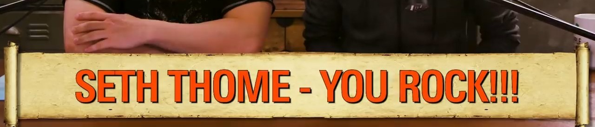](https://www.youtube.com/watch?v=2xwfJ0fY0pg&amp;t=261s) |
| Roger Charbonneau | #250 ? Ravnica Allegiance Set Review l The Command Zone 250 l Magic: the Gathering EDH | Jan 11, 2019 | [3:40](https://www.youtube.com/watch?v=fhDTouEpDZs&amp;t=220s) | [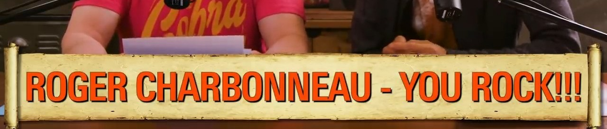](https://www.youtube.com/watch?v=fhDTouEpDZs&amp;t=220s) |
| Kale Ng | #249 ? How NOT to Evaluate Cards +RNA Preview l The Command Zone 249 l Magic: the Gathering EDH | Jan 3, 2019 | [4:00](https://www.youtube.com/watch?v=rB6veHAqR08&amp;t=240s) | [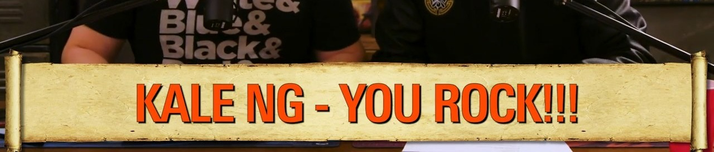](https://www.youtube.com/watch?v=rB6veHAqR08&amp;t=240s) |
| Dennis Rothmel | #248 ? What Magic Did Wrong (and Right!) This Year l The Command Zone 248 l Magic: the Gathering EDH | Dec 27, 2018 | [4:02](https://www.youtube.com/watch?v=NS1Mqas-xBA&amp;t=242s) | [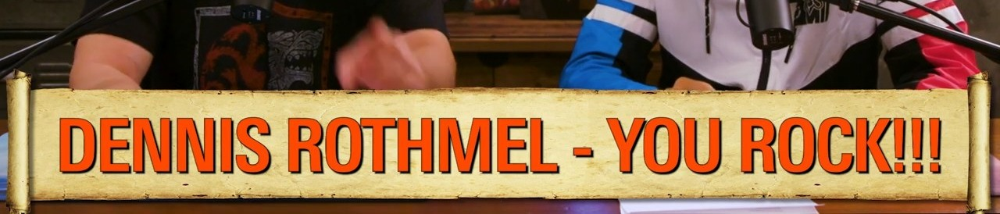](https://www.youtube.com/watch?v=NS1Mqas-xBA&amp;t=242s) |
| Max Wöger | #247 ? Problems With Your Playgroup l The Command Zone 247 l Magic: the Gathering EDH | Dec 18, 2018 | [5:17](https://www.youtube.com/watch?v=WIw47eA2Wi4&amp;t=317s) | [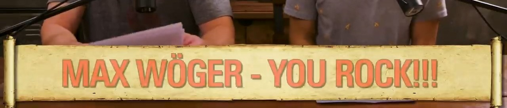](https://www.youtube.com/watch?v=WIw47eA2Wi4&amp;t=317s) |
| Jumbo Commander | #246 ? DJ’s Final Episode - Jumbo Politics l The Command Zone 246 l Magic: the Gathering EDH | Dec 14, 2018 | [3:52](https://www.youtube.com/watch?v=vQe-XnDdAVE&amp;t=232s) | [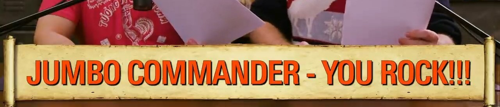](https://www.youtube.com/watch?v=vQe-XnDdAVE&amp;t=232s) |
| Harley Keith | #245 ? Most Hated Commanders | Dec 4, 2018 | [4:59](https://www.youtube.com/watch?v=dP16gWToUcc&amp;t=299s) | [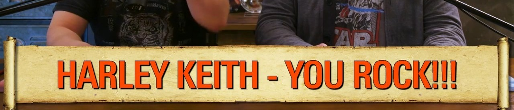](https://www.youtube.com/watch?v=dP16gWToUcc&amp;t=299s) |
| Yama Shi | #244 ? Most Overrated Cards in Commander | Nov 27, 2018 | [3:11](https://www.youtube.com/watch?v=YYPvrWMP1Rg&amp;t=191s) | [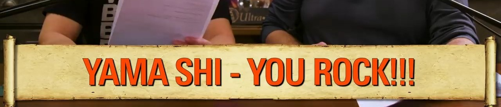](https://www.youtube.com/watch?v=YYPvrWMP1Rg&amp;t=191s) |
| Finn Shepherd-Humphreys | #243 ? Ultimate Masters Discussion + Preview Card l The Command Zone 243 l Magic: the Gathering EDH | Nov 20, 2018 | [2:46](https://www.youtube.com/watch?v=UJT4mgu3VbU&amp;t=166s) | [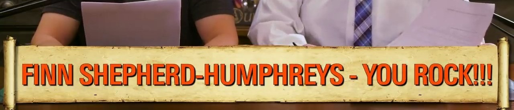](https://www.youtube.com/watch?v=UJT4mgu3VbU&amp;t=166s) |
| Vilu Seipiharju | #242 ? Things Commander Players Need To STOP Doing l The Command Zone 242 l Magic: the Gathering EDH | Nov 13, 2018 | [2:43](https://www.youtube.com/watch?v=ONSecW-lDnM&amp;t=163s) | [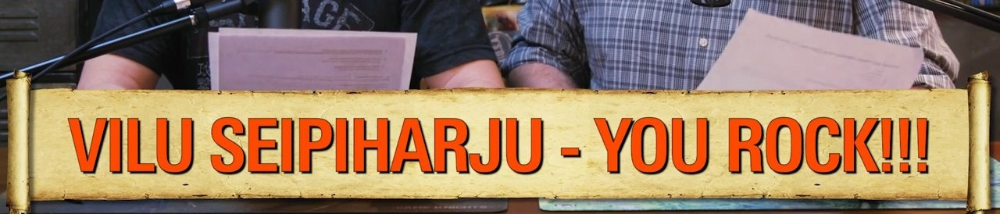](https://www.youtube.com/watch?v=ONSecW-lDnM&amp;t=163s) |
| David Kasten | #241 ? Are There Cards You Shouldn’t Play? l The Command Zone 241 l Magic: the Gathering EDH | Nov 8, 2018 | [2:52](https://www.youtube.com/watch?v=cFXIj1TfULY&amp;t=172s) | [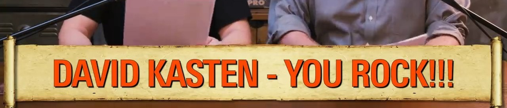](https://www.youtube.com/watch?v=cFXIj1TfULY&amp;t=172s) |
| Judson Wall | #240 ? Braids Deck Tech \| DJ’s Favorite Deck! | Oct 30, 2018 | [2:22](https://www.youtube.com/watch?v=qSh2p1e13d0&amp;t=142s) | [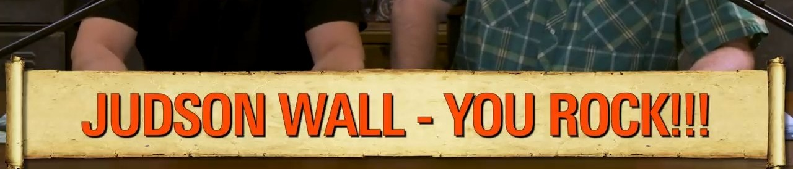](https://www.youtube.com/watch?v=qSh2p1e13d0&amp;t=142s) |
| David Littlefield | #239 ? Which Color is the Strongest? Gameplay STATS (pt2) l The Command Zone 239 l Magic the Gathering EDH | Oct 24, 2018 | [3:11](https://www.youtube.com/watch?v=ttGjuNXWxpY&amp;t=191s) | [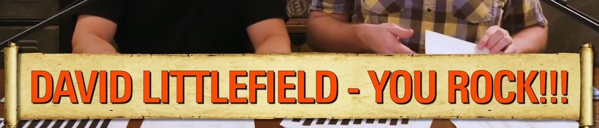](https://www.youtube.com/watch?v=ttGjuNXWxpY&amp;t=191s) |
| Levi Lunsford | #237 ? Top BUDGET Blue Cards l The Command Zone 237 l Magic: the Gathering Commander EDH | Oct 9, 2018 | [2:59](https://www.youtube.com/watch?v=cOxJOjEow5s&amp;t=179s) | [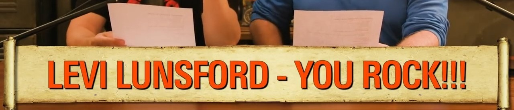](https://www.youtube.com/watch?v=cOxJOjEow5s&amp;t=179s) |
| Phillip David Davies | #236 ? Emmara Deck Tech l The Command Zone 236 l Magic: the Gathering Commander EDH | Oct 2, 2018 | [3:58](https://www.youtube.com/watch?v=zi7oyxp8sYM&amp;t=238s) | [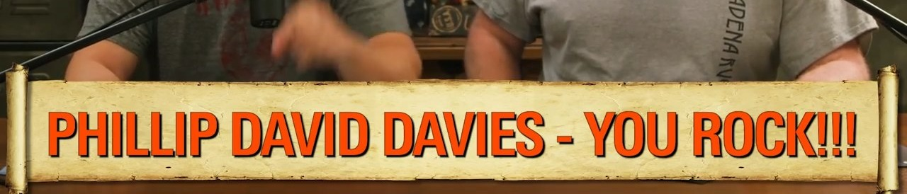](https://www.youtube.com/watch?v=zi7oyxp8sYM&amp;t=238s) |
| Dustin Neese | #235 ? Izoni Deck Tech w/ Adam Savidan l The Command Zone 235 l Magic: the Gathering Commander EDH | Sep 25, 2018 | [3:24](https://www.youtube.com/watch?v=Q5Gz1fsacns&amp;t=204s) | [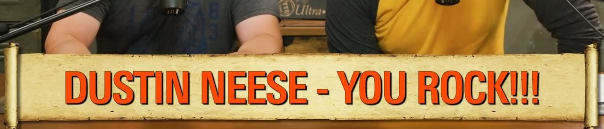](https://www.youtube.com/watch?v=Q5Gz1fsacns&amp;t=204s) |
| Corey Todalen | #234 ? Guilds of Ravnica Set Review l The Command Zone 234 l Magic: the Gathering Commander EDH | Sep 20, 2018 | [3:10](https://www.youtube.com/watch?v=20Uuo2Q9MIs&amp;t=190s) | [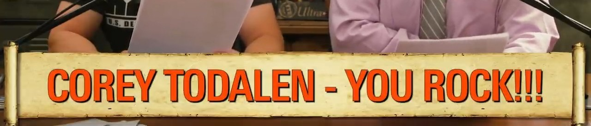](https://www.youtube.com/watch?v=20Uuo2Q9MIs&amp;t=190s) |
| Samuel Fowler | #233 ? Guilds of Ravnica Preview - Etrata, the Silencer l The Command Zone 233 l Magic the Gathering EDH | Sep 17, 2018 | [6:30](https://www.youtube.com/watch?v=uKiJyu3oWkE&amp;t=390s) | [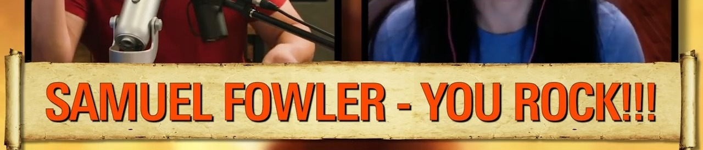](https://www.youtube.com/watch?v=uKiJyu3oWkE&amp;t=390s) |
| Holly Reid | #232 ? Jimmy’s Surprise Visit l Commander Q & A l The Command Zone 232 l Magic the Gathering EDH | Sep 12, 2018 | [4:48](https://www.youtube.com/watch?v=7a7U28Oh4EQ&amp;t=288s) | [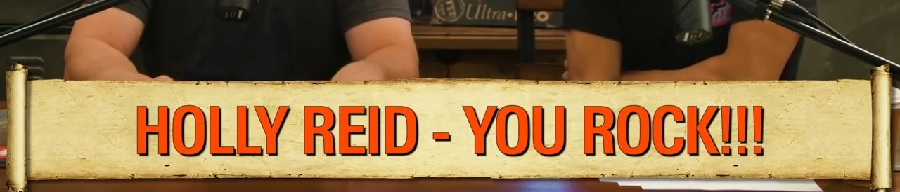](https://www.youtube.com/watch?v=7a7U28Oh4EQ&amp;t=288s) |
| Clint Miller | #231 ? Selvala, Heart of the Wilds Deck Tech | Sep 4, 2018 | [6:42](https://www.youtube.com/watch?v=WVtqB-894lI&amp;t=402s) | [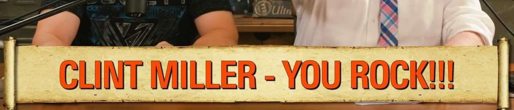](https://www.youtube.com/watch?v=WVtqB-894lI&amp;t=402s) |
| Damien Savorgino | #230 ? Commander Format Wish List l The Command Zone 230 l Magic: the Gathering EDH | Aug 30, 2018 | [2:57](https://www.youtube.com/watch?v=6OC4L9mNCWU&amp;t=177s) | [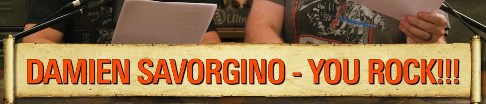](https://www.youtube.com/watch?v=6OC4L9mNCWU&amp;t=177s) |
| Mustafa Subroto | #229 ? Is C18 a Failure? l The Command Zone 229 l Magic: the Gathering EDH | Aug 23, 2018 | [3:33](https://www.youtube.com/watch?v=jKTSj8v7w1M&amp;t=213s) | [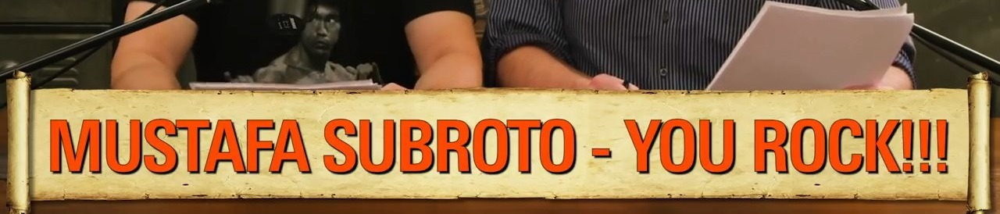](https://www.youtube.com/watch?v=jKTSj8v7w1M&amp;t=213s) |
| Aidan Bork | #228 ? Varina, Lich Queen – C18 Deck Tech l The Command Zone 228 l Magic: the Gathering EDH | Aug 16, 2018 | [4:39](https://www.youtube.com/watch?v=iKPi_-XQsW4&amp;t=279s) | [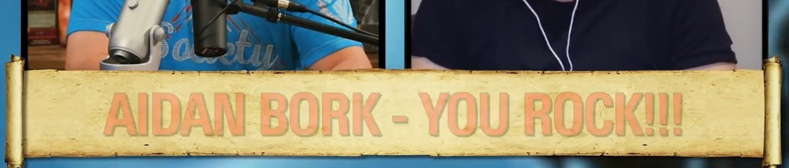](https://www.youtube.com/watch?v=iKPi_-XQsW4&amp;t=279s) |
| Kevin Kubina | #227 ? Xantcha, Sleeper Agent – C18 Deck Tech l The Command Zone 227 l Magic: the Gathering EDH | Aug 14, 2018 | [3:46](https://www.youtube.com/watch?v=byJ3B-GOU3M&amp;t=226s) | [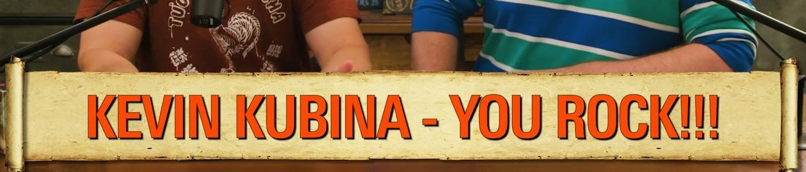](https://www.youtube.com/watch?v=byJ3B-GOU3M&amp;t=226s) |
| Felipe Hirata | #226 ? Brewing Brudiclad – C18 Deck Tech l The Command Zone 226 l Magic: the Gathering EDH | Aug 10, 2018 | [4:27](https://www.youtube.com/watch?v=TVyZdOst3Wk&amp;t=267s) | [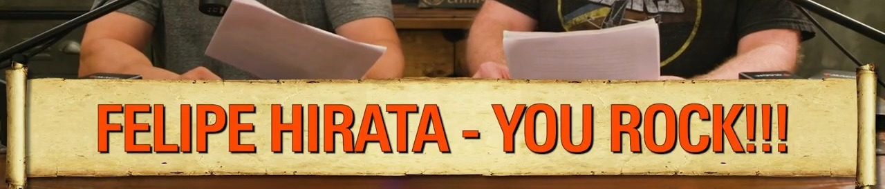](https://www.youtube.com/watch?v=TVyZdOst3Wk&amp;t=267s) |
| Juan Ochoa | #224 ? Aminatou Esper - Commander 2018 - Subjective Reality | Aug 2, 2018 | [2:53](https://www.youtube.com/watch?v=gfrT2uNVq7Y&amp;t=173s) | [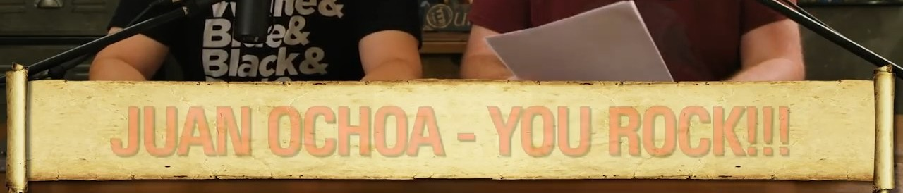](https://www.youtube.com/watch?v=gfrT2uNVq7Y&amp;t=173s) |
| Gustavo Gandia | #223 ? Adaptive Enchantments - Commander 2018 - Estrid Review l The Command Zone 223 l Magic the Gathering | Jul 30, 2018 | [3:57](https://www.youtube.com/watch?v=ooJruaL8xIc&amp;t=237s) | [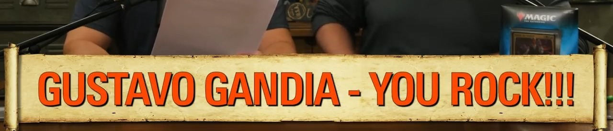](https://www.youtube.com/watch?v=ooJruaL8xIc&amp;t=237s) |
| Ted Lander | #222 ? Lands Matter- Commander 2018- Nature's Vengeance | Jul 28, 2018 | [4:09](https://www.youtube.com/watch?v=K5tEx8hRZaM&amp;t=249s) | [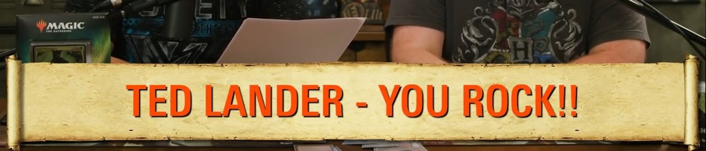](https://www.youtube.com/watch?v=K5tEx8hRZaM&amp;t=249s) |
| Mason Stalcup | #221 ? Saheeli Artifacts- Commander 2018- Exquisite Invention | Jul 27, 2018 | [3:46](https://www.youtube.com/watch?v=-jsbFDRoqm0&amp;t=226s) | [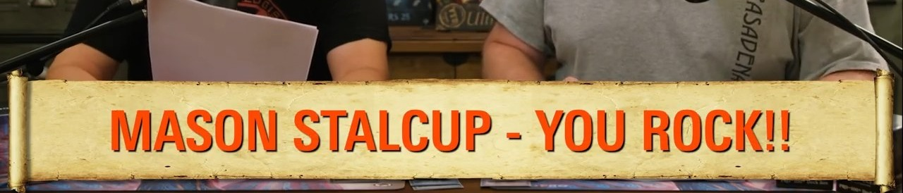](https://www.youtube.com/watch?v=-jsbFDRoqm0&amp;t=226s) |
| Charles Willibey | #220 ? Commander 2018 Preview Card - Gyrus, Waker of Corpses | Jul 24, 2018 | [2:07](https://www.youtube.com/watch?v=_69OKoIdNb4&amp;t=127s) | [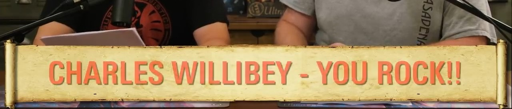](https://www.youtube.com/watch?v=_69OKoIdNb4&amp;t=127s) |
| George Lennon | #219 ? Chromium and the Voltron Debate | Jul 17, 2018 | [3:40](https://www.youtube.com/watch?v=ZdTXA1oxSSA&amp;t=220s) | [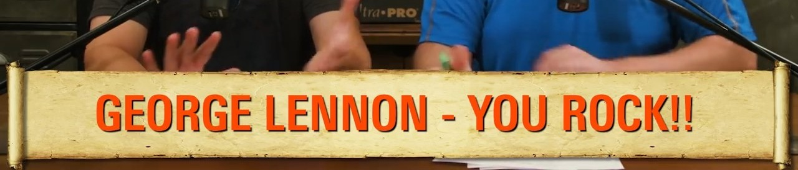](https://www.youtube.com/watch?v=ZdTXA1oxSSA&amp;t=220s) |
| Duncan Saunders | #218 ? Underrated Favorites in Commander | Jul 10, 2018 | [3:34](https://www.youtube.com/watch?v=DuB8Y8Y_0qQ&amp;t=214s) | [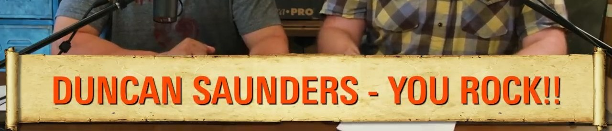](https://www.youtube.com/watch?v=DuB8Y8Y_0qQ&amp;t=214s) |
| Lynne Laboone | #217 ? How to Power-up Your Decks | Jul 3, 2018 | [4:04](https://www.youtube.com/watch?v=dDVrAb_GfxU&amp;t=244s) | [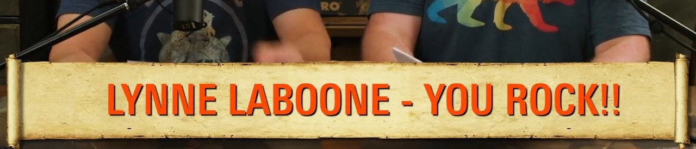](https://www.youtube.com/watch?v=dDVrAb_GfxU&amp;t=244s) |
| Ryan Swaney | #216 ? M19 Set Review | Jun 26, 2018 | [3:38](https://www.youtube.com/watch?v=aswCyuYhFOg&amp;t=218s) | [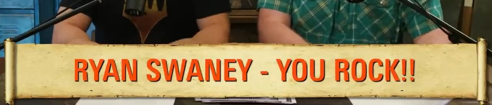](https://www.youtube.com/watch?v=aswCyuYhFOg&amp;t=218s) |
| Ben Bingham | #215 ? MTG Arena +M19 Preview Card w/ Ashlen Rose | Jun 20, 2018 | [19:22](https://www.youtube.com/watch?v=XeQlMLi6gZI&amp;t=1162s) | [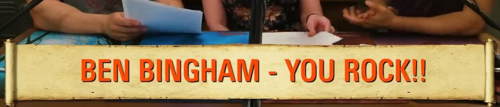](https://www.youtube.com/watch?v=XeQlMLi6gZI&amp;t=1162s) |
| Skyden Camfield | #214 ? Should ALL Planeswalkers Be Legal As Commanders? | Jun 12, 2018 | [5:02](https://www.youtube.com/watch?v=xeD35RKuRy0&amp;t=302s) | [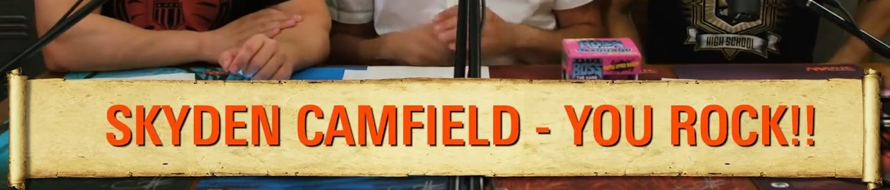](https://www.youtube.com/watch?v=xeD35RKuRy0&amp;t=302s) |
| Brian G Broderick | #213 ? The Best Partner Commanders | Jun 6, 2018 | [2:31](https://www.youtube.com/watch?v=XZniK9v1Xg0&amp;t=151s) | [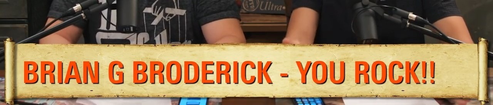](https://www.youtube.com/watch?v=XZniK9v1Xg0&amp;t=151s) |
| Lucas Neff | #212 ? Battlebond Set Review l The Command Zone 212 l Magic: the Gathering Commander/EDH | May 30, 2018 | [2:52](https://www.youtube.com/watch?v=zRxGewAY-nE&amp;t=172s) | [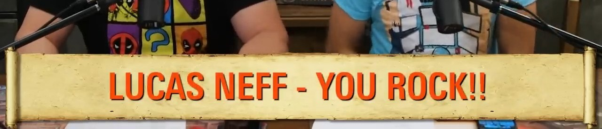](https://www.youtube.com/watch?v=zRxGewAY-nE&amp;t=172s) |
| Teddy Ho | #210 ? What is the Right Way to Concede in Commander? | May 16, 2018 | [1:55](https://www.youtube.com/watch?v=jotRWbaMwns&amp;t=115s) | [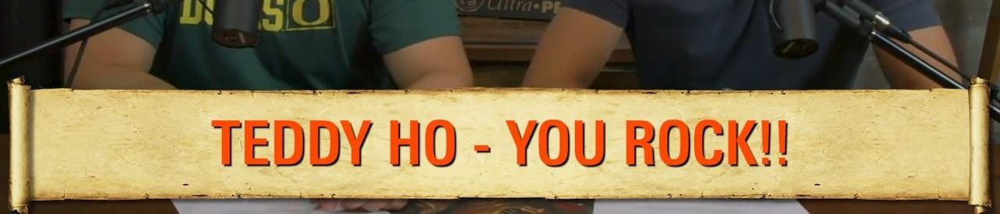](https://www.youtube.com/watch?v=jotRWbaMwns&amp;t=115s) |
| Kevin Kamarchevakul | #209 ? Commander Politics: Deals & Alliances | May 10, 2018 | [3:00](https://www.youtube.com/watch?v=Kmv4rkumcHg&amp;t=180s) | [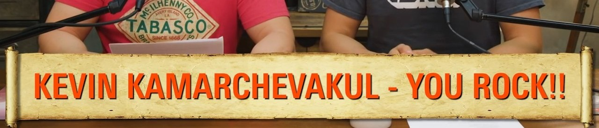](https://www.youtube.com/watch?v=Kmv4rkumcHg&amp;t=180s) |
| Jonathan Welch | #208 ? Jodah Brawl Deck Tech | May 1, 2018 | [4:38](https://www.youtube.com/watch?v=FO5MBBodrfc&amp;t=278s) | [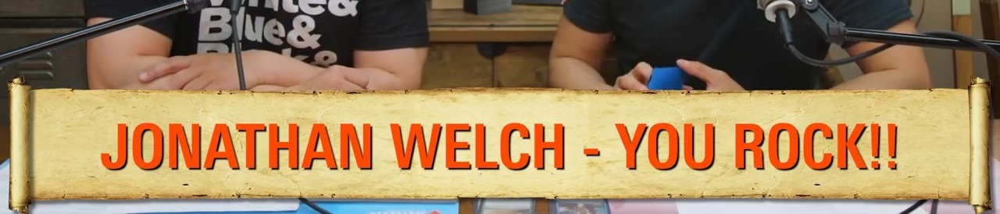](https://www.youtube.com/watch?v=FO5MBBodrfc&amp;t=278s) |
| Eliana Ford | #207 ? Muldrotha Brawl Deck Tech l The Command Zone 207 l Magic: the Gathering Commander / EDH | Apr 26, 2018 | [5:49](https://www.youtube.com/watch?v=sURhDr-DTd0&amp;t=349s) | [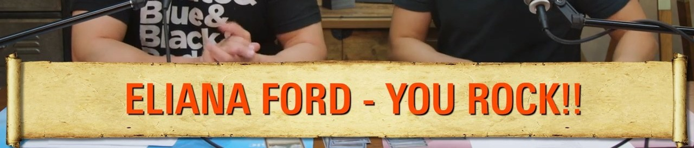](https://www.youtube.com/watch?v=sURhDr-DTd0&amp;t=349s) |
| Kristjan Olafur | #206 ? Dominaria Set Review | Apr 18, 2018 | [3:36](https://www.youtube.com/watch?v=CZv6DkDap-M&amp;t=216s) | [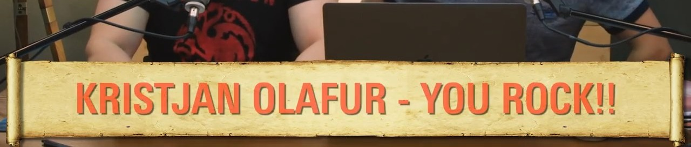](https://www.youtube.com/watch?v=CZv6DkDap-M&amp;t=216s) |
| Daniel Grumieaux | #205 ? How to Play Control with Jumbo Commander | Apr 10, 2018 | [2:23](https://www.youtube.com/watch?v=IhlB1I2VLU8&amp;t=143s) | [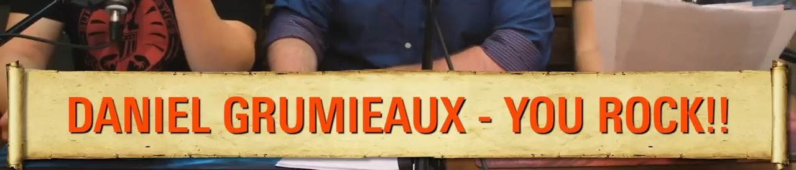](https://www.youtube.com/watch?v=IhlB1I2VLU8&amp;t=143s) |
| Morten Bürger | #204 ? Is the Brawl Format Good? +Dominaria Preview | Apr 4, 2018 | [3:34](https://www.youtube.com/watch?v=_ZiWkRiM-b0&amp;t=214s) | [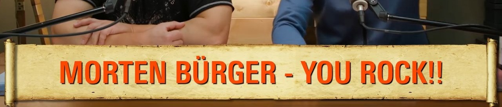](https://www.youtube.com/watch?v=_ZiWkRiM-b0&amp;t=214s) |
| Jeremy Grybas | #203 ? Grenzo, Dungeon Warden Deck Tech | Mar 27, 2018 | [2:33](https://www.youtube.com/watch?v=CT1btaotMpk&amp;t=153s) | [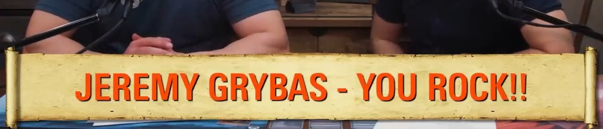](https://www.youtube.com/watch?v=CT1btaotMpk&amp;t=153s) |
| Kyoji Takenouchi | #202 ? Animar Morph Deck Tech with Vinny l The Command Zone 202 | Mar 20, 2018 | [3:44](https://www.youtube.com/watch?v=VRmp665LMIU&amp;t=224s) | [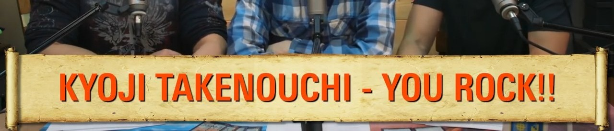](https://www.youtube.com/watch?v=VRmp665LMIU&amp;t=224s) |
| Chris Fitzgerald | #201 ? What is the State of the Commander Format? Commander Summit 2018 l The Command Zone 201 | Mar 16, 2018 | [3:19](https://www.youtube.com/watch?v=k7FsUBnhJ4I&amp;t=199s) | [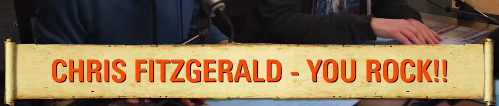](https://www.youtube.com/watch?v=k7FsUBnhJ4I&amp;t=199s) |
| Drew Bradshaw | #200 ? Episode 200 Extravaganza with Over 30 Special Guests | Mar 6, 2018 | [5:16](https://www.youtube.com/watch?v=41AhC8VDpn0&amp;t=316s) | [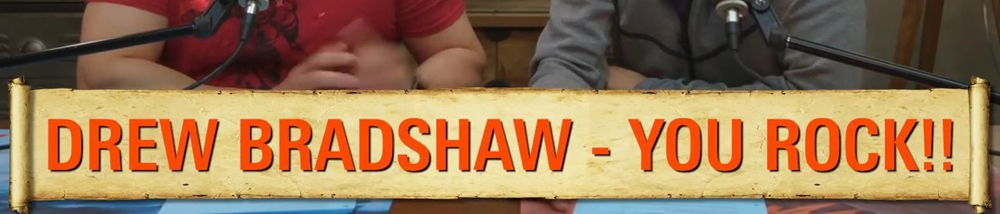](https://www.youtube.com/watch?v=41AhC8VDpn0&amp;t=316s) |
| Tom Relf | #199 ? Must-Have Commander Cards + Masters 25 Previews | Feb 28, 2018 | [3:08](https://www.youtube.com/watch?v=0fgxmEfMWrY&amp;t=188s) | [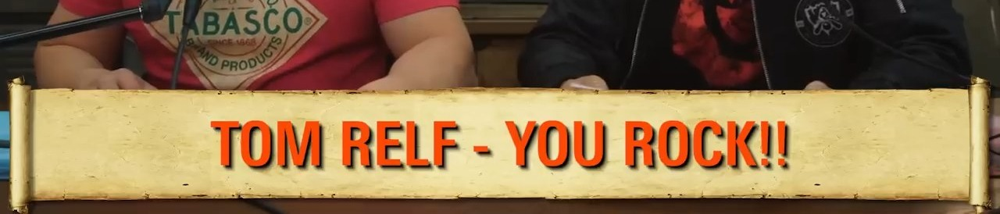](https://www.youtube.com/watch?v=0fgxmEfMWrY&amp;t=188s) |
| Wil Yausie | #198 ? Most Underrated Cards in Commander l The Command Zone 198 | Feb 15, 2018 | [4:37](https://www.youtube.com/watch?v=lianKU4GftE&amp;t=277s) | [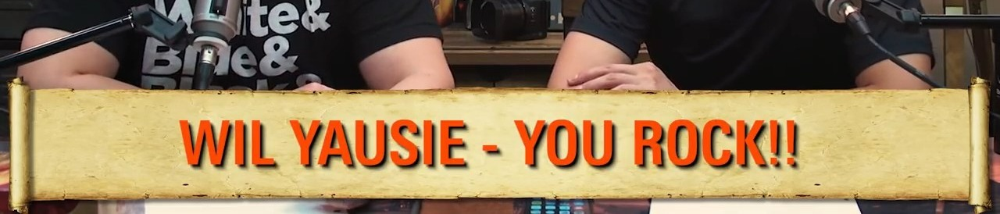](https://www.youtube.com/watch?v=lianKU4GftE&amp;t=277s) |
| Felicia Rolletschke | #197 ? How Useful is the Banlist? | Feb 7, 2018 | [3:31](https://www.youtube.com/watch?v=iGm7lgKVa1E&amp;t=211s) | [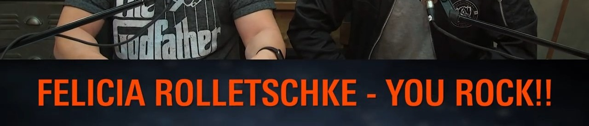](https://www.youtube.com/watch?v=iGm7lgKVa1E&amp;t=211s) |
| Nathan Ritterson | #196 ? Top 10 Biggest Mistakes Commander Players Make | Jan 30, 2018 | [2:37](https://www.youtube.com/watch?v=ZNx4F2mQJUk&amp;t=157s) | [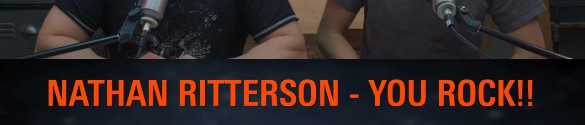](https://www.youtube.com/watch?v=ZNx4F2mQJUk&amp;t=157s) |
| Caleb Tucker | #195 ? Kumena - Best Merfolk Commander Ever? | Jan 23, 2018 | [4:00](https://www.youtube.com/watch?v=vfMn1ASQPBs&amp;t=240s) | [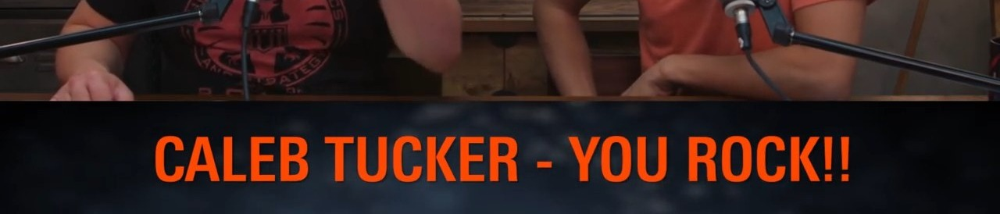](https://www.youtube.com/watch?v=vfMn1ASQPBs&amp;t=240s) |
| Aj Alvarado | #194 ? Elenda, the Dusk Rose - Deck Tech l The Command Zone 194 l Magic the Gathering Commander EDH | Jan 18, 2018 | [3:40](https://www.youtube.com/watch?v=bzjfB6iauL0&amp;t=220s) | [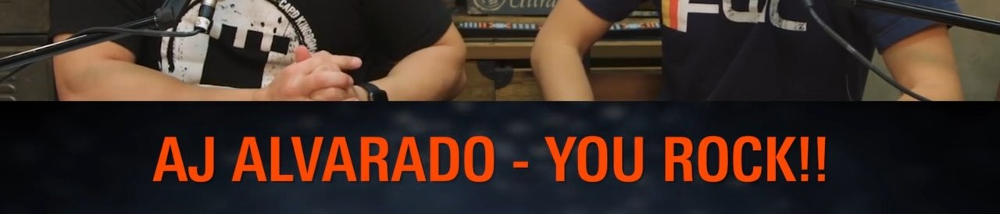](https://www.youtube.com/watch?v=bzjfB6iauL0&amp;t=220s) |
| Ernest De Leon | #193 ? Rivals of Ixalan Set Review | Jan 9, 2018 | [2:41](https://www.youtube.com/watch?v=oxC6rfyFkMk&amp;t=161s) | [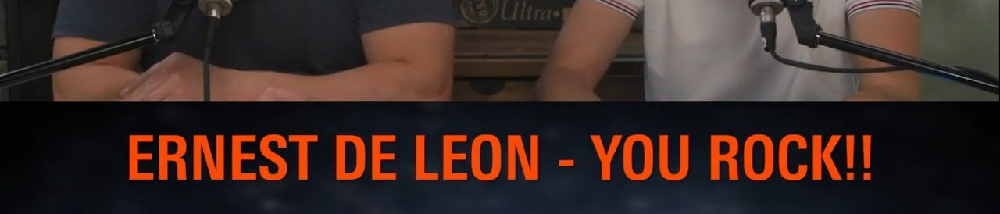](https://www.youtube.com/watch?v=oxC6rfyFkMk&amp;t=161s) |
| Jacob Funderburk | #192 ? Rivals of Ixalan Preview & Deck Tech - Zacama | Jan 4, 2018 | [3:22](https://www.youtube.com/watch?v=qqpW8D9Hhoc&amp;t=202s) | [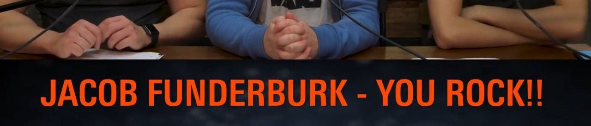](https://www.youtube.com/watch?v=qqpW8D9Hhoc&amp;t=202s) |
| Daniel Moriarty | #191 ? Best of 2017 - Year in Review | Dec 29, 2017 | [3:09](https://www.youtube.com/watch?v=uA8zsRagXX4&amp;t=189s) |  |
| Matthew Miglautch | #190 ? Lessons from The Great War | Dec 21, 2017 | [5:09](https://www.youtube.com/watch?v=44jPKGC9348&amp;t=309s) | [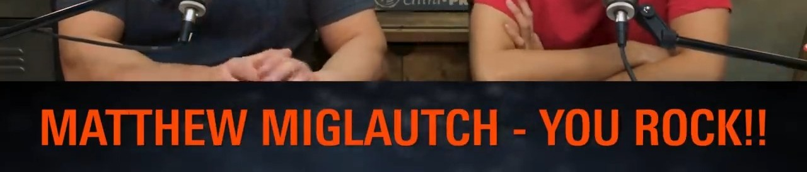](https://www.youtube.com/watch?v=44jPKGC9348&amp;t=309s) |
| Scott Paris | #189 ? Building Around Unstable Legends | Dec 13, 2017 | [4:59](https://www.youtube.com/watch?v=wxaMk3LYitw&amp;t=299s) | [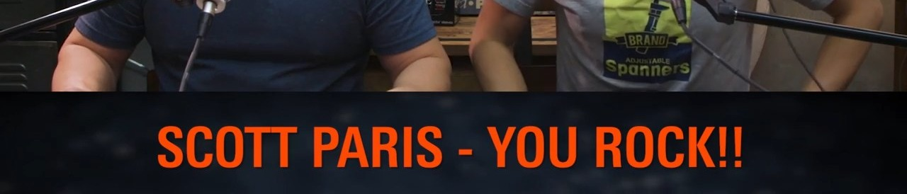](https://www.youtube.com/watch?v=wxaMk3LYitw&amp;t=299s) |
| Garrett Burchell | #188 ? Unstable Cards in Commander | Dec 4, 2017 | [10:05](https://www.youtube.com/watch?v=OwR6dgeGoxg&amp;t=605s) | [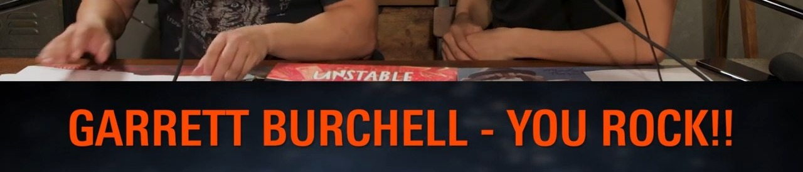](https://www.youtube.com/watch?v=OwR6dgeGoxg&amp;t=605s) |
| Ryan Hu | #187 ? The Most Powerful Commander Decks | Nov 20, 2017 | [3:52](https://www.youtube.com/watch?v=ErdYxH6N_6I&amp;t=232s) | [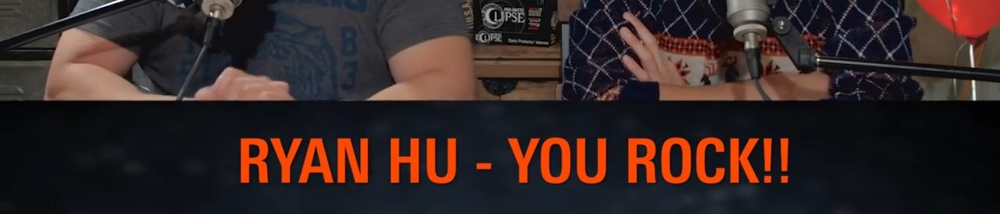](https://www.youtube.com/watch?v=ErdYxH6N_6I&amp;t=232s) |
| Victoria Chom | #186 ? Words of Wizdom | Nov 13, 2017 | [4:37](https://www.youtube.com/watch?v=WtLBBe-xaZ0&amp;t=277s) | [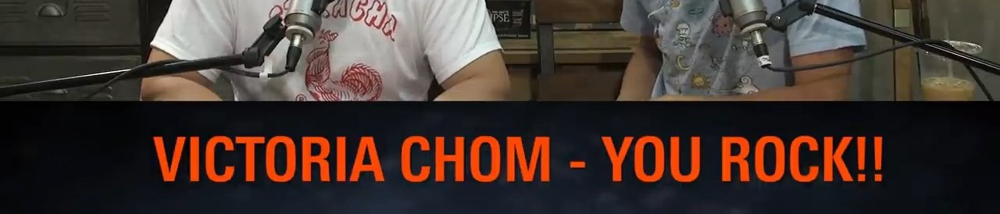](https://www.youtube.com/watch?v=WtLBBe-xaZ0&amp;t=277s) |
| Nicholas Booth | #185 ? My Playgroup Always Targets Me First | Nov 7, 2017 | [2:36](https://www.youtube.com/watch?v=GgqLu3JewvI&amp;t=156s) | [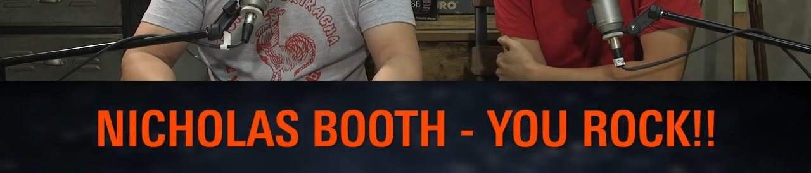](https://www.youtube.com/watch?v=GgqLu3JewvI&amp;t=156s) |
| Dan Bucci | #184 ? Inside the Mind of Magic Artist Jesper Ejsing | Oct 31, 2017 | [2:23](https://www.youtube.com/watch?v=qLhGE66i-vw&amp;t=143s) | [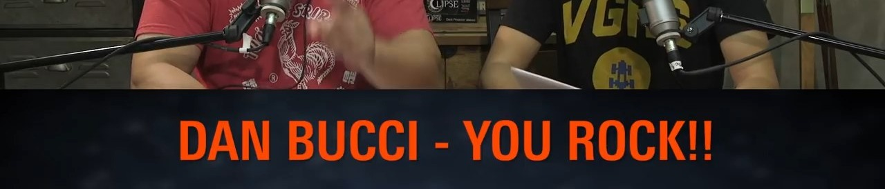](https://www.youtube.com/watch?v=qLhGE66i-vw&amp;t=143s) |
| Israel Solis | #183 ? Threat Assessment Case Studies | Oct 26, 2017 | [3:17](https://www.youtube.com/watch?v=82X0dB-gdb4&amp;t=197s) | [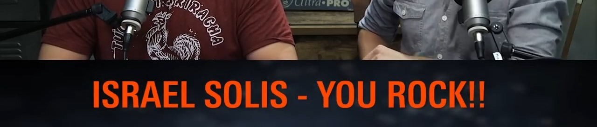](https://www.youtube.com/watch?v=82X0dB-gdb4&amp;t=197s) |
| Peter Milford | #182 ? Politics with The Professor! | Oct 11, 2017 | [2:52](https://www.youtube.com/watch?v=z9DoLwP3OhQ&amp;t=172s) | [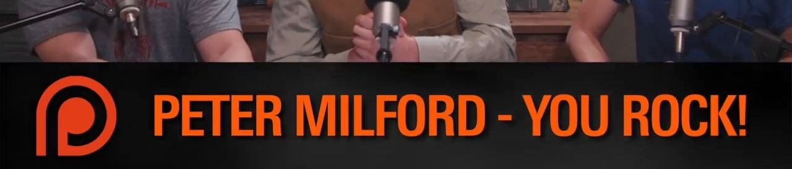](https://www.youtube.com/watch?v=z9DoLwP3OhQ&amp;t=172s) |
| Alec Surrett | #181 ? The Right Way to NETDECK | Oct 3, 2017 | [5:13](https://www.youtube.com/watch?v=M4N-dL_CeqE&amp;t=313s) | [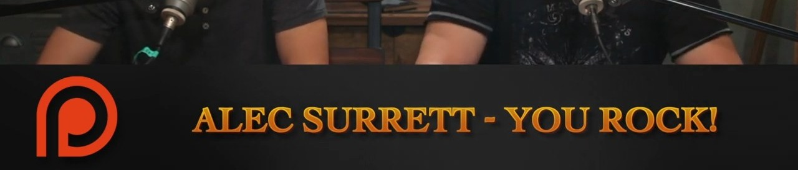](https://www.youtube.com/watch?v=M4N-dL_CeqE&amp;t=313s) |
| Charles Gray | #180 ? Most Annoying Cards in EDH | Sep 27, 2017 | [3:06](https://www.youtube.com/watch?v=lkWJcUyUHX4&amp;t=186s) | [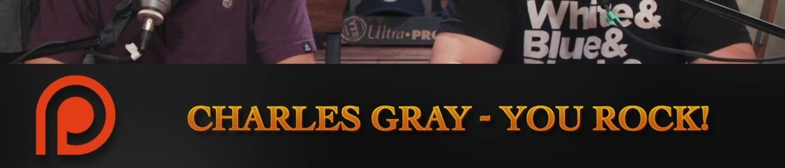](https://www.youtube.com/watch?v=lkWJcUyUHX4&amp;t=186s) |
| Jesus Barajas | #179 ? Ixalan SET REVIEW for Commander | Sep 15, 2017 | [3:26](https://www.youtube.com/watch?v=8BT0LMsvoag&amp;t=206s) |  |
| Zac Schueler | #178 ? Ramos, Dragon Engine Deck Tech & IXALAN PREVIEW | Sep 13, 2017 | [4:23](https://www.youtube.com/watch?v=obwekjqpYMQ&amp;t=263s) | [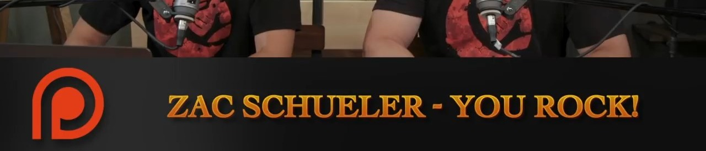](https://www.youtube.com/watch?v=obwekjqpYMQ&amp;t=263s) |
| Planeswalker Project | #177 ? Mairsil, The Pretender DECK TECH | Sep 6, 2017 | [2:49](https://www.youtube.com/watch?v=z6S9-VFFBt4&amp;t=169s) | [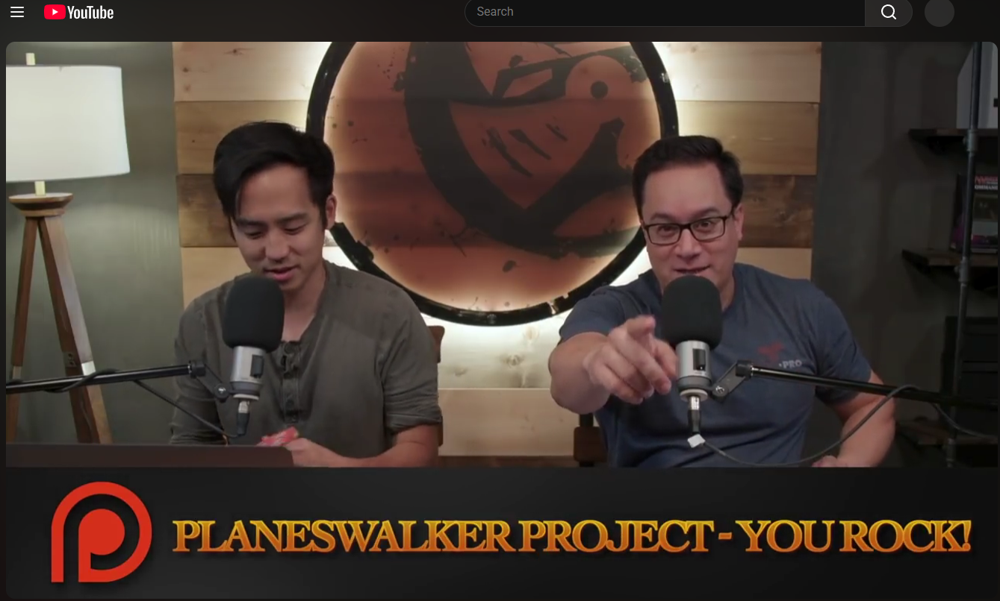](https://www.youtube.com/watch?v=z6S9-VFFBt4&amp;t=169s) |
| Travis Drake | #176 ? Is Kess, Dissident Mage the Best Commander from C17? | Sep 1, 2017 | [6:25](https://www.youtube.com/watch?v=dER3XEMDt58&amp;t=385s) | [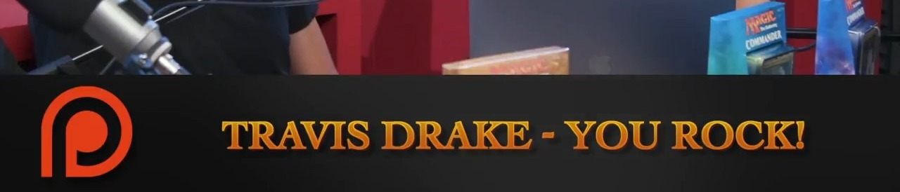](https://www.youtube.com/watch?v=dER3XEMDt58&amp;t=385s) |
| Kenji Madden | #175 ? How Would A Spike Build EDGAR MARKOV? | Aug 25, 2017 | [4:33](https://www.youtube.com/watch?v=wnqZb1WUlic&amp;t=273s) |  |
| Uriah Beaird | #174 ? The Best 5 Color Dragon EVER? CMDR 2017 Dragon Deck Review | Aug 23, 2017 | [3:56](https://www.youtube.com/watch?v=QN68B_bEMEw&amp;t=236s) | [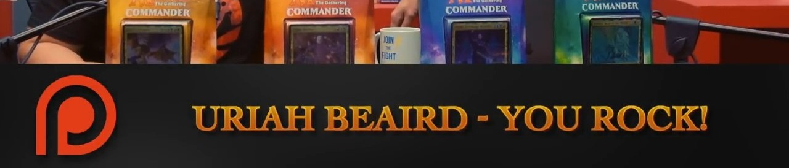](https://www.youtube.com/watch?v=QN68B_bEMEw&amp;t=236s) |
| Henry Ayala | #173 ? Can Cat Tribal be Competitive? CMDR 2017 Cat Deck Review | Aug 18, 2017 | [3:39](https://www.youtube.com/watch?v=n_xlEgAJMYU&amp;t=219s) | [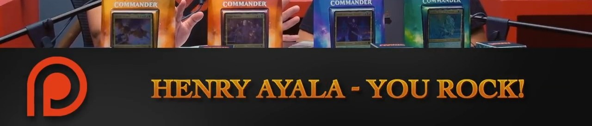](https://www.youtube.com/watch?v=n_xlEgAJMYU&amp;t=219s) |
| Felix Thomas | #171 ? Which Commander 2017 Deck Is the BEST? | Aug 13, 2017 | [4:45](https://www.youtube.com/watch?v=1G4IaB0iHgw&amp;t=285s) |  |
| Audie Garver | #170 ? COMMANDER 2017 - Boneyard Scourge & Fortunate Few | Aug 8, 2017 | [2:03](https://www.youtube.com/watch?v=sEsl4K2C-p8&amp;t=123s) |  |
| KC Garcia | #169 ? How Many Infinite Combos Is TOO Many? | Aug 1, 2017 | [4:09](https://www.youtube.com/watch?v=Zqbg1R5riVk&amp;t=249s) | [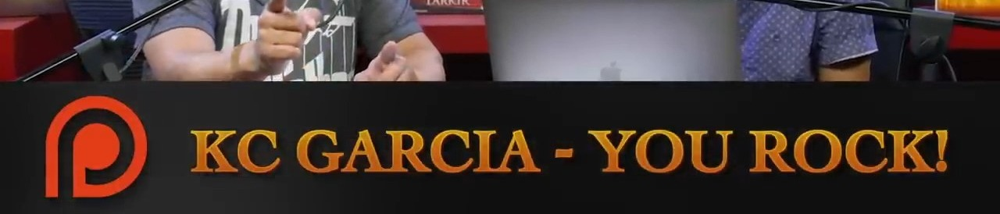](https://www.youtube.com/watch?v=Zqbg1R5riVk&amp;t=249s) |
| Patrick Lee | #168 ? Evaluating New Mechanics: Amonkhet / Hour of Devastation | Jul 25, 2017 | [4:02](https://www.youtube.com/watch?v=56O8fuSaFNA&amp;t=242s) | [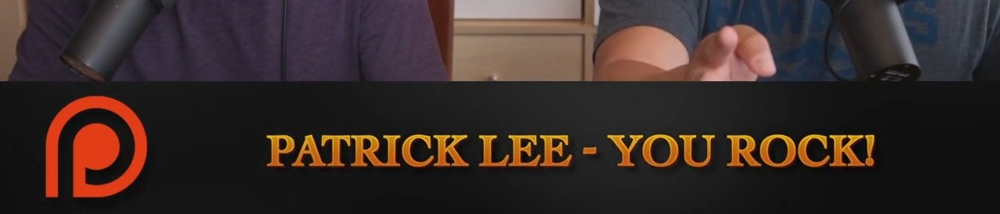](https://www.youtube.com/watch?v=56O8fuSaFNA&amp;t=242s) |
| Alissa Mcgill | #167 ? Brewing with the New Gods (Locust, Scarab, Scorpion) | Jul 18, 2017 | [5:21](https://www.youtube.com/watch?v=NsgXHtoS-OQ&amp;t=321s) |  |
| Grant Wu | #166 ? Adjusting to New Metas, LIVE at GP Vegas | Jul 11, 2017 | [4:02](https://www.youtube.com/watch?v=tV60k69sUWU&amp;t=242s) |  |
| Joshua Candava | #165 ? Hour of Devastation Commander SET REVIEW | Jul 4, 2017 | [2:34](https://www.youtube.com/watch?v=eBM_Vgw91NA&amp;t=154s) |  |
| Samuel Stokes | Our Final Fantasy Preview Card is a BEAST | May 20, 2025 | [3:32](https://www.youtube.com/watch?v=iyTTFy9cXYo&amp;t=212s) | [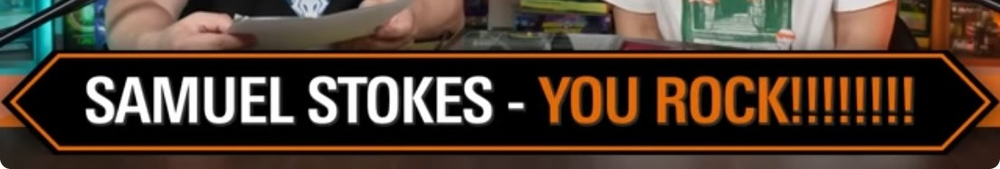](https://www.youtube.com/watch?v=iyTTFy9cXYo&amp;t=212s) |

## Data

The CSV file is the canonical dataset.
This page is rebuilt from verified rows after each review change or by running `yourock build`.
